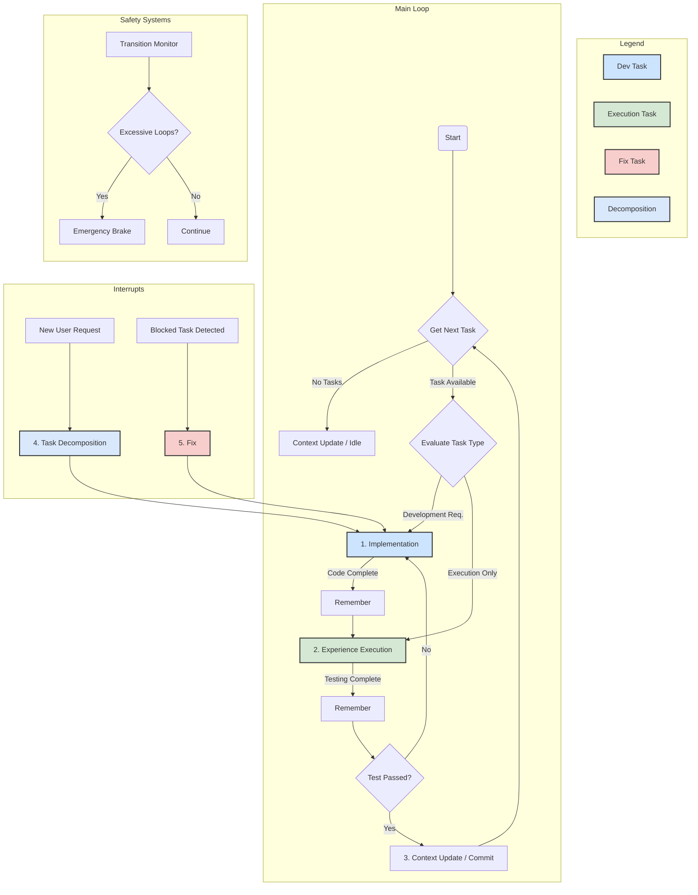

## TLDR
Initialize the agent by automatically providing comprehensive project context, system state, and working memory. This step streamlines workflow initialization by eliminating manual context loading and providing all necessary information in a single call.

## Instructions

You are now starting the autonomous workflow system. This step automatically provides you with all the context you need to understand the current project state and determine your next actions.

### 1. **System Overview**
You are operating within an autonomous AI agent system built on Cursor with MCP (Model Context Protocol) servers. The system operates in an infinite loop pattern:

```
START → start-workflow → next_rule → [step] → remember → next_rule → [step] → remember → ...
```

 **Project Context (from README.md):**

# Cursor Memory Bank 🧠

Un système de workflow autonome avancé pour Cursor avec intégration MCP (Model Context Protocol), gestion de tâches intelligente et interface utilisateur Streamlit.

## Installation 🚀

### Method 1: Using curl (Recommended)

You can install using this one-liner:

```bash
curl -fsSL https://raw.githubusercontent.com/hjamet/cursor-memory-bank/master/install.sh | bash
```

**Note for MINGW64/Git Bash users on Windows:** If you encounter `: command not found` errors during installation, it's likely due to line ending issues when piping directly. Use this modified command instead:

```bash
curl -fsSL https://raw.githubusercontent.com/hjamet/cursor-memory-bank/master/install.sh | tr -d '\r' | bash
```

For better security, you can also:
1. Download the script first:
```bash
curl -fsSL https://raw.githubusercontent.com/hjamet/cursor-memory-bank/master/install.sh -o install.sh
```

2. Review it:
```bash
less install.sh
```

3. Then run it with any desired options:
```bash
bash install.sh [options]
```

Available options:
- `--dir <path>` : Install to a specific directory (default: current directory)
- `--backup` : Create a backup of existing rules
- `--force` : Overwrite existing files
- `--help` : Show help information
- `--version` : Show version information

Examples:
```bash
# Install to current directory
bash install.sh

# Install to a specific directory
bash install.sh --dir /path/to/install

# Create a backup of existing rules
bash install.sh --backup

# Show help information
bash install.sh --help
```

### Method 2: Using git clone

If you prefer, you can also install Cursor Memory Bank by cloning the repository:

```bash
git clone https://github.com/hjamet/cursor-memory-bank.git
cd cursor-memory-bank
bash install.sh [options]
```

The installation script will:
- Install the rules to your `.cursor/rules` directory
- Always preserve any existing custom rules
- Create a backup of existing rules (only if --backup is used)
- Update only the core rules that need updating
- Preserve any unrelated files that might be in the .cursor directory
- Work even if the .cursor directory already exists
- **Configure Gemini CLI MCP servers** automatically in `~/.gemini/settings.json`

## Gemini CLI Integration 🤖

The installation script automatically configures MCP (Model Context Protocol) servers for Google's Gemini CLI, enabling you to use the same powerful tools in both Cursor and Gemini CLI environments.

### What Gets Configured
- **MyMCP**: System operations, terminal commands, and file manipulation
- **MemoryBankMCP**: Task management, persistent memory, and workflow automation
- **Context7**: Real-time library documentation access

### Usage with Gemini CLI
After installation, you can use Gemini CLI with the configured MCP servers:

```bash
# Start interactive chat with MCP tools
gemini chat

# List available MCP servers
gemini mcp list

# Get tool descriptions
gemini mcp desc
```

For detailed information about Gemini CLI integration, consult the installation script documentation.

## What is Cursor Memory Bank? 🤔

Cursor Memory Bank is an advanced autonomous workflow system that revolutionizes how you work with Cursor. It provides intelligent task management, persistent memory, and automated quality assurance through a sophisticated rule-based architecture.

### Core Features ✨

#### 🧠 **Autonomous Workflow System**
- **Self-Managing**: Operates in continuous autonomous loops with intelligent decision-making
- **Quality Assurance**: Mandatory testing cycle with automatic `implementation → experience-execution` transitions
- **Safety Mechanisms**: Anti-infinite-loop protection, emergency brakes, and transition monitoring
- **Intelligent Routing**: Context-aware task routing based on complexity and requirements

#### 📋 **Advanced Task Management**
- **Hierarchical Tasks**: Support for parent-child task relationships and dependencies
- **Multi-Task Decomposition**: Intelligent breaking down of complex requests into manageable subtasks
- **Priority System**: 5-level priority system (1=lowest, 5=critical) with automatic prioritization
- **Status Tracking**: Comprehensive task lifecycle management (TODO, IN_PROGRESS, BLOCKED, REVIEW, DONE)

#### 🔧 **MCP Server Integration**
- **MyMCP**: Terminal operations, file manipulation, web scraping, and system commands
- **MemoryBankMCP**: Task management, persistent memory, workflow automation, and commit operations
- **Context7**: Real-time library documentation with semantic search capabilities

#### 🎨 **Modern Streamlit Interface**
- **Enhanced Notifications**: Custom toast notification system with configurable duration (5-15s)
- **Markdown Support**: Full markdown rendering with line breaks, bold, italic, code blocks
- **Visual Improvements**: Modern CSS styling with gradients, animations, and responsive design
- **Multi-Page Integration**: Consistent notification experience across all interface pages

#### 🚀 **Workflow Automation**
- **Automatic Testing**: Mandatory validation after every implementation
- **Smart Transitions**: Context-aware workflow step recommendations
- **Memory Persistence**: Long-term and working memory with automatic cleanup
- **Git Integration**: Automated commit messages with standardized formatting

### Recent Major Improvements 🆕

#### **Enhanced Notification System (v2.0)**
- **Custom Duration**: Configurable 5-15 second display time (vs 4s fixed in st.toast())
- **Markdown Support**: Full markdown rendering with safe HTML sanitization
- **Visual Progress**: Animated progress bars showing remaining time
- **Manual Control**: User-controlled dismissal and hover-pause functionality
- **Type System**: Distinct styling for info, success, warning, error, and memory notifications

#### **Workflow Architecture Overhaul**
- **Automatic Experience-Execution**: Mandatory testing after every implementation
- **Safety Systems**: Comprehensive anti-loop protection with cooldown mechanisms
- **Performance Monitoring**: Real-time workflow performance tracking
- **Simplified Task Decomposition**: Streamlined approach balancing efficiency and simplicity

#### **Interface Modernization**
- **Responsive Design**: Mobile-friendly interface with breakpoint optimization
- **Enhanced Styling**: Modern gradients, shadows, and animations
- **Improved UX**: Better contrast, larger notification areas, and intuitive navigation
- **Cross-Page Consistency**: Unified notification experience across all Streamlit pages

### Known Issues & Active Development 🚧

#### **Auto-Refresh System Status**
✅ **RESOLVED**: The auto-refresh issue has been addressed with a hybrid solution that provides both reliability and user control (as of 2025-07-21).

**Solution Implemented:**
- **Primary Mode**: Manual refresh system with prominent "🔄 Actualiser les données" button in sidebar
- **Optional Auto-Refresh**: Experimental auto-refresh for users who want to try it (5-second intervals)
- **Clean Interface**: All informational refresh indicators removed from main interface for streamlined UX
- **Smart UX**: Clear instructions and visual feedback when data is refreshed

**Technical Implementation:**
- `streamlit-autorefresh` library available as optional experimental feature
- Robust manual refresh with cache clearing and forced rerun
- Error handling and fallback for environments where auto-refresh fails
- **Interface Streamlined (July 2025)**: Removed data freshness timestamps, counters, and mini refresh buttons from main interface per user feedback

**User Impact**: **POSITIVE** - Users have reliable control over data refresh with clean, distraction-free interface
**Status**: **OPERATIONAL** - Manual refresh system with experimental auto-refresh option

The system now provides a better user experience with guaranteed refresh functionality.

## Agent Workflow Logic 🧠⚙️

The autonomous agent operates on a sophisticated, rule-based workflow designed for robustness and intelligent decision-making. The system features **automatic testing integration** with mandatory `implementation → experience-execution` transitions to ensure code quality.

### Workflow Architecture



### Key Workflow Features

#### **Mandatory Testing Cycle**
- **CRITICAL RULE**: `implementation → experience-execution` (AUTOMATIC)
- **ARCHITECTURAL INTEGRITY GUARANTEED**: Complete elimination of `implementation → implementation` violations (2025-07-23)
- Every code change is automatically tested before completion
- Prevents regressions and ensures quality
- Built-in safety mechanisms prevent infinite loops

#### **Intelligent Task Routing**
- **Development Tasks**: Full implementation → testing → commit cycle
- **Execution Tasks**: Direct routing to experience-execution for commands/scripts
- **Fix Tasks**: High-priority interrupt handling for blocked tasks
- **Decomposition**: Multi-request analysis and task creation

#### **Safety Systems**
- **Transition Limits**: Maximum 10 consecutive transitions before emergency brake
- **Cooldown Periods**: 1-minute minimum between experience-execution cycles
- **Cycle Detection**: Automatic identification of implementation → fix loops
- **Emergency Brakes**: Automatic activation on excessive transitions

### Workflow Steps Explained

1. **Implementation (`implementation`)**
   - Core development step for code changes
   - Automatic marking of tasks as IN_PROGRESS
   - Intelligent routing based on task complexity
   - **Mandatory transition** to Experience Execution

2. **Experience Execution (`experience-execution`)**
   - Automatic testing and validation
   - Manual testing for complex features
   - Quality assurance checks
   - **Exclusive responsibility** for task completion

3. **Task Decomposition (`task-decomposition`)**
   - Multi-request analysis capability
   - Intelligent task creation with dependencies
   - Priority assignment and scheduling
   - **Simplified approach** balancing efficiency and thoroughness

4. **Fix (`fix`)**
   - High-priority interrupt handling
   - Blocked task resolution
   - Error diagnosis and correction
   - **Immediate routing** to implementation

5. **Context Update (`context-update`)**
   - System state analysis
   - Automated git commits
   - Memory cleanup and optimization
   - **Preparation** for next workflow cycle

## Available MCP Tools 🛠️

### **MemoryBankMCP Server**
- `mcp_MemoryBankMCP_next_rule`: Get workflow step instructions
- `mcp_MemoryBankMCP_remember`: Store memories and get next steps
- `mcp_MemoryBankMCP_create_task`: Create new tasks with dependencies
- `mcp_MemoryBankMCP_update_task`: Update task status and details
- `mcp_MemoryBankMCP_get_all_tasks`: List all tasks with filtering
- `mcp_MemoryBankMCP_get_next_tasks`: Get available priority tasks
- `mcp_MemoryBankMCP_read_userbrief`: Read user requests
- `mcp_MemoryBankMCP_update_userbrief`: Update request status
- `mcp_MemoryBankMCP_commit`: Standardized git commit operations

### **MyMCP Server**
- `mcp_MyMCP_execute_command`: Terminal command execution
- `mcp_MyMCP_get_terminal_status`: Monitor running processes
- `mcp_MyMCP_get_terminal_output`: Retrieve command output
- `mcp_MyMCP_stop_terminal_command`: Stop running processes
- `mcp_MyMCP_consult_image`: Image analysis and consultation
- `mcp_MyMCP_take_webpage_screenshot`: Web page capture
- `mcp_MyMCP_read_webpage`: Web content extraction to Markdown
- `mcp_MyMCP_replace_content_between`: Advanced file editing

### **Context7 Server**
- `mcp_Context7_resolve-library-id`: Find library documentation
- `mcp_Context7_get-library-docs`: Access real-time library docs

## Streamlit Interface Features 🎨

### **Enhanced Notification System**
- **Custom Duration**: 5-15 second configurable display time
- **Markdown Support**: Full formatting with line breaks, bold, italic
- **Visual Progress**: Animated countdown bars
- **Manual Control**: User dismissal and hover-pause
- **Type System**: Distinct styling for different notification types
- **Security**: HTML sanitization against XSS attacks

### **Modern UI Design**
- **Responsive Layout**: Mobile-friendly with breakpoint optimization
- **Modern Styling**: Gradients, shadows, and smooth animations
- **Enhanced Contrast**: Improved readability and accessibility
- **Intuitive Navigation**: Streamlined interface with clear visual hierarchy

### **Cross-Page Integration**
- **Consistent Experience**: Unified notifications across all pages
- **Session Management**: Persistent state across page navigation
- **Performance Optimized**: Efficient memory usage and cleanup

## Technical Architecture 🏗️

### **Workflow Safety Systems**
- **Transition Monitoring**: Real-time tracking of workflow steps
- **Loop Detection**: Automatic identification of problematic patterns
- **Emergency Brakes**: Fail-safe mechanisms for system stability
- **Performance Metrics**: Comprehensive monitoring and reporting

### **Memory Management**
- **Working Memory**: Short-term context for active tasks
- **Long-term Memory**: Persistent storage of important decisions
- **Automatic Cleanup**: Intelligent memory optimization
- **Context Preservation**: Seamless session continuity

### **Quality Assurance**
- **Mandatory Testing**: Automatic validation after every implementation
- **Code Quality Checks**: Integrated linting and validation
- **Regression Prevention**: Systematic testing of changes
- **Performance Monitoring**: Real-time system health tracking

## Contributing 🤝

While this is primarily a personal project, contributions are welcome! The system is designed to be extensible and maintainable. Most documentation and rules are in French, but English translations and general-purpose improvements are especially appreciated.

### **Development Guidelines**
- Follow the established workflow patterns
- Use the MCP tools for consistency
- Test all changes through the experience-execution cycle
- Document architectural decisions in long-term memory

## License 📄

This project is open source and available for personal and educational use. Please refer to the repository for the most current license information.

## Troubleshooting 🔧

### **MCP Server Issues**

If you encounter errors with MCP servers not being found:

1. **Verify Installation**: Ensure all MCP server files are properly installed
2. **Check Permissions**: Verify file permissions for MCP server directories
3. **Restart Cursor**: Complete application restart to refresh MCP cache
4. **Validate Configuration**: Check `.cursor/mcp.json` for correct server paths

### **Workflow Issues**

If the autonomous workflow seems stuck or behaving unexpectedly:

1. **Check Safety Systems**: Look for emergency brake activation
2. **Monitor Transitions**: Verify workflow step transitions are completing
3. **Review Memory**: Check working memory for error patterns
4. **Restart Workflow**: Use `start-workflow` to reset system state

### **Notification Issues**

If toast notifications are not appearing or functioning correctly:

1. **Check Session State**: Verify Streamlit session state initialization
2. **Clear Cache**: Use Streamlit's cache clearing functionality
3. **Verify Integration**: Ensure notification functions are called on all pages
4. **Test Manually**: Use the enhanced notification system directly

### **Performance Issues**

If the system is running slowly or consuming excessive resources:

1. **Memory Cleanup**: Use context-update to optimize memory usage
2. **Task Optimization**: Review task dependencies and priorities
3. **Transition Monitoring**: Check for excessive workflow transitions
4. **System Resources**: Monitor CPU and memory usage

For more detailed troubleshooting, consult the system's working memory and long-term memory for specific error patterns and solutions.

## Automatic Task Creation Validation

The system now uses an **MCP-integrated approach** instead of pre-commit hooks. To verify automatic task creation works correctly:

1. Create a test file exceeding 500 lines: `seq 600 > test_large_file.py`
2. Use the MCP commit tool: `mcp_MemoryBankMCP_commit` with appropriate arguments
3. Check the commit output for "Automatic Task Creation" section showing detected files
4. Verify that refactoring tasks are created with correct priorities (500+ lines = Priority 4)
5. Clean up the test file: `rm test_large_file.py`

**Note:** The old pre-commit hook approach has been completely replaced by this MCP-integrated system, which is more robust and provides better integration with the workflow. 

### 2. **Current System State**

**Workflow State:** {{ workflow_state }}

**Active Tasks:** {{ active_tasks_count }}

**User Requests:** {{ user_requests_status }}

### 3. **Context and Memory**

**Recent Working Memory (Last 5 memories):**

- **{{ memory.timestamp }}**: {{ memory.present }}


**Available Tasks (Next Actions):**
{{ next_tasks_summary }}

**User Brief Status:**
{{ user_brief_summary }}

### 4. **Workflow Instructions**

Based on the current system state, follow this priority order:

1.  **If there are unprocessed user requests** (`has_unprocessed_requests: true`):
    - **Action**: The highest priority is to process new user input.
    - **Next Step**: Call `mcp_MemoryBankMCP_next_rule` with `step_name: "task-decomposition"`.

2.  **Else, if there are active tasks** (`has_active_tasks: true`):
    - **Action**: Continue working on the existing task list.
    - **Next Step**: Call `mcp_MemoryBankMCP_next_rule` with `step_name: "implementation"`.

3.  **Otherwise (the system is idle)**:
    - **Action**: No pending work. Perform routine maintenance and wait for new instructions.
    - **Next Step**: Call `mcp_MemoryBankMCP_next_rule` with `step_name: "context-update"`.

**Remember**: You MUST call `mcp_MemoryBankMCP_next_rule` to continue the autonomous workflow. This step only provides context - the actual work happens in subsequent workflow steps.