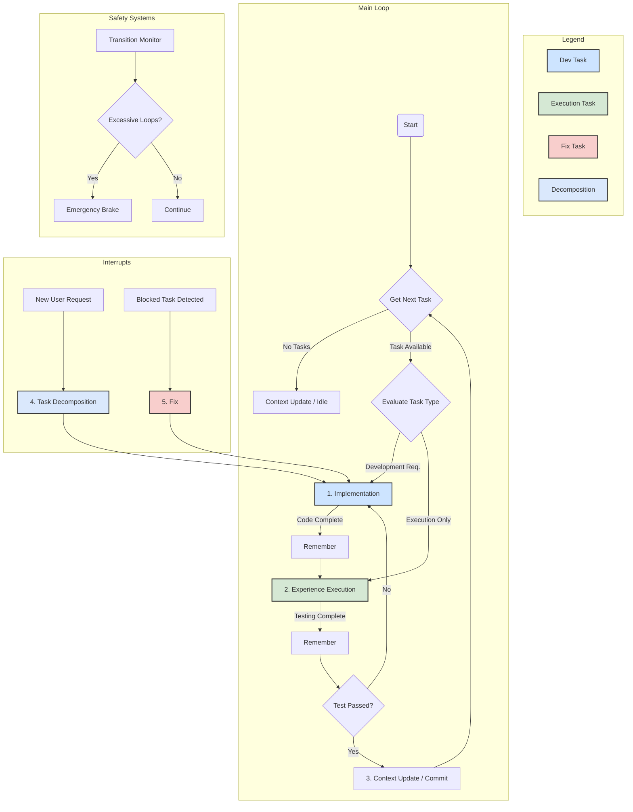

# Cursor Memory Bank 🧠

Un système de workflow autonome avancé pour Cursor avec intégration MCP (Model Context Protocol), gestion de tâches intelligente et interface utilisateur Streamlit.

## Installation 🚀

A single, robust installer is provided: `install.sh`. It now uses a unified strategy: **prefer `git clone` when available, then verify all required rule files and automatically fall back to raw downloads** when files are missing in the clone. The installer also detects the repository default branch via the GitHub API (fallback: `master`) to avoid raw URL 404s.

Recommended (download then run — reviewable):
```bash
curl -fsSL https://raw.githubusercontent.com/hjamet/cursor-memory-bank/master/install.sh | bash
```

Quick one-liners (the script auto-detects the default branch; use `--use-curl` to force curl-only mode):

```bash
# Basic installation (ToolsMCP only)
curl -fsSL https://raw.githubusercontent.com/hjamet/cursor-memory-bank/$(curl -s https://api.github.com/repos/hjamet/cursor-memory-bank | grep -o '"default_branch": *"[^"]*"' | sed 's/.*: *"\(.*\)"/\1/' || echo master)/install.sh | tr -d '\r' | bash -s --

# Full installation (all components)
curl -fsSL https://raw.githubusercontent.com/hjamet/cursor-memory-bank/$(curl -s https://api.github.com/repos/hjamet/cursor-memory-bank | grep -o '"default_branch": *"[^"]*"' | sed 's/.*: *"\(.*\)"/\1/' || echo master)/install.sh | tr -d '\r' | bash -s -- --full-install
```

Note for MINGW64/Git Bash users on Windows: If you encounter `: command not found` errors during piping, strip CR characters with `tr -d '\r'` as shown above.

Available options (summary):
- `--dir <path>` : Install to a specific directory (default: current directory)
- `--backup` : Create a backup of existing rules
- `--force` : Force overwrite existing files
- `--use-curl` : Force curl-only downloads instead of `git clone` (useful when git is unavailable)
- `--full-install` : Install all components (ToolsMCP, MemoryBankMCP, Streamlit UI)
- `--help` : Show help information
- `--version` : Show version information

Important: the installer now installs rule files more flexibly. By default it will attempt to download and install **all files** under `.cursor/rules/` from the repository into the target, except for files marked as "full-only" which are only deployed when using `--full-install`.

- Example: `.cursor/rules/agent.mdc` is provided in this repository and will be installed by default.
- Full-only example: `.cursor/rules/README.mdc` (installed only with `--full-install`).
- Critical rules that cause installation to fail if missing: `.cursor/rules/maitre-d-oeuvre.mdc`, `.cursor/rules/ouvrier.mdc`.

Note: repository-local files such as `.cursor/rules/mcp.mdc` remain in-repo and are NOT distributed by the installer.

Examples:
```bash
# Basic installation (ToolsMCP only)
bash install.sh

# Full installation with all components
bash install.sh --full-install

# Install to a specific directory with all components
bash install.sh --dir /path/to/install --full-install

# Force curl-only (no git)
bash install.sh --use-curl

# Show help information
bash install.sh --help
```

### Required files and fail-fast policy

Certain files are considered required by the installer and a missing download will stop the installation immediately (fail-fast). This ensures the installer does not continue in a partially-installed state.

- **Required files (examples)**:
  - `.cursor/rules/architecte.mdc` (preferred)
  - `.cursor/commands/architecte.md` (deprecated, kept for compatibility)
  - `.cursor/mcp/mcp-commit-server/*` (critical MCP server scripts and `mcp_tools`)
  - `.cursor/mcp.json` (MCP template)

- **Diagnosis**: On failure the installer will print diagnostic info including HTTP status codes and curl exit codes (e.g. `http_code=404 curl_exit_code=22`). Re-run the installer after fixing network or URL issues.

### Comportement des téléchargements

Le script utilise une fonction interne `download_file(url, dest, [required])` pour récupérer des fichiers via `curl`.
- **Paramètre `required`**: si la 3ᵉ valeur passée est `required`, le fichier est **considéré critique**; toute erreur HTTP (404, 403, 5xx) ou un fichier vide provoquera une erreur fatale et interrompra l'installation (fail‑fast).
- **Fichiers optionnels**: si le paramètre n'est pas fourni, les erreurs réseau/HTTP **ne feront pas échouer** l'installation. Le script affichera un **warning** et continuera (retourne 0) pour préserver la compatibilité avec `set -e` et éviter des régressions quand des ressources facultatives manquent.
- **Diagnostics**: sur erreurs ou comportements inattendus, le script affiche `http_code` et `curl_exit_code` (ex. `http_code=404 curl_exit_code=22`) pour faciliter le diagnostic réseau/URL.

Exemples d'utilisation dans le script:

```bash
# Fichier critique — installation échoue si absent
download_file "$RAW_URL_BASE/.cursor/commands/architecte.md" "$target_dir/.cursor/commands/architecte.md" "required"

# Fichier optionnel — log warning si absent mais installation continue
download_file "$RAW_URL_BASE/.cursor/streamlit_app/app.py" "$streamlit_dir/app.py"
```


### Method 2: Using git clone

If you prefer, you can also install Cursor Memory Bank by cloning the repository:

```bash
git clone https://github.com/hjamet/cursor-memory-bank.git
cd cursor-memory-bank
bash install.sh [options]
```

## Installation Modes 🎯

Cursor Memory Bank offers two installation modes to suit different needs:

### Basic Mode (Default)
- **What's included:** ToolsMCP server only
- **Best for:** Users who want essential terminal operations and file manipulation
- **Features:** Command execution, file editing, image consultation, web scraping
- **Size:** Minimal installation footprint
- **Command:** `bash install.sh` (default)

### Full Mode (`--full-install`)
- **What's included:** All MCP servers, Streamlit UI, ML model, complete workflow system
- **Best for:** Users who want the complete autonomous workflow experience
- **Features:** Task management, persistent memory, autonomous workflow, visual interface, semantic search
- **Size:** Larger installation with ML dependencies
- **Command:** `bash install.sh --full-install`

### Choosing Your Mode
- **Start with Basic:** If you're new to the system or want to try it out
- **Upgrade to Full:** You can always re-run with `--full-install` to add components later
- **Development Work:** Full mode recommended for complex projects requiring autonomous workflow

 - The installation script will:
 - Install the rules to your `.cursor/rules` directory (including `README.mdc`, `debug.mdc` and `commit.mdc` in all install modes) and install project commands to `.cursor/commands` (for example: `architecte.md`).
 - `start.mdc` is installed only when running the installer with `--full-install` (it is not deployed for basic installs).
 - `.cursor/rules/mcp.mdc` is repository-local and will not be installed or distributed by the installer.
- Always preserve any existing custom rules
- Create a backup of existing rules (only if --backup is used)
- Update only the core rules that need updating
- Preserve any unrelated files that might be in the .cursor directory
- Work even if the .cursor directory already exists
- **Configure Gemini CLI MCP servers** automatically in `~/.gemini/settings.json`
- With `--full-install`: Set up complete workflow system with all MCP servers, Streamlit UI, and ML model
- Basic mode (default): Install only ToolsMCP server for essential terminal operations

## Gemini CLI Integration 🤖

The installation script automatically configures MCP (Model Context Protocol) servers for Google's Gemini CLI, enabling you to use the same powerful tools in both Cursor and Gemini CLI environments.

### What Gets Configured
- **ToolsMCP**: System operations, terminal commands, and file manipulation
- **MemoryBankMCP**: Task management, persistent memory, and workflow automation
- **Context7**: Real-time library documentation access

### Usage with Gemini CLI
After installation, you can use Gemini CLI with the configured MCP servers:

```bash
# Start interactive chat with MCP tools
gemini chat

# List available MCP servers
gemini mcp list

# Get tool descriptions
gemini mcp desc
```

For detailed information about Gemini CLI integration, consult the installation script documentation.

## What is Cursor Memory Bank? 🤔

Cursor Memory Bank is an advanced autonomous workflow system that revolutionizes how you work with Cursor. It provides intelligent task management, persistent memory, and automated quality assurance through a sophisticated rule-based architecture.

### Core Features ✨

#### 🧠 **Autonomous Workflow System**
- **Self-Managing**: Operates in continuous autonomous loops with intelligent decision-making
- **Quality Assurance**: Mandatory testing cycle with automatic `implementation → experience-execution` transitions
- **Safety Mechanisms**: Anti-infinite-loop protection, emergency brakes, and transition monitoring
- **Intelligent Routing**: Context-aware task routing based on complexity and requirements

#### 📋 **Advanced Task Management**
- **Hierarchical Tasks**: Support for parent-child task relationships and dependencies
- **Multi-Task Decomposition**: Intelligent breaking down of complex requests into manageable subtasks
- **Priority System**: 5-level priority system (1=lowest, 5=critical) with automatic prioritization
- **Status Tracking**: Comprehensive task lifecycle management (TODO, IN_PROGRESS, BLOCKED, REVIEW, DONE)

#### 🔧 **MCP Server Integration**
- **ToolsMCP**: Terminal operations, file manipulation, web scraping, and system commands
- **MemoryBankMCP**: Task management, persistent memory, workflow automation, and commit operations
- **Context7**: Real-time library documentation with semantic search capabilities

#### 🎨 **Modern Streamlit Interface**
- **Enhanced Notifications**: Custom toast notification system with configurable duration (5-15s)
- **Markdown Support**: Full markdown rendering with line breaks, bold, italic, code blocks
- **Visual Improvements**: Modern CSS styling with gradients, animations, and responsive design
- **Multi-Page Integration**: Consistent notification experience across all interface pages

#### 🚀 **Workflow Automation**
- **Automatic Testing**: Mandatory validation after every implementation
- **Smart Transitions**: Context-aware workflow step recommendations
- **Memory Persistence**: Long-term and working memory with automatic cleanup
- **Git Integration**: Automated commit messages with standardized formatting

### Recent Major Improvements 🆕

#### **Enhanced Notification System (v2.0)**
- **Custom Duration**: Configurable 5-15 second display time (vs 4s fixed in st.toast())
- **Markdown Support**: Full markdown rendering with safe HTML sanitization
- **Visual Progress**: Animated progress bars showing remaining time
- **Manual Control**: User-controlled dismissal and hover-pause functionality
- **Type System**: Distinct styling for info, success, warning, error, and memory notifications

#### **Workflow Architecture Overhaul**
- **Automatic Experience-Execution**: Mandatory testing after every implementation
- **Safety Systems**: Comprehensive anti-loop protection with cooldown mechanisms
- **Performance Monitoring**: Real-time workflow performance tracking
- **Simplified Task Decomposition**: Streamlined approach balancing efficiency and simplicity

#### **Interface Modernization**
- **Responsive Design**: Mobile-friendly interface with breakpoint optimization
- **Enhanced Styling**: Modern gradients, shadows, and animations
- **Improved UX**: Better contrast, larger notification areas, and intuitive navigation
- **Cross-Page Consistency**: Unified notification experience across all Streamlit pages

### Known Issues & Active Development 🚧

#### **Auto-Refresh System Status**
✅ **RESOLVED**: The auto-refresh issue has been addressed with a hybrid solution that provides both reliability and user control (as of 2025-07-21).

**Solution Implemented:**
- **Primary Mode**: Manual refresh system with prominent "🔄 Actualiser les données" button in sidebar
- **Optional Auto-Refresh**: Experimental auto-refresh for users who want to try it (5-second intervals)
- **Clean Interface**: All informational refresh indicators removed from main interface for streamlined UX
- **Smart UX**: Clear instructions and visual feedback when data is refreshed

**Technical Implementation:**
- `streamlit-autorefresh` library available as optional experimental feature
- Robust manual refresh with cache clearing and forced rerun
- Error handling and fallback for environments where auto-refresh fails
- **Interface Streamlined (July 2025)**: Removed data freshness timestamps, counters, and mini refresh buttons from main interface per user feedback

**User Impact**: **POSITIVE** - Users have reliable control over data refresh with clean, distraction-free interface
**Status**: **OPERATIONAL** - Manual refresh system with experimental auto-refresh option

The system now provides a better user experience with guaranteed refresh functionality.

## Agent Workflow Logic 🧠⚙️

The autonomous agent operates on a sophisticated, rule-based workflow designed for robustness and intelligent decision-making. The system features **automatic testing integration** with mandatory `implementation → experience-execution` transitions to ensure code quality.

### Workflow Architecture



### Key Workflow Features

#### **Mandatory Testing Cycle**
- **CRITICAL RULE**: `implementation → experience-execution` (AUTOMATIC)
- **ARCHITECTURAL INTEGRITY GUARANTEED**: Complete elimination of `implementation → implementation` violations (2025-07-23)
- Every code change is automatically tested before completion
- Prevents regressions and ensures quality
- Built-in safety mechanisms prevent infinite loops

#### **Intelligent Task Routing**
- **Development Tasks**: Full implementation → testing → commit cycle
- **Execution Tasks**: Direct routing to experience-execution for commands/scripts
- **Fix Tasks**: High-priority interrupt handling for blocked tasks
- **Decomposition**: Multi-request analysis and task creation

#### **Safety Systems**
- **Transition Limits**: Maximum 10 consecutive transitions before emergency brake
- **Cooldown Periods**: 1-minute minimum between experience-execution cycles
- **Cycle Detection**: Automatic identification of implementation → fix loops
- **Emergency Brakes**: Automatic activation on excessive transitions

### Workflow Steps Explained

1. **Implementation (`implementation`)**
   - Core development step for code changes
   - Automatic marking of tasks as IN_PROGRESS
   - Intelligent routing based on task complexity
   - **Mandatory transition** to Experience Execution

2. **Experience Execution (`experience-execution`)**
   - Automatic testing and validation
   - Manual testing for complex features
   - Quality assurance checks
   - **Exclusive responsibility** for task completion

3. **Task Decomposition (`task-decomposition`)**
   - Multi-request analysis capability
   - Intelligent task creation with dependencies
   - Priority assignment and scheduling
   - **Simplified approach** balancing efficiency and thoroughness

4. **Fix (`fix`)**
   - High-priority interrupt handling
   - Blocked task resolution
   - Error diagnosis and correction
   - **Immediate routing** to implementation

5. **Context Update (`context-update`)**
   - System state analysis
   - Automated git commits
   - Memory cleanup and optimization
   - **Preparation** for next workflow cycle

## Available MCP Tools 🛠️

### **MemoryBankMCP Server**
- `mcp_MemoryBankMCP_next_rule`: Get workflow step instructions
- `mcp_MemoryBankMCP_remember`: Store memories and get next steps
- `mcp_MemoryBankMCP_create_task`: Create new tasks with dependencies
- `mcp_MemoryBankMCP_update_task`: Update task status and details
- `mcp_MemoryBankMCP_update_userbrief`: Update request status

### **ToolsMCP Server**
- `mcp_ToolsMCP_execute_command`: Terminal command execution
- `mcp_ToolsMCP_get_terminal_status`: Monitor running processes
- `mcp_ToolsMCP_get_terminal_output`: Retrieve command output
- `mcp_ToolsMCP_stop_terminal_command`: Stop running processes
- `mcp_ToolsMCP_consult_image`: Image analysis and consultation
- `mcp_ToolsMCP_take_webpage_screenshot`: Web page capture
- `mcp_ToolsMCP_read_webpage`: Web content extraction to Markdown
- `mcp_ToolsMCP_replace_content_between`: Advanced file editing
- `mcp_ToolsMCP_commit`: Git commit operations with oversized file detection

### **Context7 Server**
- `mcp_Context7_resolve-library-id`: Find library documentation
- `mcp_Context7_get-library-docs`: Access real-time library docs

## MCP Rule: `mcp`

La règle `mcp` impose deux directives critiques :

- **Toujours** utilise `mcp_ToolsMCP_execute_command` pour exécuter des commandes terminal — ne jamais utiliser l'outil de base `terminal cmd`. Commence par un timeout court (10s) pour vérifier que la commande démarre correctement; si nécessaire, surveille la commande avec `mcp_ToolsMCP_get_terminal_status` en augmentant le timeout (par ex. 30s puis 60s).
- **Ne commite jamais manuellement.** N'effectue un commit que si l'utilisateur l'a explicitement demandé et a validé les changements, et utilise toujours `mcp_MemoryBankMCP_commit` pour les commits.

**Important (limite de timeout)** : Les timeouts supérieurs à 5 minutes (300 secondes) ne sont pas autorisés. Si vous avez une commande longue, lancez d'abord `mcp_ToolsMCP_execute_command` avec un timeout très court (ex. 10s) pour vérifier que la commande s'est lancée, puis surveillez-la avec `mcp_ToolsMCP_get_terminal_status` en augmentant progressivement les timeouts (par ex. 30s → 150s → 300s). Les timeouts trop longs bloquent la chaîne d'exécution et empêchent une supervision réactive.

## Streamlit Interface Features 🎨

### **Enhanced Notification System**
- **Custom Duration**: 5-15 second configurable display time
- **Markdown Support**: Full formatting with line breaks, bold, italic
- **Visual Progress**: Animated countdown bars
- **Manual Control**: User dismissal and hover-pause
- **Type System**: Distinct styling for different notification types
- **Security**: HTML sanitization against XSS attacks

### **Modern UI Design**
- **Responsive Layout**: Mobile-friendly with breakpoint optimization
- **Modern Styling**: Gradients, shadows, and smooth animations
- **Enhanced Contrast**: Improved readability and accessibility
- **Intuitive Navigation**: Streamlined interface with clear visual hierarchy

### **Cross-Page Integration**
- **Consistent Experience**: Unified notifications across all pages
- **Session Management**: Persistent state across page navigation
- **Performance Optimized**: Efficient memory usage and cleanup

## Technical Architecture 🏗️

### **Workflow Safety Systems**
- **Transition Monitoring**: Real-time tracking of workflow steps
- **Loop Detection**: Automatic identification of problematic patterns
- **Emergency Brakes**: Fail-safe mechanisms for system stability
- **Performance Metrics**: Comprehensive monitoring and reporting

### **Memory Management**
- **Working Memory**: Short-term context for active tasks
- **Long-term Memory**: Persistent storage of important decisions
- **Automatic Cleanup**: Intelligent memory optimization
- **Context Preservation**: Seamless session continuity

### **Quality Assurance**
- **Mandatory Testing**: Automatic validation after every implementation
- **Code Quality Checks**: Integrated linting and validation
- **Regression Prevention**: Systematic testing of changes
- **Performance Monitoring**: Real-time system health tracking

## Contributing 🤝

While this is primarily a personal project, contributions are welcome! The system is designed to be extensible and maintainable. Most documentation and rules are in French, but English translations and general-purpose improvements are especially appreciated.

### **Development Guidelines**
- Follow the established workflow patterns
- Use the MCP tools for consistency
- Test all changes through the experience-execution cycle
- Document architectural decisions in long-term memory

## License 📄

This project is open source and available for personal and educational use. Please refer to the repository for the most current license information.

## Troubleshooting 🔧

### **CRITICAL: MCP Server Restart Requirement** ⚠️

**IMPORTANT:** After modifying any MCP server JavaScript files (`.cursor/mcp/memory-bank-mcp/mcp_tools/*.js`), you **MUST restart Cursor completely** for changes to take effect. The MCP server cache does not automatically reload modified code.

**Symptoms of stale MCP cache:**
- Code changes not reflected in tool behavior
- Unexpected tool responses or errors
- Modified logic appears to be ignored

**Solution:** Close Cursor entirely and restart the application.

**Note:** The `execute_command` tool (implemented in `/.cursor/mcp/mcp-commit-server/mcp_tools/terminal_execution.js`) now appends an additional advisory message when a timeout occurs. This advisory tells the LLM that the command is still running (only the timeout was reached) and recommends using `mcp_ToolsMCP_get_terminal_status` with progressively longer timeouts (30 seconds → 170 seconds (2m50s) → 300 seconds (5 minutes)) to monitor the process, or `mcp_ToolsMCP_stop_terminal_command` to stop it if it appears stuck or in an infinite loop.

### **MCP Server Issues**

If you encounter errors with MCP servers not being found:

1. **Verify Installation**: Ensure all MCP server files are properly installed
2. **Check Permissions**: Verify file permissions for MCP server directories
3. **Restart Cursor**: Complete application restart to refresh MCP cache
4. **Validate Configuration**: Check `.cursor/mcp.json` for correct server paths

### **Windows Emoji Encoding Issues** 🐛

If you encounter `UnicodeEncodeError` when running commands with emojis on Windows:

**Problem**: Windows uses `cp1252` encoding by default, causing errors with Unicode characters and emojis.

**Solution**: The ToolsMCP server automatically sets the following environment variables for all processes:
- `PYTHONIOENCODING=utf-8`: Forces Python to use UTF-8 for I/O operations
- `PYTHONLEGACYWINDOWSSTDIO=0`: Enables UTF-8 mode on Windows
- `LC_ALL=C.UTF-8` and `LANG=C.UTF-8`: Sets locale to UTF-8

**Note**: After modifying the MCP server code, you must restart Cursor completely for changes to take effect.

### **Workflow Issues**

If the autonomous workflow seems stuck or behaving unexpectedly:

1. **Check Safety Systems**: Look for emergency brake activation
2. **Monitor Transitions**: Verify workflow step transitions are completing
3. **Review Memory**: Check working memory for error patterns
4. **Restart Workflow**: Use `start-workflow` to reset system state

### **Notification Issues**

If toast notifications are not appearing or functioning correctly:

1. **Check Session State**: Verify Streamlit session state initialization
2. **Clear Cache**: Use Streamlit's cache clearing functionality
3. **Verify Integration**: Ensure notification functions are called on all pages
4. **Test Manually**: Use the enhanced notification system directly

### **Performance Issues**

If the system is running slowly or consuming excessive resources:

1. **Memory Cleanup**: Use context-update to optimize memory usage
2. **Task Optimization**: Review task dependencies and priorities
3. **Transition Monitoring**: Check for excessive workflow transitions
4. **System Resources**: Monitor CPU and memory usage

For more detailed troubleshooting, consult the system's working memory and long-term memory for specific error patterns and solutions.

## Automatic Task Creation System 🔧

The system automatically creates refactoring tasks for oversized files (>500 lines) **integrated directly into the MCP commit tool**. This replaces the traditional pre-commit hook approach.

### How It Works

**Automatic Detection**: Every time you use `mcp_MemoryBankMCP_commit`, the system:
1. **Scans all files** in the project with supported extensions (`.py`, `.js`, `.tex`, `.html`, `.css`, `.sh`)
2. **Detects files** exceeding 500 lines
3. **Creates refactoring tasks** automatically with appropriate priorities
4. **Stores tasks** in `.cursor/memory-bank/workflow/tasks.json`

### Supported File Types
- Python (`.py`)
- JavaScript (`.js`) 
- LaTeX (`.tex`)
- HTML (`.html`)
- CSS (`.css`)
- Shell scripts (`.sh`)

### Priority Assignment
- **1500+ lines**: Priority 5 (Critical)
- **1000+ lines**: Priority 5 (Critical)
- **500+ lines**: Priority 4 (High)

### Testing the System

To verify automatic task creation works:

1. Create a test file with >500 lines: `seq 600 > test_file.py`
2. Commit using the MCP tool: `mcp_MemoryBankMCP_commit` 
3. Check the commit output for "Automatic Task Creation" section
4. Verify the task appears in Streamlit interface
5. Clean up: `rm test_file.py`

### Configuration Notes

**Important**: If you see git hook configuration pointing to `.githooks`, this is obsolete and can be removed:
```bash
git config --unset core.hooksPath
```

The functionality is now **100% integrated** into the MCP workflow - no separate hooks needed.

### **Windows: git diff encoding fix**

If `python tomd.py` raises a `UnicodeDecodeError` when writing the git diff (Windows CP1252 decoding issue), update `tomd.py` to write the raw `git diff` bytes to the `diff` file. The script now writes the diff as binary to preserve arbitrary bytes and avoid platform-specific decoding errors. No user action is required for the fix bundled in the repository.
