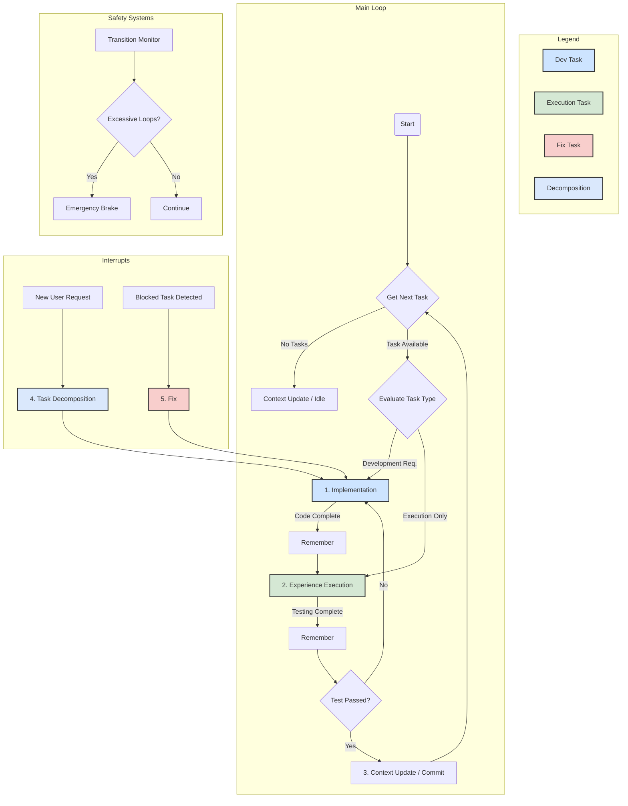

# Cursor Memory Bank 🧠

Un système de workflow autonome avancé pour Cursor avec gestion de tâches intelligente et système de roadmap centralisée.

## Table des Matières - Ordre de Révision

*Les fichiers sont listés du plus récent au moins récent. Le dernier fichier sera vérifié à la prochaine exécution.*

1. [Scripts](./scripts/scripts.md) - *Dernière vérification : 2025-01-20*

## Architecture du dépôt & emplacement des fichiers

Le projet Cursor Memory Bank est organisé selon une architecture modulaire permettant une installation flexible et une maintenance aisée :

```
root/
├─ .cursor/              # Configuration Cursor et règles d'agent
│  ├─ rules/            # Règles d'agent (.mdc) - comportement de l'IA
│  ├─ commands/         # Commandes personnalisées (.md)
│  └─ agents/           # Système de roadmap centralisée
│     ├─ roadmap.yaml   # Roadmap centralisée avec toutes les tâches
│     └─ *.md            # Fichiers de tâches et rapports
├─ documentation/        # Guides détaillés et documentation longue
├─ install.sh           # Script d'installation automatisé
├─ tomd.py              # Utilitaire Python pour conversion markdown
└─ package.json         # Métadonnées du projet et scripts npm
```

### Structure détaillée des dossiers

- **`.cursor/commands/`** : Commandes personnalisées pour l'agent
  - *Contient* : `prompt.md`, `enqueteur.md`, `agent.md`, `task.md`, `janitor.md` - Commandes de transition, enquête, roadmap et maintenance
  - *Structure* : Fichiers `.md` définissant des commandes slash personnalisées
  - *Usage* : Permet aux agents de générer des prompts de transition avec `/prompt`, lancer une enquête avec `/enqueteur`, sélectionner une tâche avec `/agent`, ajouter une tâche avec `/task`, et analyser le repository avec `/janitor`

- **`.cursor/agents/`** : Système de roadmap centralisée pour coordination multi-agents
  - *Contient* : `roadmap.yaml` (roadmap centralisée), fichiers de tâches (`{titre-kebab-case}.md`), fichiers de résultats (`rapport-{titre-kebab-case}.md`)
  - *Structure* : Fichier YAML pour la roadmap, fichiers markdown pour les tâches et rapports
  - *Usage* : Permet à plusieurs agents Cursor de travailler en parallèle, chaque agent peut consulter la roadmap, sélectionner une tâche, et consulter les résultats des autres agents
  
- **`.cursor/rules/`** : Règles d'agent définissant le comportement de l'IA
  - *Contient* : `agent.mdc`, `debug.mdc`, `start.mdc`, `README.mdc` (exemples)
  - *Structure* : Fichiers `.mdc` avec métadonnées YAML et instructions markdown
  - *Usage* : Définissent comment l'agent doit réagir dans différents contextes. Note : la procédure d'enquête auparavant répartie dans `.cursor/rules/enqueteur/` a été consolidée en une commande unique `.cursor/commands/enqueteur.md`.
  - *Nouveau* : `communication.mdc` — règle de communication imposant clarté, emojis pertinents, sections structurées et usage de tableaux lorsque utile.

- **`documentation/`** : Guides approfondis et procédures détaillées
  - *Contient* : Documentation technique, guides d'utilisation, architecture détaillée
  - *Structure* : Fichiers markdown organisés par domaine fonctionnel
  - *Usage* : Référence pour les utilisateurs avancés et la maintenance

- **`install.sh`** : Script d'installation unifié (mode unique)
  - *Rôle* : Installation automatisée avec détection de branche et fallback curl
  - *Fonctionnalités* : Mode unique — règles, commandes et configuration `.gitignore`
  - *Usage* : `bash install.sh`

- **`tomd.py`** : Utilitaire Python pour la conversion et le traitement markdown
  - *Rôle* : Conversion de formats, traitement de fichiers markdown
  - *Usage* : Outil de ligne de commande pour les tâches de formatage

## Installation 🚀

A single installer is provided: `install.sh`. It installs agent rules, custom commands, and configures `.gitignore`. Clone is preferred; a curl fallback may be used when necessary.

Recommended (download then run — reviewable):
```bash
curl -fsSL https://raw.githubusercontent.com/hjamet/cursor-memory-bank/master/install.sh | bash
```

Examples:
```bash
# Default installation (rules + commands)
bash install.sh

# Install to a specific directory
bash install.sh --dir /path/to/install

# Show help information
bash install.sh --help
```

Available options (summary):
- `--dir <path>` : Install to a specific directory (default: current directory)
- `--force` : Force overwrite existing files
- `--help` : Show help information
- `--version` : Show version information

### Required files and fail-fast policy

Certain files are considered required by the installer and a missing download will stop the installation immediately (fail-fast). This ensures the installer does not continue in a partially-installed state.

- **Required files (examples)**:
  - `.cursor/rules/agent.mdc` (agent behavior rules)
  - `.cursor/commands/prompt.md` (agent handoff command)

- **Diagnosis**: On failure the installer will print diagnostic info including HTTP status codes and curl exit codes (e.g. `http_code=404 curl_exit_code=22`). Re-run the installer after fixing network or URL issues.

### Comportement des téléchargements

Le script utilise une fonction interne `download_file(url, dest, [required])` pour récupérer des fichiers via `curl`.
- **Paramètre `required`**: si la 3ᵉ valeur passée est `required`, le fichier est **considéré critique**; toute erreur HTTP (404, 403, 5xx) ou un fichier vide provoquera une erreur fatale et interrompra l'installation (fail‑fast).
- **Fichiers optionnels**: si le paramètre n'est pas fourni, les erreurs réseau/HTTP **ne feront pas échouer** l'installation. Le script affichera un **warning** et continuera (retourne 0) pour préserver la compatibilité avec `set -e` et éviter des régressions quand des ressources facultatives manquent.
- **Diagnostics**: sur erreurs ou comportements inattendus, le script affiche `http_code` et `curl_exit_code` (ex. `http_code=404 curl_exit_code=22`) pour faciliter le diagnostic réseau/URL.

Exemples d'utilisation dans le script:

```bash
# Fichier critique — installation échoue si absent
download_file "$RAW_URL_BASE/.cursor/commands/prompt.md" "$target_dir/.cursor/commands/prompt.md" "required"
```


### Method 2: Using git clone

If you prefer, you can also install Cursor Memory Bank by cloning the repository:

```bash
git clone https://github.com/hjamet/cursor-memory-bank.git
cd cursor-memory-bank
bash install.sh [options]
```

## Installation Mode 🎯

The installer now provides a single mode: it installs essential rules (`agent.mdc`, `debug.mdc`), custom commands, and updates `.gitignore`. Existing custom rules are preserved. No Streamlit UI or ML artifacts are installed.

## Système de Roadmap Centralisée 📋

Le système utilise maintenant une roadmap centralisée (`.cursor/agents/roadmap.yaml`) pour coordonner plusieurs agents Cursor en parallèle. Ce système simple et léger remplace les anciens serveurs MCP qui sont désormais obsolètes.

**Note historique** : L'historique git contient les anciens systèmes basés sur les serveurs MCP (ToolsMCP, MemoryBankMCP) ainsi qu'une ancienne UI Streamlit. Ces éléments ont été retirés au profit d'un système de roadmap centralisée plus simple et léger. Voir `documentation/legacy-ui-ml.md` pour un court récapitulatif.

### Comment ça fonctionne

- **Roadmap centralisée** : `.cursor/agents/roadmap.yaml` contient toutes les tâches à faire
- **Fichiers de tâches** : `.cursor/agents/{titre}.md` décrivent chaque tâche avec contexte, objectif et instructions
- **Commandes** : `/agent` pour sélectionner une tâche, `/task` pour en ajouter une nouvelle
- **Coordination** : Plusieurs agents peuvent travailler en parallèle en consultant la roadmap

Pour plus d'informations, consultez les commandes `/agent` et `/task` dans la section "Custom Commands" ci-dessous.

## What is Cursor Memory Bank? 🤔

Cursor Memory Bank is an advanced autonomous workflow system that revolutionizes how you work with Cursor. It provides intelligent task management, persistent memory, and automated quality assurance through a sophisticated rule-based architecture.

### Core Features ✨

#### 🧠 **Autonomous Workflow System**
- **Self-Managing**: Operates in continuous autonomous loops with intelligent decision-making
- **Quality Assurance**: Mandatory testing cycle with automatic `implementation → experience-execution` transitions
- **Safety Mechanisms**: Anti-infinite-loop protection, emergency brakes, and transition monitoring
- **Intelligent Routing**: Context-aware task routing based on complexity and requirements

#### 📋 **Advanced Task Management**
- **Hierarchical Tasks**: Support for parent-child task relationships and dependencies
- **Multi-Task Decomposition**: Intelligent breaking down of complex requests into manageable subtasks
- **Priority System**: 5-level priority system (1=lowest, 5=critical) with automatic prioritization
- **Roadmap-Only State**: No runtime status like `IN_PROGRESS` is used by `/agent`. On selection, the task is immediately removed from the roadmap and its task file is deleted (irreversible by design).

<!-- Streamlit UI removed from installer scope -->

#### 🚀 **Workflow Automation**
- **Automatic Testing**: Mandatory validation after every implementation
- **Smart Transitions**: Context-aware workflow step recommendations
- **Memory Persistence**: Long-term and working memory with automatic cleanup
- **Git Integration**: Automated commit messages with standardized formatting

### Recent Major Improvements 🆕

#### **Enhanced Notification System (v2.0)**
- **Custom Duration**: Configurable 5-15 second display time (vs 4s fixed in st.toast())
- **Markdown Support**: Full markdown rendering with safe HTML sanitization
- **Visual Progress**: Animated progress bars showing remaining time
- **Manual Control**: User-controlled dismissal and hover-pause functionality
- **Type System**: Distinct styling for info, success, warning, error, and memory notifications

#### **Workflow Architecture Overhaul**
- **Automatic Experience-Execution**: Mandatory testing after every implementation
- **Safety Systems**: Comprehensive anti-loop protection with cooldown mechanisms
- **Performance Monitoring**: Real-time workflow performance tracking
- **Simplified Task Decomposition**: Streamlined approach balancing efficiency and simplicity

#### **Interface Modernization**
- **Responsive Design**: Mobile-friendly interface with breakpoint optimization
- **Enhanced Styling**: Modern gradients, shadows, and animations
- **Improved UX**: Better contrast, larger notification areas, and intuitive navigation

### Known Issues & Active Development 🚧

#### **Auto-Refresh System Status**
✅ **RESOLVED**: The auto-refresh issue has been addressed with a hybrid solution that provides both reliability and user control (as of 2025-07-21).

**Solution Implemented:**
- **Primary Mode**: Manual refresh system with prominent "🔄 Actualiser les données" button in sidebar
- **Optional Auto-Refresh**: Experimental auto-refresh for users who want to try it (5-second intervals)
- **Clean Interface**: All informational refresh indicators removed from main interface for streamlined UX
- **Smart UX**: Clear instructions and visual feedback when data is refreshed

**Technical Implementation:**
 - Robust manual refresh with cache clearing and forced rerun
- Error handling and fallback for environments where auto-refresh fails
- **Interface Streamlined (July 2025)**: Removed data freshness timestamps, counters, and mini refresh buttons from main interface per user feedback

**User Impact**: **POSITIVE** - Users have reliable control over data refresh with clean, distraction-free interface
**Status**: **OPERATIONAL** - Manual refresh system with experimental auto-refresh option

The system now provides a better user experience with guaranteed refresh functionality.

## Agent Workflow Logic 🧠⚙️

The autonomous agent operates on a sophisticated, rule-based workflow designed for robustness and intelligent decision-making. The system features **automatic testing integration** with mandatory `implementation → experience-execution` transitions to ensure code quality.

### Workflow Architecture



### Key Workflow Features

#### **Mandatory Testing Cycle**
- **CRITICAL RULE**: `implementation → experience-execution` (AUTOMATIC)
- **ARCHITECTURAL INTEGRITY GUARANTEED**: Complete elimination of `implementation → implementation` violations (2025-07-23)
- Every code change is automatically tested before completion
- Prevents regressions and ensures quality
- Built-in safety mechanisms prevent infinite loops

#### **Intelligent Task Routing**
- **Development Tasks**: Full implementation → testing → commit cycle
- **Execution Tasks**: Direct routing to experience-execution for commands/scripts
- **Fix Tasks**: High-priority interrupt handling for blocked tasks
- **Decomposition**: Multi-request analysis and task creation

#### **Safety Systems**
- **Transition Limits**: Maximum 10 consecutive transitions before emergency brake
- **Cooldown Periods**: 1-minute minimum between experience-execution cycles
- **Cycle Detection**: Automatic identification of implementation → fix loops
- **Emergency Brakes**: Automatic activation on excessive transitions

### Workflow Steps Explained

1. **Implementation (`implementation`)**
   - Core development step for code changes
   - No roadmap status change to `IN_PROGRESS`; selection via `/agent` removes the task instantly (irreversible)
   - Intelligent routing based on task complexity
   - **Mandatory transition** to Experience Execution

2. **Experience Execution (`experience-execution`)**
   - Automatic testing and validation
   - Manual testing for complex features
   - Quality assurance checks
   - **Exclusive responsibility** for task completion

3. **Task Decomposition (`task-decomposition`)**
   - Multi-request analysis capability
   - Intelligent task creation with dependencies
   - Priority assignment and scheduling
   - **Simplified approach** balancing efficiency and thoroughness

4. **Fix (`fix`)**
   - High-priority interrupt handling
   - Blocked task resolution
   - Error diagnosis and correction
   - **Immediate routing** to implementation

## Custom Commands

### `/prompt` - Transition entre agents

La commande `/prompt` permet aux agents de créer un plan de transition pour passer le contexte à un nouvel agent. Le plan est automatiquement enregistré dans le repository et supprimé par le successeur.

**Usage:**
- `/prompt il faudrait maintenant optimiser les performances` : Avec instructions
- `/prompt` : Sans instructions

**Format de sortie:** Plan de transition avec 4 sections (Contexte, Objectif, Fichiers Concernés, Instructions de Collaboration) + todos incomplets + todo de nettoyage

**Mécanique:**
- Le plan de transition est créé via l'outil `create_plan` et sauvegardé automatiquement dans le repository
- Si l'agent courant a des todos non terminés, ils sont inclus dans le plan de transition
- Le premier todo du plan est toujours de supprimer le fichier de plan de transition
- Le nouveau plan permet au successeur de reprendre là où le prédécesseur s'est arrêté ou de démarrer une nouvelle direction

### `/enqueteur` - Enquête méthodologique des bugs

La commande `/enqueteur` exécute la procédure d'enquête pas à pas (exploration, hypothèses, logs, exécution, analyse, validation critique, rapport) définie dans `.cursor/commands/enqueteur.md`.

**Usage:**
- `/enqueteur` : Démarre l'enquête étape par étape. L'agent doit suivre les instructions du fichier et produire le rapport final d'identification (aucune correction proposée).

**Format de sortie:** Rapport d'identification du bug avec fichier/fonction/ligne/instruction et preuves BEFORE/AFTER.

### `/janitor` - Reviewer exhaustif du repository

La commande `/janitor` conduit une analyse critique exhaustive du repository pour identifier TOUS les problèmes de maintenance, incohérences, et lacunes organisationnelles.

**Usage:**
- `/janitor` : Exploration exhaustive générale du repository (trouve au moins 1 problème)
- `/janitor scripts/` : Analyse ciblée d'un dossier spécifique

**Fonctionnalités:**
- **Cohérence structurelle** : Vérifie que la documentation (README) correspond à la structure réelle
- **Qualité de documentation** : Valide toutes les sections obligatoires du README contre réalité
- **Code legacy** : Identifie fichiers obsolètes, checkpoints anciens, logs non nettoyés
- **Organisation** : Détecte fichiers mal placés, duplications, structure incohérente
- **Qualité du code** : Imports cassés, chemins relatifs incorrects, dépendances manquantes
- **Complétude** : Variables d'environnement non documentées, commandes obsolètes

**Système de sévérité:**
- 🔴 **Critique** : Problèmes bloquants (architecture cassée, imports broken)
- 🟠 **Majeur** : Problèmes significatifs (documentation obsolète, incohérences majeures)
- 🟡 **Mineur** : Améliorations (clarté, organisation, conventions)

**Output:** Tableau complet avec 5 colonnes (Sévérité, Catégorie, Fichier/Section, Description du Problème, Action Suggérée) + Résumé + Évaluation de santé du repository

**Focus README:** Validation MANDATOIRE de toutes les sections du README contre l'état réel du repository à chaque exécution.

**Sécurité:** Jamais d'exécution automatique - identification exhaustive des problèmes uniquement

### `/agent` - Sélection et traitement de tâche depuis la roadmap centralisée 🚀

La commande `/agent` permet de lancer un agent qui consulte la roadmap centralisée, sélectionne automatiquement la tâche la plus intéressante disponible, charge tout son contexte, puis présente la tâche à l'utilisateur pour discussion collaborative avant implémentation.

**Usage:**
- `/agent` : Lance un agent qui sélectionne et traite une tâche de la roadmap

**Fonctionnalités:**
- **Sélection intelligente** : Choisit automatiquement la tâche la plus pertinente selon les dépendances, la priorité et l'ancienneté
- **Chargement de contexte** : Lit exhaustivement tous les fichiers mentionnés dans la tâche
- **Lectures en parallèle** : Effectue en parallèle la lecture de tous les fichiers mentionnés pour réduire la latence
- **Recherches** : Effectue les recherches sémantiques et web mentionnées
- **Présentation** : Présente la tâche sélectionnée avec contexte complet en français
- **Discussion collaborative** : Attend la planification avec l'utilisateur avant toute implémentation

**Système de roadmap:**
- Fichier centralisé : `.cursor/agents/roadmap.yaml`
- Fichiers de tâches : `.cursor/agents/{titre-kebab-case}.md`
- Fichiers de résultats : `.cursor/agents/rapport-{titre-kebab-case}.md`

**Critères de sélection:**
- Dépendances résolues (toutes les tâches dépendantes existent dans la roadmap)
- Priorité (5 = plus haute priorité)

**Workflow:**
1. Lecture de la roadmap
2. Sélection de la tâche la plus intéressante
3. Chargement du fichier de tâche et de tous les fichiers mentionnés
4. Recherches sémantiques et web
5. Suppression de la tâche de la roadmap et nettoyage des dépendances
6. Suppression du fichier de tâche
7. Présentation à l'utilisateur avec contexte complet
8. Discussion collaborative pour planification
9. Implémentation après validation

**Règle associée:** `.cursor/rules/agent.mdc` explique quand et comment créer des tâches dans la roadmap lorsque des travaux futurs sont identifiés.

**Format de présentation standard (sortie de `/agent`)**:

```
🎯 **Tâche sélectionnée :** [Titre] (🔴X, 🟠Y, 🔵Z, 🟢W)

📋 **Contexte :**
[Pourquoi cette tâche existe, découvertes, problèmes]

🎯 **Objectif :**
[But à atteindre, ton exploratoire]

🧠 **Idées :**
- [Piste 1]
- [Piste 2]

❓ **Questions :**
1. [Question 1] ?
2. [Question 2] ?
```

Note: `/agent` ne crée jamais de plan pour la sélection/consultation de la roadmap. Le plan est créé uniquement pour l’implémentation de la tâche sélectionnée, après discussion avec l’utilisateur.

> Compteurs de priorités: les valeurs X/Y/Z/W correspondent au nombre de tâches restantes dans la roadmap après suppression de la tâche sélectionnée, agrégées par priorité (5=🔴, 4=🟠, 3=🔵, 2–1=🟢). Les quatre compteurs sont toujours affichés, même à 0.

### `/task` - Ajout non-bloquant de tâche à la roadmap 📝

La commande `/task` permet d'ajouter une nouvelle tâche à la roadmap centralisée **SANS INTERROMPRE** le travail en cours de l'agent. L'agent crée la tâche avec tout le contexte nécessaire, puis reprend immédiatement son travail précédent.

**Usage:**
- `/task il faudrait optimiser les performances plus tard` : Ajoute une tâche future à la roadmap

**Fonctionnalités:**
- **Création complète** : Génère le fichier de tâche avec les 4 sections obligatoires (Contexte, Objectif, Fichiers Concernés, Instructions)
- **Ajout à la roadmap** : Enregistre la tâche dans `roadmap.yaml` avec ID unique
- **Contexte préservé** : Mentionne les fichiers du travail actuel dans "Fichiers Concernés"
- **Non-bloquant** : Ne change pas le focus de l'agent, reprend le travail immédiatement après
 - **Aucune implémentation immédiate** : La tâche créée ne doit jamais être implémentée ni planifiée tout de suite; elle sera traitée plus tard via `/agent` après discussion

**Comportement:**
- **Interruption obligatoire et immédiate** : `/task` suspend TOUT travail en cours pour être traitée immédiatement
- **Traitement strictement séquentiel** : Si plusieurs `/task` sont invoquées, elles sont traitées l'une après l'autre
- **Confirmation minimale** : `✅ Tâche ajoutée (task-{id})` - la plus courte possible pour reprendre rapidement le flux initial

**Principe fondamental:**
- **Interruption non-bloquante** : L'agent continue exactement là où il s'était arrêté
- **Délégation** : La tâche est créée pour être traitée par un autre agent (via `/agent`)
 - **Interdiction d'implémenter** : Après création, l'agent ne doit ni implémenter ni planifier cette nouvelle tâche
- **Format cohérent** : Suit exactement le même format que les autres fichiers de tâches

**Workflow:**
1. Analyser la demande de l'utilisateur
2. Générer les noms de fichiers (tâche + rapport)
3. Créer le fichier de tâche avec les 4 sections
4. Ajouter l'entrée dans `roadmap.yaml`
5. Confirmer la création : `✅ Tâche ajoutée (task-{id})`
6. Reprendre immédiatement le travail précédent

**Exemple:** Pendant l'implémentation de l'authentification, l'utilisateur tape `/task optimiser les performances`. L'agent crée la tâche avec contexte, confirme `✅ Tâche ajoutée (task-1)`, puis continue l'implémentation de l'authentification.

<!-- Streamlit Interface Features section removed (UI no longer installed) -->

## Technical Architecture 🏗️

### **Workflow Safety Systems**
- **Transition Monitoring**: Real-time tracking of workflow steps
- **Loop Detection**: Automatic identification of problematic patterns
- **Emergency Brakes**: Fail-safe mechanisms for system stability
- **Performance Metrics**: Comprehensive monitoring and reporting

### **Memory Management**
- **Working Memory**: Short-term context for active tasks
- **Long-term Memory**: Persistent storage of important decisions
- **Automatic Cleanup**: Intelligent memory optimization
- **Context Preservation**: Seamless session continuity

### **Quality Assurance**
- **Mandatory Testing**: Automatic validation after every implementation
- **Code Quality Checks**: Integrated linting and validation
- **Regression Prevention**: Systematic testing of changes
- **Performance Monitoring**: Real-time system health tracking

## Contributing 🤝

While this is primarily a personal project, contributions are welcome! The system is designed to be extensible and maintainable. Most documentation and rules are in French, but English translations and general-purpose improvements are especially appreciated.

### **Development Guidelines**
- Follow the established workflow patterns
- Test all changes through the experience-execution cycle
- Document architectural decisions in long-term memory

## License 📄

This project is open source and available for personal and educational use. Please refer to the repository for the most current license information.

## Troubleshooting 🔧

### **Windows Emoji Encoding Issues** 🐛

If you encounter `UnicodeEncodeError` when running commands with emojis on Windows:

**Problem**: Windows uses `cp1252` encoding by default, causing errors with Unicode characters and emojis.

**Solution**: Set the following environment variables for all processes:
- `PYTHONIOENCODING=utf-8`: Forces Python to use UTF-8 for I/O operations
- `PYTHONLEGACYWINDOWSSTDIO=0`: Enables UTF-8 mode on Windows
- `LC_ALL=C.UTF-8` and `LANG=C.UTF-8`: Sets locale to UTF-8

### **Workflow Issues**

If the autonomous workflow seems stuck or behaving unexpectedly:

1. **Check Safety Systems**: Look for emergency brake activation
2. **Monitor Transitions**: Verify workflow step transitions are completing
3. **Review Memory**: Check working memory for error patterns
4. **Restart Workflow**: Use `start-workflow` to reset system state

### **Notification Issues**

If toast notifications are not appearing or functioning correctly:

1. **Check Session State**: Verify Streamlit session state initialization
2. **Clear Cache**: Use Streamlit's cache clearing functionality
3. **Verify Integration**: Ensure notification functions are called on all pages
4. **Test Manually**: Use the enhanced notification system directly

### **Performance Issues**

If the system is running slowly or consuming excessive resources:

1. **Memory Cleanup**: Use context-update to optimize memory usage
2. **Task Optimization**: Review task dependencies and priorities
3. **Transition Monitoring**: Check for excessive workflow transitions
4. **System Resources**: Monitor CPU and memory usage

For more detailed troubleshooting, consult the system's working memory and long-term memory for specific error patterns and solutions.

## Automatic Task Creation System 🔧

The system automatically creates refactoring tasks for oversized files (>500 lines) integrated directly into the commit workflow.

### How It Works

**Automatic Detection**: Every time you commit, the system:
1. **Scans all files** in the project with supported extensions (`.py`, `.js`, `.tex`, `.html`, `.css`, `.sh`)
2. **Detects files** exceeding 500 lines
3. **Creates refactoring tasks** automatically with appropriate priorities
 

### Supported File Types
- Python (`.py`)
- JavaScript (`.js`) 
- LaTeX (`.tex`)
- HTML (`.html`)
- CSS (`.css`)
- Shell scripts (`.sh`)

### Priority Assignment
- **1500+ lines**: Priority 5 (Critical)
- **1000+ lines**: Priority 5 (Critical)
- **500+ lines**: Priority 4 (High)

### Testing the System

To verify automatic task creation works:

1. Create a test file with >500 lines: `seq 600 > test_file.py`
2. Commit the changes
3. Check the commit output for "Automatic Task Creation" section
 
5. Clean up: `rm test_file.py`

### Configuration Notes

**Important**: If you see git hook configuration pointing to `.githooks`, this is obsolete and can be removed:
```bash
git config --unset core.hooksPath
```

The functionality is now **100% integrated** into the commit workflow - no separate hooks needed.

### **Windows: git diff encoding fix**

If `python tomd.py` raises a `UnicodeDecodeError` when writing the git diff (Windows CP1252 decoding issue), update `tomd.py` to write the raw `git diff` bytes to the `diff` file. The script now writes the diff as binary to preserve arbitrary bytes and avoid platform-specific decoding errors. No user action is required for the fix bundled in the repository.
