# Cursor Memory Bank 🧠

## Installation 🚀

### Method 1: Using curl (Recommended)

You can install using this one-liner:

```bash
curl -fsSL https://raw.githubusercontent.com/hjamet/cursor-memory-bank/master/install.sh | bash
```

**Note for MINGW64/Git Bash users on Windows:** If you encounter `: command not found` errors during installation, it's likely due to line ending issues when piping directly. Use this modified command instead:

```bash
curl -fsSL https://raw.githubusercontent.com/hjamet/cursor-memory-bank/master/install.sh | tr -d '\r' | bash
```

For better security, you can also:
1. Download the script first:
```bash
curl -fsSL https://raw.githubusercontent.com/hjamet/cursor-memory-bank/master/install.sh -o install.sh
```

2. Review it:
```bash
less install.sh
```

3. Then run it with any desired options:
```bash
bash install.sh [options]
```

Available options:
- `--dir <path>` : Install to a specific directory (default: current directory)
- `--backup` : Create a backup of existing rules
- `--force` : Overwrite existing files
- `--help` : Show help information
- `--version` : Show version information

Examples:
```bash
# Install to current directory
bash install.sh

# Install to a specific directory
bash install.sh --dir /path/to/install

# Create a backup of existing rules
bash install.sh --backup

# Show help information
bash install.sh --help
```

### Method 2: Using git clone

If you prefer, you can also install Cursor Memory Bank by cloning the repository:

```bash
git clone https://github.com/hjamet/cursor-memory-bank.git
cd cursor-memory-bank
bash install.sh [options]
```

The installation script will:
- Install the rules to your `.cursor/rules` directory
- Always preserve any existing custom rules
- Create a backup of existing rules (only if --backup is used)
- Update only the core rules that need updating
- Preserve any unrelated files that might be in the .cursor directory
- Work even if the .cursor directory already exists

## What is Cursor Memory Bank? 🤔

Cursor Memory Bank is a system that helps maintain context between coding sessions by storing and organizing information in a coherent file structure. It's designed to work with Cursor, enhancing its capabilities with structured rules and workflows.

### Features
- 📁 Organized file structure for storing context
- 🔄 Automatic backup of custom rules
- 🛠️ Flexible installation options
- 🔒 Safe updates with rule preservation
- 📝 Structured workflows and rules

## Workflow 🌊

Here is a diagram of the workflow used by the agent to process requests:

```mermaid
graph TD
    A["start-workflow<br/>🚀 Initialize workflow<br/>Load context & memory"] --> B["task-decomposition<br/>📋 Break down requests<br/>Create tasks"]
    
    B --> C["implementation<br/>⚙️ Execute tasks<br/>Code & develop"]
    
    C --> D["experience-execution<br/>🧪 Manual testing<br/>Validate functionality"]
    
    D --> E["fix<br/>🔧 Debug & resolve<br/>Handle issues"]
    D --> F["context-update<br/>📝 Update context<br/>Process userbrief<br/>Commit changes"]
    
    E --> C
    E --> D
    
    F --> B
    F --> A
    
    style A fill:#e1f5fe
    style B fill:#f3e5f5
    style C fill:#e8f5e8
    style D fill:#fff3e0
    style E fill:#ffebee
    style F fill:#f1f8e9
```



## Contributing 🤝

While this is primarily a personal project, contributions are welcome! Just note that most of the documentation and rules are in French. If you'd like to help translate the project to English or improve its general-purpose usage, that would be especially appreciated!

## License 📄

This project is licensed under the MIT License - see the LICENSE file for details.

## Pre-commit Hook Verification (Manual)

The installation script installs a pre-commit hook in `.githooks/pre-commit` to check for code files exceeding 500 lines. To manually verify this hook blocks commits correctly:

1. Ensure the rules have been installed using `bash install.sh`.
2. Initialize a temporary git repository: `mkdir temp_repo && cd temp_repo && git init`
3. Configure git to use the installed hooks: `git config core.hooksPath ../.githooks`
4. Create a file longer than 500 lines: `seq 510 > long_file.txt`
5. Stage the file: `git add long_file.txt`
6. Attempt to commit:
   - Using the MCP tool: Call `mcp_MyMCP_commit` via Cursor with appropriate arguments (e.g., title, type).
   - OR Using standard git: `git commit -m "Test long file"`
7. Observe the output. The commit should fail, and you should see the error message from the hook script: `COMMIT FAILED: Files exceed maximum line count (500). ... The following files are too long...: long_file.txt`.
8. Clean up: `cd .. && rm -rf temp_repo`

## Troubleshooting 🔧

### MCP Commit Server Issues

If you encounter an error like `Error: Cannot find module '.cursor/mcp/mcp-commit-server/server.js'` when using Cursor, it means the MCP commit server files were not properly installed in your Cursor installation directory. To fix this issue:

1. Make sure the MCP commit server files exist in your project:
```bash
ls -la .cursor/mcp/mcp-commit-server/
```

2. Copy the MCP commit server files to your Cursor installation directory:
```bash
# For Windows (adjust the path as needed):
mkdir -p "C:/Users/<YourUsername>/AppData/Local/Programs/cursor/.cursor/mcp/mcp-commit-server"
cp -r .cursor/mcp/mcp-commit-server/* "C:/Users/<YourUsername>/AppData/Local/Programs/cursor/.cursor/mcp/mcp-commit-server/"

# For macOS (adjust the path as needed):
mkdir -p ~/Library/Application\ Support/cursor/.cursor/mcp/mcp-commit-server
cp -r .cursor/mcp/mcp-commit-server/* ~/Library/Application\ Support/cursor/.cursor/mcp/mcp-commit-server/

# For Linux (adjust the path as needed):
mkdir -p ~/.config/cursor/.cursor/mcp/mcp-commit-server
cp -r .cursor/mcp/mcp-commit-server/* ~/.config/cursor/.cursor/mcp/mcp-commit-server/
```

3. Install the dependencies:
```bash
# Navigate to the MCP commit server directory in your Cursor installation:
cd "C:/Users/<YourUsername>/AppData/Local/Programs/cursor/.cursor/mcp/mcp-commit-server/" # Windows
cd ~/Library/Application\ Support/cursor/.cursor/mcp/mcp-commit-server/ # macOS
cd ~/.config/cursor/.cursor/mcp/mcp-commit-server/ # Linux

# Install dependencies:
npm install
```

4. Create or update the mcp.json file in your Cursor installation directory:
```json
// For Windows - Save this to C:/Users/<YourUsername>/AppData/Local/Programs/cursor/.cursor/mcp.json
{
    "mcpServers": {
        "Git Commit (Internal)": {
            "command": "cmd",
            "args": [
                "/c",
                "node",
                ".cursor/mcp/mcp-commit-server/server.js"
            ],
            "cwd": "."
        }
    }
}

// For macOS/Linux - Save this to ~/Library/Application Support/cursor/.cursor/mcp.json (macOS) or ~/.config/cursor/.cursor/mcp.json (Linux)
{
    "mcpServers": {
        "Git Commit (Internal)": {
            "command": "node",
            "args": [
                ".cursor/mcp/mcp-commit-server/server.js"
            ],
            "cwd": "."
        }
    }
}
```

5. Restart Cursor and the MCP commit server should now be available as a tool.

### MCP Tool Discovery Issues

If you've successfully installed MCP servers but new tools aren't appearing in Cursor's available tools list:

**Quick Solution: Restart Cursor completely**

1. **Close Cursor**: Exit the application entirely
2. **Restart Cursor**: Launch the application again  
3. **Open Workspace**: Navigate back to your project
4. **Verify**: Check if the tool now appears in the available tools list

**Why This Happens:** Cursor caches MCP tool lists for performance. When tools are added to existing servers, the cache isn't automatically refreshed until the application restarts.

**Note:** As of the latest updates, the commit tool has been migrated from MyMCP to MemoryBank MCP server. After updating, you'll need to restart Cursor to see the new `mcp_MemoryBank_commit` tool replace the old `mcp_MyMCP_commit` tool.