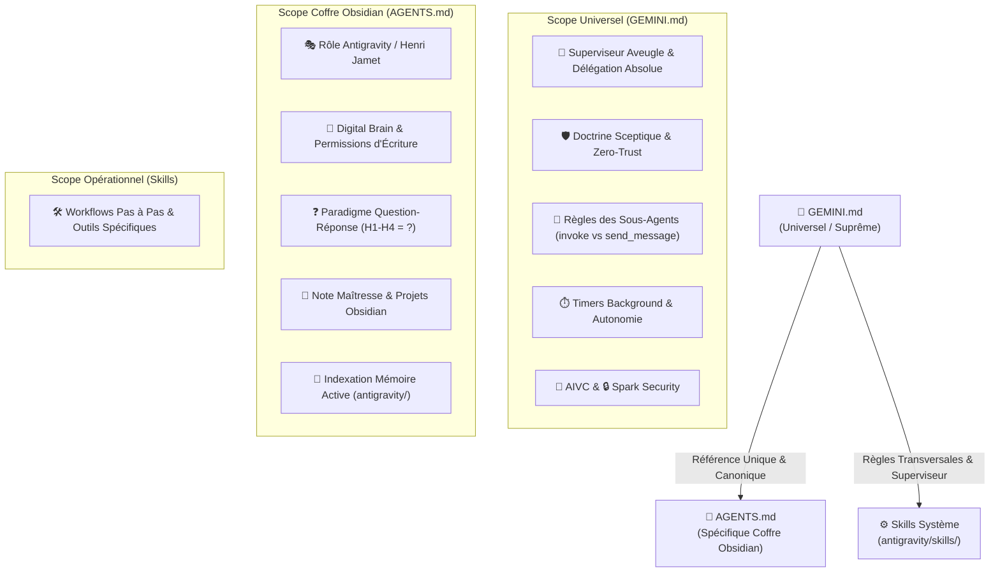
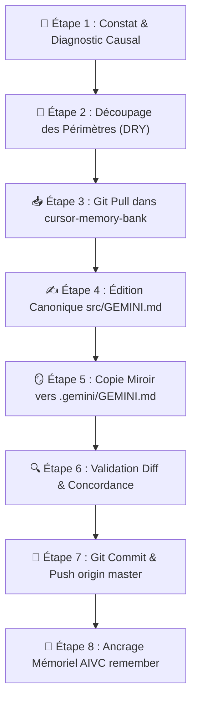

# 🎯 Pourquoi et Quand Déclencher le Protocole Align-Instructions ?

| Déclencheur / Symptôme | Cause Probable | Risque Systémique | Action Immédiate |
| :--- | :--- | :--- | :--- |
| **Violation du Superviseur Aveugle** | L'agent racine appelle `find_by_name`, `grep_search`, `view_file` ou `run_command` au lieu de déléguer. | Perte de contexte, gaspillage de tokens, transgression des règles d'or. | Arrêt immédiat, rappel de la liste noire formelle, délégation via `invoke_subagent`. |
| **Recyclage Abusif via `send_message`** | Réutilisation d'un ancien sous-agent pour un nouveau besoin ou un outil distinct. | Pollution du contexte du sous-agent, hallucinations, exécution dégradée. | Clôture de l'échange, lancement d'un nouveau sous-agent dédié (`invoke_subagent`). |
| **Désynchronisation Miroir** | `C:\Users\Jamet\.gemini\GEMINI.md` et `cursor-memory-bank/src/GEMINI.md` diffèrent. | Régression au redémarrage d'IDE, comportement instable, perte des correctifs. | Exécution du protocole de synchronisation miroir git. |
| **Duplication de Règles (Violation DRY)** | Une règle globale système est recopiée ou paraphrasée dans `AGENTS.md`. | Divergence de consignes, ambiguïté d'arbitrage pour les modèles. | Élagage de `AGENTS.md`, consolidation dans `GEMINI.md` et renvoi par lien. |
| **Hallucination / Biais d'Optimisme** | Validation aveugle d'un résultat non prouvé ou affirmation d'une information absente. | Décisions erronées, dégradation de la confiance utilisateur. | Autopsie médico-légale de la règle transgressée, renforcement du Zero-Trust. |

---

## 🏛️ Comment S'Articule l'Arborescence des Règles Système ?



| Fichier / Entité | Emplacement Canonique | Périmètre Exclusif | Ce Qui y Est STRICTEMENT INTERDIT |
| :--- | :--- | :--- | :--- |
| **`GEMINI.md`** | `C:\Users\Jamet\.gemini\GEMINI.md`<br/>`cursor-memory-bank/src/GEMINI.md` | **Règles universelles transversales** : Pattern Superviseur Aveugle, sous-agents, interdiction `send_message` pour nouveaux besoins, timers de commandes, sécurité Spark, AIVC. | Spécificités locales d'un coffre ou projet particulier (chemins de notes, rôles métiers contextuels). |
| **`AGENTS.md`** | `c:\Users\Jamet\Documents\VoiceNotes\AGENTS.md` | **Spécificités locales du coffre Obsidian** : Rôle d'Antigravity auprès de Henri, Digital Brain, format des notes Obsidian (Paradigme Q/R), arborescence `notes/`, index `antigravity/`. | Recopier ou redéfinir les règles globales système déjà présentes dans `GEMINI.md` (DRY strict). |
| **`SKILL.md`** | `antigravity/skills/<skill-name>/SKILL.md` | **Directives opérationnelles d'un workflow ciblé** : Commandes CLI, checklists, schémas Mermaid et étapes d'exécution d'un outil précis. | Redéfinir l'architecture globale ou entrer en conflit avec `GEMINI.md`. |

---

## 🔬 Comment Autopsier une Dérive Comportementale (Root-Cause Analysis) ?

| Dérive Observée | Question d'Autopsie Causal | Diagnostic de Cause Racine | Correction dans les Instructions |
| :--- | :--- | :--- | :--- |
| **L'agent superviseur lit un fichier ou exécute un `grep`** | Pourquoi le superviseur a-t-il utilisé un outil de lecture ? | Manque de clarté sur la liste noire ou tentation de "vérification rapide". | Réaffirmer la métaphore de l'aveugle et la liste noire formelle dans `GEMINI.md`. |
| **L'agent envoie un `send_message` pour demander une nouvelle action** | Pourquoi ne pas avoir déployé un nouveau sous-agent ? | Biais hérité des consignes génériques de plateforme ("continue conversation"). | Sanctuariser l'interdiction de `send_message` hors correction immédiate de bug. |
| **L'agent produit un titre descriptif sans point d'interrogation** | Pourquoi le format H1-H4 n'est pas interrogatif ? | Oubli du Paradigme Question-Réponse ou prompt tiers non aligné. | Réinjecter la règle stricte : TOUS les titres H1-H4 = questions terminées par `?`. |
| **Divergence entre l'IDE et le dépôt git** | Pourquoi le comportement a régressé après une mise à jour ? | Modification locale dans `.gemini/GEMINI.md` sans report dans `cursor-memory-bank`. | Exécuter la synchronisation miroir bidirectionnelle avec commit et push. |
| **Duplication de règles entre fichiers** | Pourquoi deux fichiers contiennent le même paragraphe ? | Copier-coller de confort sans respect de la source unique de vérité. | Supprimer la copie, insérer un lien Markdown canonique absolu `[Nom](file:///...)`. |

---

## 🔄 Quel Est le Protocole d'Alignement & de Synchronisation Miroir Pas à Pas ?



### 1. 🛑 Comment Conduire l'Arrêt & le Diagnostic Causal (Phase 1) ?
- **Arrêt réflexe** : Dès qu'une instruction ambiguë produit une mauvaise action, stopper l'exécution immédiate.
- **Formulation de la dérive** : Identifier le fichier responsable (`GEMINI.md` pour le comportement universel, `AGENTS.md` pour Obsidian, `SKILL.md` pour un skill).
- **Règle d'arbitrage** : Si la règle concerne tous les projets/workspaces → `GEMINI.md`. Si la règle concerne uniquement le coffre Obsidian de Henri → `AGENTS.md`.

### 2. 🧭 Comment Découper & Assigner les Périmètres sans Duplication (Phase 2) ?
- **Vérification DRY** : S'assurer que la règle n'est pas rédigée à deux endroits distincts.
- **Règle de référence** : Dans `AGENTS.md`, pointer systématiquement vers `GEMINI.md` pour les règles globales.
- **Clarté chirurgicale** : Éliminer tout verbiage, privilégier des listes à puces clés-valeurs et des tableaux d'interdiction formelle.

### 3. 📥 Comment Exécuter le Pull Préalable de cursor-memory-bank (Phase 3) ?
- **Positionnement** : Se placer dans `C:\Users\Jamet\Documents\code\cursor-memory-bank`.
- **Commande Git** :
  ```bash
  git pull origin master
  ```
- **Objectif** : Éviter tout conflit de version avant d'appliquer les modifications canoniques.

### 4. ✍️ Comment Garantir la Synchronisation Miroir Parfaite (Phase 4) ?
- **Édition source** : Modifier `c:\Users\Jamet\Documents\code\cursor-memory-bank\src\GEMINI.md`.
- **Copie miroir exacte** : Copier l'intégralité du contenu vers `C:\Users\Jamet\.gemini\GEMINI.md`.
- **Vérification de parité** : Les deux fichiers doivent être strictement identiques octet par octet.

### 5. 🚀 Comment Valider le Commit, Push & l'Ancrage AIVC (Phase 5) ?
- **Commandes Git** :
  ```bash
  git status
  git add src/GEMINI.md
  git commit -m "docs(gemini): align universal system instructions and mirror sync"
  git push origin master
  ```
- **Ancrage AIVC** : Appeler obligatoirement `remember` avec `read_files` et `edited_files` documentés.

---

## 📋 Quelle Est la Checklist de Validation & d'Intégrité ?

- [ ] **Parité Miroir Absolue** : `C:\Users\Jamet\.gemini\GEMINI.md` et `cursor-memory-bank/src/GEMINI.md` ont un contenu strictement identique.
- [ ] **Frontière Étanche Respectée** : Aucune règle générale (superviseur aveugle, timers, `send_message`) n'est dupliquée dans `AGENTS.md`.
- [ ] **Règle `send_message` Explicite** : Mention formelle que `send_message` = correction de bug immédiat uniquement ; tout nouveau besoin = `invoke_subagent`.
- [ ] **Git Propre & Synchro** : Le dépôt `cursor-memory-bank` est à jour (`git push origin master` validé sans erreur).
- [ ] **Paradigme Question-Réponse** : TOUS les titres H1-H4 de la documentation Obsidian se terminent par `?`.
- [ ] **Mémoire AIVC Consignée** : Un checkpoint mémoriel détaillé a été créé via l'outil MCP `remember`.

---

## 🛡️ Quelles Sont les 5 Règles d'Or de l'Alignement des Instructions ?

- **[Règle 1 : Source Unique de Vérité]** : `GEMINI.md` commande le comportement universel ; `AGENTS.md` commande le coffre Obsidian. Zéro copie inter-fichiers.
- **[Règle 2 : Miroir Parfait Obligatoire]** : Tout changement dans `GEMINI.md` doit exister simultanément dans `.gemini/GEMINI.md` et `cursor-memory-bank/src/GEMINI.md`.
- **[Règle 3 : Interdiction de Recyclage des Sous-Agents]** : `send_message` = correctif d'erreur en cours. Nouveau besoin = NOUVEAU sous-agent (`invoke_subagent`).
- **[Règle 4 : Cécité Totale du Superviseur]** : L'agent racine ne lit, ne cherche et n'exécute jamais directement.
- **[Règle 5 : Audit Sceptique Systématique]** : Zéro confiance aveugle envers les sous-agents, métriques et preuves brutes exigées.
