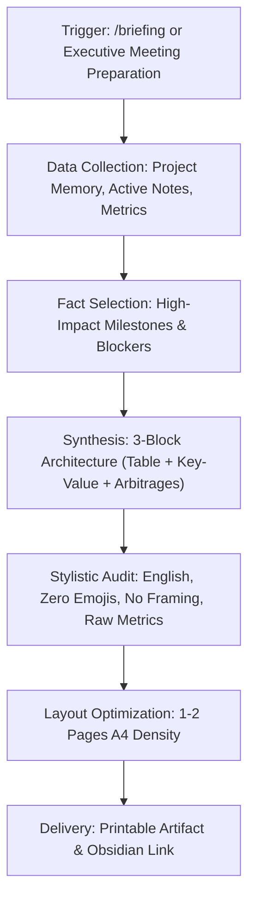
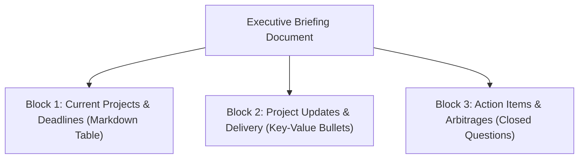
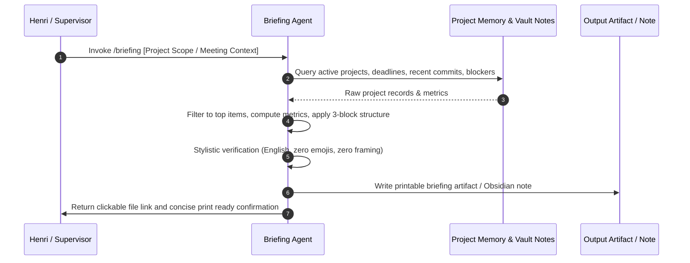

# How to Generate Printable Executive Briefings for High-Stakes Meetings?

This skill defines the protocol for producing high-density, printable executive briefings designed for supervisory meetings, steering committees, and milestone evaluations. Every briefing generated under this skill is engineered for immediate visual scanning in under 3 minutes during in-person discussions and optimized for A4 paper printouts (1 to 2 pages maximum).



---

## What Is the Core Purpose and Operational Scope of the Briefing Skill?

The objective of an executive briefing is to provide Henri and his supervisors with a mutual, transparent, and factual basis for rapid decision-making. The document is not an essay, a status log, or a pitch. It is a decision-support instrument that answers three practical questions:
1. Where do current commitments and deadlines stand?
2. What concrete, verified progress was achieved since the last review?
3. What specific decisions or trade-offs require supervisory validation today?

| Dimension | Standard Report / Narrative Memo | Executive Briefing (This Skill) |
| :--- | :--- | :--- |
| **Language** | Often matches working language or user prompt | Strictly English across all sections |
| **Visual Elements** | Icons, emojis, badges, decorative callouts | Zero emojis, clean typography, strict lines |
| **Opening / Closing** | Courteous introductions, conclusions, narrative transitions | No framing, immediate factual data attack |
| **Data Format** | Prose paragraphs, nested lists, discursive updates | Dense Markdown tables and compact `**[Key]** : [Value]` pairs |
| **Tone** | Persuasive, promotional, or explanatory | Strictly neutral, raw figures, zero spin |
| **Length & Layout** | Variable length, loose vertical spacing | 1 to 2 A4 pages maximum, high horizontal density |
| **Read Time** | 10 to 15 minutes | Under 3 minutes on physical paper |

---

## What Are the Strict Stylistic Guardrails for Executive Printouts?

Every document generated via `/briefing` must adhere to seven mandatory guardrails. Any deviation compromises readability and executive utility.

### Why Is English Mandatory Across All Briefings?
- Academic, research, and high-level steering bodies operate in English as the universal lingua franca.
- Standardizing briefings in English ensures consistent terminology with published papers, benchmark metrics, and grant deliverables.
- Even if conversational prompts or Obsidian vault notes are in French, the output briefing artifact must be written strictly in English.

### Why Are Emojis and Visual Decorations Strictly Banned?
- Emojis degrade document authority in formal supervisory contexts.
- Colored emojis and decorative symbols introduce printing artifacts, inconsistent ink smearing, and distracting visual clutter on black-and-white or standard laser printers.
- Structural hierarchy must rely solely on Markdown typography: clear headings, horizontal rules, table column alignment, and bold key identifiers.

### How Does the No-Framing Rule Enforce Zero Narrative Filler?
- Banned phrases include: *"In summary..."*, *"This briefing outlines the current status..."*, *"As discussed in our previous exchange..."*, *"In conclusion, we can observe that..."*.
- The document begins immediately with the title, date/metadata line, and Block 1 table.
- The document terminates immediately after the final arbitrage option of Block 3.

### What Constitutes Strict Neutrality and Raw Metric Reporting?
- Avoid subjective adjectives: do not use terms such as *"perfect"*, *"seamless"*, *"cutting-edge"*, *"revolutionary"*, or *"100% compliant"*.
- Replace claims with verifiable metrics: sample size ($N$), test accuracy ($\% \pm \sigma$), latency ($\text{ms}$), compute hours expended, code coverage, or exact git commit hashes.
- Highlight blockers and regressions neutrally: state the delay, the failure root cause, and the proposed workaround without defensive or apologetic language.

### How Does Horizontal Layout Maximize A4 Printable Density?
- Standard vertical bullet lists consume excessive page height with empty whitespace on the right margin.
- Executive briefings compress information horizontally using:
  - Multi-column tables for tabular metadata.
  - Inline bold keys followed by concise factual statements: `**[Component]** : [Status / Metric]`.
  - Grouped metrics separated by semicolons rather than multi-level indented bullets.
- The total document length must strictly fit within 1 to 2 printed pages (approximately 450 to 850 words total).

### Why Are Raw Deliverable Embeds Formally Prohibited?
- **Prohibition of Raw Deliverable Embeds**: It is FORMALLY FORBIDDEN to paste or dump full deliverable texts (e.g., full draft emails, manuscript sections, complete letters) inside an executive briefing.
- Briefings only report status, metadata, progress metrics, and actionable bullet updates under the format `**[Key]** : [Value]`.
- Raw deliverables belong exclusively in their own dedicated notes or drafting files, linked via standard references.

### Why Is Block 1 Restricted to a Single Master Table?
- **Single Master Table Rule**: Block 1 contains strictly ONE unified master table of active tracks and deadlines.
- Do not proliferate auxiliary or secondary tables across the document. All active commitments must be consolidated within this single executive overview table.

---

## What Is the Canonical Three-Block Architecture of an Executive Briefing?

Every briefing document follows a standardized three-block structure.



### Block 1: How Should Current Projects and Deadlines Be Structured in a Table?
Block 1 provides an immediate snapshot of all active tracks under discussion. It must be rendered as a single, dense Markdown table with five standard columns:

| Project / Track | Hard Deadline | Target Milestone | Urgency / Priority | Current Progress |
| :--- | :--- | :--- | :--- | :--- |
| Canonical name of project | YYYY-MM-DD or Month Day | Conference, defense, release, or review | Critical / High / Medium | Percentage, phase, or blocker |

Guidelines:
- Limit the table to active, relevant projects (typically 2 to 5 tracks).
- Keep cell contents concise to prevent awkward word-wrapping when printed.

### Block 2: How Should Project Updates Be Formatted as Dense Key-Value Bullets?
Block 2 provides substantive, technical updates for each project listed in Block 1.
- Each project receives a clean H2/H3 header.
- Sub-items are formatted as inline key-value pairs: `**[Module / Aspect]** : [Fact, metric, or status]`.
- No introductory or transitional sentences are permitted between items.

Allowed keys include:
- `**[Architecture]**`, `**[Dataset]**`, `**[Training]**`, `**[Evaluation]**`, `**[Paper / Writing]**`, `**[Infrastructure]**`, `**[Blocker]**`, `**[Next Step]**`.

### Block 3: How Should Action Items and Supervisory Arbitrages Be Formulated?
Block 3 contains 2 to 4 closed, actionable questions requiring immediate direction or arbitration from the supervisor.
- Formulate each decision as an explicit question ending with `?`.
- Provide mutually exclusive options labeled `Option A`, `Option B`, etc.
- Add `**(Recommended)**` to the methodologically or operationally sound option, backed by a single-sentence rationale.
- Leave an inline decision checkbox for print markup: `[ ] Approved: Option X`.

---

## What Is the End-to-End Execution Workflow for the /briefing Command?

When Henri invokes `/briefing` or requests a meeting preparation sheet, the agent follows this four-step sequence:



### Step 1: How to Gather Real-Time Context from Project Notes and Memory?
1. Inspect `_agents/memory/memoire_principale.md` and `_agents/memory/index_principal.md` for current sprint priorities.
2. Read project master notes (`#project`) in `VoiceNotes/` for roadmap items, targets, and open checkboxes.
3. Consult CLI memory if applicable via `python _agents/scripts/project_memory_cli.py list` to verify priority scores and Pomodoro statuses.
4. Verify code and experimental metrics from project repositories in `C:\Users\hjamet\Documents\code\`.

### Step 2: How to Synthesize and Filter High-Priority Facts?
1. Select only items directly relevant to the meeting's agenda.
2. Filter out internal housekeeping, trivial commits, and low-level scratch details.
3. Convert narrative descriptions into raw quantifiable numbers ($N$, accuracy, loss, page counts, compute budgets).

### Step 3: How to Format and Validate Against Print Constraints?
1. Check that the output language is 100% English.
2. Verify that no emojis or decorative icons are present.
3. Verify that the layout does not exceed 2 pages when printed (under 850 words).
4. Verify that 2 to 4 clear decision questions are included with explicit recommendations.

### Step 4: Where Should the Briefing Be Stored and How Should It Be Linked?
1. If intended as a persistent vault note: write to `C:\Users\hjamet\Documents\VoiceNotes\administratif\` following canonical naming: `[Supervisor / Entity] [MMAAAA] Executive Briefing [Topic].md`.
2. If intended as a session review sheet: write to `<appDataDir>\brain\<conversation-id>/executive_briefing.md`.
3. In the chat response, provide the clickable link `[Executive Briefing](file:///...)` in the very first line, followed by a one-paragraph summary of the proposed arbitrages.

---

## What Is the Reference Template for a Canonical Executive Briefing?

Below is the authoritative structural template for generating executive briefings:

```markdown
# Executive Briefing: Research & Supervision Sync

Date: 2026-09-17 | Candidate: Henri Jamet | Supervisor: Prof. Dr. [Name]

---

## 1. Current Projects & Deadlines

| Project / Track | Hard Deadline | Target Milestone | Urgency | Current Progress |
| :--- | :--- | :--- | :--- | :--- |
| Latent Space Alignment | 2026-10-15 | Conference Paper Submission | High | Empirical ablation 80% complete |
| Ethics & IRB Approval | 2026-09-30 | Institutional Committee Defense | Critical | Dossier filed; committee review |
| Distributed Cluster Setup | 2026-10-01 | Production Multi-GPU Pipeline | Medium | Node synchronization validated |

---

## 2. Project Updates & Operational Delivery

### Latent Space Alignment
- **[Model Architecture]** : Swin-transformer backbone frozen at 42M parameters; cross-attention dimension set to 768.
- **[Ablation Metric]** : Val-loss reached 0.174 (-0.021 vs baseline); Top-1 accuracy improved from 78.2% to 81.6% on $N = 12,000$ validation samples.
- **[Hardware & Runtime]** : Training throughput measured at 142 samples/sec across 4x A100 GPUs; peak VRAM consumption 34.2 GB per node.
- **[Draft Status]** : Section 3 (Methodology) and Section 4 (Experiments) fully drafted; discussion section in progress.

### Ethics & IRB Dossier
- **[Documentation]** : Participant consent protocol and anonymization pipeline submitted to local ethics committee on 2026-09-10.
- **[Security Audit]** : Local pseudonymization hash validated; zero PII stored on remote training nodes.
- **[Pending Step]** : Awaiting formal written feedback scheduled for 2026-09-22.

---

## 3. Action Items & Arbitrages

### Question 1: Should we submit the preliminary latent space benchmark to the main track or workshop?
- **Option A (Recommended)** : Submit to Main Track by 2026-10-15. Current empirical metrics on 12 datasets exceed prior state-of-the-art by 3.4 percentage points.
- **Option B** : Delay to Workshop Track by 2026-11-20 to allow additional cross-lingual ablations.
- *Decision*: [ ] Option A  [ ] Option B  [ ] Notes: ______________________

### Question 2: Should we allocate additional cluster storage quota for checkpoint retention?
- **Option A (Recommended)** : Purge intermediate step checkpoints older than 3 epochs to remain within current 5 TB tier.
- **Option B** : Request a 2 TB quota extension from department IT (turnaround time: 5 business days).
- *Decision*: [ ] Option A  [ ] Option B  [ ] Notes: ______________________
```

---

## How Does the Quality-Control Checklist Validate Compliance?

Before presenting the briefing to Henri, the agent must evaluate the output against this checklist:

| Verification Item | Target Standard | Status |
| :--- | :--- | :--- |
| **Language** | 100% English across all text, headers, and tables | Mandatory |
| **Emoji Absence** | Zero emojis, zero unicode pictograms | Mandatory |
| **Intro/Outro Removal** | No introductory framing, no concluding remarks | Mandatory |
| **Tone Neutrality** | Zero promotional adjectives; raw metrics and figures only | Mandatory |
| **3-Block Structure** | Block 1 (Table), Block 2 (Dense Bullets), Block 3 (Arbitrages) | Mandatory |
| **Arbitrage Format** | 2 to 4 closed questions with `**(Recommended)**` flag | Mandatory |
| **Print Budget** | Fits within 1 to 2 A4 pages (450 to 850 words) | Mandatory |
| **No Raw Embeds** | Zero full drafts, emails, or manuscript sections pasted | Mandatory |
| **Single Master Table** | Block 1 contains strictly one unified table; zero auxiliary tables | Mandatory |
| **Clickable Link** | Absolute `file:///` link in the first line of the chat response | Mandatory |
