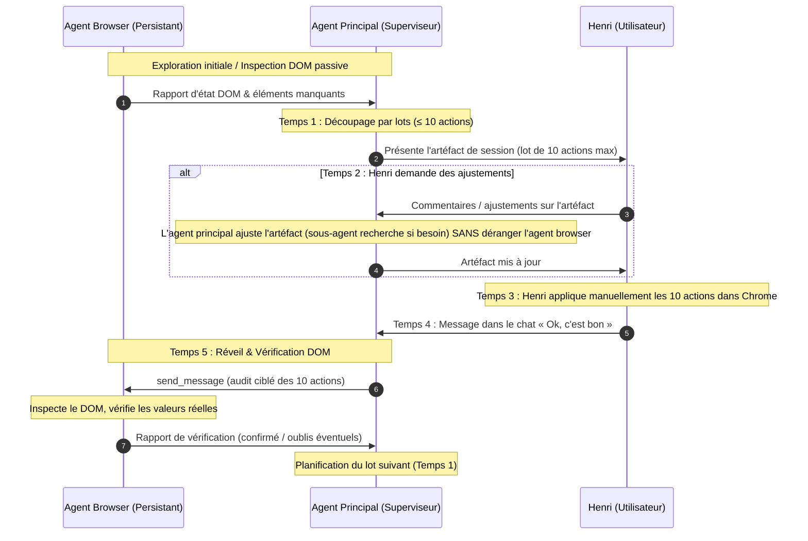

# Skill Browser — Observation Passive, Contrôle Manuel par Lots & Sous-Agent Persistant

Ce skill définit le protocole officiel, l'architecture et les règles opérationnelles pour l'accompagnement sur Google Chrome via la passerelle MCP `chrome_devtools` dans l'écosystème Antigravity.

Conformément à la doctrine établie par Henri Jamet, ce skill repose sur un principe cardinal : **l'agent browser est les « yeux » passifs du système, jamais les « mains » d'écriture**. Toutes les saisies et soumissions sont opérées manuellement par l'utilisateur (Henri), assisté par l'agent principal via des lots digestes de 10 actions maximum et un sous-agent browser persistant.

---

## 1. Architecture, Déclenchement & Persistance Absolue

### 1.1 Condition Sine Qua Non d'Activation des Outils (`/browser`)
> [!IMPORTANT]
> **Mécanisme d'Injection des Outils dans Antigravity** :
> Dans Google Antigravity, les outils d'automatisation et de contrôle du navigateur (`chrome_devtools` : `list_pages`, `new_page`, `select_page`, `click`, `fill`, `type_text`, `evaluate_script`, `take_screenshot`, etc.) **ne sont jamais injectés par défaut** dans l'environnement.
> Ils ne sont injectés et mis à la disposition du superviseur et des sous-agents **QUE SI l'utilisateur (Henri) invoque explicitement la commande slash `/browser` dans son message**.
> - **Si `/browser` est présent dans le message** : Antigravity arme et injecte dynamiquement la passerelle MCP `chrome_devtools` reliée à l'instance Chrome active d'Henri.
> - **Si `/browser` est absent du message** : Même si la tâche porte sur la navigation web, les outils `chrome_devtools` n'existent pas dans l'environnement d'exécution. Ni le superviseur ni le sous-agent ne peuvent s'auto-octroyer ces outils.

### 1.2 Règle Fondamentale de Persistance Absolue du Sous-Agent Browser
> [!IMPORTANT]
> **Invocation Unique & Maintien en Vie Permanent** :
> L'agent principal ne doit **JAMAIS** exécuter directement les outils du navigateur dans son fil de discussion principal, et doit impérativement déléguer à un sous-agent browser (`TypeName: 'browser'`).
> Cependant, une règle stricte régit son cycle de vie :
> 1. **Invocation Unique** : Invoquer le sous-agent browser **UNE SEULE FOIS** au moment où Henri tape `/browser`.
> 2. **Persistance Totale pour Toute la Session** : **INTERDICTION FORMELLE DE TUER ET RÉ-INVOQUER** un nouveau sous-agent browser en cours de route.
>    * *Pourquoi ?* Tuer et recréer le sous-agent fait perdre l'historique d'exploration, le contexte d'inspection DOM et l'accès dynamique aux outils injectés.
> 3. **Communication Exclusif via `send_message`** : L'agent principal réveille et pilote le sous-agent browser **EXCLUSIVEMENT via `send_message`** à chaque cycle d'audit et de vérification.

### 1.3 Environnement & Sessions Actives d'Henri
- Le serveur MCP `chrome_devtools` se connecte directement à l'instance Google Chrome de bureau active de l'utilisateur (**Henri**).
- **Accès complet aux sessions authentifiées** : L'agent bénéficie automatiquement de toutes les sessions connectées et des cookies existants d'Henri (ex. **Dify, Moodle, GitHub, Webmail, Drive, portails éthiques, consoles cloud, intranets et applications locales**).
- **Zéro ré-authentification manuelle** : Si l'utilisateur est déjà connecté à un service sur son Chrome, aucune étape de reconnexion ou de transmission de mots de passe n'est requise.

### 1.4 Doctrine Fail-Stop sur Indisponibilité des Outils & Règle Anti-Bricolage
> [!CAUTION]
> **Arrêt Immédiat (Fail-Stop) & Interdiction Absolue de Bricolage** :
> Si le sous-agent `browser` est invoqué mais constate que les outils `chrome_devtools` (`list_pages`, `new_page`, etc.) ne sont pas disponibles dans son environnement (l'utilisateur n'a pas tapé `/browser` dans son message, session expirée ou réinitialisée) :
> 1. **ARRÊT IMMÉDIAT (FAIL-STOP)** : Le sous-agent DOIT S'ARRÊTER IMMÉDIATEMENT.
> 2. **INTERDICTION ABSOLUE DE BRICOLAGE** : Ne JAMAIS fabriquer d'outils maison (scripts Python, CDP direct, sockets).
> 3. **MESSAGE CANONIQUE OBLIGATOIRE** : Le sous-agent renvoie mot pour mot :
>    « *Les outils du navigateur ne sont pas disponibles dans cette session. Pour m'y donner accès, veuillez simplement inclure la commande `/browser` dans votre prochain message.* »

---

## 2. Le Nouveau Paradigme : Observation & Exploration Passive

### 2.1 Rôle Exclusif : Les « Yeux » du Système
L'agent browser opère comme un observateur expert et passif :
- **Identification de l'état** : Il observe la page active, repère où en est Henri dans son formulaire ou sa navigation, et cartographie les sections visibles et masquées.
- **Inspection structurelle du DOM** : Il extrait les sélecteurs, inspecte les champs, étudie les contraintes de validation (champs requis, formats attendus, options de listes déroulantes).
- **Exploration non-destructive** : Il peut cliquer pour déplier un menu, explorer des sous-sections ou dérouler un accordéon à seule fin d'inspecter ce qui manque.
- **Diagnostic technique** : Il inspecte la console JavaScript et les requêtes réseau (XHR/Fetch) via `list_network_requests` pour détecter les erreurs asynchrones ou blocages techniques.

### 2.2 Zéro Écriture Automatique (Contrôle Manuel Exclusif par Henri)
> [!CAUTION]
> **Interdiction Formelle et Absolue d'Écriture Automatique** :
> - L'agent browser ne doit **JAMAIS modifier, remplir (`fill`, `type_text`) ou cliquer pour soumettre des données sur la page web**.
> - C'est **TOUJOURS l'utilisateur (Henri)** qui effectue physiquement les saisies de texte, les coches de cases, les sélections de menus et les clics de soumission.
> - **Raison fondamentale** : Intégrité des données, conformité éthique et administrative, souveraineté totale de l'utilisateur, et élimination de tout risque d'hallucination ou de soumission intempestive.

### 2.3 Classification Rigoureuse des Outils `chrome_devtools`

| Statut | Outils | Usage Autorisé / Proscrit |
| :--- | :--- | :--- |
| **Observation & Inspection** | `list_pages`, `select_page`, `evaluate_script` *(lecture seule)*, `take_screenshot`, `list_network_requests` | **✅ PLEINEMENT AUTORISÉ** : inspection du DOM, extraction d'arborescences, repérage de sélecteurs, diagnostic réseau et console. |
| **Exploration Passive** | `click` *(sur éléments non-mutatifs uniquement)*, `navigate_page` *(si navigation demandée)* | **✅ AUTORISÉ SOUS RÉSERVE** : ouvrir un menu déroulant, déplier un accordéon pour en lire le contenu. **INTERDIT** sur tout bouton de soumission ou de validation. |
| **Écriture & Mutation** | `fill`, `type_text`, `click` *(soumission)*, `evaluate_script` *(injection de valeurs DOM)* | **❌ STRICTEMENT INTERDIT** : aucune frappe clavier automatique, aucun remplissage de formulaire, aucun clic d'envoi. |

---

## 3. Batching par Lots de 10 Actions Maximum

### 3.1 Plafond de Lot Strict (≤ 10 actions)
Pour prévenir toute surcharge cognitive et assurer une exécution manuelle rapide et fluide par Henri :
- Les actions nécessaires identifiées par l'observation de la page sont découpées en **paquets digestes de 10 actions maximum à la fois**.
- Chaque action est atomique, non ambiguë et directement actionnable (ex: « Copier la valeur X dans le champ Y », « Sélectionner l'option Z »).

### 3.2 Artéfact Dédié dans la Brain de Session
L'agent principal consigne et présente chaque lot dans un artéfact temporaire dédié situé dans `<appDataDir>\brain\<conversation-id>\lot_actions_browser_XX.md` avec `RequestFeedback: true` :
- **Structure ultra-lisible** : Tableau clair ou liste numérotée (1 à 10 maximum).
- **Contenu directement copiable** : Blocs de texte prêts à copier en un clic, intitulés exacts des champs et boutons cibles.
- **Charte de lisibilité sans texte barré** : Si des diffs ou ajustements sont présentés, respecter scrupuleusement la charte d'Henri :
  * Ajout / Nouvelle valeur : `<ins style="color:#116329; background-color:#dafbe1; text-decoration:none; display:block; padding:8px; border-radius:4px; font-family:monospace; font-size:12px;">...</ins>` (fond vert doux, texte vert, **sans soulignement**).
  * Suppression / Remplacement : `<del style="color:#cf222e; background-color:#ffeef0; text-decoration:none; display:block; padding:8px; border-radius:4px; font-family:monospace; font-size:12px;">...</del>` (fond rouge doux, texte rouge, **sans texte barré**).
  * **Strictement aucun texte barré (`line-through`) ni souligné (`underline`)**.

### 5.8 Format Canonique Obligatoire des Artéfacts de Consignes par Lot
Pour éliminer toute friction cognitive et guider pas à pas Henri lors de la saisie manuelle dans Chrome :

- **Attaque Directe & Zéro Boilerplate** :
  * Strictement **zéro note boilerplate / zéro encadré didactique** en tête d'artéfact.
  * Attaque directe et immédiate par le titre H1 du lot (ex: `# Lot 1 — Déclarations Éthiques & Affiliations`).
- **Plafond Strict de 10 Actions par Lot** : Tout artéfact de consignes est strictement plafonné à 10 actions maximum (actions 1 à 10).
- **Gabarit Normalisé pour Chaque Action (1 à 10)** :
  Chaque action dans l'artéfact doit impérativement respecter la structure canonique suivante :

````markdown
### [ ] Action X — <Titre explicite de l'action>

- **Où** : Localisation fluide en langage naturel et repères par rapport aux questions voisines.
- **Quoi faire** : Action directe (clic, sélection, remplacement de texte).
- **Texte à copier** (si champ de saisie) : Fenced code block ```text propre.
- **Callout de justification** :
  > [!NOTE]
  > **Justification (Source / d'après moi)** : Explication pédagogique, réglementaire (LRH, nLPD, CER-UNIL) ou méthodologique du choix.
````

---

## 4. Cycle de Validation Interactif en 5 Temps

Le travail collaboratif entre Henri, l'agent principal et l'agent browser suit rigoureusement un cycle découpé en 5 temps :



### Temps 1 : Présentation du Lot par l'Agent Principal
- L'agent principal synthétise les données d'observation et formule un lot de **10 actions au maximum**.
- Il génère ou met à jour l'artéfact temporaire de session dédié (`RequestFeedback: true`).
- L'artéfact fournit à Henri les valeurs textuelles exactes à copier, les sélecteurs clairs (noms des libellés à l'écran) et la localisation visuelle.

### Temps 2 : Revue & Ajustements par Henri (Sans Déranger le Browser)
- Henri lit l'artéfact et peut poser des questions ou demander des modifications de fond.
- **Règle d'Isolation** : L'agent principal effectue les ajustements de l'artéfact (en déployant au besoin des sous-agents de recherche documentaire dans le coffre) **SANS SOLLICITER L'AGENT BROWSER**.
- Le sous-agent browser reste au repos, préservant son contexte.

### Temps 3 : Application Manuelle par Henri
- Henri applique manuellement les modifications sur sa page web dans Google Chrome (copier-coller des textes préparés, sélection des boutons radio/checkboxes, saisies).
- Henri dispose de son propre rythme et d'un contrôle visuel total sur son navigateur.

### Temps 4 : Signal de Clôture d'Henri
- Une fois les modifications complétées, Henri envoie un message simple dans le chat :
  * **« Ok, c'est bon »** (ou équivalent : « Fait », « C'est bon pour ce lot »).

### Temps 5 : Audit & Vérification DOM par l'Agent Browser Persistant
- L'agent principal réveille l'agent browser persistant via `send_message` en lui donnant la liste exacte des 10 points à vérifier dans le DOM.
- L'agent browser exécute une inspection ciblée via `evaluate_script` (lecture des attributs `value`, `innerText`, statut des cases à cocher `checked`).
- L'agent browser remonte son compte-rendu d'audit à l'agent principal via `send_message` :
  * Si tout est validé : l'agent principal prépare le lot suivant (retour au Temps 1).
  * Si un oubli ou une anomalie est détecté : l'agent principal le signale immédiatement avec bienveillance pour correction ciblée.

---

## 5. Inventaire & Matrice d'Usage des Outils `chrome_devtools`

| Outil | Description & Rôle | Statut & Directives |
| :--- | :--- | :--- |
| `list_pages` | Cartographie tous les onglets ouverts (IDs, URLs, titres). | **Obligatoire au démarrage** pour cibler l'onglet de travail existant d'Henri sans ouvrir de doublons. |
| `select_page` | Bascule le focus d'inspection sur un onglet précis. | **Autorisé** pour cibler la page active d'Henri. |
| `new_page` | Ouvre un nouvel onglet avec l'URL cible. | **Autorisé** uniquement si la page demandée n'est pas déjà ouverte dans un onglet existant. |
| `close_page` | Ferme un onglet spécifique. | **Strictement restreint** aux onglets temporaires créés par l'agent. **INTERDIT** de fermer les onglets d'Henri. |
| `navigate_page` | Charge une URL dans l'onglet actif. | **Autorisé** sur demande explicite de navigation. |
| `evaluate_script` | Exécute du JavaScript dans la page. | **AUTORISÉ EN LECTURE SEULE** : extraction du DOM, vérification d'état, inspection de valeurs. **STRICTEMENT INTERDIT** pour modifier le DOM ou injecter des valeurs. |
| `take_screenshot` | Capture une image de la page ou d'un élément. | **Autorisé** pour contrôle visuel passif ou aide au repérage. |
| `list_network_requests` | Inspecte les requêtes XHR/Fetch et logs réseau. | **Autorisé** pour diagnostic technique (chargements asynchrones, erreurs HTTP). |
| `click` | Simule un clic sur un élément. | **Exploration passive uniquement** (déplier un menu, ouvrir un onglet de navigation). **INTERDIT** pour soumettre un formulaire ou valider définitivement. |
| `fill` | Remplit la valeur d'un champ (`input`, `textarea`). | **STRICTEMENT INTERDIT** : la saisie est réservée à Henri manuellement. |
| `type_text` | Simule la frappe clavier. | **STRICTEMENT INTERDIT** : la frappe est réservée à Henri manuellement. |

---

## 6. Règles de Sécurité, Recherche Documentaire & Bonnes Pratiques

### 6.1 Délégation Systématique de la Recherche Documentaire
- L'agent browser est spécialisé dans l'inspection Chrome. Il n'a pas accès et ne doit jamais chercher dans les fichiers locaux ou les notes du coffre Obsidian.
- **Délégation à l'Agent Principal** : Dès qu'une valeur de fond manque (détail d'un projet, numéro d'éthique, affiliations, formulations méthodologiques), l'agent principal orchestre cette recherche documentaire via des sous-agents dédiés (`self` ou `research`) dans le coffre Obsidian ou la mémoire AIVC, sans déranger le sous-agent browser.

### 6.2 Préservation de l'Espace de Travail d'Henri
- Ne jamais fermer les onglets préexistants ouverts par Henri.
- Ne jamais effacer le stockage local, les cookies ou les sessions de navigation.
- Ne pas divulguer de mots de passe, tokens ou informations confidentielles dans les synthèses de chat.

### 6.3 Sanctuarisation Doctrinale
- `GEMINI.md` demeure la source canonique suprême et reste intact.
- En cas de contradiction sur la manipulation Chrome, les directives d'observation passive et de batching de 10 de ce présent skill priment rigoureusement.
