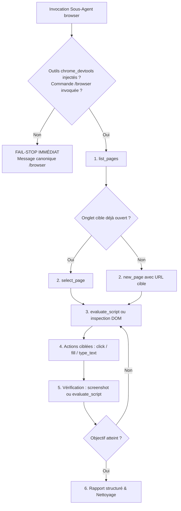

# Skill Browser — Automatisation & Pilotage Avancé de Chrome

Ce skill définit le protocole officiel, l'architecture et les règles opérationnelles pour le pilotage de Google Chrome via la passerelle MCP `chrome_devtools` dans l'écosystème Antigravity.

---

## 1. Architecture & Déclenchement

### 1.1 Condition Sine Qua Non d'Activation des Outils (`/browser`)
> [!IMPORTANT]
> **Mécanisme d'Injection des Outils dans Antigravity** :
> Dans Google Antigravity, les outils d'automatisation et de contrôle du navigateur (`chrome_devtools` : `list_pages`, `new_page`, `select_page`, `click`, `fill`, `type_text`, `evaluate_script`, `take_screenshot`, etc.) **ne sont jamais injectés par défaut** dans l'environnement.
> Ils ne sont injectés et mis à la disposition du superviseur et des sous-agents **QUE SI l'utilisateur (Henri) invoque explicitement la commande slash `/browser` dans son message**.
> - **Si `/browser` est présent dans le message** : Antigravity arme et injecte dynamiquement la passerelle MCP `chrome_devtools` reliée à l'instance Chrome active d'Henri.
> - **Si `/browser` est absent du message** : Même si la tâche porte sur la navigation web, les outils `chrome_devtools` n'existent pas dans l'environnement d'exécution. Ni le superviseur ni le sous-agent ne peuvent s'auto-octroyer ces outils.

### 1.2 Délégation Obligatoire au Sous-Agent (`TypeName: 'browser'`)
> [!IMPORTANT]
> **Règle Fondamentale de Délégation** :
> L'agent principal **NE DOIT PAS** exécuter directement les boucles d'interactions Chrome dans son contexte principal.
> Il **DOIT IMPÉRATIVEMENT** déléguer la mission à un sous-agent spécialisé en spécifiant :
> ```json
> {
>   "TypeName": "browser"
> }
> ```
> **Pourquoi cette isolation ?**
> - Préserve la fenêtre de contexte de l'agent principal.
> - Isole les payloads volumineux (captures d'écran, logs DOM, réponses réseau XHR).
> - Permet une boucle d'itération rapide (navigate -> click -> inspect -> evaluate) sans saturer l'historique conversationnel de haut niveau.

### 1.3 Environnement & Sessions Actives d'Henri
- Le serveur MCP `chrome_devtools` se connecte directement à l'instance Google Chrome de bureau active de l'utilisateur (**Henri**).
- **Accès complet aux sessions authentifiées** : L'agent bénéficie automatiquement de toutes les sessions connectées et des cookies existants d'Henri (ex. **Dify, Moodle, GitHub, Webmail, Drive, consoles cloud, applications intranet et locales**).
- **Pas de ré-authentification manuelle** : Si l'utilisateur est déjà connecté à un service sur son Chrome, aucune étape de reconnexion ou d'échange de mots de passe n'est requise.

### 1.4 Doctrine Fail-Stop sur Indisponibilité des Outils & Règle Anti-Bricolage
> [!CAUTION]
> **Arrêt Immédiat (Fail-Stop) & Interdiction Absolue de Bricolage** :
> Si le sous-agent `browser` est invoqué mais constate que les outils `chrome_devtools` (`list_pages`, `new_page`, etc.) ne sont pas disponibles dans son environnement (l'utilisateur n'a pas tapé `/browser` dans son message, session expirée ou réinitialisée) :
> 1. **ARRÊT IMMÉDIAT (FAIL-STOP)** : Le sous-agent DOIT S'ARRÊTER IMMÉDIATEMENT.
> 2. **INTERDICTION ABSOLUE DE BRICOLAGE** : Ne JAMAIS fabriquer d'outils maison (scripts Python, CDP direct, sockets).
> 3. **MESSAGE CANONIQUE OBLIGATOIRE** : Le sous-agent renvoie mot pour mot :
>    « *Les outils du navigateur ne sont pas disponibles dans cette session. Pour m'y donner accès, veuillez simplement inclure la commande `/browser` dans votre prochain message.* »

---

## 2. Inventaire des Outils `chrome_devtools`

La passerelle `chrome_devtools` met à disposition une suite complète d'outils d'automatisation et d'inspection :

| Outil | Catégorie | Description & Rôle |
| :--- | :--- | :--- |
| `list_pages` | Gestion d'onglets | Liste l'ensemble des cibles/onglets ouverts avec leurs IDs, titres et URLs. |
| `new_page` | Gestion d'onglets | Crée un nouvel onglet et navigue vers l'URL spécifiée. |
| `select_page` | Gestion d'onglets | Sélectionne la page active sur laquelle les commandes suivantes s'appliqueront. |
| `close_page` | Gestion d'onglets | Ferme un onglet spécifique via son identifiant de page. |
| `navigate_page` | Navigation | Charge une URL dans la page active en cours. |
| `click` | Interaction DOM | Déclenche un clic sur un élément identifié (sélecteur CSS, XPath ou coordonnées). |
| `fill` | Interaction DOM | Remplit la valeur d'un champ de saisie (`input`, `textarea`). |
| `type_text` | Interaction DOM | Simule la frappe clavier au niveau caractère ou raccourcis système. |
| `take_screenshot` | Inspection visuelle | Capture une image de la page ou d'un élément spécifique pour vérification. |
| `evaluate_script` | Exécution JS | Exécute du code JavaScript dans le contexte de la page pour extraire du contenu ou manipuler le DOM. |
| `list_network_requests` | Réseau & Logs | Inspecte les requêtes réseau (XHR/Fetch), statuts HTTP et en-têtes pour déboguer les API. |

---

## 3. Protocole Opérationnel d'Automatisation

Pour garantir une exécution robuste, prévisible et sans erreur, tout sous-agent `browser` applique le cycle d'exécution en 6 étapes :



### Étape 1 : Cartographie des Onglets (`list_pages`)
Toujours exécuter `list_pages` en premier. Cela permet de vérifier si l'application visée (ex. un canvas Dify ou un cours Moodle) est déjà ouverte dans un onglet existant pour éviter d'ouvrir des doublons et réutiliser la session ouverte.

### Étape 2 : Ciblage / Ouverture (`select_page` ou `new_page`)
- Si l'onglet existe déjà : exécuter `select_page` avec le `pageId` correspondant.
- Si l'onglet n'existe pas : exécuter `new_page` avec l'URL souhaitée.

### Étape 3 : Attente & Analyse de l'État DOM
- Utiliser `evaluate_script` pour inspecter la présence d'éléments clés ou vérifier la complétion des requêtes asynchrones.
- Privilégier les sélecteurs stables : `data-testid`, `aria-label`, IDs explicites ou sélecteurs CSS uniques.

### Étape 4 : Interactions Structurées
- Enchaîner les commandes `fill`, `click`, ou `type_text` de manière ciblée.
- Prévoir de courts délais de transition si l'interface déclenche des animations ou des requêtes réseau en arrière-plan.

### Étape 5 : Validation & Feedback Visuel
- Valider le résultat de chaque action critique :
  - Soit par extraction de texte / validation d'état via `evaluate_script`.
  - Soit par capture visuelle via `take_screenshot` (particulièrement utile pour les interfaces complexes, canvas, éditeurs graphiques ou diagnostics d'erreurs).

### Étape 6 : Synthèse & Clôture
- Si des onglets éphémères de travail ont été créés, fermer uniquement ceux qui ont été initiés par la tâche (`close_page`).
- Remonter un rapport concis et documenté à l'agent principal via `send_message`.

---

## 4. Règles de Sécurité et Bonnes Pratiques

> [!CAUTION]
> **Préservation de l'espace de travail d'Henri** :
> - Ne jamais fermer un onglet préexistant ouvert par l'utilisateur sans instruction explicite.
> - Ne jamais modifier ou écraser des données de session ou profils utilisateurs critiques sans validation.
> - Ne pas divulguer de tokens, cookies d'authentification ou données d'identification personnelles dans les logs de compte-rendu.

---

## 5. Directives Doctrinales d'Exécution, de Sécurité & de Restitution (MANDATOIRE)

### 5.1 Exécution Réelle Préalable & Zéro Simulation (Action-First)
- Le sous-agent browser doit **TOUJOURS exécuter physiquement l'action** (`click`, `fill`, `type_text`, `evaluate_script`) dans le navigateur et vérifier l'état du DOM résultant **AVANT** de formuler son rapport.
- **Interdiction formelle de prétendre qu'une case est cochée, qu'un champ est rempli ou qu'une action est accomplie** tant que l'opération n'a pas été matériellement constatée et vérifiée dans la page web.

### 5.2 Règle Absolue de Sécurité : Interdiction Formelle des Actions Définitives
> [!CAUTION]
> **Validation et Soumission Finale Réservées Exclusivement à l'Utilisateur** :
> - **Interdiction formelle et absolue de soumettre ou de cliquer sur des boutons d'action définitive ou irréversible** : boutons d'envoi (`Submit`, `Send`, `Soumettre`), boutons de suppression définitive (`Delete`, `Purger`), boutons de validation finale (`Finaliser`, `Valider définitivement`, `Complete application`).
> - **C'est TOUJOURS à Henri (l'utilisateur) de procéder à la vérification finale et au clic de soumission ultime**. L'agent prépare, remplit, coche et inspecte, mais s'arrête impérativement avant le point de non-retour pour laisser la main à Henri.

### 5.3 Délégation Systématique de la Recherche Documentaire
- L'agent browser a pour rôle exclusif l'interaction, le remplissage et l'inspection de la page web.
- **Interdiction de chercher soi-même dans les notes ou fichiers du coffre** : Dès qu'une valeur, un texte, un chiffre, une décision éthique ou un contexte documentaire manque pour compléter un champ, l'agent browser doit impérativement déléguer cette recherche à un sous-agent dédié (`research` ou `self`) via `invoke_subagent` et attendre sa réponse.

### 5.4 Progression Incrémentale par Page / Bloc Logique
- **Plafond de lot strict** : Remplir une quantité raisonnable d'éléments à la fois — **strictement limitée à une seule page ou un seul bloc logique cohérent** (environ 3 à 5 champs maximum).
- **Arrêt et rapport systématique** après chaque page ou bloc logique pour permettre à Henri de valider, commenter ou ajuster avant de poursuivre sur les champs suivants.
- Ne jamais tenter de remplir un formulaire entier d'un coup sans validation intermédiaire.

### 5.5 Restitution par l'Agent Principal via Artéfact de Suivi & Diffs HTML Propres
- L'agent principal centralise et présente les modifications dans un **artéfact de session dédié** (`RequestFeedback: true`) pour permettre une revue claire, structurée et commentable.
- Pour tout diff visuel en HTML, respecter scrupuleusement la charte de lisibilité d'Henri :
  * **Suppression / Remplacement** : `<del style="color:#cf222e; background-color:#ffeef0; text-decoration:none; display:block; padding:8px; border-radius:4px; font-family:monospace; font-size:12px;">...</del>` (texte rouge, fond rouge doux, **SANS texte barré**).
  * **Ajout / Nouvelle valeur** : `<ins style="color:#116329; background-color:#dafbe1; text-decoration:none; display:block; padding:8px; border-radius:4px; font-family:monospace; font-size:12px;">...</ins>` (texte vert, fond vert doux, **SANS texte souligné**).
  * **Strictement aucun texte barré (`line-through`) ni souligné (`underline`)** : la lisibilité doit rester optimale pour les textes longs et les documents administratifs ou d'éthique.

### 5.6 Doctrine Fail-Stop sur Indisponibilité des Outils `/browser` & Bannissement du Bricolage
- **Condition Sine Qua Non d'Activation des Outils** : Dans Antigravity, les outils du navigateur (`chrome_devtools`) ne sont injectés dans l'environnement que si l'utilisateur invoque explicitement la commande slash `/browser` dans son message.
- **Doctrine Fail-Stop sur Indisponibilité** : Si les outils ne sont pas disponibles (l'utilisateur n'a pas tapé `/browser` ou la session a changé), le sous-agent DOIT S'ARRÊTER IMMÉDIATEMENT.
- **Interdiction Absolue de Bricolage** : Ne JAMAIS fabriquer d'outils maison (scripts Python, CDP direct, sockets).
- **Message Canonique à Renvoyer** : Renvoyer mot pour mot :
  « *Les outils du navigateur ne sont pas disponibles dans cette session. Pour m'y donner accès, veuillez simplement inclure la commande `/browser` dans votre prochain message.* »

### 5.7 Protocole de Preuve Visuelle par Captures Ciblées Avant / Après & Présentation en Carrousel (MANDATOIRE)
- **Principe de Preuve Matérielle Visuelle** : Toute modification apportée à une interface web doit être documentée de manière irréfutable par un doublet de captures d'écran ciblées.
- **Workflow Séquentiel de Capture** :
  1. **Avant toute modification** : Capturer l'élément ou la zone initiale via `take_screenshot` et nommer le fichier `before_<section>_<champ>.png`.
  2. **Effectuer l'action matérielle** : Exécuter l'action concrète (`fill`, `click`, `type_text`, etc.).
  3. **Après stabilisation du DOM** : Capturer le résultat final via `take_screenshot` et nommer le fichier `after_<section>_<champ>.png`.
- **Présentation en Carrousel dans l'Artéfact de Session** :
  * Présenter obligatoirement le doublet dans l'artéfact de session sous forme de carrousel natif à 2 diapositives (bloc `carousel` avec séparateur `<!-- slide -->`).
  * Accompagner le carrousel du diff HTML conforme aux règles de lisibilité d'Henri (cf. 5.5) :
    - **Suppression / Remplacement** : `<del style="color:#cf222e; background-color:#ffeef0; text-decoration:none; display:block; padding:8px; border-radius:4px; font-family:monospace; font-size:12px;">...</del>` (texte rouge, fond rouge doux, sans texte barré).
    - **Ajout / Nouvelle valeur** : `<ins style="color:#116329; background-color:#dafbe1; text-decoration:none; display:block; padding:8px; border-radius:4px; font-family:monospace; font-size:12px;">...</ins>` (texte vert, fond vert doux, sans texte souligné).
    - **Strictement aucun texte barré (`line-through`) ni souligné (`underline`)**.

