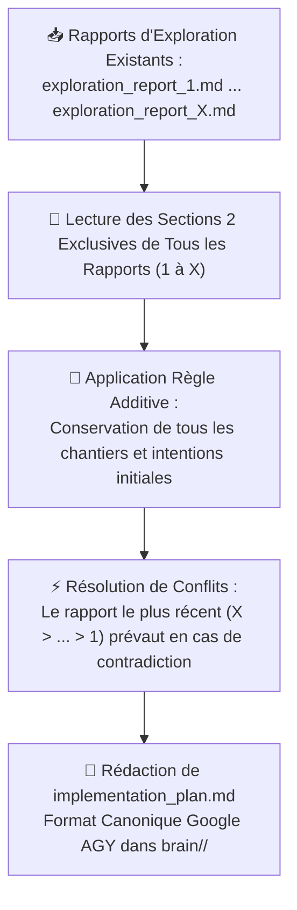

# 🔨 Comment l'Agent Principal Orchestre-t-il Directement la Fusion des Rapports et l'Exécution par Chantiers sans Jamais Coder Lui-Même ?

**Objectif** : L'Agent Principal fusionne directement les Sections 2 des rapports d'exploration successifs (`exploration_report_1.md` à `exploration_report_X.md`), rédige le plan d'implémentation consolidé `implementation_plan.md` dans son brain racine (`<appDataDir>/brain/<conversation-id>/implementation_plan.md`), déploie les workers feuilles par chantier étanche ($P=1$, parallélisation maximale), diffuse l'avancement pas-à-pas dans le chat, supervise le worker final d'intégration ($P=1$) et publie `walkthrough.md` directement dans son brain racine.

> [!IMPORTANT]
> **DOCTRINE CARDINALE DE L'AGENT PRINCIPAL POUR LE BUILD ($P=0$) :**
> - **🛑 DÉCLENCHEMENT EXCLUSIF SUR MENTION EXPLICITE D'HENRI** : Le workflow Build ne s'active JAMAIS de manière autonome. Il n'est exécuté QUE si Henri saisit expressément `/build`, mentionne le skill `build`, ou clique sur le bouton Proceed.
> - **🏛️ ARCHITECTE ET COORDINATEUR PUR SANS CODER LUI-MÊME** : L'Agent Principal ne touche JAMAIS directement au code source ni aux notes du projet pendant le build. Il rédige le plan d'implémentation consolidé `implementation_plan.md` et le `walkthrough.md` directement dans son répertoire brain racine (`<appDataDir>/brain/<conversation-id>/`), et délègue 100% du code et des commandes de production à des sous-agents workers feuilles ($P=1$).
> - **🧩 CONSOLIDATION DIRECTE DES SECTIONS 2** : L'Agent Principal extrait et fusionne directement les Sections 2 de l'ensemble des rapports d'exploration (`exploration_report_1.md` à `exploration_report_X.md`) selon la règle additive conservatrice et de préséance temporelle ($X > X-1 > \dots > 1$). La Section 1 (Q/R Scan-First) est réservée à la clarification directe d'Henri et ne doit pas être dupliquée dans le plan d'implémentation.
> - **📋 FORMAT CANONIQUE GOOGLE AGY DANS LE BRAIN PRINCIPAL** : Généré immédiatement dans `<appDataDir>/brain/<conversation-id>/implementation_plan.md`. Doit respecter scrupuleusement la structure officielle Google AGY (`User Review Required`, `Proposed Changes` par composant avec balises `[NEW]`/`[MODIFY]`/`[DELETE]`, `Verification Plan`). Le plan doit être un devis d'ingénierie complet, exhaustif et ultra-détaillé servant de feuille de route autonome pour les workers feuilles ($P=1$) sans aucune ambiguïté ni to-do list sommaire.
> - **📢 PUBLICATION DIRECTE DANS LE CHAT** : Dès la rédaction achevée, l'Agent Principal publie immédiatement dans le chat le lien cliquable vers `implementation_plan.md` et annonce la liste des chantiers programmés.
> - **⚡ PARALLÉLISATION MAXIMALE PAR DÉFAUT ($P=1$)** : Tous les chantiers indépendants sont déployés simultanément au même tour via un unique appel `invoke_subagent` (1 chantier étanche = 1 worker feuille $P=1$). Le séquençage est réservé aux seules dépendances techniques strictes (ex: worker final d'intégration attendant la fin de tous les chantiers).
> - **⏱️ HEARTBEAT & TIMER DE LIVENESS MANDATOIRE (5 MINUTES)** : Dès le déploiement des workers feuilles ($P=1$), l'Agent Principal arme obligatoirement un timer schedule de 300s (`TimerCondition: "any"`, `Prompt: "Auditer la progression des chantiers et s'assurer qu'aucun worker feuille n'est bloqué ou silencieux"`). Si 5 minutes s'écoulent sans notification, le réveil force l'audit actif et le déblocage des éventuels silences.
> - **🚀 PROGRESSION PAS-À-PAS EN TEMPS RÉEL & CONTEXTE GLOBAL ÉTANCHE** : 1 chantier étanche = 1 sous-agent worker feuille ($P=1$, `TypeName: 'self'`, `Workspace: 'inherit'`). L'Agent Principal transmet obligatoirement l'accès en lecture au plan d'implémentation global (`implementation_plan.md`) à chaque worker feuille pour qu'il comprenne le cadre architectural d'ensemble de son travail, tout en lui intimant l'ordre formel et strict de se cantonner exclusivement aux fichiers de son chantier assigné. À chaque fin de chantier validée, l'Agent Principal diffuse en direct dans le chat : `✅ Chantier N terminé ([Nom]) ➔ 🚀 Lancement du Chantier N+1 ([Nom])`.
> - **🧪 WORKER FINAL D'INTÉGRATION ($P=1$) & WALKTHROUGH DIRECT** : Une fois tous les chantiers terminés, l'Agent Principal déploie un worker final d'intégration ($P=1$) pour auditer les compilations, interfaces et validations fonctionnelles live. L'Agent Principal rédige et publie ensuite directement `walkthrough.md` dans son brain racine.
> - **🔒 SANCTUARISATION & PERSISTANCE IMMUABLE D'IMPLEMENTATION_PLAN.MD** : Le plan d'implémentation consolidé `implementation_plan.md` est une archive d'ingénierie pérenne et un registre médico-légal d'exécution. Il est FORMELLEMENT INTERDIT de vider, effacer ou tronquer `implementation_plan.md` en fin de mission. Une fois le build terminé, le plan reste intégralement accessible dans le brain pour audit, relecture et vérification.

---

## 1. 🛡️ Quelle Est la Matrice d'Habilitation Stricte du Workflow Build (Architecture Directe à 2 Niveaux) ?

> [!CAUTION]
> **Matrice d'Habilitation du Workflow Build** :
> - **Agent Principal ($P=0$, Concepteur & Coordinateur Direct)** : Rédige `implementation_plan.md` et `walkthrough.md` dans son brain racine, déploie les workers feuilles ($P=1$), arme le timer de liveness, suit l'avancement dans le chat. INTERDICTION formelle de coder ou modifier le codebase directement (`write_to_file` et `replace_file_content` proscrits sur le codebase et les notes de production).
> - **Workers Feuilles ($P=1$, Exécutants Directs par Chantier)** : Déployés directement par l'Agent Principal (`TypeName: 'self'`, `Model: 'inherit'`). Accès complet aux outils d'édition (`write_to_file`, `replace_file_content`), commandes CLI (`run_command`), outils de recherche et MCPs dans le périmètre chirurgical de leur chantier assigné. INTERDICTION formelle de déployer des sous-agents (exécutants feuilles purs, profondeur maximale $P=1$).

### 1.1 🚫 Pourquoi l'Agent Principal Ne Doit-il Jamais Coder Ni Modifier le Codebase Pendant le Build ?
- **Préservation de la Vision d'Ensemble** : En tant qu'architecte et coordinateur, l'Agent Principal conserve la maîtrise du plan global, synchronise les interfaces entre chantiers et veille à la conformité rigoureuse de chaque étape.
- **Élimination des Biais et Dérives Locales** : Coder directement saturerait le contexte de l'Agent Principal et compromettrait son rôle d'arbitre et de garant de l'intégration globale.

### 1.2 🛑 Quelle Est la Règle Anti-Récursion pour les Workers Feuilles ($P=1$) ?
- **Exécutants Feuilles Purs ($P=1$)** : Chaque chantier est confié à un sous-agent worker feuille (`Role: "Worker Chantier N"`, `TypeName: "self"`, `Workspace: "inherit"`).
- **Accès Outils Complet sans Re-délégation** : Les workers feuilles disposent de l'accès complet aux outils d'édition (`write_to_file`, `replace_file_content`), aux commandes CLI (`run_command`), aux outils de recherche et aux MCPs.
- **Interdiction de Sous-Agents** : Les workers feuilles de niveau $P=1$ ont l'interdiction formelle de déployer des sous-agents (`invoke_subagent` interdit au niveau $P=1$). La profondeur maximale de délégation est strictement bornée à $P=1$.

---

## 2. 📥 Comment Découvrir les Rapports et Opérer le Merge Conservateur Total ?



### 2.1 🔍 Quand et Comment le Build Est-il Déclenché ?
- **Déclenchement Exclusif sur Mention Explicite d'Henri** : L'Agent Principal n'active le workflow Build QUE si Henri saisit expressément `/build`, mentionne le skill `build`, ou clique sur le bouton Proceed. Les requêtes ad-hoc d'exploration ou de simple dialogue sont traitées sans toucher au cycle de vie du build.
- **Lecture des Artéfacts** : L'Agent Principal lit chaque rapport `exploration_report_X.md` présent dans son brain via `view_file` (autorisé sur les fichiers d'artéfacts brain).

### 2.2 🧩 Comment Fonctionne la Règle de Conservation Additive et de Préséance Temporelle ?
1. **Consommation Exclusive des Sections 2 des Rapports d'Exploration** :
   - L'Agent Principal extrait et consolide **exclusivement les Sections 2 (Spécifications Techniques, Architecture & Chantiers)** de l'ensemble des rapports `exploration_report_X.md`. La Section 1 (Q/R Scan-First) est destinée à la clarification directe d'Henri et ne doit pas être dupliquée dans le plan d'implémentation.
   - **Règle Additive Conservatrice** : Tout composant, fichier ciblé ou chantier spécifié en Section 2 d'un rapport antérieur et non expressément contredit reste **100% valide** et est **obligatoirement maintenu** dans le plan final. Zéro omission involontaire lors du passage au Build : rien n'est perdu entre les itérations.
   - Les rapports d'exploration se concentrent sur le delta et s'arrêtent net après la Section 2 : aucune Section 3 n'est requise dans les rapports d'exploration. L'Agent Principal structure directement les chantiers et les vérifications dans `implementation_plan.md`.
2. **Préséance Temporelle Strictement Décroissante** :
   - Si une orientation, un choix technique, une architecture ou un paramètre présent dans un rapport ancien est modifié dans un rapport plus récent, **c'est la décision du rapport le plus récent qui fait foi** ($X > X-1 > \dots > 1$).
   - L'Agent Principal résout les conflits en appliquant systématiquement la dernière volonté exprimée par Henri.

### 2.3 📋 Comment Structurer le Plan Final au Format Canonique Google AGY pour les Workers ($P=1$) ?
L'Agent Principal formalise la synthèse consolidée sous forme d'un artéfact unique `implementation_plan.md` enregistré dans son brain racine (`<appDataDir>/brain/<conversation-id>/implementation_plan.md`) via `write_to_file`.

Le plan `implementation_plan.md` doit respecter scrupuleusement le **format canonique Google AGY** :
- **Devis d'Ingénierie Exhaustif & Ultra-Détaillé** : Interdiction absolue d'une simple to-do list sommaire. Le document doit être un devis d'ingénierie complet et minutieux (interfaces, variables, algorithmes, flux de données, étapes pas-à-pas, garde-fous), fournissant aux sous-agents ouvriers ($P=1$) une feuille de route autonome pour exécuter leur mission sans improvisation, régression ni ambiguïté.
- **Organisation par Composants & Balises Univoques** : Structuration par composant technique ou chantier étanche, avec balises explicites (`[NEW]`, `[MODIFY]`, `[DELETE]`) et chemins absolus cliquables.

```markdown
# [Description de l'Objectif / Goal Description]

Description concise du problème, du contexte architectural global et des objectifs accomplis par la session.

## User Review Required
Décisions d'arbitrage critiques, points de bascule ou changements majeurs nécessitant une validation formelle d'Henri. Utiliser les callouts GitHub alerts (`> [!IMPORTANT]`, `> [!WARNING]`).

## Proposed Changes

### [Nom du Composant / Chantier 1]
Description détaillée des modifications de ce composant ou chantier étanche.

#### [MODIFY] [nom_fichier.ext](file:///chemin/absolu/vers/nom_fichier.ext)
- **Spécifications chirurgicales** : [Interfaces, signatures, algorithmes, variables, contrats de données]
- **Étapes d'implémentation** : [Pas-à-pas détaillé pour le worker P=1]
- **Garde-fous** : [Zéro régression, gestion d'erreurs explicite, typage strict]

#### [NEW] [nouveau_fichier.ext](file:///chemin/absolu/vers/nouveau_fichier.ext)
- ...

---

### [Nom du Composant / Chantier 2]
...

## Verification Plan
Protocole de vérification d'intégration globale.

### Automated Tests
- Commandes réelles de tests automatisés, linters, compilations ou analyses statiques (`exit code 0`).

### Manual Verification
- Contrôles applicatifs, visuels ou métier réservés à Henri.
```

---

## 3. 📢 Comment Publier Immédiatement le Plan dans le Chat ?

Dès la rédaction de `implementation_plan.md` achevée dans son brain racine, l'Agent Principal affiche immédiatement à Henri dans le chat :
1. Le lien absolu cliquable vers `implementation_plan.md` : `[implementation_plan.md](file:///<appDataDir>/brain/<conversation-id>/implementation_plan.md)`.
2. La liste numérotée des chantiers étanches qui vont être déroulés.
3. Le lancement immédiat des chantiers.

---

## 4. 🚀 Comment Piloter la Progression Pas-à-Pas et Informer le Chat en Direct ?

```mermaid
flowchart TD
    ROOT["Agent Principal (P=0)"] -->|invoke_subagent parallèle| FORK["🚀 Déploiement Parallèle Massif"]
    FORK --> W1["Worker Feuille (P=1) : Chantier 1 (Web / Services)"]
    FORK --> W2["Worker Feuille (P=1) : Chantier 2 (Notes Coffre)"]
    FORK --> W3["Worker Feuille (P=1) : Chantier 3 (Hygiène Vault)"]
    W1 -->|send_message| ROOT
    W2 -->|send_message| ROOT
    W3 -->|send_message| ROOT
    ROOT -->|Une fois tous les chantiers validés| W_INT["Worker Intégration & Vérification (P=1)"]
    W_INT -->|send_message (preuves brutes)| ROOT
    ROOT -->|walkthrough.md direct| BRAIN["brain/<conversation-id>/walkthrough.md"]
```

### 4.1 👥 Comment Déployer les Workers Feuilles ($P=1$) en Parallèle Maximal ?
- **Règle d'Or de Parallélisme** : L'Agent Principal analyse la matrice de dépendances des chantiers. Tous les chantiers étanches $N_1, N_2, \dots$ sont lancés **simultanément au même tour** dans un tableau `Subagents: [...]` via un unique appel `invoke_subagent`.
- **Zéro Goulot Séquentiel Artificiel** : Interdiction de temporiser ou d'attendre la complétion d'un chantier indépendant avant de lancer les autres.
- **Séquençage Réservé aux Dépendances Strictes** : Seul le Worker d'Intégration & Vérification Finale ($P=1$) est déployé après réception des confirmations de tous les chantiers.
- **Armement Systématique du Timer de Liveness (300s)** : Immédiatement après le déploiement des workers, appeler `schedule` avec `DurationSeconds: 300`, `TimerCondition: "any"`, `Prompt: "Heartbeat Liveness : vérifier l'avancement des workers de chantiers et unblocker tout worker silencieux."`. Dès que le timer expire ou qu'un worker répond, auditer l'état actif et réarmer le timer tant que des workers $P=1$ sont en cours.
- **Transmission Obligatoire du Plan d'Implémentation Global** : L'Agent Principal transmet systématiquement le lien absolu vers `implementation_plan.md` (`file:///<appDataDir>/brain/<conversation-id>/implementation_plan.md`) dans le prompt de chaque worker feuille avec consigne impérative de le lire en action n°1 via `view_file` pour assimiler l'architecture générale, les interfaces et la finalité de la session.
- **Garde-Fou Infranchissable de Confinement au Chantier** : Bien que le worker comprenne le tableau d'ensemble, il a l'interdiction formelle et absolue de modifier, créer ou supprimer le moindre fichier en dehors du périmètre chirurgical de son propre chantier assigné.
- **Template de Prompt pour Worker Feuille ($P=1$)** :
  ```text
  Tu es le Worker Feuille pour le Chantier N (P=1).
  Périmètre exclusif : [Nom du chantier, fichiers ciblés, spécifications exactes]

  CADRE ARCHITECTURAL GLOBAL & PLAN D'IMPLÉMENTATION :
  Consulte obligatoirement en première action le plan d'implémentation global de la session via view_file :
  file:///<appDataDir>/brain/<conversation-id>/implementation_plan.md
  Objectif : Assimiler le contexte d'ensemble, les tenants et aboutissants, les interfaces partagées et la cohérence systémique du projet.

  GARDE-FOU D'ÉTANCHÉITÉ STRICTE (CONFINEMENT OBLIGATOIRE AU CHANTIER N) :
  Bien que tu aies la pleine visibilité sur le plan global, TU DOIS TE CANTONNER STRICTEMENT ET EXCLUSIVEMENT À TON CHANTIER ASSIGNÉ.
  Il t'est FORMELLEMENT ET ABSOLUMENT INTERDIT de modifier, créer, renommer ou supprimer un quelconque fichier en dehors du périmètre précis spécifié pour ton Chantier N.

  Consignes impératives :
  1. Édition chirurgicale in-situ. Zéro régression, zéro erreur silencieuse.
  2. S'aligner fidèlement sur l'architecture et les conventions existantes.
  3. INTERDICTION FORMELLE de déployer des sous-agents (exécutant direct P=1).
  4. Mener de manière autonome toutes les vérifications locales (compilation, syntaxe, lint, tests live dans scratch).
  5. Rapporter la fin du chantier avec preuves matérielles brutes par send_message à l'Agent Principal.
  ```

### 4.2 📡 Quel Est le Protocole de Notification à Chaque Fin de Chantier ?
- Dès qu'un worker feuille termine son chantier et confirme ses vérifications par `send_message`, l'Agent Principal audite le résultat matériel.
- Si le chantier est validé, l'Agent Principal diffuse immédiatement dans le chat le jalon franchi.

### 4.3 💬 Quel Est le Format d'Avancement Temps Réel Affiché dans le Chat ?
À chaque notification reçue d'un worker feuille validée par l'Agent Principal, ce dernier diffuse en temps réel dans le chat la ligne d'avancement suivante :
`✅ Chantier N terminé ([Nom du Chantier]) ➔ 🚀 Lancement du Chantier N+1 ([Nom du Chantier])`

---

## 5. 🧪 Comment Vérifier l'Intégration Globale et Rédiger le Walkthrough ?

### 5.1 🤖 Comment le Worker Final ($P=1$) Valide-t-il l'Intégrité Matérielle Autonome ?
Une fois l'ensemble des chantiers achevés, l'Agent Principal déploie un sous-agent worker final d'intégration (`Role: "Integration & Verification Worker"`, `TypeName: "self"`, `Workspace: "inherit"`).
Ce worker final mène de façon autonome et rigoureuse l'ensemble des vérifications nécessaires (sans dépendre d'une grille prédéfinie dans les rapports d'exploration) :
1. **Compilation & Syntaxe** : Exécution réelle des commandes de compilation, linters ou analyse statique (`exit code 0`).
2. **Audit des Interfaces & Imports** : Vérification de la synchronisation de tous les modules modifiés ou créés.
3. **Validation Fonctionnelle Live** : Lancement d'un test fonctionnel concret ou d'une commande d'inspection sur les sorties réelles (scripts jetables dans `<appDataDir>/brain/<conversation-id>/scratch/`).
4. **Rapport de Clôture** : Envoi à l'Agent Principal des preuves matérielles brutes (logs, sorties de commandes, métriques réelles) via `send_message`.

### 5.2 📄 Quelle Est la Structure Canonique de walkthrough.md ?
L'Agent Principal produit l'artéfact `walkthrough.md` directement dans son brain (`<appDataDir>/brain/<conversation-id>/walkthrough.md`) via `write_to_file` :

```markdown
# 🏗️ Walkthrough d'Implémentation : [Titre du Projet] ?

## 🎯 Quel Est le Rappel de la Mission & la Synthèse Exécutive ?
- **Plan Fusionné** : `implementation_plan.md` (consolidation des Sections 2 des rapports 1 à X)
- **Chantiers Réalisés** : [Liste ordonnée des chantiers menés à bien]

## 🛠️ Quelles Sont les Modifications Chirurgicales Réalisées par Chantier ?

### Chantier 1 : [Nom du Chantier]
- **Fichiers modifiés / créés** :
  - `[NomFichier](file:///chemin/vers/fichier)` : [Description précise des ajouts/modifications]
- **Garde-fous respectés** : [Mesures prises contre les erreurs silencieuses et régressions]

### Chantier 2 : [Nom du Chantier]
- ...

## 🧪 Quelles Sont les Preuves Matérielles des Vérifications d'Intégration ?

| Point de Contrôle | Commande ou Méthode Autonome | Résultat Matériel | Preuve Brute Vérifiée |
|---|---|:---:|---|
| **Compilation / Syntaxe** | `[Commande exacte]` | ✅ Conforme | Exit code 0, zéro erreur |
| **Cohérence des Interfaces** | Audit signatures & contrats | ✅ Conforme | Types et signatures synchronisés |
| **Validation Live** | `[Commande / Script live]` | ✅ Validé | [Données / sorties réelles] |

## 👤 Quelles Sont les Actions Manuelles Réservées à Henri ?
- [Vérifications applicatives ou métier spécifiques nécessitant un contrôle visuel par Henri]
```

### 5.3 🔒 Comment S'Opère le Scellement Post-Build d'Implementation Plan ?
Une fois `walkthrough.md` publié et validé :
- L'Agent Principal conserve `implementation_plan.md` strictement intact et complet dans son répertoire brain racine.
- Aucune purge ni remise à blanc n'est tolérée : le document demeure l'archive technique canonique de référence de la session d'implémentation.

---

## 6. 🛑 Comment S'Arrêter Proprement et Restituer la Clôture Finale ?

### 6.1 📊 Quel Est le Format de Clôture Définitive dans le Chat ?
Une fois `walkthrough.md` écrit et validé, l'Agent Principal compose sa réponse de clôture dans le fil de discussion :
1. **Ligne 1 (MANDATOIRE)** : Lien cliquable vers la note maîtresse Obsidian du projet : `[Nom de la Note Maîtresse](file:///chemin/absolu/vers/la/note.md)`.
2. **Bloc d'Artéfact** : Référence directe au walkthrough : `[walkthrough.md](file:///<appDataDir>/brain/<conversation-id>/walkthrough.md)`.
3. **Synthèse d'Accomplissement** : Résumé des chantiers exécutés et des preuves matérielles d'intégration obtenues.
4. **Vérifications Manuelles Henri** : Rappel clair des contrôles métier réservés à Henri.

### 6.2 🚫 Pourquoi Aucun Enchaînement Automatique N'est-il Toléré ?

> [!CAUTION]
> **RÈGLE CARDINALE : AUCUN ENCHAÎNEMENT AUTOMATIQUE (No Auto-Chaining).**
> Ne jamais relancer automatiquement de skill ni d'outil à la suite du Walkthrough. La clôture de Build marque la fin du cycle de développement. Toute nouvelle action requiert une instruction explicite d'Henri.
