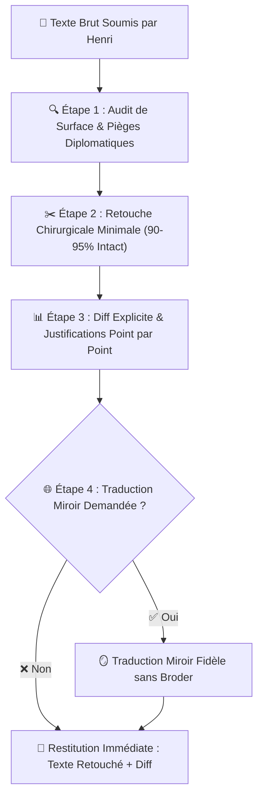
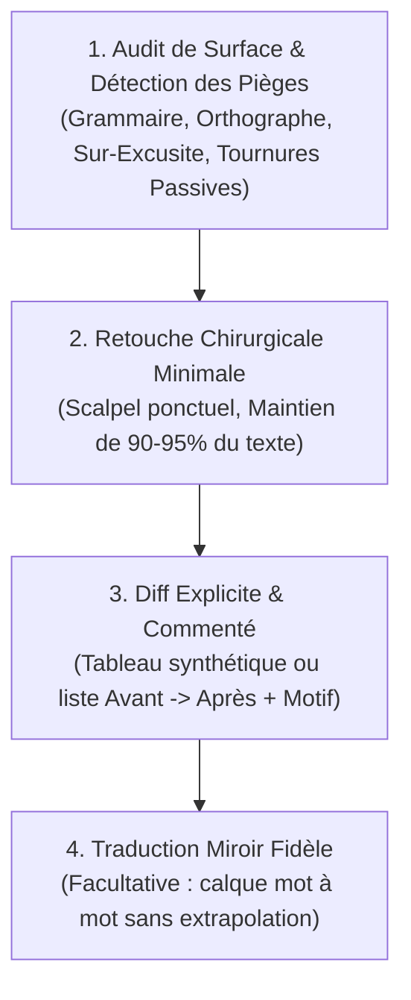

# ✍️ Comment le Skill /correct Assure-t-il la Relecture et la Retouche Chirurgicale sans Altérer la Voix d'Henri ?

Ce skill formalise le **protocole de relecture, correction et retouche chirurgicale** des textes, courriels, messages et documents rédigés par **Henri Jamet**. Il garantit une élimination sans faille des coquilles et des maladresses institutionnelles tout en érigeant un rempart infranchissable contre la dérive de réécriture intégrale courante des LLM.

---

## 🎯 Quelle Est la Philosophie et la Raison d'Être du Skill /correct ?

### 🛡️ Pourquoi Sanctuariser la Voix et l'Authenticité d'Henri ?
- **Respect du temps et de l'énergie** : Henri sait exactement ce qu'il veut dire, à qui il s'adresse et quel impact il vise. Le rôle de l'assistant n'est pas de réinventer sa pensée, mais de polir ses mots avec le tranchant d'un scalpel.
- **Préservation de l'authenticité** : La force de conviction d'Henri réside dans son ton direct, incarné, humain, percutant et sincère. Tout lissage aseptisé détruit cette signature personnelle et dépersonnalise ses échanges.
- **Rejet de la complaisance IA (Sycophancy & Corpo-Wash)** : Les modèles de langage ont un biais systématique les poussant à substituer un texte personnel par un jargon d'entreprise impersonnel, verbeux et artificiellement obséquieux (*"I hope this email finds you well"*, *"Permettez-moi de revenir vers vous..."*, *"N'hésitez pas si vous avez des questions"*). Le skill `/correct` agit comme un antidote strict à ce réflexe.

| Dimension | Voix Authentique d'Henri | Dérive IA / Corpo-Wash (Bannie) |
| :--- | :--- | :--- |
| **Attaque** | Directe, va droit au but dès la 1ère phrase | Préambules creux et salutations boursouflées |
| **Ton** | Concret, vif, dynamique, accessible, chaleureux | Formel, pompeux, distancé, passif |
| **Vocabulaire** | Mots justes, précis, simples et efficaces | Superlatifs automatiques, jargon administratif lourd |
| **Posture** | Égale, confiante, orientée solution et action | Auto-dépréciative, sur-excusite, hésitation |
| **Rythme** | Phrases courtes et enchaînements naturels | Périodes longues alourdies de propositions subordonnées |

---

## 🛑 Quelle Est la Règle d'Or Absolue Anti-Réécriture ?

> [!IMPORTANT]
> **RÈGLE D'OR : INTERDICTION FORMELLE DE RÉÉCRIRE LE TEXTE DE ZÉRO OU DE SUBSTITUER UNE VERSION ENTIÈREMENT REMANIÉE.**
> - **Seuil de préservation** : Au minimum **90% à 95%** du texte d'origine d'Henri doit demeurer strictement inchangé, mot pour mot.
> - **Principe de subsidiarité** : Si une phrase est grammaticalement correcte, compréhensible et sans piège diplomatique, **ON NE LA MODIFIE SOUS AUCUN PRÉTEXTE**.
> - **Bannissement du "mieux disant" subjectif** : L'assistant ne remplace jamais un mot par un autre au seul motif d'une préférence stylistique personnelle ou statistique du modèle.

---

## 🧭 Quel Est le Protocole d'Exécution en 4 Étapes ?

### 🔍 1. Comment Réaliser l'Audit de Surface et Détecter les Pièges ?

L'analyse initiale scanne le texte sur deux plans complémentaires :

#### 📝 Comment Corriger Formellement l'Orthographe, la Typographie et les Accords ?
- **Orthographe & Typographie** : Coquilles, fautes de frappe, accents manquants, cédilles, apostrophes typographiques.
- **Accords & Syntaxe** : Accords sujet-verbe, participes passés, accords en genre et en nombre, cohérence des temps.
- **Ponctuation** : Virgules mal placées brisant le souffle, espaces insécables avant ponctuation double en français (`:`, `;`, `!`, `?`).

#### 🛡️ Comment Traquer la Sur-Excusite et les Formulations Négatives ?
- **Élimination de la sur-excusite (Over-apologizing)** :
  * ❌ *« Je suis sincèrement désolé de vous déranger avec cela... »* $	o$ ✅ Supprimé ou remplacé par une formule d'action directe.
  * ❌ *« Excuse my English, I hope I'm clear... »* $	o$ ✅ Supprimé purement et simplement.
  * ❌ *« Je m'excuse d'avance pour le retard de ma réponse... »* $	o$ ✅ *« Merci pour ta patience ! »* ou traitement immédiat de la question.
- **Remplacement des mots négatifs ou défensifs non intentionnels** :
  * Transformer les formulations passives ou culpabilisantes en constat factuel et tourné vers l'avenir.
  * ❌ *« Il y a eu un problème / une erreur de ma part »* $	o$ ✅ Constat factuel neutre : *« Le fichier n'était pas attaché, le voici : ... »*.
- **Éradication des marqueurs IA et tics académiques creux** :
  * Purge absolue des tirets cadratins (`—`) ou tirets d'incise (`–`) au profit de virgules, parenthèses sobres ou points.
  * Bannissement des adverbes d'enrobage (*"fondamentalement"*, *"naturellement"*, *"incontestablement"*).

---

### ✂️ 2. Comment Appliquer la Retouche Chirurgicale Minimale (90-95% Intact) ?

- **Opérer au mot près** : Remplacer uniquement le mot fautif ou la locution boiteuse.
- **Conserver la syntaxe originelle** : Ne pas inverser les propositions, ne pas scinder un paragraphe fluide en liste à puces, ne pas réorganiser la structure argumentative choisie par Henri.
- **Préserver le registre relationnel** :
  * Si Henri tutoie : conserver le tutoiement sans basculer au vouvoiement.
  * Si Henri utilise un smiley textuel (`:)`, `;)`), le laisser exactement là où il l'a placé.
  * Ne jamais ajouter de formule de politesse pompeuse en fin de message si Henri a simplement signé *"Henri"* ou *"Joyeusement,"*.

---

### 📊 3. Comment Présenter le Diff Explicite et Commenté ?

Chaque restitution `/correct` doit obligatoirement comporter deux volets distincts et clairement séparés :
1. **Le Texte Retouché Intégral** : Prêt à être copié-collé par Henri en une seconde.
2. **Le Diff Commenté & Justifié** : Tableau ou liste à puces synthétique décrivant chaque modification.

#### 📋 Quelle Est la Structure Normée du Tableau de Diff ?
| Segment Original (Avant) | Segment Corrigé (Après) | Justification Chirurgicale |
| :--- | :--- | :--- |
| *« Je vous envoie les document »* | *« Je vous envoie les document**s** »* | Accord en nombre (pluriel). |
| *« Désolé de vous déranger, est-ce que... »* | *« Est-ce que... »* | Suppression de la sur-excusite / attaque directe. |
| *« Il faudrait qu'on se voit »* | *« Il faudrait qu'on se voi**e** »* | Subjonctif présent du verbe voir (*qu'on se voie*). |

---

### 🌐 4. Comment Assurer une Traduction Miroir Fidèle sans Broder ?

Lorsque Henri demande de traduire un texte (notamment du français vers l'anglais ou inversement), la même discipline chirurgicale s'applique :
- **Traduction miroir mot à mot et idée par idée** : Si Henri écrit une phrase courte de 7 mots, la traduction fait une phrase courte de 7 mots.
- **Interdiction formelle d'ajouter du liant artificiel** : Ne pas insérer de conjonctions de coordination grandiloquentes (*"Furthermore"*, *"Moreover"*, *"Nevertheless"*, *"Indeed"*).
- **Conserver l'ADN stylistique en anglais** :
  * Style actif, concis, direct.
  * Utilisation naturelle des contractions idiomatiques (*"I'll"*, *"don't"*, *"we'd"*) si le contexte est informel ou collégial.
  * Pas de formules victoriennes ni de phrases de trois lignes.

---

## 💡 Quels Sont les Exemples Concrets et les Anti-Patterns ?

### 📧 Exemple 1 : Comment Traiter un Courriel Professionnel ou Universitaire ?

**Texte Brut Soumis par Henri :**
> Bonjour Thomas, désolé de te déranger avec ça mais est-ce que tu as eu le temps de jeter un oeil sur le draft ? J'ai modifier la section 3 comme convenu avec Yash. Tiens moi au courant si tu as des remarques. Joyeusement, Henri

**Restitution du Skill /correct :**
> Bonjour Thomas, est-ce que tu as eu le temps de jeter un œil sur le draft ? J'ai modifié la section 3 comme convenu avec Yash. Tiens-moi au courant si tu as des remarques. Joyeusement, Henri

**Diff Commenté :**
| Avant | Après | Justification |
| :--- | :--- | :--- |
| *« désolé de te déranger avec ça mais est-ce que »* | *« est-ce que »* | Suppression de la sur-excusite ; attaque directe et chaleureuse. |
| *« un oeil »* | *« un œil »* | Typographie (ligature). |
| *« J'ai modifier »* | *« J'ai modifié »* | Participe passé avec l'auxiliaire avoir. |
| *« Tiens moi »* | *« Tiens-moi »* | Trait d'union impératif. |

---

### 💬 Exemple 2 : Comment Traiter un Message Court de Messagerie Instantanée ?

**Texte Brut Soumis par Henri :**
> Hello, c'est bon pour moi pour la réunion de 14h, désolé pour le délais de réponse j'étais en conf. A toute !

**Restitution du Skill /correct :**
> Hello, c'est bon pour moi pour la réunion de 14h, désolé pour le délai de réponse j'étais en conf. À toute !

**Diff Commenté :**
| Avant | Après | Justification |
| :--- | :--- | :--- |
| *« délais »* | *« délai »* | Orthographe (singulier). |
| *« A toute ! »* | *« À toute ! »* | Accentuation de la préposition majuscule. |

---

### 🚫 Anti-Pattern 1 : Comment Identifier et Bannir la Réécriture Complète Corporative ("Corpo-Wash") ?

**Ce Que l'IA Trompeuse Proposerait à Tort (STRICTEMENT INTERDIT) :**
> *« Cher Thomas, j'espère que tu vas bien et que ta semaine se déroule au mieux. Je me permets de revenir vers toi concernant notre manuscrit commun. Aurais-tu eu l'opportunité de prendre connaissance des dernières révisions ? Pour faire suite à nos échanges avec le Professeur Yash, j'ai pris l'initiative de remanier en profondeur la troisième section. Je reste à ton entière disposition pour tout échange complémentaire. Bien chaleureusement, Henri »*

> [!CAUTION]
> **Pourquoi c'est un échec critique** : Le texte a été dénaturé à 85%, transformé en bouillie corporative, rallongé inutilement et privé de son énergie d'origine. C'est une violation flagrante du skill `/correct`.

---

### 🚫 Anti-Pattern 2 : Comment Neutraliser la Sur-Excusite et l'Auto-Dépréciation Diplomatique ?

**Texte Soumis par Henri :**
> *« Désolé pour le retard, j'ai eu une semaine compliquée. Voici mon retour sur ton papier. Désolé d'avance si certaines remarques sont directes. »*

**Correction Chirurgicale Validée :**
> *« Merci pour ta patience ! Voici mon retour sur ton papier. Mes remarques se veulent directes et constructives pour faire avancer le projet :) »*

**Diff Commenté :**
| Avant | Après | Justification |
| :--- | :--- | :--- |
| *« Désolé pour le retard, j'ai eu une semaine compliquée. »* | *« Merci pour ta patience ! »* | Recadrage positif (gratitude vs culpabilité). |
| *« Désolé d'avance si certaines remarques sont directes. »* | *« Mes remarques se veulent directes et constructives pour faire avancer le projet :) »* | Affirmation bienveillante et professionnelle vs excuse préventive. |

---

## 📋 Quelle Est la Checklist de Contrôle Avant Restitution ?

Avant de renvoyer le résultat à Henri, l'agent audite sa propre production :
- [ ] **90% à 95% du texte original d'Henri est-il strictement préservé ?**
- [ ] **Aucune réécriture globale ni restructuration non demandée n'a-t-elle été commise ?**
- [ ] **Toutes les fautes réelles d'orthographe, d'accord et de ponctuation sont-elles corrigées ?**
- [ ] **Les pièges diplomatiques (sur-excusite, culpabilité passive) ont-ils été neutralisés ?**
- [ ] **Les marqueurs IA (tirets cadratins `—`, formulations boursouflées) sont-ils absents ?**
- [ ] **Le diff explicite avec justification de chaque micro-changement est-il fourni sous le texte ?**
- [ ] **En cas de traduction, est-elle rigoureusement miroir sans extrapolation ?**
