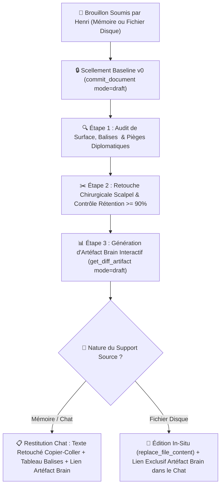
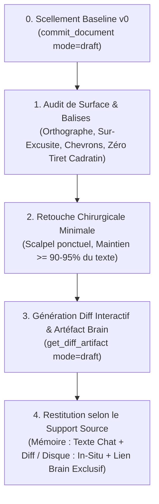

# ✍️ Comment le Skill /draft Assure-t-il la Relecture, la Complétion et la Retouche Chirurgicale sans Altérer la Voix d'Henri ?

Ce skill formalise le **protocole de relecture, correction et retouche chirurgicale** des textes, courriels, messages et documents rédigés par **Henri Jamet**. Il garantit une élimination sans faille des coquilles et des maladresses institutionnelles tout en érigeant un rempart infranchissable contre la dérive de réécriture intégrale courante des LLM.



---

## 0. 🎯 Quelle Est la Règle Canonique de Restitution Arbitrée par Henri ?

> [!IMPORTANT]
> **RÈGLE FORMELLE D'ARBITRAGE DE RESTITUTION D'HENRI :**
> - **Génération Systématique de l'Artéfact Brain** : Quel que soit le support source, un artéfact interactif Markdown (`file:///<appDataDir>/brain/<conversation-id>/...`) est **TOUJOURS généré** via l'outil MCP `get_diff_artifact(mode="draft")` pour inspecter le word-diff coloré, le contrôle de rétention ($\ge 90\%$) et le tableau de traçabilité complet.
> - **Bifurcation selon le Support Source** :
>   1. **Texte Soumis en Mémoire Pure (Chat sans Fichier Disque)** :
>      * Restitution directe du **texte final poli intégral dans le chat**, immédiatement prêt au copier-coller sans friction.
>      * Affichage sous le texte du **tableau comparatif de traçabilité** des balises `<XXX>` et modifications chirurgicales.
>      * Mention du lien cliquable vers l'artéfact Brain interactif en accompagnement pour revue détaillée.
>   2. **Texte Issu d'un Fichier Existant sur le Disque (Note Obsidian, Document, etc.)** :
>      * Modification chirurgicale **in-situ** du fichier cible via `replace_file_content` (zéro réécriture complète).
>      * Restitution dans le fil de discussion Antigravity **EXCLUSIVEMENT DU LIEN CLIQUABLE** vers l'artéfact Brain (`file:///<appDataDir>/brain/<conversation-id>/<nom>.md`) en première ligne.
>      * **INTERDICTION FORMELLE DE COPIE INTÉGRALE** : Ne jamais recopier le texte entier du fichier dans le fil de discussion.

---

## 🎯 Quelle Est la Philosophie et la Raison d'Être du Skill /draft ?

### 🛡️ Pourquoi Sanctuariser la Voix et l'Authenticité d'Henri ?
- **Respect du temps et de l'énergie** : Henri sait exactement ce qu'il veut dire, à qui il s'adresse et quel impact il vise. Le rôle de l'assistant n'est pas de réinventer sa pensée, mais de polir ses mots avec le tranchant d'un scalpel.
- **Préservation de l'authenticité** : La force de conviction d'Henri réside dans son ton direct, incarné, humain, percutant et sincère. Tout lissage aseptisé détruit cette signature personnelle et dépersonnalise ses échanges.
- **Rejet de la complaisance IA (Sycophancy & Corpo-Wash)** : Les modèles de langage ont un biais systématique les poussant à substituer un texte personnel par un jargon d'entreprise impersonnel, verbeux et artificiellement obséquieux (*"I hope this email finds you well"*, *"Permettez-moi de revenir vers vous..."*, *"N'hésitez pas si vous avez des questions"*). Le skill `/draft` agit comme un antidote strict à ce réflexe.

| Dimension | Voix Authentique d'Henri | Dérive IA / Corpo-Wash (Bannie) |
| :--- | :--- | :--- |
| **Attaque** | Directe, va droit au but dès la 1ère phrase | Préambules creux et salutations boursouflées |
| **Ton** | Concret, vif, dynamique, accessible, chaleureux | Formel, pompeux, distancé, passif |
| **Vocabulaire** | Mots justes, précis, simples et efficaces | Superlatifs automatiques, jargon administratif lourd |
| **Posture** | Égale, confiante, orientée solution et action | Auto-dépréciative, sur-excusite, hésitation |
| **Rythme** | Phrases courtes et enchaînements naturels | Périodes longues alourdies de propositions subordonnées |

---

## 🛑 Quelle Est la Règle d'Or Absolue Anti-Réécriture ?

> [!IMPORTANT]
> **RÈGLE D'OR : INTERDICTION FORMELLE DE RÉÉCRIRE LE TEXTE DE ZÉRO OU DE SUBSTITUER UNE VERSION ENTIÈREMENT REMANIÉE.**
> - **Seuil de préservation** : Au minimum **90% à 95%** du texte d'origine d'Henri doit demeurer strictement inchangé, mot pour mot.
> - **Principe de subsidiarité** : Si une phrase est grammaticalement correcte, compréhensible et sans piège diplomatique, **ON NE LA MODIFIE SOUS AUCUN PRÉTEXTE**.
> - **Bannissement du "mieux disant" subjectif** : L'assistant ne remplace jamais un mot par un autre au seul motif d'une préférence stylistique personnelle ou statistique du modèle.

---

## 🧭 Quel Est le Protocole d'Exécution Instrumenté par doc-version-mcp ?

Le cycle `/draft` s'articule autour du versioning déclaratif CAS pour garantir l'intégrité de la voix d'Henri et la traçabilité intégrale des retouches :

> [!IMPORTANT]
> **Double Voie d'Exécution (MCP doc-version ou CLI doc_version_cli.py)** :
> 1. **Voie Principale (MCP)** : Appel direct des outils `doc-version` (`commit_document`, `get_diff_artifact`).
> 2. **Voie Robuste (CLI Local)** : Si le serveur MCP est inactif, exécuter impérativement le script Python dédié :
>    `& "C:\Users\hjamet\Documents\code\doc-version-mcp\.venv\Scripts\python.exe" "C:\Users\hjamet\Documents\VoiceNotes\_agents\scripts-for-skills\doc_version_cli.py" diff --target "<fichier>" --explanation "<motif>" --content-file "<fichier_retouche>" --brain-dir "<appDataDir>/brain/<id>" --artifact-name "<nom>.md"`
> **INTERDICTION STRICTE DE SIMULATION** : Il est formellement interdit de créer l'artéfact à la main avec `write_to_file`.



### 🔒 0. Comment Sceller la Baseline v0 Avant Toute Intervention ?

Avant de commencer la moindre retouche, l'état initial doit être sanctuarisé dans le cache CAS via `commit_document` :
- **Si le texte est soumis en mémoire (chat)** :
  ```python
  call_mcp_tool(
      ServerName="doc-version",
      ToolName="commit_document",
      Arguments={
          "target": "virtual:draft_message",
          "content": "<texte_brut_soumis_par_henri>",
          "message": "Baseline v0 brouillon",
          "author": "henri",
          "mode": "draft"
      }
  )
  ```
- **Si le texte réside dans un fichier existant sur disque** :
  ```python
  call_mcp_tool(
      ServerName="doc-version",
      ToolName="commit_document",
      Arguments={
          "target": "C:/Users/hjamet/Documents/.../fichier.md",
          "message": "Baseline v0 brouillon",
          "author": "henri",
          "mode": "draft"
      }
  )
  ```

---

### 🔍 1. Comment Réaliser l'Audit de Surface et Détecter les Pièges ?

L'analyse initiale scanne le texte sur deux plans complémentaires :

#### 📝 Comment Corriger Formellement l'Orthographe, la Typographie et les Accords ?
- **Orthographe & Typographie** : Coquilles, fautes de frappe, accents manquants, cédilles, apostrophes typographiques.
- **Accords & Syntaxe** : Accords sujet-verbe, participes passés, accords en genre et en nombre, cohérence des temps.
- **Ponctuation** : Virgules mal placées brisant le souffle, espaces insécables avant ponctuation double en français (`:`, `;`, `!`, `?`).

#### 🛡️ Comment Traquer la Sur-Excusite et les Formulations Négatives ?
- **Élimination de la sur-excusite (Over-apologizing)** :
  * ❌ *« Je suis sincèrement désolé de vous déranger avec cela... »* ➔ ✅ Supprimé ou remplacé par une formule d'action directe.
  * ❌ *« Excuse my English, I hope I'm clear... »* ➔ ✅ Supprimé purement et simplement.
  * ❌ *« Je m'excuse d'avance pour le retard de ma réponse... »* ➔ ✅ *« Merci pour ta patience ! »* ou traitement immédiat de la question.
- **Remplacement des mots négatifs ou défensifs non intentionnels** :
  * Transformer les formulations passives ou culpabilisantes en constat factuel et tourné vers l'avenir.
  * ❌ *« Il y a eu un problème / une erreur de ma part »* ➔ ✅ Constat factuel neutre : *« Le fichier n'était pas attaché, le voici : ... »*.
- **Éradication des marqueurs IA et tics académiques creux** :
  * Purge absolue des tirets cadratins (`—`) ou tirets d'incise (`–`) au profit de virgules, parenthèses sobres ou points.
  * Bannissement des adverbes d'enrobage (*"fondamentalement"*, *"naturellement"*, *"incontestablement"*).

---

## 🧩 Comment Résoudre Chirurgicalement les Balises d'Hésitation & Données Manquantes <XXX> ?

Lorsque Henri insère des balises délimitées par des chevrons `<...>` dans son texte brut :

### 1. Règle des Deux Typologies de Balises `<XXX>`
1. **Cas A — Hésitation Lexicale ou Synonyme** (ex: `<protocole>`, `<dispositif>`, `<amicalement>`) :
   - L'agent remplace la balise par le terme le plus naturel, précis et institutionnellement adapté au contexte.
   - Respect strict du registre relationnel et de la voix d'Henri, sans extrapolation ni jargon boursouflé.

2. **Cas B — Donnée Factuelle Manquante ou Indice Intégré** (ex: `<5h ? Mais un classique d'après l'UNIL>`, `<chiffre CA>`, `<date limite>`) :
   - **Prendre en compte les indices d'Henri** : Analyser les réflexions, approximations ou pistes textuelles fournies à l'intérieur des chevrons.
   - **Interdiction formelle d'inventer** : L'agent ne devine jamais une métrique au hasard. Il déclenche une recherche active (notes du coffre, syllabus, e-mails Spark, règlements officiels, MCPs) pour identifier la donnée exacte et sourcée.
   - **Substitution fluide** : Remplacer l'intégralité du tag `<XXX>` par la valeur vérifiée intégrée harmonieusement dans la phrase.

### 2. Traçabilité dans le Tableau de Diff
Toute résolution de balise `<XXX>` fait l'objet d'une ligne dédiée dans le tableau de diff :
| Balise Originale (Avant) | Remplacement Validé (Après) | Justification & Source Vérifiée |
| :--- | :--- | :--- |
| *`<protocole>`* | *« dispositif d'évaluation continue »* | Qualification juridique conforme au règlement RBHEC art. 10. |
| *`<5h ? Mais classique...>`* | *« environ 15 heures de préparation »* | Standard ECTS du cours AIB (soutenance de 30 min en équipe). |

---

### ✂️ 2. Comment Appliquer la Retouche Chirurgicale Minimale (90-95% Intact) ?

- **Opérer au mot près** : Remplacer uniquement le mot fautif ou la locution boiteuse.
- **Audit de rétention $\ge 90\%$** : Vérifier que le ratio de préservation textuelle respecte rigoureusement le seuil contractuel ($\ge 90\%$, idéalement 95%).
- **Conserver la syntaxe originelle** : Ne pas inverser les propositions, ne pas scinder un paragraphe fluide en liste à puces, ne pas réorganiser la structure argumentative choisie par Henri.
- **Préserver le registre relationnel** :
  * Si Henri tutoie : conserver le tutoiement sans basculer au vouvoiement.
  * Si Henri utilise un smiley textuel (`:)`, `;)`), le laisser exactement là où il l'a placé.
  * Ne jamais ajouter de formule de politesse pompeuse en fin de message si Henri a simplement signé *"Henri"* ou *"Joyeusement,"*.

---

### 📊 3. Comment Générer l'Artéfact de Diff et Restituer les Résultats selon la Règle d'Henri ?

> [!CAUTION]
> **🚫 INTERDICTION FORMELLE DE FABRICATION MANUELLE D'ARTÉFACT /DRAFT** :
> Il est formellement interdit à un agent (racine ou sous-agent) de concevoir, rédiger ou simuler artisanalement un artéfact de diff interactif `/draft` via `write_to_file`.
> L'artéfact Markdown interactif (`diff_*.md`) doit être **STRICTEMENT ET EXCLUSIVEMENT généré par l'exécution du script d'instrumentation machine officiel** (`doc-version` `get_diff_artifact` ou CLI dédiée). Tout artéfact rédigé à la main est nul, non avenu, et constitue une violation critique du protocole /draft.

#### 🛠️ Génération de l'Artéfact Brain Interactif (`get_diff_artifact`)
L'artéfact interactif Markdown est généré via le serveur MCP `doc-version` :
```python
call_mcp_tool(
    ServerName="doc-version",
    ToolName="get_diff_artifact",
    Arguments={
        "target": "virtual:draft_message",  # ou chemin absolu du fichier disque
        "content": "<texte_retouche_complet>",  # requis si virtuel
        "diff_explanation": "Polissage chirurgical, résolution balises <XXX>, élimination sur-excusite",
        "mode": "draft",
        "brain_dir": "C:/Users/hjamet/.gemini/antigravity/brain/<conversation-id>"
    }
)
```
Cet artéfact contient le word-diff coloré (<ins>/<del>), le calcul du taux de rétention textuelle, et le tableau de traçabilité complet.

#### 📋 Restitution Concrète selon le Support Source :

##### Option A — Le texte source a été soumis directement en mémoire (chat) :
1. **Texte Retouché Intégral** : Restitué directement dans le chat, prêt à être copié-collé en un clic.
2. **Tableau Synthétique de Traçabilité des Balises & Retouches** :
   | Segment Original (Avant) | Segment Corrigé (Après) | Justification Chirurgicale |
   | :--- | :--- | :--- |
   | *« Je vous envoie les document »* | *« Je vous envoie les document**s** »* | Accord en nombre (pluriel). |
   | *« <protocole> »* | *« dispositif d'évaluation continue »* | Terme réglementaire RBHEC art. 10. |
   | *« Désolé de vous déranger, est-ce que... »* | *« Est-ce que... »* | Suppression sur-excusite / attaque directe. |
3. **Lien vers l'Artéfact Brain** : Offert pour inspection visuelle approfondie (`[Artéfact Diff Interactif](file:///...)`).

##### Option B — Le texte source provient d'un fichier existant sur le disque :
1. **Édition Chirurgicale In-Situ** : Application exclusive via `replace_file_content` sur le fichier source.
2. **Scellement du Commit Agent** :
   ```python
   call_mcp_tool(
       ServerName="doc-version",
       ToolName="commit_document",
       Arguments={
           "target": "C:/Users/hjamet/Documents/.../fichier.md",
           "message": "Polissage chirurgical draft",
           "author": "agent",
           "mode": "draft"
       }
   )
   ```
3. **Restitution dans le Chat** : **UNIQUEMENT LE LIEN CLIQUABLE VERS L'ARTÉFACT BRAIN** (`file:///<appDataDir>/brain/<conversation-id>/...`) en première ligne.
   > [!CAUTION]
   > **Zéro Copie Intégrale dans le Chat** : Interdiction formelle de recopier le fichier dans le fil de discussion quand un fichier source existe sur le disque. Le lien Brain est le seul livrable interactif.

---

### 🌐 4. Comment Assurer une Traduction Miroir Fidèle sans Broder ?

Lorsque Henri demande de traduire un texte (notamment du français vers l'anglais ou inversement), la même discipline chirurgicale s'applique :
- **Traduction miroir mot à mot et idée par idée** : Si Henri écrit une phrase courte de 7 mots, la traduction fait une phrase courte de 7 mots.
- **Interdiction formelle d'ajouter du liant artificiel** : Ne pas insérer de conjonctions de coordination grandiloquentes (*"Furthermore"*, *"Moreover"*, *"Nevertheless"*, *"Indeed"*).
- **Conserver l'ADN stylistique en anglais** :
  * Style actif, concis, direct.
  * Utilisation naturelle des contractions idiomatiques (*"I'll"*, *"don't"*, *"we'd"*) si le contexte est informel ou collégial.
  * Pas de formules victoriennes ni de phrases de trois lignes.

---

## 💡 Quels Sont les Exemples Concrets et les Anti-Patterns ?

### 📧 Exemple 1 : Comment Traiter un Courriel Professionnel ou Universitaire ?

**Texte Brut Soumis par Henri :**
> Bonjour Thomas, désolé de te déranger avec ça mais est-ce que tu as eu le temps de jeter un oeil sur le draft ? J'ai modifier la section 3 comme convenu avec Yash. Tiens moi au courant si tu as des remarques. Joyeusement, Henri

**Restitution du Skill /draft :**
> Bonjour Thomas, est-ce que tu as eu le temps de jeter un œil sur le draft ? J'ai modifié la section 3 comme convenu avec Yash. Tiens-moi au courant si tu as des remarques. Joyeusement, Henri

**Diff Commenté :**
| Avant | Après | Justification |
| :--- | :--- | :--- |
| *« désolé de te déranger avec ça mais est-ce que »* | *« est-ce que »* | Suppression de la sur-excusite ; attaque directe et chaleureuse. |
| *« un oeil »* | *« un œil »* | Typographie (ligature). |
| *« J'ai modifier »* | *« J'ai modifié »* | Participe passé avec l'auxiliaire avoir. |
| *« Tiens moi »* | *« Tiens-moi »* | Trait d'union impératif. |

---

### 💬 Exemple 2 : Comment Traiter un Message Court de Messagerie Instantanée ?

**Texte Brut Soumis par Henri :**
> Hello, c'est bon pour moi pour la réunion de 14h, désolé pour le délais de réponse j'étais en conf. A toute !

**Restitution du Skill /draft :**
> Hello, c'est bon pour moi pour la réunion de 14h, désolé pour le délai de réponse j'étais en conf. À toute !

**Diff Commenté :**
| Avant | Après | Justification |
| :--- | :--- | :--- |
| *« délais »* | *« délai »* | Orthographe (singulier). |
| *« A toute ! »* | *« À toute ! »* | Accentuation de la préposition majuscule. |

---

### 🚫 Anti-Pattern 1 : Comment Identifier et Bannir la Réécriture Complète Corporative ("Corpo-Wash") ?

**Ce Que l'IA Trompeuse Proposerait à Tort (STRICTEMENT INTERDIT) :**
> *« Cher Thomas, j'espère que tu vas bien et que ta semaine se déroule au mieux. Je me permets de revenir vers toi concernant notre manuscrit commun. Aurais-tu eu l'opportunité de prendre connaissance des dernières révisions ? Pour faire suite à nos échanges avec le Professeur Yash, j'ai pris l'initiative de remanier en profondeur la troisième section. Je reste à ton entière disposition pour tout échange complémentaire. Bien chaleureusement, Henri »*

> [!CAUTION]
> **Pourquoi c'est un échec critique** : Le texte a été dénaturé à 85%, transformé en bouillie corporative, rallongé inutilement et privé de son énergie d'origine. C'est une violation flagrante du skill `/draft`.

---

### 🚫 Anti-Pattern 2 : Comment Neutraliser la Sur-Excusite et l'Auto-Dépréciation Diplomatique ?

**Texte Soumis par Henri :**
> *« Désolé pour le retard, j'ai eu une semaine compliquée. Voici mon retour sur ton papier. Désolé d'avance si certaines remarques sont directes. »*

**Correction Chirurgicale Validée :**
> *« Merci pour ta patience ! Voici mon retour sur ton papier. Mes remarques se veulent directes et constructives pour faire avancer le projet :) »*

**Diff Commenté :**
| Avant | Après | Justification |
| :--- | :--- | :--- |
| *« Désolé pour le retard, j'ai eu une semaine compliquée. »* | *« Merci pour ta patience ! »* | Recadrage positif (gratitude vs culpabilité). |
| *« Désolé d'avance si certaines remarques sont directes. »* | *« Mes remarques se veulent directes et constructives pour faire avancer le projet :) »* | Affirmation bienveillante et professionnelle vs excuse préventive. |

---

## 📋 Quelle Est la Checklist de Contrôle Avant Restitution ?

Avant de renvoyer le résultat à Henri, l'agent audite rigoureusement sa propre production :
- [ ] **Scellement CAS préalable** : La baseline v0 a-t-elle été scellée via `commit_document(mode="draft")` avant retouche ?
- [ ] **Taux de rétention $\ge 90\%$** : Au moins 90% à 95% du texte original d'Henri est-il strictement préservé mot pour mot ?
- [ ] **Subsidiarité chirurgicale** : Aucune réécriture globale ni restructuration stylistique arbitraire n'a-t-elle été commise ?
- [ ] **Résolution des balises <XXX>** : Toutes les balises sont-elles résolues (Cas A élégance, Cas B faits vérifiés sans invention) et tracées ?
- [ ] **Orthographe & syntaxe** : Toutes les coquilles réelles, accords et ponctuations ont-ils été corrigés au scalpel ?
- [ ] **Pièges diplomatiques** : La sur-excusite et la culpabilité passive ont-elles été neutralisées avec bienveillance ?
- [ ] **Bannissement des marqueurs IA** : Les tirets cadratins (`—`) ou d'incise (`–`) et le jargon corporatif sont-ils totalement absents ?
- [ ] **Artéfact Machine Exclusif** : L'artéfact de diff interactif a-t-il été compilé **exclusivement par l'outil d'instrumentation machine** (zéro rédaction manuelle) ?
- [ ] **Règle de restitution d'Henri respectée** :
  * Si texte en mémoire ➔ Texte poli prêt au copier-coller + tableau comparatif de traçabilité dans le chat + lien Brain.
  * Si fichier disque ➔ Modification in-situ via `replace_file_content` + lien cliquable Brain exclusif en 1ère ligne (zéro copie intégrale dans le chat).
- [ ] **En cas de traduction** : Est-elle rigoureusement miroir sans extrapolation ni connecteurs boursouflés ?
