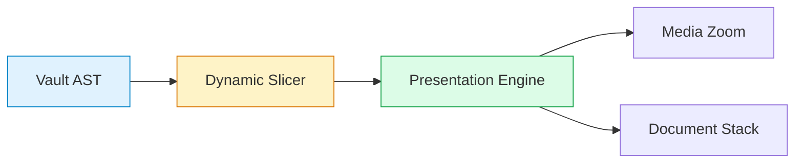
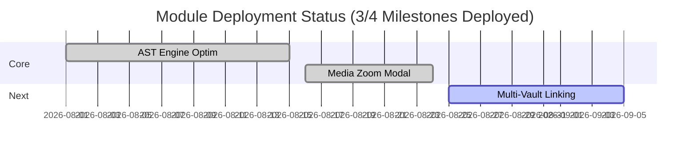

# 📽️ Dynamic Section Slides — Presentation Architecture & Visual Design Skill

Ce skill fournit les directives, protocoles et recettes pour concevoir de nouvelles présentations ou transformer n'importe quelle note du coffre Obsidian en un **support de présentation interactif plein écran** optimisé pour le plugin Obsidian **Dynamic Section Slides** (`obsidian-dynamic-slides`).

---

## 🎯 1. Philosophie & Règle d'Or de Concision Radicale

Un support de présentation animé par *Dynamic Section Slides* n'est **ni un article rédigé, ni un document de lecture dense**. C'est un **tableau de bord visuel pour l'oral**, conçu pour soutenir le discours de l'orateur et captiver l'audience en un coup d'œil.

```
┌────────────────────────────────────────────────────────────────────────────┐
│                    THE 3-SECOND COGNITIVE RULE (HIGH SIGNAL)               │
│  "Every slide must convey its core takeaway within 3 seconds of viewing."  │
└────────────────────────────────────────────────────────────────────────────┘
```

### 💎 Les Commandements d'Élagage pour l'Oral & Règle de l'Information Unique (Oral-First)

1. **Titres sous Forme de Questions Explicites (MANDATOIRE `?`)** :
   - Chaque titre de slide (`# H1`, `## H2`, `### H3`) **DOIT SYSTÉMATIQUEMENT ÊTRE FORMULÉ SOUS LA FORME D'UNE QUESTION EXPLICITE** se terminant par un point d'interrogation (`?`).
   - La slide pose la question clé que l'audience ou le présentateur se pose, et le contenu de la slide (callout, figure Python 300 DPI, tableau, diagramme) y apporte la réponse factuelle et directe.
2. **Bannissement Absolu des Listes à Puces Redondantes & Règle de l'Information Unique (Oral-First)** (MANDATOIRE) :
   - **Interdiction formelle d'insérer des puces récapitulatives ou explicatives sous un tableau, un graphique, un diagramme Mermaid ou un callout qui contient déjà l'information.**
   - **Chaque élément visuel (Figure, Tableau, Callout, Schéma) se suffit intégralement à lui-même.** Ne JAMAIS ajouter de texte venant paraphraser, résumer ou commenter ce qui est déjà visible dans le composant.
   - **L'explication didactique et les commentaires d'analyse appartiennent exclusivement au discours oral du présentateur.** L'écran ne sert pas d'aide-mémoire textuel ni de script de lecture.
   - **Une diapositive ne doit contenir QUE l'élément visuel fort et sa question, zéro paraphrase textuelle.**
   - **Chaque nouvel élément doit apporter une information strictement inédite** : ne jamais reformuler, synthétiser ou expliquer ce qu'il y avait avant.
3. **Règle de l'Ancrage Visuel Unique & Zéro Redondance** :
   - Maximum **1 Visuel Fort par Slide** (1 Diagramme Mermaid OU 1 Tableau compact OU 1 Figure Python 300 DPI OU 1 Callout percutant).
   - En l'absence de visuel lourd, maximum **2 à 3 puces télégraphiques strictes**.
4. **Puces Télégraphiques Strictes (< 6 à 8 Mots)** :
   - Utilisées uniquement en l'absence de visuel ou pour un fait inédit non représentable visuellement.
   - Format obligatoire : `- **Mot-clé fort** : Fait clé chiffré` (ex: `- **Latence** : $142\text{ms}$ moy. ($N=50\text{k}$)`).
   - Bannir les phrases narratives complètes ("Nous avons mis en place un système qui...").
5. **Bannissement Absolu du Verbiage** :
   - Zéro paragraphe discursif ou narratif.
   - Zéro redite, zéro phrase de remplissage, zéro intro/outro bavarde.
6. **Priorité 100% Visuelle (1 Ancrage Fort par Slide)** :
   - Chaque slide doit contenir **1 Diagramme Mermaid OU 1 Tableau compact OU 1 Figure Python 300 DPI OU 1 Callout percutant**.
   - Zéro texte redondant accompagnant le visuel.
7. **Déport Systématique vers la Document Stack (`[[Note.md]]`)** :
   - Tout protocole expérimental, calcul mathématique complet, log d'erreur ou détail d'architecture DOIT être placé dans une sous-note `[[Note.md]]`.
   - *Dynamic Section Slides* gère nativement la pile de documents : un clic ouvre la sous-note en mode présentation avec le bouton de retour `↩ Revenir à la présentation principale`.
8. **Zéro Séparateur Horizontal `---`** : Découpe 100% sémantique via les titres Markdown `#` à `####`.
9. **Langue par Défaut** : **Anglais** (sauf demande expresse en français).

---

## 🔬 2. Style, Registre & Ton (Rigueur Scientifique & Evidence-First)

Le contenu des présentations doit observer une **neutralité absolue, une concision chirurgicale et une rigueur sans faille**.

### A. Bannissement Formel du Fluff & Jargon Marketing

* ❌ **Termes bannis** : *"High Execution Velocity"*, *"Game-changing"*, *"Seamless"*, *"Revolutionary"*, *"Flawless execution"*, *"Next-generation"*, *"Groundbreaking"*, *"State-of-the-art / SOTA"* (sans benchmark formel).
* ❌ **Complaisance / Sycophancy** : Bannir toute déclaration d'infaillibilité ou d'optimisme naïf.

### B. Tableau Comparatif : Verbiage vs Concision Scientifique

| ❌ Verbiage Marketing / Narratif | ✅ Concision Radicale & Chiffrée (< 8 mots) |
| :--- | :--- |
| *"Seamless multi-agent collaboration with flawless execution"* | **"- IPC Dispatch : $< 5\text{ms}$ overhead, 0 loss"** |
| *"Revolutionary context engine achieving high execution velocity"* | **"- Context Pruning : $-38\%$ tokens ($N = 1,200$)"** |
| *"Groundbreaking, unmatched accuracy across all benchmarks"* | **"- Accuracy : $+8.4\%$ F1 vs Graph-RAG ($p = 0.003$)"** |
| *"Zero-bias memory system ensuring perfect recall on all queries"* | **"- Recall@10 : $91.2\%$ on noisy inputs"** |
| *"All components delivered on time with massive impact"* | **"- Status : 4/5 modules deployed, target $< 50\text{ms}$"** |

---

## 🏗️ 3. Moteur Hiérarchique & Navigation 2D

*Dynamic Section Slides* parse l'arbre Markdown (AST) et génère une navigation bidimensionnelle dynamique :

### 📐 Hiérarchie des Titres Markdown (Paradigme Question-Réponse)

| Balise | Rôle | Format & Contenu Maximal Recommandé |
| :--- | :--- | :--- |
| `# Title ?` | **Écran Titre / Chapitre** | Question d'orientation générale + 1 Callout d'objectif percutant. Zéro puce redondante. |
| `## Section ?` | **Diapositive Principale** | Question clé de la diapositive + 1 Visuel fort unique (Mermaid / Tableau / Figure 300 DPI / Callout). Zéro paraphrase. |
| `### Topic ?` | **Sous-diapositive (Deep Dive)** | Question d'investigation technique + 1 Visuel ou métrique inédite + 1 lien `[[Note.md]]`. |
| `#### Detail ?` | **Carte Zoom** | Question sur cas limite ou ablation isolée (< 2 lignes). |

> [!CAUTION]
> ### 🚫 Règle Anti-Redondance & Anti-Fragmentation (Oral-First)
> * **Zéro puce explicative sous les visuels** : Ne JAMAIS insérer de puces récapitulatives ou explicatives sous un tableau, graphique ou schéma. L'orateur commente le visuel à l'oral.
> * **Élément visuel autonome** : Chaque visuel (Figure, Tableau, Callout) se suffit intégralement à lui-même.
> * **Zéro slide vide** : Intégrer l'image/diagramme directement dans la section `## ?` sans section fantôme.

### 🎮 Contrôles Clavier
* `Espace` / `Flèche Droite` : Avancement séquentiel (zoom média $\rightarrow$ défilement $\rightarrow$ slide suivante).
* `Flèche Bas` / `Flèche Haut` : Saut direct à la slide suivante / précédente.
* `+` / `-` / `0` : Zoom vue ($\pm 10\%$, réinitialisation à 100%).
* `Clic Média` : Zoom plein écran sur Mermaid, tableau, image ou code.
* `Clic Lien [[Note]]` : Navigation Document Stack avec retour `↩`.
* `Échap` : Quitter la présentation.

---

## 📊 4. Recettes Visuelles Compactes

### A. Tableaux Compacts (3-4 Lignes Max)
```markdown
| Method | Accuracy | Latency | Memory | Status | Deep Dive |
| :--- | :---: | :---: | :---: | :---: | :---: |
| **Vector RAG** | 68.4% | 340ms | 1.2 GB | Baseline | [[Note Baseline]] |
| **Graph-RAG** | 81.2% | 510ms | 3.8 GB | Baseline | [[Note Graph RAG]] |
| **Dynamic AST** | **94.6%** | **180ms** | **850 MB** | Verified | [[Note AST Engine]] |
```

### B. Diagrammes Mermaid Épurés
````markdown
```mermaid
flowchart LR
    A[📥 Obsidian AST] --> B[⚙️ 2D Engine]
    B --> C[🖥️ Presentation View]
    C --> D[🔍 Media Zoom]
    C --> E[📚 [[Document Stack]]]

    style A fill:#e0f2fe,stroke:#0284c7
    style B fill:#fef3c7,stroke:#d97706
    style C fill:#dcfce7,stroke:#16a34a
```
````

### C. Alertes GitHub Flash (1-2 Phrases Max)
```markdown
> [!IMPORTANT]
> **Sub-200ms Target Achieved :** $142\text{ms}$ average latency on $N = 50\text{k}$ nodes. Spec : [[AST Architecture]]
```

---

## 🎨 5. Infographies Visuelles Clés (Format 16:9)

* **Outil** : `generate_image` (`AspectRatio="16:9"`)
* **Formule S.S.V.D.** :
  1. **Subject** : Schéma conceptuel ou pipeline fonctionnel précis.
  2. **Style** : *"Flat 2D vector infographic schematic, modern minimalist tech presentation style, clean light background"*.
  3. **Visuals** : *"16:9 landscape, left-to-right flow, modular rounded boxes, high-contrast palette (navy, emerald, amber, slate)"*.
  4. **Details** : *"Clean typography, zero 3D clutter, no photorealistic noise, no drop shadows"*.

---

## 🔄 6. Protocole de Rédaction : "Cut to the Bone & Oral-First"

1. **Question Formulation & Single Goal** : Identifier l'idée maîtresse et la formuler sous la forme d'une **question explicite percutante se terminant par `?`** pour le titre H1 / H2 / H3.
2. **Visual First & Standalone** : Insérer immédiatement le diagramme Mermaid, le tableau compact, l'infographie 16:9 / figure Python 300 DPI ou le callout apportant la réponse visuelle directe. L'élément visuel se suffit intégralement à lui-même.
3. **Bannissement Absolu des Puces Récapitulatives** : Interdiction formelle d'insérer des listes à puces pour paraphraser ou expliquer ce qui est déjà présent dans le visuel. Tout commentaire didactique est réservé au discours oral.
4. **Offload to Stack** : Remplacer tout détail technique, protocole ou calcul par un lien cliquable `[[Détail Technique.md]]` intégré si nécessaire directement dans le tableau ou le visuel.
5. **3-Second Test** : Lancer `Ctrl+Shift+P`. Si la slide nécessite plus de 3 secondes de lecture ou contient de la paraphrase textuelle d'un visuel, éliminer immédiatement le texte superflu.

---

## 🌟 7. Gabarit Modèle Ultra-Concis (Deck Template — Zero Redundancy)

```markdown
# 🔬 How Does the Dynamic AST Engine Synchronize Multi-Agent Context in Sub-200ms?

> [!IMPORTANT]
> **Sub-200ms Target :** Synchronization achieved across $N = 50,000$ document nodes in $142\text{ms}$ average round-trip time. Full Spec: [[System Specifications]]

## ⚙️ What Are the Bottlenecks of Traditional Vector & Graph Approaches?

| Method | Mean Latency | Memory Allocation | Staleness Rate | Deep Dive |
| :--- | :---: | :---: | :---: | :---: |
| **Vector Index** | 340 ms | 3.8 GB | 14.2% | [[Vector Audit]] |
| **Graph-RAG** | 510 ms | 4.2 GB | 8.7% | [[Graph Audit]] |
| **AST Dynamic (Ours)** | **142 ms** | **850 MB** | **0.0%** | [[Empirical Fragmentation Study]] |

## 🏛️ How Does the Dynamic Slicing Pipeline Stream Views to the Presentation Engine?



## 📊 What Are the Verified Performance Gains & Throughput Benchmarks?

> [!TIP]
> **Throughput & Memory Gains :** $+42\%$ FPS on 4K displays, $-58.2\%$ parsing latency, $-77.6\%$ memory footprint vs baselines ($p < 0.001$, $N = 50$ runs). Logs: [[Benchmark Logs 2026]]

## 🏁 What Is the Delivery Status & Milestone Roadmap?


```
