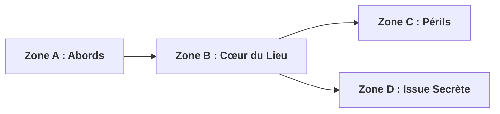

# Harpy Entity Creator — Moteur Universel d'Entités JDR pour Obsidian & Harpy

> **Aliases & Invocations** : `/harpy-entity-creator` | `/rpg-entity-creator` | `/jdr-entity-creator` | `/pnj-jdr-creator`
> **Fiche Étalon Canonique dans le Coffre** : [`Conseil/Shanwen.md`](file:///c:/Users/Jamet/Documents/VoiceNotes/Conseil/Shanwen.md)
> **Note Modèle Technique de Référence** : [`notes/Modèle Fiche Entité Pathfinder 1e.md`](file:///c:/Users/Jamet/Documents/VoiceNotes/notes/Mod%C3%A8le%20Fiche%20Entit%C3%A9%20Pathfinder%201e.md)

Ce skill est le **moteur unifié de rédaction, mise en page et illustration** de toute fiche d'entité de jeu de rôle pour le coffre Obsidian d'Henri Jamet et l'application **Harpy**. Il traite l'ensemble des entités : **PNJ (`character`)**, **Monstres & Créatures (`monster`)**, **Lieux & Sanctuaires (`place`/`location`)**, **Objets magiques, Véhicules & Alchimie (`item`)**, **Sortilèges & Rituels (`spell`)**, **Factions & Guildes (`group`)**, et **Plans & Battlemaps (`battlemap`/`scene`)**.

---

## 1. Principes Fondateurs & Exigences Absolues

### 🎯 1.1. RÈGLE STRICTE DU FICHIER UNIQUE — ZÉRO DOUBLON (MANDATOIRE)
* **Emplacement Unique et Canonique** : Une fiche d'entité ne doit résider qu'en **UN SEUL et unique endroit** dans le coffre Obsidian.
* **Dossier de Campagne Prioritaire** : Si la campagne dispose d'un dossier dédié (ex: `Conseil/` pour *Le Conseil des Voleurs*, `Asharde/` pour *Asharde*), la fiche est créée **EXCLUSIVEMENT** dans ce dossier thématique (ex: `Conseil/Frère Théodore.md`, `Conseil/Shanwen.md`, `Conseil/Herb le Soufre.md`).
* **INTERDICTION FORMELLE DE DUPLICATION** : Il est formellement interdit de créer une fiche dans `notes/` ET dans le sous-dossier de campagne. Le dossier `notes/` ne reçoit une fiche d'entité QUE si celle-ci est transversale à plusieurs campagnes ou si la campagne n'a aucun dossier dédié.
* **Liaisons par Wikilinks Directs** : Les notes de session et aides-mémoires (ex: `notes/Session JDR Le Conseil des Voleurs 9 septembre 2026.md`) pointent directement vers le fichier unique situé dans son dossier de campagne via `[[Conseil/NomDeLEntite|Alias]]`.

### 📜 1.2. Ancrage Obligatoire dans la Fiche de Style d'Univers / Campagne (MANDATOIRE)
Avant de poser la moindre ligne, l'agent doit consulter la **Fiche de Style** de la campagne (ex: `[[Conseil/Fiche de Style Le Conseil des Voleurs|Fiche de Style Le Conseil des Voleurs]]` ou `[[Asharde/Fiche de Style Asharde]]`) pour adopter :
- Le système de règles idoine (Pathfinder 1e, D&D 5e, système propriétaire).
- Le barème de FP/niveaux et l'équilibrage de rencontre.
- Le lexique francophone officiel et l'ambiance narrative attendue.

### ⚡ 1.3. Étincelle Créative par Mot-Clé Aléatoire
Pour éviter les stéréotypes, utiliser une amorce sous forme de **1 à 2 mots-clés aléatoires orthogonaux** (concept, objet insolite, paradoxe) afin d'insuffler une singularité marquante à l'entité (manie, accessoire fétiche, secret inavouable, anomalie sensorielle).

### 🏷️ 1.4. Métadonnées YAML Standardisées & Suppression Formelle de `description:`
* **Zéro champ `description:` dans le YAML** : Le champ `description:` est strictement banni du frontmatter YAML pour éliminer toute redondance et alléger les métadonnées Obsidian.
* **Tag Dynamique de Session (MANDATOIRE)** : Dans le frontmatter YAML, le premier tag doit obligatoirement être le tag de session de préparation sans zéro initial : `session-5` (ou `session-1`, `session-4`, etc.).
* **Gestion des UIDs Harpy** : Ne pas renseigner manuellement `harpy-uid:` ni `uid:`, ils sont générés automatiquement par le plugin `harpy-sync`.

### 👁️ 1.5. Courte Description Sensorielle Sous l'Image
La courte vue sensorielle (1 à 2 phrases percutantes, max 120 caractères, zéro spoiler) se place directement sous l'illustration 16:9 sous forme d'une citation Markdown `> ...`, juste avant le callout `> [!quote] 👤 Vue Joueurs`.

### 🔒 1.6. Interconnexion Dense dans les Secrets MJ (`> [!warning]`) (MANDATOIRE)
Dans le callout `> [!warning] 🔒 Secrets MJ / Coulisses` et les sections privées MJ, insérer obligatoirement de **multiples liens Obsidian `[[...]]`** vers :
- Les factions (`[[Conseil/Ordre du Chevalet|Ordre du Chevalet]]`).
- Les PNJ alliés ou rivaux (`[[Conseil/Herb le Soufre|Herb le Soufré]]`, `[[Conseil/Shanwen|Shanwen]]`).
- Les lieux canoniques (`[[Conseil/Pont sur l Athua Site de l Embuscade|Pont sur l'Athua]]`).
- Le lore (`[[Culte d'Asmodéus]]`, `[[Couronne d'Ouest]]`).
- La Fiche de Style et le cockpit de campagne.

### 🎨 1.7. Illustration 16:9 Dédiée & Zéro Placeholder (MANDATOIRE)
* **PNJ, Monstres, Créatures, Objets & Reliques** : Génération 16:9 obligatoire via `/asharde-visual-architect` (Master Formula).
* **Donjons, Bâtiments, Plans & Battlemaps** : Génération 16:9 vue zénithale 90° sans grille via `/asharde-cartographer` (The Cartographer Formula).
* **🏰 Lieux, Sanctuaires & Bâtiments (DEUX images 16:9 minimum - MANDATOIRE)** :
  1. Une **vue d'ambiance immersive** selon la Master Formula (placée en tête sous la maxime).
  2. Une **battlemap tactique zénithale à 90° sans grille** (avec zones tactiques A-B-C-D découpées).
* L'illustration doit exister physiquement dans `_attachments/`. Zéro placeholder vide ni recyclage toléré.

### ⏱️ 1.8. Copier-Coller Fluide vers Harpy (< 30 secondes)
Henri copie directement les sections de la note Markdown vers les champs de Harpy. La balise de pagination Harpy `<!-- harpy:page {"displayName":"Secrets MJ & Coulisses"} -->` isole automatiquement les secrets des joueurs lors de la manipulation.

### 🇫🇷 1.9. Immersion 100% en Français Soigné & Bannissement des Anglicismes
Zéro terme ou doublon anglais entre parenthèses. Utilisation exclusive des sigles mécaniques francophones officiels : `CA`, `PV`, `BBA`, `BMO`, `DMD`, `RD`, `RM`, `FP`, `DD`, `AdO`, `DV`. Titres d'ouvrages traduits en français.

### 🚫 1.10. Bannissement des Backticks Inline dans les Fiches Harpy (MANDATOIRE)
Ne JAMAIS utiliser de balises de code / backticks `...` (ex: `` `Ext` ``, `` `Mag` ``, `` `Sur` ``, `` `Sort` ``, `` `text` ``) dans les sections de statistiques mécaniques, aptitudes ou descriptions de la fiche. Le parser d'importation de Harpy gère mal le code inline et cela corrompt les fiches à l'import. Utiliser **uniquement du texte brut** sans aucun balisage de code : `(Ext)`, `(Mag)`, `(Sur)`, `(Sort)`.

### 🚫 1.11. Onomastique Organique & Règle Anti-Clichés (MANDATOIRE)
* **Bannissement de la formule `[Prénom] le [Qualificatif/Métier]`** : Proscription formelle de nommer des PNJ sous la forme paresseuse `[Prénom] le [Qualificatif]` (ex: *Marc le Tueur*, *Frédéric le Moine*, *Gorgoroth le Suifeux*).
* **Identités Civiles Authentiques** : Privilégier systématiquement de véritables patronymes complets (**Prénom + Nom de famille**) cohérents avec la culture locale (ex: souche chéloise / baroque pour Westcrown : *Corvin Drovenge*, *Aldo Scornavacco*, *Vespera Rosetan*, *Hesperia Vane*). Les surnoms doivent être rarissimes, nés d'une histoire vécue par les PJ, et jamais une étiquette fonctionnelle.
* **Toponymes & Factions Organiques** : Bannir les noms descriptifs naïfs (*la forêt des Chênes Blancs*, *la Confrérie des Gouttières*). Utiliser des néologismes évocateurs (*la forêt asverdiane*, *le marais d'Olynthe*, *le gouffre de Malroche*) et des factions institutionnelles crédibles (*la Légation de Cendres*, *le Cercle de Maras*).

---

## 2. Structure Universelle en 5 Blocs Canoniques

Chaque note d'entité créée doit respecter rigoureusement l'enchaînement des 5 blocs suivants :

```
┌────────────────────────────────────────────────────────────────────────┐
│ BLOC 1 : FRONTMATTER YAML STANDARDISÉ (Obsidian + Harpy)               │
│ - displayName, type, category, Image (SANS champ description:)         │
│ - tags : session-N, date, PNJ/Monstre/Lieu/Objet, Système, Campagne    │
│ - variables compactes pour Harpy : Classe, PV, CA, FP, BBA...          │
├────────────────────────────────────────────────────────────────────────┤
│ BLOC 2 : MAXIME DE L'ENTITÉ (DIRECTEMENT SOUS LE YAML)                 │
│ - > *« Citation percutante incarnant la voix et l'éthique »*          │
│ - STRICTEMENT AUCUN TITRE H1 `# [Nom]` (évite le doublon avec le nom) │
├────────────────────────────────────────────────────────────────────────┤
│ BLOC 3 : ILLUSTRATION 16:9 DÉDIÉE & CITATION SENSORIELLE               │
│ - ![[Dossier/_attachments/nom_image_16_9.png]]                         │
│ - > Courte vue extérieure sensorielle (≤ 120 car., sans spoiler)       │
├────────────────────────────────────────────────────────────────────────┤
│ BLOC 4 : LES DEUX CALLOUTS ÉTANCHES AVEC MAILLAGE DENSE MJ & ACTIONS   │
│ - > [!quote] 👤 Vue Joueurs / Directement visible                      │
│   (Allure, démarche, voix, posture, adjectifs en GRAS)                 │
│ - > [!warning] 🔒 Secrets MJ / Coulisses (DENSE EN WIKILINKS [[...]])  │
│   (Allégeances [[Factions]], rivaux [[PNJ]], lieux [[Lieux]], peurs)   │
│   (Fiche technique, Puissance, Source, Liaisons [[Campagne]]/[[Session]])│
│ - Puces d'actions réflexes : ⚔️ Attaque, 🏹 Pouvoir, 🔮 Magie, 🎲 Réflexe│
├────────────────────────────────────────────────────────────────────────┤
│ BLOC 5 : PROFIL MÉCANIQUE COMPLET & SECRETS ÉTENDUS HARPY              │
│ - ## ⚔️ Profil Mécanique & Statblock Complet (Tableaux compacts)       │
│   * Stats Principales (Init, Vitesse, CA, PV, Sauvegardes, BMO/DMD)    │
│   * Attaques & Capacités (Attaques, Aptitudes Ext/Sur/Mag, Sorts)      │
│   * Équipement & Trésor (Combat, Divers, Richesse)                     │
│   * Statistiques & Compétences (BBA, Sens, Langues, Dons, Compétences) │
│   * Attributs Principaux (For, Dex, Con, Int, Sag, Cha)                │
│ - <!-- harpy:page {"displayName":"Secrets MJ & Coulisses"} -->         │
│ - # Secrets MJ & Coulisses                                             │
│   * ### 💬 Répliques Types & Interactions Clés (3 répliques)           │
│   * ### ⏳ Destin & Trajectoire Narrative (Moments clés & 3 Phases)    │
│     (🌟 Plus beau moment, ⚡ Pire moment, 💀 Comment mourir, 3 Phases)  │
└────────────────────────────────────────────────────────────────────────┘
```

---

## 3. Typologie des Entités Harpy & Destination des Champs

### Types Standard Harpy (`type`) :
- `character` : PNJ, alliés, rivaux, antagonistes majeurs, autorités.
- `monster` : Bêtes, aberrations, créatures planaires, prédateurs nocturnes.
- `item` : Objets magiques, reliques, armes spéciales, véhicules, explosifs et pièges.
- `place` / `location` : Villes, auberges, sanctuaires, ponts, places fortes, donjons.
- `spell` : Rituels, sortilèges, malédictions, auras magiques.
- `group` : Factions, guildes, ordres militaires, cultes religieux.
- `battlemap` / `scene` : Cartes tactiques et découpages de scènes d'ambiance.

### Matrice de Correspondance pour le Copier-Coller dans Harpy :

| Section de la Note Obsidian | Destination dans Harpy | Usage en Partie |
| :--- | :--- | :--- |
| **Frontmatter YAML** (`displayName`, `category`, `tags`) | **Nom de la carte**, **Dossier**, **Tags** | Tri immédiat par filtre `session-5` dans Harpy. |
| **Bloc 2 (Maxime)** + **Citation sensorielle** + **Bloc 4 (`Vue Joueurs`)** | Champ **Description** (Face publique) | Affiché aux joueurs lors d'un partage de fiche. |
| **Bloc 3 (`_attachments/...png`)** | **Avatar / Illustration de carte** | Visuel 16:9 plein écran de la carte Harpy. |
| **Bloc 4 (`Secrets MJ` maillés [[...]])** + **Bloc 5 (`Destin & Trajectoire`)** | Champ **Notes Privées / Secrets MJ** | Révélations, factions et intrigue sous les yeux du MJ seul. |
| **Bloc 4 (Puces Réflexes)** + **Bloc 5 (Statblock)** | Section **Actions / Stats Rapides** | Lancer les attaques et sauvegardes sans latence. |

---

## 4. Modèle Canonique Complet Prêt à l'Emploi (PNJ / Monstre)

```markdown
---
displayName: "[Nom de l'Entité]"
harpy-last-sync: "2026-09-09T18:00:00.000Z"
lastSync: "2026-09-09T18:00:00.000Z"
type: character
category: PNJ
tags:
  - session-5
  - 2026-09-09
  - PNJ
  - Pathfinder-1e
  - [Campagne-Cible]
variables:
  Classe: "[Classe et Niveau]"
  PV: [PV]
  CA: [CA]
  FP: "[FP]"
  BBA: [BBA]
  PerceptionPassif: [10 + Mod Perception]
Image: "[[DossierCampagne/_attachments/nom_image_16_9.png]]"
---

> *« [Maxime / Citation percutante incarnant la voix et l'éthique de l'entité] »*

![[DossierCampagne/_attachments/nom_image_16_9.png]]
> [Courte description sensorielle extérieure, max 120 caractères, zéro spoiler.]

> [!quote] 👤 Vue Joueurs / Directement visible
> [Physique, allure, démarche, voix et vêtements distinctifs avec adjectifs clés en **gras**.]

> [!warning] 🔒 Secrets MJ / Coulisses
> [Origines, allégeances secrètes à la faction [[DossierCampagne/Faction|Faction]], rivalités avec [[DossierCampagne/PNJ|Autre PNJ]], motivations profondes et peurs intimes.]
>
> **Fiche technique :** [Race] ([Genre]) [Classe] [Niveau]. [Type (Sous-type)] de taille [Taille], d'alignement [Alignement].  
> **Puissance :** FP [FP] ([XP] px).  
> **Source :** *[Ouvrage de référence en français]*, p. [XX].  
> **Liaisons Campagne :** [[DossierCampagne/Fiche de Style|Fiche de Style]] • [[notes/NomCampagne|Cockpit Campagne]] • [[notes/Session JDR...|Session Active]] • [[DossierCampagne/Lieu|Lieu]]

- ⚔️ **Attaque principale ([Arme])** : +[X] au toucher ([Dégâts] / [Critique], Portée [X] m). [Effet additionnel].
- 🏹 **Pouvoir clé ([Capacité majeure])** : [Fonctionnement direct, DD de sauvegarde, cadence].
- 🔮 **Pouvoir magique direct ([Sort/Don])** : [Portée, effet, utilisations par jour].
- 🎲 **Mécanique / Réflexe ([Interaction clé])** : [Bonus contextuel ou jet d'opposition].

---

## ⚔️ Profil Mécanique & Statblock Complet

### 🛡️ Stats Principales
| Initiative & Vitesse | CA | PV | Sauvegardes | BMO & DMD | RD, RM & Immunités |
| :--- | :--- | :---: | :--- | :--- | :--- |
| Init +[X], Vitesse [X] m | **[Total]**, contact [X], pris au dépourvu [X] (+[X] armure, +[X] Dex) | **[Total]** ([DV]) | **Vigueur** +[X], **Réflexes** +[X], **Volonté** +[X] | BMO +[X], DMD [X] | [RD, RM, Immunités] |

### ⚔️ Attaques & Capacités
* 🛡️ **[Capacité Extraordinaire]** (Ext) : [Description de l'aptitude physique ou tactique non magique].
* 🔮 **[Capacité Magique]** (Mag) : [Description de l'effet, portée, utilisations].
* ✨ **[Capacité Surnaturelle]** (Sur) : [Description, DD de sauvegarde].
* 📜 **Sortilèges préparés / connus** (Sort, NLS [X], DD [X] + niveau) :
  * **Niveau 1** ([X]/jour, DD [X]) : *[Sort 1]*, *[Sort 2]*.
  * **Niveau 0** ([X] à volonté) : *[Sort de base]*.

### 🎒 Équipement & Trésor
| Catégorie | Éléments & Détails |
| :--- | :--- |
| ⚔️ **Équipement de combat** | [Armes équipées, munitions, potions de soins] |
| 🎒 **Équipement divers** | [Armures, vêtements de fonction, clés maîtresses, missives scellées vers [[DossierCampagne/Lieu]]] |
| 💰 **Richesse** | [Bourse de pièces d'or (PO), bijoux, titres] |

### 🎲 Statistiques & Compétences
| Caractéristique | Valeur / Détail |
| :--- | :--- |
| 🎯 **BBA** | +[X] |
| 👁️ **Sens** | Perception +[X], [Vision dans le noir / normale] |
| 🗣️ **Langues** | [Langues parlées] |
| 🎖️ **Dons** | [Liste des dons] |
| 📚 **Compétences principales** | [Compétence 1] +[X] ([N] rgs), [Compétence 2] +[X] ([N] rgs) |

### 📊 Attributs Principaux
| Force | Dextérité | Constitution | Intelligence | Sagesse | Charisme |
| :---: | :---: | :---: | :---: | :---: | :---: |
| [10 (+0)] | [10 (+0)] | [10 (+0)] | [10 (+0)] | [10 (+0)] | [10 (+0)] |

<!-- harpy:page {"displayName":"Secrets MJ & Coulisses"} -->
# Secrets MJ & Coulisses

### 💬 Répliques Types & Interactions Clés
* *« [Réplique d'accueil ou de négociation marquant le ton habituel] »*
* *« [Réplique en situation de tension, de crise ou de combat] »*
* *« [Dernière parole ou sentence rituelle] »*

### ⏳ Destin & Trajectoire Narrative
* 🌟 **Le plus beau moment de sa vie** : [Événement fondateur ayant forgé sa vision du monde].
* ⚡ **Le pire moment de sa vie** : [Traumatisme originel ou pire défaite le hantant encore face à [[DossierCampagne/Faction]]].
* 💀 **Comment il devrait mourir** : [Mort spectaculaire ou tragique prévue s'il n'est pas sauvé].
* **Phase 1 ([Ancrage initial])** : [Point de rencontre avec les PJ lors de la session].
* **Phase 2 ([Destin autonome])** : [Comportement si les PJ fuient ou le laissent agir].
* **Phase 3 ([Climax / Dépouille])** : [Conséquences de sa chute et révélations].
```

---

## 5. Modèle Spécifique : Lieux & Donjons (2 Images 16:9 & Découpage Tactique)

Pour tout lieu, donjon, pont ou sanctuaire :
1. **Illustration d'Ambiance 16:9** (sous la maxime) via `/asharde-visual-architect`.
2. **Battlemap Zénithale 16:9** (sous la section des zones tactiques) via `/asharde-cartographer` (vue 90° sans grille).
3. **Découpage des Zones Tactiques** en schéma Mermaid (`Zone A`, `Zone B`, `Zone C`, `Zone D`) et tableau d'environnement interactif.

```markdown
---
displayName: "[Nom du Lieu]"
harpy-last-sync: "2026-09-09T18:00:00.000Z"
lastSync: "2026-09-09T18:00:00.000Z"
type: place
category: Lieu
tags:
  - session-5
  - 2026-09-09
  - Lieu
  - Battlemap
  - [Campagne-Cible]
variables:
  Dimensions: "60 x 33 m (40x22 cases)"
  TypeTerrain: "Pont de pierre et rapides"
  Danger: "Moyen"
Image: "[[DossierCampagne/_attachments/nom_vue_ambiance_16_9.png]]"
---

> *« [Maxime du lieu] »*

![[DossierCampagne/_attachments/nom_vue_ambiance_16_9.png]]
> [Courte description sensorielle de l'atmosphère, max 120 caractères.]

> [!quote] 👤 Vue Joueurs / Directement visible
> [Architecture, matériaux, sons, odeurs et perspectives avec adjectifs clés en **gras**.]

> [!warning] 🔒 Secrets MJ / Coulisses
> [Passages secrets, pièges dissimulés, historique occulte et liaisons vers [[DossierCampagne/Faction]].]

- 🛡️ **Obstacle environnemental** : [Effet mécanique, DD du jet de sauvegarde].
- ⚙️ **Mécanisme / Piège** : [Déclencheur, perception DD [X], désamorçage DD [X]].
- 🚪 **Issue secrète** : [Emplacement, test de détection].

---

## 🗺️ Découpage des Zones Tactiques de la Carte

![[DossierCampagne/_attachments/nom_battlemap_16_9.png]]



### 🛡️ Paramètres d'Environnement
| Dimensions Totales | Hauteur Plafond / Pont | Profondeur / Dénivelé | Éclairage | Abri Disponible |
| :--- | :--- | :--- | :--- | :--- |
| [Dimensions] | [Hauteur] | [Dénivelé] | [Visibilité] | [Abri partiel / total] |

### 🎒 Éléments d'Environnement Interactifs
| Élément Interactif | Emplacement | Action Requise | Effet Mécanique |
| :--- | :--- | :--- | :--- |
| [Élément 1] | [Zone] | [Action simple / complexe] | [Effet tactique direct] |

<!-- harpy:page {"displayName":"Secrets MJ & Coulisses"} -->
# Secrets MJ & Coulisses

### 💬 Déclencheurs d'Alerte & Renforts
* **Rounds 1 à 3** : [Évolution du combat et réactions initiales].
* **Round 4+** : [Arrivée de patrouilles ou déclenchement de pièges secondaires].

### ⏳ Trajectoire Narrative & Évacuation
* **Phase 1** : [Point d'entrée des PJ].
* **Phase 2** : [Climax et dénouement de la scène].
* **Phase 3** : [Retraite sécurisée et liaisons de quête].
```
