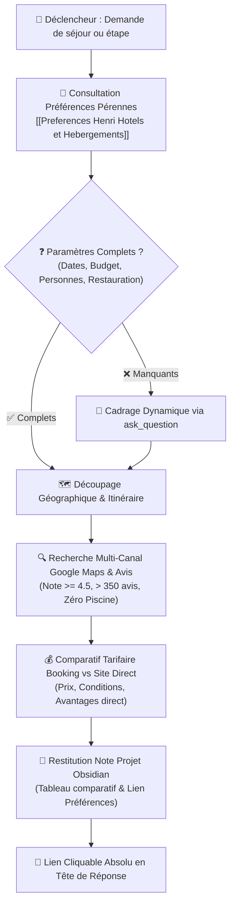

# 🏨 Comment le Skill Hotel-Scout Déniche-t-il les Hébergements d'Exception pour Henri ?



---

## 🏛️ Comment S'Articule le Socle de Préférences d'Henri ?

Avant toute démarche de recherche, l'agent **DOIT IMPÉRATIVEMENT** consulter la note maîtresse de référence du coffre Obsidian :
`[[Preferences Henri Hotels et Hebergements]]` (fichier `Preferences Henri Hotels et Hebergements.md`).

| Dimension | Spécification Canonique | Règle d'Or Opérationnelle |
| :--- | :--- | :--- |
| **Bâtisses & Matériaux** | Bâtisses anciennes de caractère, vieilles pierres de taille, poutres massives, tomettes. | Écarter toute construction moderne standardisée, hôtel de zone commerciale ou chaîne générique. |
| **Espaces & Ambiance** | Petit jardin intime arboré, cour intérieure fermée, cloître végétalisé, calme absolu. | Privilégier les maisons d'hôtes et auberges de charme à taille humaine (4 à 15 chambres). |
| **Invariant Équipement** | **ZÉRO PISCINE** | **Élimination formelle** des hôtels avec complexe aquatique, bassins bruyants ou ambiance resort de vacances. |
| **Restauration** | Goût prononcé pour la gastronomie de terroir et les circuits courts. | **Arbitrage dynamique obligatoire** : bistronomique, gastronomique, dîner libre extérieur ou petit-déj. |
| **Archétype de Référence** | Auberge de la Bersaudière à Nitry (89). | Modèle d'authenticité rurale, chaleur humaine sincère, sérénité et absence totale de bling-bling. |

---

## ❓ Comment Cadrer Dynamiquement le Besoin via `ask_question` ?

Si la requête initiale d'Henri ne précise pas l'intégralité des paramètres opérationnels, le superviseur **DOIT** poser une série de questions ciblées via `ask_question`.

| Paramètre Clé | Options Types | Pourquoi C'est Critique ? |
| :--- | :--- | :--- |
| **Objectif du séjour** | Étape repos (1 nuit) / Séjour découverte (2-4 nuits) / Retraite au calme (>4 nuits) | Détermine le niveau de confort requis et le rayon géographique acceptable. |
| **Participants** | Seul / En couple / Avec proches | Dimensionne le type de chambre (chambre double de charme, suite, configuration lits). |
| **Fourchette budgétaire** | Économique raisonnable (<120€/n) / Confort de charme (120-220€/n) / D'exception (>220€/n) | Évite les propositions hors-cible et calibre la recherche. |
| **Restauration souhaitée** | Table bistronomique sur place / Table gastronomique / Repas libre extérieur / Petit-déj impératif | Conditionne la présence d'une table d'hôtes ou d'un restaurant réputé dans l'établissement. |

---

## 🔍 Quel Est le Protocole de Prospection Multi-Canal Pas à Pas ?

### 1. 🗺️ Comment Découper l'Itinéraire et la Zone Géographique ?
- **Rayon de recherche** : Maximum 15 à 25 minutes de détour par rapport à l'axe routier principal si simple étape.
- **Cadre territorial** : Privilégier les villages préservés, hameaux ruraux, vallées et vignobles, à l'écart des voies rapides.

### 2. ⭐ Comment Filtrer Rigoureusement sur Google Maps ?
- **Note minimale** : $\ge 4.5 / 5$.
- **Seuil d'avis** : $> 350$ avis réels (garantie de constance du service dans le temps).
  * *Exception pépites rurales confidentielles* : Si une maison d'hôtes de charme exceptionnelle possède entre 80 et 350 avis, elle est admissible si et seulement si sa note est $\ge 4.8 / 5$ avec des éloges unanimes sur le calme, l'accueil et la bâtisse.
- **Analyse sémantique des avis négatifs / récents** :
  * Traquer les mots-clés éliminatoires : *"bruit"*, *"route bruyante"*, *"insonorisation"*, *"cris d'enfants"*, *"piscine bondée"*, *"climatisation bruyante"*.
  * Valider les mots-clés positifs : *"calme absolu"*, *"havre de paix"*, *"literie remarquable"*, *"vieilles pierres"*, *"petit jardin superbe"*, *"accueil chaleureux"*.

### 3. 💳 Comment Conduire le Comparatif Tarifaire Booking.com vs Site Officiel Direct ?
- **Vérification Booking.com** : Consulter les tarifs, conditions d'annulation (annulable sans frais privilégié) et typologies de chambres disponibles.
- **Vérification Site Officiel Direct** :
  * Consulter le moteur de réservation direct ou la page tarifs du propriétaire.
  * Comparer le prix net : le direct offre fréquemment $10\%$ à $15\%$ de réduction ou des avantages exclusifs (petit-déjeuner offert, surclassement, meilleure chambre avec vue jardin, pot d'accueil).
  * Préciser systématiquement les coordonnées directes (téléphone, email, URL officielle).

---

## 📑 Comment Restituer les Recommandations dans Obsidian ?

### 1. 📂 Où et Comment Créer la Note Projet Dédiée ?
- **Emplacement canonique** : `C:\Users\hjamet\Documents\VoiceNotes\Hôtel <Nom ou Destination>.md` (ou sous-dossier projet si séjour plus large).
- **Frontmatter YAML** :
  ```yaml
  ---
  tags:
    - projet
    - voyage
    - hotel
  type: selection_hotel
  destination: "<Ville ou Région>"
  dates: "<Dates envisagées>"
  statut: en_attente_arbitrage
  ---
  ```
- **Frontière étanche des liens** :
  * Dans la note Obsidian : Wikilinks natifs exclusifs `[[Preferences Henri Hotels et Hebergements]]` et `[[AutreNote]]`.
  * Dans le chat Antigravity : Lien Markdown absolu cliquable `[Hôtel Destination](file:///C:/Users/hjamet/Documents/VoiceNotes/Hôtel%20Destination.md)` en première ligne.

### 2. 📊 Quel Format de Tableau Comparatif Utiliser ?
La note projet doit contenir un tableau comparatif synthétique des 2 à 3 meilleures options sélectionnées :

| Établissement & Lieu | Style & Cadre | Note & Avis | Tarif Booking vs Direct | Restauration & Atouts | Points d'Attention |
| :--- | :--- | :--- | :--- | :--- | :--- |
| **[Nom Établissement]**<br/>Village (Dép.) | Vieilles pierres, cour arborée, bâtisse XVIIe | ⭐ 4.7/5 (420 avis) | Booking: 160€<br/>**Direct: 145€ + Pdj** | Table bistronomique terroir sur place | Parking gratuit sur place, calme total |

### 3. 🔄 Comment Enrichir l'Historique des Sélections Validées ?
Dès qu'Henri valide une réservation ou rentre d'un séjour réussi :
1. Mettre à jour la section `## 📜 Quel Est l'Historique des Sélections et Séjours Validés ?` dans `[[Preferences Henri Hotels et Hebergements]]`.
2. Consigner l'ancrage via `call_mcp_tool` (`remember`).
