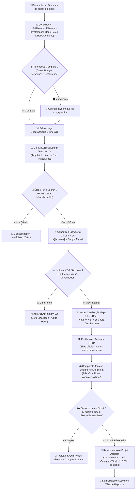

# 🏨 Comment le Skill Hotel-Scout Déniche-t-il les Hébergements d'Exception pour Henri ?



---

## 🏛️ Comment S'Articule le Socle de Préférences d'Henri ?

Avant toute démarche de recherche, l'agent **DOIT IMPÉRATIVEMENT** consulter la note maîtresse de référence du coffre Obsidian :
`[[Preferences Henri Hotels et Hebergements]]` (fichier `Preferences Henri Hotels et Hebergements.md`).

| Dimension | Spécification Canonique | Règle d'Or Opérationnelle |
| :--- | :--- | :--- |
| **Bâtisses & Matériaux** | Bâtisses anciennes de caractère, vieilles pierres de taille, poutres massives, tomettes. | Écarter toute construction moderne standardisée, hôtel de zone commerciale ou chaîne générique. |
| **Espaces & Ambiance** | Petit jardin intime arboré, cour intérieure fermée, cloître végétalisé, calme absolu. | Privilégier les maisons d'hôtes et auberges de charme à taille humaine (4 à 15 chambres). |
| **Invariant Équipement** | **ZÉRO PISCINE** | **Élimination formelle** des hôtels avec complexe aquatique, bassins bruyants ou ambiance resort de vacances. |
| **Détour Temporel Étape** | **$\Delta t \le 30\text{ min}$ MAXIMUM** | **Plafond dur et infranchissable** : tout établissement imposant $\Delta t > 30\text{ min}$ par rapport au trajet direct est **formellement disqualifié** d'office. |
| **Disponibilité Réelle** | **Audit en direct obligatoire** | **Vérification impérative** sur Booking / Direct aux dates exactes. Si 0 chambre libre : rejet immédiat en audit négatif (« Complet à date »). |
| **Restauration** | Goût prononcé pour la gastronomie de terroir et les circuits courts. | **Arbitrage dynamique obligatoire** : bistronomique, gastronomique, dîner libre extérieur ou petit-déj. |
| **Archétype de Référence** | Auberge de la Bersaudière à Nitry (89). | Modèle d'authenticité rurale, chaleur humaine sincère, sérénité et absence totale de bling-bling. |

---

## ❓ Comment Cadrer Dynamiquement le Besoin via `ask_question` ?

Si la requête initiale d'Henri ne précise pas l'intégralité des paramètres opérationnels, le superviseur **DOIT** poser une série de questions ciblées via `ask_question`.

| Paramètre Clé | Options Types | Pourquoi C'est Critique ? |
| :--- | :--- | :--- |
| **Objectif du séjour** | Étape repos (1 nuit) / Séjour découverte (2-4 nuits) / Retraite au calme (>4 nuits) | Détermine le niveau de confort requis, le rayon géographique et le calcul de détour $\Delta t$ ($\Delta t \le 30\text{ min}$ max). |
| **Participants** | Seul / En couple / Avec proches | Dimensionne le type de chambre (chambre double de charme, suite, configuration lits). |
| **Fourchette budgétaire** | Économique raisonnable (<120€/n) / Confort de charme (120-220€/n) / D'exception (>220€/n) | Évite les propositions hors-cible et calibre la recherche. |
| **Restauration souhaitée** | Table bistronomique sur place / Table gastronomique / Repas libre extérieur / Petit-déj impératif | Conditionne la présence d'une table d'hôtes ou d'un restaurant réputé dans l'établissement. |

---

## 🌐 Comment Orchestrer le Pilotage Browser et la Doctrine Fail-Stop (Zéro Simulation) ?

### 1. 🖥️ Comment Mobiliser Impérativement le Skill Browser pour Piloter Chrome et Google Maps ?
- **Délégation obligatoire au sous-agent dédié** :
  * Conformément aux directives de `[[browser]]` (`.agent/skills/browser/SKILL.md`), l'agent principal ne sature jamais son contexte d'exécution : il délègue le pilotage Chrome à un sous-agent dédié avec `TypeName: 'browser'` ou exploite les commandes directes de la passerelle `chrome_devtools`.
  * Le serveur `chrome_devtools` s'arrime directement à l'instance Chrome de bureau active d'Henri (réutilisation transparente des sessions authentifiées et cookies existants).
- **Pilotage de Google Maps dans Chrome** :
  * Navigation ciblée sur les fiches des établissements candidats au sein du secteur géographique déterminé.
  * Inspection visuelle rigoureuse des photographies authentiques (validation de la bâtisse historique, des poutres, de la cour pavée arborée, et vérification stricte de l'absence totale de piscine).
  * Examen cartographique satellite pour identifier les éventuelles nuisances environnementales masquées (voies ferrées, axes routiers à grand trafic, zones d'activité commerciale).
  * Analyse des avis récents bruts et vérification du volume total d'évaluations.

### 2. 🕵️ Comment Fouiller le Web en Profondeur via Outils HTTP et Agents Dédiés ?
L'agent mobilise activement les outils de consultation HTTP (`read_url_content`, requêtes web ciblées, agents d'exploration) pour approfondir l'investigation :
- **Sites officiels d'hôteliers / propriétaires** : Examen des descriptifs complets des chambres, de l'architecture historique, des prestations incluses et extraction des coordonnées de contact direct (téléphone, email direct sans intermédiaire).
- **Cartes et menus des restaurants** : Audit minutieux des propositions culinaires sur place (authenticité du terroir, circuits courts, fraîcheur des produits de saison, grille tarifaire et jours/heures d'ouverture).
- **Avis récents non filtrés** : Analyse chronologique resserrée sur les 3 à 6 derniers mois pour traquer tout incident opérationnel récent (travaux limitrophes, dégradation de service, nuisances sonores nocturnes, changement de propriétaire).
- **Politiques d'annulation et flexibilité** : Examen scrupuleux des conditions contractuelles (remboursement intégral sans frais, politique d'arrhes ou d'acompte, délais de prévenance).

### 3. 🛑 Quelle Est la Règle Absolue de Défaillance Fail-Stop (Zéro Simulation) ?
> [!CAUTION]
> **Doctrine de Vérité Absolue : Fail-Stop Immédiat & Zéro Simulation**
> Si le skill `browser` rencontre le moindre obstacle technique :
> - Navigateur Chrome de bureau non démarré
> - Port de débogage CDP inaccessible (ex: port 9222 fermé, connexion refusée ou timeout)
> - Blocage, crash ou déconnexion de la passerelle `chrome_devtools`
>
> **Consignes strictes et non négociables** :
> 1. **INTERDICTION FORMELLE d'extrapoler, d'inventer des métriques ou de simuler une navigation réussie** : Ne jamais prétendre avoir inspecté Google Maps, les avis ou les photographies si l'outil n'a pas restitué de données réelles brutes.
> 2. **ARRÊT IMMÉDIAT (Fail-Stop)** : Interrompre instantanément la prospection dès la détection de l'anomalie.
> 3. **Remontée transparente et précise à Henri** : Remonter immédiatement à Henri un diagnostic technique explicite (nature de l'erreur CDP, port concerné, état du navigateur) afin qu'il puisse intervenir (lancer Chrome avec `--remote-debugging-port=9222`, vérifier l'extension ou redémarrer le service) avant toute reprise d'investigation.

---

## 🔍 Quel Est le Protocole de Prospection Multi-Canal Pas à Pas ?

### 1. 🗺️ Comment Découper l'Itinéraire et Calculer le Surcoût de Détour Temporel ?
- **Étape sur itinéraire (trajet $A \to B$)** :
  * **Calcul systématique du surcoût de détour temporel $\Delta t$** :
    $$\Delta t = (t_{\text{Départ} \to \text{Hôtel}} + t_{\text{Hôtel} \to \text{Arrivée}}) - t_{\text{Trajet Direct}}$$
    où $t_{\text{Trajet Direct}}$ est la durée du trajet direct le plus rapide et fluide sans étape, et les durées avec étape correspondent aux temps de route réels via les axes routiers principaux.
  * **RÈGLE ABSOLUE DU DÉTOUR TEMPOREL MAXIMAL ($\Delta t \le 30\text{ min}$)** :
    > [!IMPORTANT]
    > **Plafond Dur Infranchissable de 30 Minutes & Disqualification d'Office** :
    > Lorsqu'un hôtel est recherché comme étape sur un trajet ($A \to B$) :
    > 1. Le surcoût de détour temporel $\Delta t$ doit être **STRICTEMENT INFÉRIEUR OU ÉGAL À 30 MINUTES MAXIMUM** ($\Delta t \le 30\text{ min}$).
    > 2. **30 minutes est un plafond dur et infranchissable**.
    > 3. Tout établissement imposant plus de 30 minutes de détour net par rapport au trajet direct ($\Delta t > 30\text{ min}$) est **FORMELLEMENT DISQUALIFIÉ** d'office, sans aucune dérogation possible, quelle que soit la beauté de la bâtisse.
  * **Graduation opérationnelle du détour** :
    - $\Delta t \le 15\text{ min}$ : **Optimal & indolore** — détour imperceptible préservant au maximum l'énergie d'Henri.
    - $15\text{ min} < \Delta t \le 25\text{ min}$ : **Acceptable** — zone de confort standard pour hébergement de caractère.
    - $25\text{ min} < \Delta t \le 30\text{ min}$ : **Tolérance limite** — admise uniquement si bâtisse ou table de terroir d'exception irremplaçable.
    - $\Delta t > 30\text{ min}$ : **DISQUALIFICATION IMMÉDIATE** — rejet d'office avant toute analyse détaillée.
  * **Affichage systématique** : Mentionner obligatoirement le $\Delta t$ en minutes dans le tableau comparatif et le résumé exécutif.
- **Séjour de destination (sans étape)** : Découpage selon le rayon d'attractivité géographique autour de la zone d'intérêt.
- **Cadre territorial** : Privilégier les villages préservés, hameaux ruraux, vallées et terroirs viticoles, à l'écart des voies rapides tout en respectant scrupuleusement $\Delta t \le 30\text{ min}$.

### 2. ⭐ Comment Filtrer Rigoureusement sur Google Maps ?
- **Note minimale** : $\ge 4.5 / 5$.
- **Seuil d'avis** : $> 350$ avis réels (garantie de constance du service dans le temps).
  * *Exception pépites rurales confidentielles* : Si une maison d'hôtes de charme exceptionnelle possède entre 80 et 350 avis, elle est admissible si et seulement si sa note est $\ge 4.8 / 5$ avec des éloges unanimes sur le calme, l'accueil et la bâtisse.
- **Analyse sémantique des avis négatifs / récents** :
  * Traquer les mots-clés éliminatoires : *"bruit"*, *"route bruyante"*, *"insonorisation"*, *"cris d'enfants"*, *"piscine bondée"*, *"climatisation bruyante"*.
  * Valider les mots-clés positifs : *"calme absolu"*, *"havre de paix"*, *"literie remarquable"*, *"vieilles pierres"*, *"petit jardin superbe"*, *"accueil chaleureux"*.

### 3. 💳 Comment Conduire le Comparatif Tarifaire Booking.com vs Site Officiel Direct ?
- **Vérification Booking.com** : Consulter les tarifs, conditions d'annulation (annulable sans frais privilégié) et typologies de chambres disponibles.
- **Vérification Site Officiel Direct** :
  * Consulter le moteur de réservation direct ou la page tarifs du propriétaire.
  * Comparer le prix net : le direct offre fréquemment $10\%$ à $15\%$ de réduction ou des avantages exclusifs (petit-déjeuner offert, surclassement, meilleure chambre avec vue jardin, pot d'accueil).
  * Préciser systématiquement les coordonnées directes (téléphone, email, URL officielle).

### 4. 🛏️ Comment Auditer Systématiquement la Disponibilité en Direct ?
> [!IMPORTANT]
> **RÈGLE ABSOLUE D'AUDIT DES DISPONIBILITÉS EN DIRECT** :
> Dès que les dates du séjour sont connues ou déduites, **INTERDICTION FORMELLE** de recommander un établissement sans avoir vérifié en direct sur les moteurs de réservation (Booking.com ou moteur officiel direct de l'hôtel) qu'au moins une chambre de la catégorie requise est **réellement libre et réservable** pour le nombre exact d'occupants.

- **Protocole de Contrôle des Disponibilités Réelles** :
  * **Vérification en direct aux dates exactes** : Dès que les dates d'arrivée et de départ sont arrêtées ou estimées, effectuer la requête en direct sur Booking.com et/ou sur le moteur de réservation officiel de l'établissement pour la configuration d'occupants requise.
  * **Mention obligatoire de la chambre & du stock** :
    - Préciser la **catégorie exacte** de chambre disponible (ex: *« Chambre Double Supérieure avec lit King-size »*, *« Suite Junior »*).
    - Indiquer systématiquement le **stock résiduel** si mentionné sur la plateforme (ex: *« 2 chambres restantes à ce tarif »*, *« Dernière chambre disponible »*).
  * **Bascule immédiate des complets dans l'Audit Négatif** :
    - Si un établissement est complet pour les dates demandées (zéro chambre disponible ou restrictions de séjour minimum non satisfaites), **interdiction formelle** de le présenter dans la sélection principale recommandée.
    - Le basculer immédiatement dans le **Tableau d'Audit Négatif / Éliminations** avec la mention explicite **« Complet à date »**, la date du contrôle et le moteur vérifié, évitant ainsi à Henri de perdre son temps sur des options indisponibles.

---

## 📑 Comment Restituer les Recommandations dans Obsidian ?

### 1. 📂 Où et Comment Créer la Note Projet Dédiée ?
- **Emplacement canonique** : `C:\Users\hjamet\Documents\VoiceNotes\Hôtel <Nom ou Destination>.md` (ou sous-dossier projet si séjour plus large).
- **Frontmatter YAML** :
  ```yaml
  ---
  tags:
    - projet
    - voyage
    - hotel
  type: selection_hotel
  destination: "<Ville ou Région>"
  dates: "<Dates envisagées>"
  statut: en_attente_arbitrage
  ---
  ```
- **Frontière étanche des liens** :
  * Dans la note Obsidian : Wikilinks natifs exclusifs `[[Preferences Henri Hotels et Hebergements]]` et `[[AutreNote]]`.
  * Dans le chat Antigravity : Lien Markdown absolu cliquable `[Hôtel Destination](file:///C:/Users/hjamet/Documents/VoiceNotes/Hôtel%20Destination.md)` en première ligne.

### 2. 📊 Quel Format de Tableau Comparatif Utiliser ?
La note projet doit contenir un tableau comparatif synthétique des 2 à 3 meilleures options sélectionnées, incluant systématiquement la colonne de détour temporel $\Delta t$ dès qu'il s'agit d'une étape sur itinéraire ainsi que la validation de la disponibilité réelle en direct :

| Établissement & Lieu | Style & Cadre | Détour Temporel $\Delta t$ (si étape, $\le 30\text{ min}$) | Disponibilité Validée & Catégorie | Note & Avis | Tarif Booking vs Direct | Liens Cliquables (Trio Obligatoire) | Points d'Attention |
| :--- | :--- | :--- | :--- | :--- | :--- | :--- | :--- |
| **[Nom Établissement]**<br/>Village (Dép.) | Vieilles pierres, cour arborée, bâtisse XVIIe | **+18 min**<br/>(4h45 vs 4h27 direct) | ✅ **Libre** (Double Supérieure, 2 restantes) | ⭐ 4.7/5 (420 avis) | Booking: 160€<br/>**Direct: 145€ + Pdj** | [Avis Google Maps](https://maps.google.com/...)<br/>[Site Officiel Direct](https://...)<br/>[Fiche Booking.com](https://booking.com/...) | Parking gratuit sur place, calme total |

#### 🚫 Quel Format de Tableau d'Audit Négatif Utiliser pour les Établissements Complets ou Disqualifiés ?
Tout établissement éliminé au cours de la prospection (notamment pour indisponibilité aux dates exactes ou dépassement de détour) doit figurer dans le tableau d'audit négatif pour transparence intégrale :

| Établissement & Lieu | Motif d'Élimination | Date d'Audit & Constat Direct |
| :--- | :--- | :--- |
| **Auberge de la Rivière** (Foncine-le-Haut) | **Complet à date** | Vérifié le 03/09/2026 sur Booking.com & Direct : 0 chambre disponible pour le 06-07/09/2026 |
| **[Autre Établissement]** | Détour excessif ($\Delta t = +38\text{ min}$) | Dépassement du plafond dur infranchissable de 30 min |

### 3. 🌐 Pourquoi le Trio de Liens Cliquables Est-il Systématiquement Obligatoire ?
Pour chaque établissement recommandé, tant dans la note projet Obsidian que dans la restitution du chat, l'agent **DOIT SYSTÉMATIQUEMENT** fournir le trio complet de liens cliquables :
1. **Lien Google Maps direct** : Consultation immédiate des avis récents, des photos réelles de la bâtisse et vérification de la vue satellite.
2. **Lien vers le Site Officiel direct** : Réservation directe auprès de l'hôtelier/hôte au tarif garanti le plus bas (sans commission OTA) et bénéfice des avantages exclusifs (petit-déjeuner, surclassement).
3. **Lien Booking.com** : Comparaison immédiate des disponibilités, conditions d'annulation et flexibilité tarifaire.

### 4. ⏱️ Comment Calculer et Présenter le Surcoût de Détour Temporel sur un Trajet A -> B ?
Lorsqu'un hébergement est recherché dans le cadre d'une étape sur un itinéraire routier :
- **Formule de calcul** :
  $$\Delta t = (t_{\text{Départ} \to \text{Hôtel}} + t_{\text{Hôtel} \to \text{Arrivée}}) - t_{\text{Trajet Direct}}$$
- **Données obligatoires à mentionner** :
  * Durée du trajet direct de référence sans étape ($t_{\text{Trajet Direct}}$).
  * Durée cumulée du trajet passant par l'établissement ($(t_{\text{Départ} \to \text{Hôtel}} + t_{\text{Hôtel} \to \text{Arrivée}})$).
  * Différentiel net sous la forme `Détour temporel : +XX min` (avec validation expresse du critère $\Delta t \le 30\text{ min}$).
- **Règle d'arbitrage et plafond infranchissable** :
  * **$\Delta t \le 30\text{ min}$ (Plafond dur absolu)** : Seuls les établissements respectant strictement ce plafond sont admissibles et présentés.
  * **$\Delta t > 30\text{ min}$ (Disqualification formelle d'office)** : Ne JAMAIS inclure ni proposer à Henri un hôtel excédant 30 minutes de détour net par rapport au tracé direct, même en cas de coup de cœur architectural.
  * Pour les options se situant entre 25 et 30 minutes, expliciter impérativement la valeur ajoutée exceptionnelle justifiant d'approcher le plafond critique.

### 5. 🔄 Comment Enrichir l'Historique des Sélections Validées ?
Dès qu'Henri valide une réservation ou rentre d'un séjour réussi :
1. Mettre à jour la section `## 📜 Quel Est l'Historique des Sélections et Séjours Validés ?` dans `[[Preferences Henri Hotels et Hebergements]]`.
2. Consigner l'ancrage via `call_mcp_tool` (`remember`).
