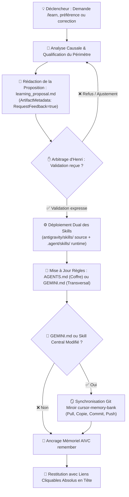
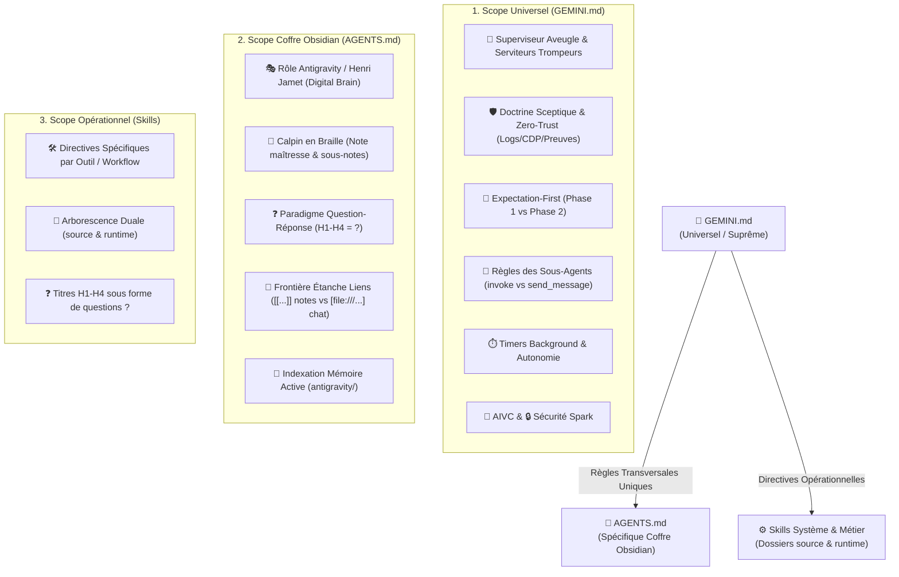
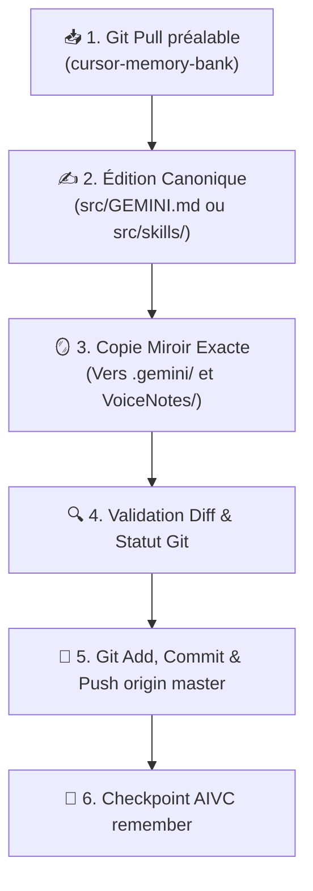

# 🧠 Comment le Protocole Learn (/learn) Intègre-t-il les Compétences et Préférences Pérennes d'Henri ?



---

## 🎯 Pourquoi et Quand Déclencher le Protocole Learn ?

Le skill `learn` s'active systématiquement dès qu'une information, un comportement, une préférence ou une directive a vocation à devenir **pérenne** dans l'écosystème d'Henri Jamet, ou lors de l'appel explicite de la commande `/learn`.

| Déclencheur / Cas d'Usage | Exemple Concret | Périmètre Cible | Livrable Attendu |
| :--- | :--- | :--- | :--- |
| **Préférence personnelle durable** | Préférences d'hébergement, goûts de voyage, choix d'outils, habitudes de travail. | Coffre Obsidian (`Preferences Henri...md`) | Note de référence Obsidian dédiée + wikilinks. |
| **Création d'un nouveau Skill** | Nouveau workflow automatisé (`hotel-scout`, `stitch`, etc.). | Arborescence duale des skills | `antigravity/skills/<nom>/SKILL.md` ET `.agent/skills/<nom>/SKILL.md`. |
| **Correction d'une dérive d'agent** | Violation de la cécité du superviseur, hallucination, omission de preuves CDP. | `GEMINI.md` (universel) | Refactoring organique dans la section concernée de `GEMINI.md`. |
| **Spécificité du coffre Obsidian** | Convention de nommage, arborescence des notes, plugins locaux (`project-memory`). | `AGENTS.md` (coffre local) | Mise à jour de `VoiceNotes/AGENTS.md`. |
| **Désynchronisation miroir Git** | Écart entre l'environnement local et le dépôt de sauvegarde. | `cursor-memory-bank` | Git pull -> synchro miroir -> commit & push origin master. |

---

## 🏛️ Comment S'Articule la Frontière Étanche des Règles Système ?

La cohérence globale repose sur une séparation stricte et étanche des périmètres d'instruction (Principe DRY absolu).



| Fichier / Entité | Emplacement Canonique | Périmètre Exclusif | Ce Qui y Est STRICTEMENT INTERDIT |
| :--- | :--- | :--- | :--- |
| **`GEMINI.md`** | `C:\Users\Jamet\.gemini\GEMINI.md`<br/>`cursor-memory-bank/src/GEMINI.md` | **Règles universelles transversales** : Superviseur Aveugle, Serviteurs Trompeurs, Zero-Trust, Expectation-First, sous-agents, timers, Spark, AIVC. | Spécificités locales d'un coffre (chemins de notes, rôles métiers contextuels), empilement en bas de fichier. |
| **`AGENTS.md`** | `C:\Users\Jamet\Documents\VoiceNotes\AGENTS.md` | **Spécificités locales du coffre Obsidian** : Rôle d'Antigravity auprès d'Henri, Calpin en Braille, Paradigme Q/R, wikilinks internes (`[[...]]` et `![[...]]`). | Recopier ou paraphraser les règles transversales de `GEMINI.md`, utiliser des liens markdown standards dans les notes. |
| **`SKILL.md`** | `antigravity/skills/<nom>/`<br/>`.agent/skills/<nom>/` | **Directives opérationnelles d'un workflow ciblé** : Commandes CLI, checklists, schémas Mermaid et étapes d'un outil précis. | Redéfinir l'architecture globale ou contredire les règles de `GEMINI.md`. |

---

## 🌲 Comment Fonctionne l'Arborescence Duale des Skills ?

Pour garantir à la fois la **persistance locale** dans le Digital Brain d'Henri et la **découverte automatique** par le runtime de l'agent, tout skill doit exister en miroir dans deux répertoires :

| Rôle du Répertoire | Chemin Absolu | Fonction Système |
| :--- | :--- | :--- |
| **Dossier Source (Vault)** | `C:\Users\hjamet\Documents\VoiceNotes\antigravity\skills\<nom>\SKILL.md` | Version canonique source archivée avec le coffre Obsidian et synchronisée. |
| **Dossier Runtime (Agent)** | `C:\Users\hjamet\Documents\VoiceNotes\.agent\skills\<nom>\SKILL.md` | Version exécutable découverte et chargée par le moteur d'agent Antigravity. |
| **Miroir Git (Optionnel)** | `C:\Users\hjamet\Documents\code\cursor-memory-bank\src\skills\<nom>\SKILL.md` | Dépôt distant de sauvegarde pour les skills transversaux réutilisables. |

- **[Règle de Parité Stricte]** : Lors de la création ou de la mise à jour d'un skill, le contenu écrit dans le dossier source et le dossier runtime doit être **rigoureusement identique au caractère près**.
- **[Zéro Fichier Orphelin]** : Aucun skill ne doit être présent dans le runtime sans son pendant dans le dossier source du coffre.

---

## 📑 Quel Est le Workflow de Proposition Préalable Obligatoire (`learning_proposal.md`) ?

Pour éviter toute modification intempestive ou dérive silencieuse des règles directrices, le superviseur **DOIT OBLIGATOIREMENT** soumettre une proposition formelle avant d'appliquer des changements aux fichiers maîtres.

### 1. 📝 Comment Rédiger l'Artéfact de Proposition (learning_proposal.md) ?
- **Chemin** : `<appDataDir>\brain\<conversation-id>/learning_proposal.md`
- **Métadonnées** : `ArtifactMetadata: { RequestFeedback: true, UserFacing: true, Summary: "..." }`
- **Structure de l'Artéfact** :
  1. `# Proposition d'Apprentissage / Refactorisation (/learn)`
  2. `## 🎯 Quel Est le Contexte & Diagnostic ?`
  3. `## 📂 Quels Sont les Fichiers Ciblés & Périmètres ?`
  4. `## 📝 Quel Est le Diff Prévisionnel ou Contenu Proposé ?`
  5. `## 🛡️ Comment l'Audit DRY & Non-Régression Est-il Garanti ?`

### 2. ✋ Pourquoi Attendre la Validation Explicite d'Henri Avant Toute Action ?
- L'agent s'arrête et présente la proposition à Henri de manière concise dans le chat avec un lien cliquable vers l'artéfact.
- **INTERDIT d'écrire dans les fichiers cibles** avant qu'Henri n'ait cliqué sur le bouton de validation ("Proceed") ou confirmé textuellement son approbation.

### 3. ⚙️ Comment Déployer et Appliquer les Modifications Approuvées ?
- Dès approbation reçue, l'agent procède à l'écriture chirurgicale des fichiers.
- Si un skill est impliqué, il applique la règle d'arborescence duale.
- Si une note Obsidian est créée, il respecte le Paradigme Q/R et la frontière étanche des liens.

---

## 🪞 Comment Gérer la Synchronisation Miroir Git avec `cursor-memory-bank` ?

Dès qu'une modification touche **`GEMINI.md`** ou un **skill transversal partagé**, la procédure de synchronisation Git avec le dépôt de référence `cursor-memory-bank` s'applique immédiatement.



### 1. 💻 Quelles Sont les Commandes Opérationnelles de Synchronisation Git ?
```powershell
# Se positionner dans le dépôt miroir
cd C:\Users\hjamet\Documents\code\cursor-memory-bank

# 1. Pull préalable pour intégrer les évolutions distantes
git pull origin master

# 2. Après édition ou copie des fichiers modifiés dans src/ :
git status
git add src/ AGENTS.md
git commit -m "docs(rules): update system instructions and learn protocol"
git push origin master
```

### 2. 🔍 Comment Vérifier la Concordance et Sceller l'Empreinte AIVC ?
- Vérifier que `C:\Users\hjamet\.gemini\GEMINI.md` et `cursor-memory-bank\src\GEMINI.md` sont strictement identiques octet par octet.
- Enregistrer immédiatement l'empreinte de la mise à jour via `call_mcp_tool(remember)`.

---

## 🛡️ Quelles Sont les Règles d'Or d'Intégration Organique et Anti-Bloat ?

- **[Intégration Organique (Anti-Empilement)]** : INTERDIT d'ajouter des règles en vrac en fin de document. Toute nouvelle consigne doit être fusionnée chirurgicalement dans la section thématique appropriée.
- **[Style Télégraphique & Concision Chirurgicale]** : Éliminer tout verbiage narratif. Privilégier les tableaux synthétiques Markdown, les schémas Mermaid et les puces clé-valeur `**[Clé]** : [Valeur]`.
- **[Frontière Étanche des Liens]** :
  * Dans les notes Obsidian (`.md` du coffre) : Utiliser exclusivement les wikilinks natifs `[[Nom de la note]]` et `![[Média]]`.
  * Dans le chat Antigravity et les livrables : Utiliser impérativement des liens Markdown absolus cliquables `[Nom](file:///...)` placés en première ligne de réponse.
- **[Respect de la Trinité Canonique des Modèles 2026]** : Biais de date de coupure formellement proscrit. Respecter impérativement les identifiants officiels : `google/gemini-3.7-flash`, `deepseek/deepseek-v4-pro`, `meta/muse-glimmer`.
- **[Paradigme Question-Réponse]** : 100% des titres H1 à H4 des notes Obsidian et des fichiers `SKILL.md` doivent obligatoirement être rédigés sous la forme d'une question directe se terminant par un point d'interrogation `?`.

---

## 📋 Quelle Est la Checklist de Validation & d'Intégrité Learn ?

- [ ] **Proposition Préalable Formellement Validée** : L'artéfact `learning_proposal.md` a été créé avec `RequestFeedback: true` et validé par Henri avant modification.
- [ ] **Frontière Étanche Respectée** : Les règles transversales sont dans `GEMINI.md` ; les spécificités du coffre sont dans `AGENTS.md` ; les workflows sont dans les skills dédiés (DRY absolu).
- [ ] **Arborescence Duale des Skills Conforme** : Tout nouveau skill existe à l'identique dans `antigravity/skills/<nom>/SKILL.md` ET `.agent/skills/<nom>/SKILL.md`.
- [ ] **Intégration Organique & Zero-Bloat** : Aucune consigne empilée en fin de fichier ; refactorisation dense et chirurgicale au cœur des sections existantes.
- [ ] **Paradigme Question-Réponse (Q/R)** : 100% des titres H1-H4 se terminent par `?`.
- [ ] **Frontière Étanche des Liens** : Wikilinks `[[...]]` dans les notes du coffre, liens cliquables `[Nom](file:///...)` en tête de chat.
- [ ] **Synchronisation Git Miroir Effectuée** : Si `GEMINI.md` ou un skill central a été modifié, `cursor-memory-bank` est synchronisé, commité et poussé sur master.
- [ ] **Mémoire AIVC Consignée** : Un checkpoint mémoriel dense a été enregistré via `remember` avec `read_files` et `edited_files` renseignés.
