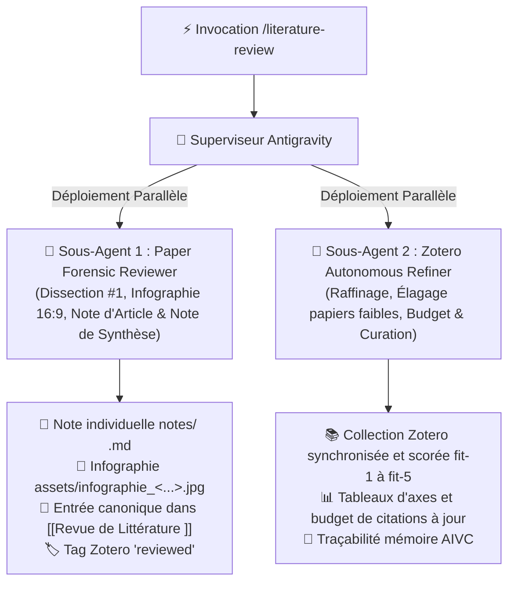

---
name: literature-review
description: "Moteur unifié de revue de littérature académique, création et synchronisation continue Zotero & Obsidian pour Henri Jamet. À chaque invocation, déploie simultanément deux sous-agents : (1) Paper Forensic Reviewer pour la dissection médico-légale de l'article prioritaire, génération de l'infographie 16:9, création de la note d'article et alimentation de la note de synthèse Markdown [[Revue de Littérature NomDuProjet]] (format Canvas formellement abandonné), et (2) Zotero Autonomous Refiner pour l'élagage, le raffinage qualitatif (budget de citations, CORE A*/Q1 vs arXiv, suppression des doublons/papiers faibles) et la synchronisation continue Zotero / Obsidian."
---

# 📚 Skill : Unified Autonomous Literature Review, Zotero Curation & Obsidian Synthesis Engine

Ce skill unifié orchestre l'intégralité du cycle de vie de la recherche bibliographique scientifique pour tout projet de recherche d'Henri Jamet, en combinant la **création et synchronisation bilatérale de la bibliothèque Zotero** et la **revue médico-légale article par article centralisée dans la note de synthèse Markdown Obsidian `notes/Revue de Littérature [Nom du Projet].md`**.

> [!IMPORTANT]
> **Abandon Formel du Format Canvas (.canvas) dans Obsidian :**
> Le format Canvas (`.canvas`) est **formellement et définitivement abandonné** dans tout le coffre Obsidian car jugé trop lourd, lent et peu maniable pour les graphes denses de littérature.
> Il est **remplacé à 100% par la note de synthèse Markdown vivante : `notes/Revue de Littérature [Nom du Projet].md`**, qui doit **TOUJOURS être explicitement liée à la note maîtresse du projet associée (`[[NomDuProjet]]`)**.

> [!CAUTION]
> **Interdiction Absolue des Fichiers `.bib` dans le Coffre Obsidian :**
> Il est **strictement interdit** d'écrire, créer ou déposer des fichiers `.bib` dans le coffre Obsidian (`notes/`, `antigravity/`, `antigravity/scratch/`, racine, etc.).
> Toute la gestion bibliographique, la curation des références, les métadonnées et les clés de citation s'effectuent **EXCLUSIVEMENT via Zotero** (via la base de données Zotero et l'API `pyzotero`). Aucun fichier `.bib` ne doit jamais polluer le coffre Obsidian.

---

## ⚡ Architecture d'Exécution : Déploiement Dual de 2 Sous-Agents

Dès que Henri invoque `/literature-review` (ou demande une revue de littérature / un point d'étape bibliographique), Antigravity (Superviseur) **déploie obligatoirement 2 sous-agents spécialisés en parallèle** :



---

## 🔬 Mission du Sous-Agent 1 : Paper Forensic Reviewer (Article #1)

Le **Sous-Agent 1** se concentre exclusivement sur la dissection médico-légale approfondie d'**un unique article prioritaire** :

1. **Détection & Sélection de la Cible** :
   - Identifier la collection Zotero du projet et la note de synthèse Markdown correspondante (`notes/Revue de Littérature [Nom du Projet].md`).
   - Vérifier la présence du lien vers la note du projet (`[[NomDuProjet]]`).
   - Filtrer les articles de la collection Zotero qui ne sont **pas encore revus** (tag `reviewed` absent dans Zotero ou article non encore inséré dans la note de synthèse).
   - *Condition d'arrêt* : Si tous les articles sont déjà traités, s'arrêter proprement en notifiant que la file de lecture est 100% à jour.
   - Retenir l'article ayant le score de pertinence le plus élevé (**`fit-5` en priorité absolue**, puis `fit-4`).
2. **Téléchargement & Analyse Complète du PDF** :
   - Localiser et analyser le **PDF intégral / texte complet** (via ScienceDirect, arXiv, Semantic Scholar, CrossRef ou recherche web).
   - Ne jamais se contenter de l'abstract : disséquer le protocole expérimental, les jeux de données, les analyses quantitatives/qualitatives, et les discussions réelles de la communauté.
3. **Génération Systématique de l'Infographie Visuelle (Haute Résolution 16:9)** :
   - Concevoir et générer via `generate_image` une infographie synthétique propre et structurée en 5 panneaux :
     1. *Question de recherche & Thèse centrale*
     2. *Méthode & Architecture du système*
     3. *Résultats empiriques clés & Métriques*
     4. *Débats médico-légaux des pairs & Limites réelles*
     5. *Acquis réutilisables & Synergies projet*
   - Copier l'infographie dans `assets/infographie_<nom_court>.jpg`.
4. **Rédaction de la Note Permanente Individuelle Obsidian (`notes/<Année> <Titre>.md`)** :
   - Créer directement la note **`notes/<Année> <Titre Court ou Titre de l'article>.md`** en Français.
   - **Règles Strictes de Nommage** :
     * **JAMAIS** de préfixe *"Revue"* ni *"Revue médico-légale"*.
     * **JAMAIS** de nom d'auteur dans le nom de fichier (les auteurs figurent dans le frontmatter et le tableau de métadonnées).
     * Format exact : **`<Année> <Titre de l'article>.md`** (avec des espaces, sans underscores `_` ni tirets `-`, ex: `notes/2024 GraphRAG From Local to Global.md`, `notes/2024 Multiagent Debate.md`).
   - **Structure Intérieure Obligatoire** :
     1. **Titre H1** : `# 📄 <Année> — <Titre Officiel de l'Article>`
     2. **Infographie Visuelle** : Insérée **immédiatement sous H1** : `![[infographie_<nom_court>.jpg]]`.
     3. **Bloc `> [!IMPORTANT]` (ZÉRO redite de métadonnées, ZÉRO abstract brut)** : Synthèse & Intuition centrale du papier (verrou scientifique, approche/solution, illustrations concrètes).
     4. **Section 1. Fiche d'Identité & Profil de la Venue** : Tableau des métadonnées (Auteurs, Affiliations, Publication, Rang CORE / IF, DOI/URL, Fit score, profil thématique).
     5. **Sections Analytiques Suivantes** :
        - *2. Thèse Centrale & Pipeline / Architecture Technique*
        - *3. Résultats Empiriques & Benchmarks Quantitatifs*
        - *4. Examen Médico-Légal, Débats des Pairs & Limites Réelles (Anti-Complaisance)*
        - *5. Acquis Réutilisables & Synergies avec [[NomDuProjet]]*
        - *6. Références Croisées & Connexions Vault*
5. **Alimentation de la Note de Synthèse Markdown (`notes/Revue de Littérature [Nom du Projet].md`)** :
   - **Abandon Formel du Canvas** : Aucun fichier `.canvas` ne doit être généré.
   - La note de synthèse `notes/Revue de Littérature [Nom du Projet].md` doit **TOUJOURS être liée à la note du projet associée (`[[NomDuProjet]]`)**.
   - Pour chaque article validé et analysé, insérer l'entrée selon la **structure canonique obligatoire** :
     ```markdown
     # [[Lien vers la note produite pour l'article]]

     ![[Infographie générée pour expliquer l'article]]
     ```
     suivi immédiatement de la **synthèse médico-légale** et des **métriques** :
     ```markdown
     ### 📊 Métriques & Profil de Publication
     - **Venue & Rang** : <Conférence/Journal> (<CORE A* / CORE A / Q1>)
     - **Citations & Score** : <Nombre de citations>, Score : `<fit-X>`
     - **Métriques quantitatives** : Taille échantillon $N$, Accuracy, $F_1$, baselines battues, gains mesurés

     ### ⚖️ Synthèse Médico-Légale & Limites
     - **Intuition & Verrou** : Problème fondamental résolu et intuition directrice
     - **Limites réelles & Biais** : Faiblesses expérimentales, limites méthodologiques admises, surcoûts et critiques des pairs

     ### 🚀 Synergie & Impact pour [[NomDuProjet]]
     - **Acquis réutilisables** : Ce sur quoi notre projet s'appuie directement sans refaire le travail
     - **Différenciation** : Articulation exacte et positionnement vis-à-vis de notre contribution
     ```
6. **Synchronisation Zotero, Obsidian & AIVC** :
   - **Création et Synchronisation Zotero ↔ Obsidian** :
     * Mettre à jour l'item Zotero via `pyzotero` avec les tags `reviewed`, `fit-X` et le chemin/URL du PDF.
     * Aligner les métadonnées (titre exact, auteurs, DOI, année) entre la bibliothèque Zotero et la fiche Obsidian.
     * Rappel : Zéro export `.bib` dans le coffre ; Zotero demeure la base centrale exclusive.
   - Sauvegarder l'article dans Readwise Reader avec l'URL directe du PDF si pertinent.
   - Consigner le jalon dans la mémoire AIVC (`remember`).

---

## 🧹 Mission du Sous-Agent 2 : Zotero Autonomous Refiner & Curator

Le **Sous-Agent 2** assure l'entretien qualitatif, le filtrage, le désherbage et la synchronisation continue de la bibliothèque Zotero du projet avec les notes Obsidian :

1. **Philosophie de Curation & Budgets de Citations** :
   - L'objectif n'est **PAS d'empiler aveuglément des articles**, mais de maintenir une bibliographie affûtée et irréprochable :
     * **Papier standard (Empirique / Computationnel)** : **$\approx 40$ à $60$ citations au maximum**.
     * **Revue de Littérature / Survey (ex: ACM CSUR)** : **$\approx 150$ à $250$ citations au maximum**.
2. **Audit & Élagage Actif des Papiers Faibles / Redondants** :
   - Examiner en priorité les articles **qui ne sont PAS encore analysés** dans la note de synthèse (non tagués `reviewed` dans Zotero).
   - *Papiers sujets à révision ou suppression* :
     * Articles avec scores faibles (`fit-3`, `fit-2`, `fit-1`).
     * Articles faiblement cités sans apport méthodologique unique.
     * Préprints arXiv non évalués par les pairs (sauf s'ils sont devenus des standards de fait hautement cités comme *GraphRAG* ou *Llama*).
     * Papiers hors des conférences cibles de rang mondial (**CORE A\*** / **CORE A**) ou revues **Q1**.
     * Doublons ou versions antérieures obsolètes.
   - *Sanctuarisation* : **Les articles déjà intégrés dans la note de synthèse Markdown `[[Revue de Littérature NomDuProjet]]` (tagués `reviewed`) sont actés comme validés et ne doivent JAMAIS être supprimés.**
3. **Synergie avec l'Analyse du Sous-Agent 1** :
   - Identifier les références clés citées par l'article actuellement en cours d'analyse par le Sous-Agent 1.
   - Rechercher les baselines concurrentes ou les cadres théoriques connexes pour combler les manques immédiats de la taxonomie.
4. **Recherche Multi-Sources & Attribution des Scores `fit-1` à `fit-5`** :
   - Interroger Consensus, DBLP, Semantic Scholar et Google Scholar.
   - Aligner la sélection sur les attentes méthodologiques et l'audience de la venue cible (ex: ACM CSUR, AAAI, WWW, ACL, EMNLP).
   - Appliquer les métadonnées et scores normalisés directement dans Zotero via `pyzotero` (zéro export `.bib` dans le coffre).
5. **Mise à Jour de la Cartographie & Synchronisation Obsidian** :
   - Mettre à jour les tableaux d'axes dans la note de synthèse `notes/Revue de Littérature [Nom du Projet].md` (liée à `[[NomDuProjet]]`).
   - Assurer l'exactitude des liens Obsidian `[[...]]` et la cohérence avec les collections Zotero.
   - Consigner le jalon de curation dans la mémoire AIVC (`remember`).

---

## 🎯 Système Normalisé de Scoring (`fit-1` à `fit-5`)

| Score | Tag Zotero | Définition & Rôle dans le Projet | Critères d'Attribution |
| :--- | :--- | :--- | :--- |
| **`fit-5`** | `fit-5` | **Papier Fondateur / Rupture Majeure** | Article pivot définissant un axe entier ou résolvant un gap critique (ex: *GraphRAG*, *Multiagent Debate*). |
| **`fit-4`** | `fit-4` | **Papier Très Pertinent** | Benchmark solide, étude empirique de premier plan ou framework majeur (CORE A* / Q1). |
| **`fit-3`** | `fit-3` | **Papier Secondaire / Contexte** | Contexte théorique utile ou baseline historique classique. Sujet à élagage si le quota approche du plafond. |
| **`fit-2`** | `fit-2` | **Faible Pertinence** | Lien tangentiel ou méthodologie fragile. À élaguer prioritairement. |
| **`fit-1`** | `fit-1` | **Hors Scope** | À supprimer immédiatement de la collection Zotero. |

---

## 🔒 Principes Directeurs Fondamentaux

1. **Zéro Fichier `.bib` dans le Coffre** : Gestion bibliographique exclusive et centralisée dans Zotero (via `pyzotero`). Aucun `.bib` dans `notes/`, `antigravity/` ou `scratch/`.
2. **Abandon Formel du Format Canvas (.canvas)** : Les fichiers `.canvas` sont proscrits en raison de leur lourdeur. Toute la cartographie repose exclusivement sur la note Markdown `notes/Revue de Littérature [Nom du Projet].md`.
3. **Lien Systématique vers le Projet Associé** : La note de synthèse doit TOUJOURS inclure en tête le lien wikilink vers sa note maîtresse de projet : `[[NomDuProjet]]`.
4. **Structure Canonique d'Article dans la Synthèse** :
   ```markdown
   # [[Lien vers la note produite pour l'article]]

   ![[Infographie générée pour expliquer l'article]]
   ```
   suivi de la synthèse médico-légale et des métriques quantitatives.
5. **Création & Synchronisation Bilatérale Zotero ↔ Obsidian** : Enrichissement mutuel continu des fiches du coffre et de la base Zotero.
6. **Anti-Complaisance (Anti-Sycophancy)** : Rigueur médico-légale pure dans les notes de revue (mettre en lumière les vrais surcoûts, limites d'extraction et biais).

---

## 📑 Structure Canonique de la Note de Synthèse Markdown (`notes/Revue de Littérature [Nom du Projet].md`)

```markdown
---
title: "Revue de Littérature — <Nom du Projet>"
project: "[[<NomDuProjet>]]"
tags:
  - literature-review
  - <NomDuProjet>
  - zotero-synced
---

# 📚 Revue de Littérature : [[<NomDuProjet>]]

> [!NOTE]
> **Note Maîtresse du Projet :** [[<NomDuProjet>]]  
> **Collection Zotero :** `<NomDuProjet>`  
> **Budget de Citations :** <X> articles validés / cible <Quota> citations.

---

## 🗺️ Cartographie & Distribution des Axes

| Axe Thématique | Papiers Fondateurs (`fit-5`) | Baselines Majeures (`fit-4`) | Contexte (`fit-3`) |
| :--- | :--- | :--- | :--- |
| **Axe 1 : <Thème>** | [[notes/2024 Papier A|Papier A]] | [[notes/2023 Papier B|Papier B]] | [[notes/2022 Papier C|Papier C]] |
| **Axe 2 : <Thème>** | [[notes/2024 Papier D|Papier D]] | [[notes/2024 Papier E|Papier E]] | ... |

---

## 🔬 Analyses Médico-Légales des Articles Validés

# [[notes/<Année> <Titre de l Article 1>|<Année> <Titre de l'Article 1>]]

![[assets/infographie_<nom_court_1>.jpg]]

### 📊 Métriques & Profil de Publication
- **Venue & Rang** : <Venue> (<CORE A* / CORE A / Q1>)
- **Citations & Fit** : <Citations>, Score : `<fit-5>`
- **Métriques clés** : $N = \dots$, Acc = $\dots$, gains de $+X\%$ vs baseline

### ⚖️ Synthèse Médico-Légale & Limites
- **Intuition & Verrou** : <Explication concise du problème et de la solution>
- **Limites réelles & Biais** : <Limites admises, surcoût computationnel, manques empiriques>

### 🚀 Synergie & Impact pour [[<NomDuProjet>]]
- **Acquis réutilisables** : <Ce que l'on intègre directement>
- **Différenciation** : <Où se situe notre valeur ajoutée>

---

# [[notes/<Année> <Titre de l Article 2>|<Année> <Titre de l'Article 2>]]

![[assets/infographie_<nom_court_2>.jpg]]

### 📊 Métriques & Profil de Publication
- **Venue & Rang** : <Venue> (<CORE A* / CORE A / Q1>)
- **Citations & Fit** : <Citations>, Score : `<fit-4>`
- **Métriques clés** : Benchmark standard, métriques comparatives

### ⚖️ Synthèse Médico-Légale & Limites
- **Intuition & Verrou** : ...
- **Limites réelles & Biais** : ...

### 🚀 Synergie & Impact pour [[<NomDuProjet>]]
- **Acquis réutilisables** : ...
- **Différenciation** : ...
```

---

## 📝 Résumé des Actions Clés à Chaque Revue

| Étape | Outil / Support | Action Requise |
| :--- | :--- | :--- |
| **1. Analyse PDF** | Web / ScienceDirect / arXiv | Lecture intégrale du PDF, extraction des données réelles, limites et acquis. |
| **2. Infographie Visuelle** | `generate_image` / Vault | Génération de l'infographie haute résolution 16:9 synthétisant les 5 piliers cardinaux (`assets/infographie_<nom_court>.jpg`). |
| **3. Fiche Permanente** | `notes/<Année> <Titre>.md` | Rédaction en Français de la fiche médico-légale individuelle avec infographie en tête. |
| **4. Note de Synthèse Markdown** | `notes/Revue de Littérature [Nom du Projet].md` | Insertion de la section canonique : `# [[Lien]]` + `![[Infographie]]` + synthèse médico-légale et métriques, liée à `[[NomDuProjet]]`. |
| **5. Synchronisation Zotero & Obsidian** | pyzotero / Vault | Enrichissement mutuel, tags `fit-X` et `reviewed`, alignement des métadonnées, zéro export `.bib`. |
| **6. Readwise (si pertinent)** | MCP / CLI Readwise | `reader_create_document` (URL directe PDF) + `reader_create_highlight` (ancré via `document_id`). |
| **7. Traçabilité** | AIVC (`remember`) | Enregistrement du jalon avec liste des fichiers consultés et édités. |
