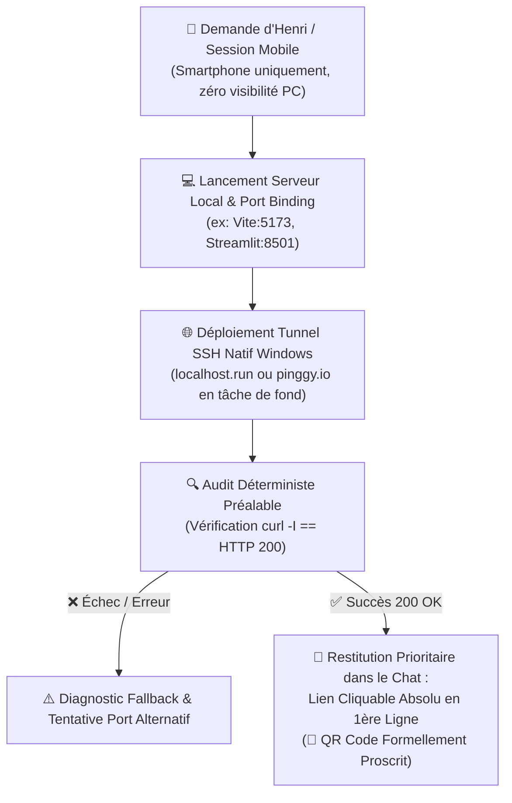
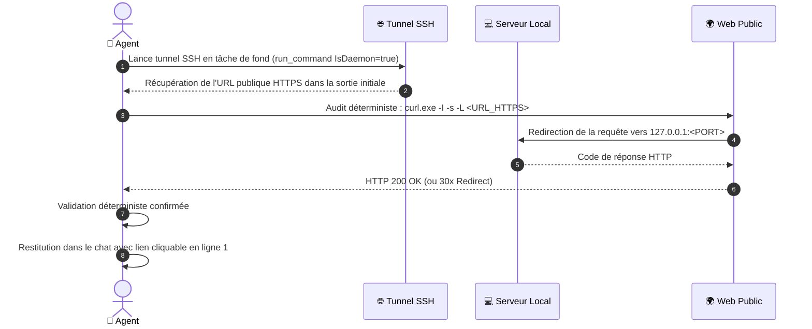

# 📱 Comment le Skill Mobile-Tunnel Expose-t-il les Applications Locales sur le Smartphone d'Henri ?



---

## 🎯 Quelle Est la Règle d'Or Absolue d'Henri Jamet ?

> [!IMPORTANT]
> **RÈGLE D'OR — LIEN CLIQUABLE EN TÊTE DE CHAT (ZÉRO QR CODE)** :
> Henri utilise son smartphone et **n'a accès qu'à l'interface de chat Antigravity**. Il **n'a aucun accès physique ni visuel à l'écran de son ordinateur**.
> 1. **Affichage Prioritaire en 1ère Ligne** : L'agent DOIT intercepter l'URL publique HTTPS générée et **l'afficher IMMÉDIATEMENT en toute première ligne de sa réponse sous forme de lien Markdown cliquable absolu** :
>    ```markdown
>    [📱 Ouvrir l'application sur smartphone](https://xxxxxx.localhost.run)
>    ```
> 2. **INTERDICTION FORMELLE DES QR CODES** : Il est **strictement interdit** de générer un QR code (image, ASCII art, terminal ou artefact visuel) pour rediriger Henri. Un QR code affiché sur l'écran d'un PC qu'il ne voit pas ou dans un chat sur l'écran même de son téléphone est inutile et inutilisable.
> 3. **Zéro Attente Passive** : Le lien doit être directement disponible dès la fin de l'audit réseau.

---

## 🛠️ Quelles Sont les Commandes SSH Natives Windows pour Monter le Tunnel ?

Le tunnel repose exclusivement sur le client OpenSSH natif de Windows (`ssh.exe`), sans nécessiter l'installation d'aucun binaire tiers (zéro ngrok, zéro cloudflared, zéro dépendance npm/pip).

| Service de Tunnel | Commande SSH 1-Liner (PowerShell) | Spécificités & Avantages |
| :--- | :--- | :--- |
| **Option A (Canonique) : localhost.run** | `ssh -T -o StrictHostKeyChecking=no -o ServerAliveInterval=30 -R 80:127.0.0.1:<PORT> nokey@localhost.run` | Totalement gratuit, sans compte, génère une URL HTTPS publique directe dès la connexion. |
| **Option B (Secours) : pinggy.io** | `ssh -o StrictHostKeyChecking=no -p 443 -R0:127.0.0.1:<PORT> a.pinggy.io` | Utilise le port HTTPS sortant 443 (pratique si le port 22 sortant est bridé par un pare-feu). |

---

## 🔬 Quel Est le Protocole d'Audit Déterministe Préalable ?

L'agent **ne doit JAMAIS poster une URL dans le chat sans avoir vérifié matériellement qu'elle répond**.



### 1. Comment Extraire l'URL et Valider le Code HTTP ?
1. **Lancement asynchrone** : Lancer la commande SSH via `run_command` avec un `WaitMsBeforeAsync` suffisant (ex: 3000ms-5000ms) pour capturer les premières lignes de log contenant l'URL HTTPS attribuée.
2. **Filtrage de l'URL** : Extraire l'URL HTTPS (ex: `https://[a-z0-9]+.localhost.run` ou `https://[a-z0-9]+.a.pinggy.link`).
3. **Contrôle d'intégrité déterministe** :
   ```powershell
   curl.exe -I -s -L "https://xxxxxx.localhost.run"
   ```
   - **Condition de succès** : Obtenir un code `HTTP/1.1 200 OK` ou `HTTP/2 200` (ou redirection valide `301`/`302`).
   - **Échec (502, 503, Connection Refused)** : Vérifier que le serveur local écoute bien sur `127.0.0.1:<PORT>` avant de retenter.

---

## 📋 Comment Orchestrer le Cycle de Vie du Tunnel ?

| Étape | Action Opérationnelle | Commande / Outil |
| :--- | :--- | :--- |
| **1. Port Check** | Vérifier que l'application locale tourne et répond en local. | `curl.exe -I http://127.0.0.1:<PORT>` |
| **2. Tunnel Init** | Démarrer le tunnel SSH en arrière-plan. | `run_command(CommandLine="ssh ...", IsDaemon=true)` |
| **3. Health Check** | Valider la connectivité externe de bout en bout. | `curl.exe -I https://<URL>` |
| **4. Restitution** | Poster l'URL cliquable en Ligne 1 du message. | Markdown : `[Nom](https://...)` |
| **5. Cleanup** | Terminer la tâche d'arrière-plan à la clôture de la session. | `manage_task(Action="kill", TaskId="...")` |

---

## 🚫 Quels Sont les Anti-Patterns Proscrits ?

- ❌ **Générer un QR code** : Formellement banni (Henri est sur téléphone, il ne peut pas scanner son propre écran de téléphone ni un écran de PC absent).
- ❌ **Poster une URL non testée** : Interdit de supposer que le tunnel fonctionne sans le `curl -I` préalable.
- ❌ **Laisser des tunnels orphelins** : Tuer systématiquement la tâche de fond (`manage_task kill`) si le serveur local s'arrête ou en fin d'usage.
- ❌ **Utiliser des outils lourds nécessitant installation** : Bannir ngrok ou services avec inscription obligatoire quand SSH natif suffit.
