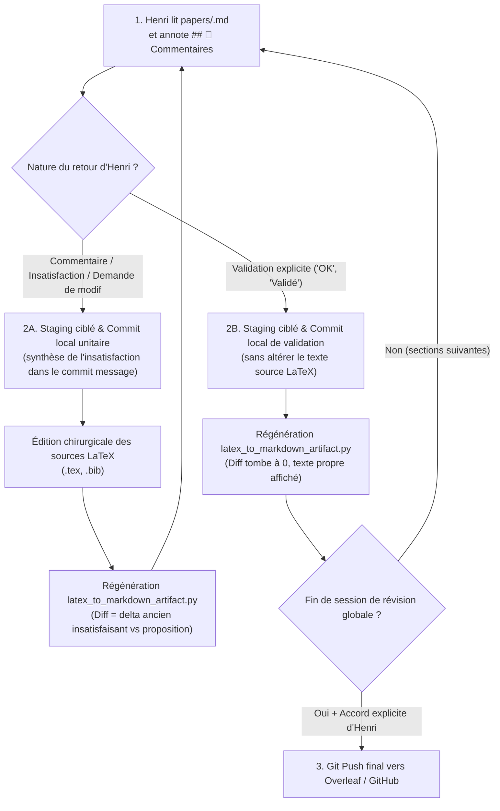

# 📝 Paper Writing & Revision Skill

> [!IMPORTANT]
> **Règle absolue d'écriture académique :** 
> Le texte doit être extrêmement scientifique, neutre, rigoureux et précis. Tout langage promotionnel, adjectifs hyperboliques ou tournures typiques des IA sont formellement interdits.

> [!TIP]
> **Synergie Amont avec `/literature-review` :**
> La rédaction et la révision des sections bibliographiques (*Related Work*, *Background*, *Baselines*, *Discussion*) s'articulent directement avec le skill `/literature-review`. Avant d'entamer l'écriture de ces sections, consulter la note de synthèse Markdown `notes/Revue de Littérature [Nom du Projet].md` et la collection Zotero synchronisée. Celles-ci constituent la source de vérité amont pour les fiches médico-légales, les infographies d'articles et les métriques comparatives.

---

## 1. 🪞 Comment la Note Miroir et la Boucle Granulaire Orchestrent-elles la Relecture ?

### Le Rôle Central de la Note Miroir
La note miroir `papers/<nom_papier>.md` (au sein du coffre `VoiceNotes`) est l'interface visuelle et le tableau de bord de relecture pour Henri. Elle est générée automatiquement à partir des sources LaTeX par le convertisseur universel :

```bash
python antigravity/scripts/latex_to_markdown_artifact.py <main.tex> --bib <references.bib> [--baseline-git auto]
```

- **Fonctionnalités & Richesse du rendu** :
  - **KaTeX natif** : Formules mathématiques fidèlement rendues (`$...$`, `$$...$$`, environnements `align`, `equation`).
  - **Tableaux Markdown** : Conversion automatique des tables LaTeX (`tabular`, `tabularx`, `booktabs`) en tableaux Markdown natifs.
  - **Résolution des citations** : Parser BibTeX intégré résolvant les clés `\cite{...}`, `\citep{...}`, `\citet{...}` en `[Auteur, Année]` lisibles.
  - **Diff AST incrémental** : Découpage par sections AST. Les sections inchangées restent en texte continu sans bruit ; seules les modifications réelles sont mises en évidence par callouts colorés chirurgicaux (`> [!CAUTION] 🔴 Supprimé / Ancien` et `> [!TIP] 🟢 Ajouté / Nouveau`).

---

### ⚓ Baseline de Révision Git Native sur l'Auteur (Henri Jamet)

Le moteur de diff différentiel ancre automatiquement sa baseline de comparaison sur le dernier commit signé par Henri Jamet :

```bash
git log --author="Henri Jamet" -n 1 --format="%H"
```

- **Invariant Zero-Trust** : Les modifications apportées par des co-auteurs ou synchronisées depuis Overleaf/GitHub via `git pull` restent continuellement surlignées en diff (vert/rouge) dans la note miroir tant qu'Henri ne les a pas explicitement validées ou commentées.
- **Fallback automatique** : Si aucun commit d'Henri Jamet n'est détecté dans l'historique du dépôt, le moteur bascule automatiquement sur `HEAD~1` (ou `HEAD`).

---

### 🔄 Le Cycle d'Itération Granulaire Section par Section

Le travail de révision suit un protocole unitaire et chirurgical section par section :



#### Étape 1 : Relecture & Retours d'Henri dans Obsidian
- Henri lit la note miroir `papers/<nom_papier>.md` directement dans Obsidian.
- Henri inscrit ses remarques, consignes de réécriture, suppressions ou validations dans la section sanctuarisée :
  ```markdown
  ## 💬 Commentaires & Retours d'Arbitrage

  <!-- USER_COMMENTS_START -->
  [Consignes, retours et arbitrages rédigés par Henri]
  <!-- USER_COMMENTS_END -->
  ```
- Cette section est automatiquement préservée lors des régénérations successives du script d'export.

#### Étape 2A : En cas de Commentaire / Insatisfaction / Modification demandée
1. **Staging ciblé & Commit local d'insatisfaction** :
   - L'agent effectue un staging ciblé du bloc ou fichier concerné : `git add <fichier.tex>`.
   - L'agent enregistre un commit local dont le message synthétise le retour critique d'Henri :
     ```bash
     git commit -m "review(sec): [synthèse de l'insatisfaction ou du retour d'Henri]"
     ```
2. **Édition directe des sources LaTeX** :
   - L'agent applique chirurgicalement la correction dans les fichiers sources (`.tex`, `.bib`).
   - **Interdiction formelle d'éditer le corps Markdown miroir à la main** : La note `papers/<nom_papier>.md` est une projection générée ; toute modification manuelle directe serait écrasée.
3. **Régénération immédiate de la note miroir** :
   - L'agent réexécute `latex_to_markdown_artifact.py`.
   - 🎯 **Effet visuel immédiat** : Le diff projeté dans Obsidian n'affiche plus l'historique lointain, mais **exclusivement le delta entre l'ancien texte insatisfaisant et la proposition corrigée**.

#### Étape 2B : En cas de Validation explicite ("OK", "Validé")
1. **Staging ciblé & Commit local de validation** :
   - L'agent effectue un staging ciblé et un commit local sans modifier le texte source :
     ```bash
     git add <fichier.tex>
     git commit -m "review(sec): validation section par Henri"
     ```
2. **Régénération immédiate de la note miroir** :
   - L'agent réexécute `latex_to_markdown_artifact.py`.
   - 🎯 **Effet visuel immédiat** : La baseline git avance sur ce commit, le diff tombe à 0 pour cette section, et le texte propre apparaît immédiatement dans Obsidian.

#### Étape 3 : Garde-Fou Absolu — Zéro Git Push
- ⚠️ **RÈGLE INVIOLABLE** : **INTERDICTION ABSOLUE** d'exécuter `git push` vers le dépôt distant (Overleaf, GitHub) pendant les cycles de révision.
- Tous les commits de révision restent strictement **locaux**.
- Le `git push` final ne peut intervenir qu'avec l'accord explicite et sans ambiguïté d'Henri en toute fin de session de relecture.

---

## 2. 🤖 Comment les Sous-Agents Spécialisés se Répartissent-ils le Travail ?

Toute modification substantielle d'un papier académique doit mobiliser des sous-agents en parallèle. Trois rôles sont systématiques :

### 2.1 Sous-agent Critique (*Paper Text Critic*)
- **Rôle** : Relire le texte actuel et identifier les faiblesses.
- **Focus** : Claims non étayés, langage "IA", gaps logiques, structure, comparaisons manquantes.
- **Output** : Rapport structuré par sévérité (🔴 critique → 🔵 mineur).
- **Quand** : Avant toute réécriture, pour disposer d'un diagnostic objectif.

### 2.2 Sous-agent Recherche (*Citation Researcher*)
- **Rôle** : Chercher des références pertinentes via le skill `/literature-review`, MCP Consensus ou web search.
- **Focus** : Papiers de la conférence cible, travaux récents sur le sujet, citations manquantes, extraction depuis la note `notes/Revue de Littérature [Nom du Projet].md` et la collection Zotero curée.
- **Output** : Entrées BibTeX complètes + suggestion d'insertion subtile.
- **Quand** : En amont (via `/literature-review`) et en parallèle de la critique, pour alimenter la réécriture.

### 2.3 Sous-agent Rédaction (*Paper Writer*)
- **Rôle** : Rédiger un passage spécifique selon le style défini ci-dessous (pour les textes longs).
- **Focus** : Section Results, Discussion, Related Work (directement nourrie par les synthèses de `/literature-review`).
- **Output** : Texte LaTeX prêt à insérer.
- **Quand** : Pour les passages longs nécessitant un premier jet itératif.

> [!NOTE]
> Les sous-agents travaillent en parallèle. L'agent principal intègre leurs résultats et assure la cohérence globale du papier.

---

## 3. ✒️ Quels sont les Invariants du Style d'Écriture Scientifique ?

### Ton & Registre
- **Extrêmement scientifique, neutre, rigoureux, précis.**
- Faire comprendre de manière subtile l'intérêt et la qualité du travail sans l'affirmer de manière explicite ou pompeuse.
- Jamais d'adjectifs hyper-mélioratifs : rester strictement objectif.
- Écrire de manière humaine : varier la longueur des phrases et le vocabulaire employé.

### Structure & Mise en page
- Privilégier les **paragraphes clairs et denses**.
- Pas de formatting excessif : éviter les sous-titres superflus et les listes à puces sauf si absolument nécessaire.
- Varier la mise en page pour rendre la lecture fluide et agréable.
- Chaque phrase doit porter une information précise. Aucune phrase vide ou de remplissage.

### ❌ Anti-patterns INTERDITS (Style IA)
- ❌ **Phrases vides non porteuses d'information** (ex: *"In this section, we discuss..."*)
- ❌ **Phrases de conclusion inutiles** (ex: *"In summary, we have shown that..."*)
- ❌ **Adjectifs superlatifs non justifiés** (ex: *"groundbreaking"*, *"revolutionary"*, *"powerful"*)
- ❌ **Formulations grandiloquentes** (ex: *"demonstrating the power of..."*)
- ❌ **Répétition de l'évidence** (ex: *"as mentioned earlier"*, *"as we have seen"*)
- ❌ **Hedging excessif** (ex: *"it is worth noting that"*, *"interestingly"*)
- ❌ **Listes numérotées comme substitut de prose** (ex: *"What we observe is the following: (1)... (2)..."*)

### ✅ Patterns RECOMMANDÉS
- ✅ **Attaque directe** : Commencer directement par l'observation ou le résultat.
- ✅ **Quantification** : Quantifier systématiquement les claims (pourcentages, p-values, intervalles de confiance).
- ✅ **Contextualisation** : Situer les résultats par rapport aux baselines de la littérature.
- ✅ **Connecteurs logiques variés** (*however*, *consistent with*, *in contrast*, *nevertheless*).
- ✅ **Rythme** : Alterner phrases courtes et phrases complexes.
- ✅ **Nuance** : Qualifier les résultats avec mesure plutôt que de manière catégorique.
- ✅ **Citations ciblées** : Intégrer les citations de la conférence cible de manière subtile et naturelle.

---

## 4. 📚 Comment Intégrer Subtilement les Citations de la Conférence Cible ?

Lors de la préparation ou de la révision d'un papier pour une conférence spécifique :
1. **Exploitation de `/literature-review`** : Mobiliser la note de synthèse `notes/Revue de Littérature [Nom du Projet].md` (liée à la note maîtresse `[[NomDuProjet]]`) et la collection Zotero du projet (issues du skill `/literature-review`) pour identifier immédiatement les papiers pivots (`fit-5`) et les baselines pertinentes (`fit-4`).
2. **Recherche ciblée** : Rechercher 2 à 3 papiers publiés récemment **dans cette conférence** qui sont thématiquement proches.
3. **Insertion naturelle** : Les intégrer dans le texte de manière **extrêmement subtile** (la citation doit s'insérer naturellement dans le flux argumentatif, jamais comme une mention forcée).
4. **Vérification rigoureuse** : Toujours vérifier les DOI, auteurs et venues via DBLP, Consensus ou le site officiel de l'éditeur.
