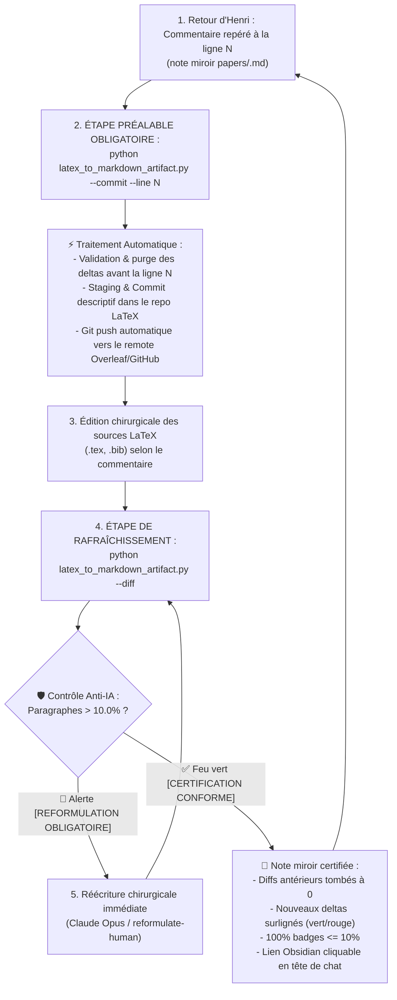

# 📝 Comment Rédiger et Réviser des Papiers Académiques (Paper Writing) ?

> [!IMPORTANT]
> **Règle absolue d'écriture académique :** 
> Le texte doit être extrêmement scientifique, neutre, rigoureux et précis. Tout langage promotionnel, adjectifs hyperboliques ou tournures typiques des IA sont formellement interdits.

> [!TIP]
> **Synergie Amont avec `/literature-review` :**
> La rédaction et la révision des sections bibliographiques (*Related Work*, *Background*, *Baselines*, *Discussion*) s'articulent directement avec le skill `/literature-review`. Avant d'entamer l'écriture de ces sections, consulter la note de synthèse Markdown `notes/Revue de Littérature [Nom du Projet].md` et la collection Zotero synchronisée. Celles-ci constituent la source de vérité amont pour les fiches médico-légales, les infographies d'articles et les métriques comparatives.

---

## 1. 🪞 Comment la Note Miroir et la Boucle Granulaire Orchestrent-elles la Relecture ?

### 1.1 Quel est le Protocole d'Entrée Zéro-Modification & Boucle Commentaire-First ?
- **Au premier appel du skill** : L'agent ne modifie STRICTEMENT AUCUNE ligne de code ou de texte LaTeX.
  Il exécute uniquement `python antigravity/scripts/latex_to_markdown_artifact.py`, affiche le lien vivant de la note miroir dans le chat, et attend les commentaires d'Henri.
- **Règle d'or de réécriture** : INTERDICTION FORMELLE de toute réécriture générale ou proactive.
  Toute modification doit découler STRICTEMENT et EXCLUSIVEMENT d'un commentaire direct d'Henri sur un passage spécifique de la note miroir.
- **Mandatement Direct de Claude Opus** : Toute réécriture ou reformulation littéraire ou scientifique issue d'un commentaire est mandatée DIRECTEMENT via :
  ```bash
  antigravity-agents run --model claude-opus-4-6 --prompt "..."
  ```
  sans passer par aucun sous-agent intermédiaire (interdiction absolue de double délégation).

---

### 1.2 Quel est le Rôle Central de la Note Miroir ?
La note miroir `papers/<nom_papier>.md` (au sein du coffre `VoiceNotes`) est l'interface visuelle et le tableau de bord de relecture pour Henri. Elle est générée automatiquement à partir des sources LaTeX par le convertisseur universel sans aucun argument complexe :

```bash
python antigravity/scripts/latex_to_markdown_artifact.py <main.tex>
```
*(ou simplement `python antigravity/scripts/latex_to_markdown_artifact.py` sans argument depuis le dossier du papier ou du projet, la détection de `main.tex`, de la bibliographie `.bib`, de la baseline Git d'Henri et du fichier miroir étant 100% automatique)*.

- **Fonctionnalités & Automatisation Totale** :
  - **Auto-détection source & bib** : Résolution récursive des `\input{...}` et auto-détection du fichier `.bib` présent dans le répertoire.
  - **Baseline Git automatique** : Calage déterministe sur le dernier commit signé par Henri Jamet (`git log --author="Henri Jamet" -n 1 --format="%H"`, fallback `HEAD~1`).
  - **KaTeX natif** : Formules mathématiques fidèlement rendues (`$...$`, `$$...$$`, environnements `align`, `equation`).
  - **Tableaux Markdown** : Conversion automatique des tables LaTeX (`tabular`, `tabularx`, `booktabs`) en tableaux Markdown natifs.
  - **Résolution des citations** : Parser BibTeX intégré résolvant les clés `\cite{...}`, `\citep{...}`, `\citet{...}` en `[Auteur, Année]` lisibles.
  - **Diff AST incrémental Inline** : Découpage par sections AST. Les sections inchangées restent en texte continu sans bruit ; seules les modifications réelles sont surlignées en Inline Word-Diff (`<del>` rouge / `<ins>` vert).

---

### 1.3 Comment s'Ancre la Baseline de Révision Git Native sur l'Auteur (Henri Jamet) ?

Le moteur de diff différentiel ancre automatiquement sa baseline de comparaison sur le dernier commit signé par Henri Jamet :

```bash
git log --author="Henri Jamet" -n 1 --format="%H"
```

- **Invariant Zero-Trust** : Les modifications apportées par des co-auteurs ou synchronisées depuis Overleaf/GitHub via `git pull` restent continuellement surlignées en diff (vert/rouge) dans la note miroir tant qu'Henri ne les a pas explicitement validées ou commentées.
- **Fallback automatique** : Si aucun commit d'Henri Jamet n'est détecté dans l'historique du dépôt, le moteur bascule automatiquement sur `HEAD~1` (ou `HEAD`).

---

### 1.4 Comment S'Orchestre le Cycle Systématique `--commit` / `--diff` à Chaque Retour ?

Dès qu'Henri annote la note miroir `papers/<nom_papier>.md` et avant TOUTE modification du code LaTeX, l'agent exécute la boucle déterministe en 3 temps :



#### Étape 1 : Comment la Validation Immédiate & la Baseline Git S'Automatisent-elles (`--commit`) ?
- **Règle absolue** : AVANT toute retouche de code ou de texte LaTeX suite à un retour d'Henri, l'agent invoque systématiquement :
  ```bash
  python antigravity/scripts/latex_to_markdown_artifact.py --commit --line <N>
  ```
  *(où `<N>` représente le numéro de ligne 1-indexed du dernier commentaire d'Henri dans la note miroir Markdown)*.
- **Effets instantanés** :
  - Toutes les diffs antérieures à la ligne `<N>` sont validées : ajouts `<span ...>` intégrés en texte normal, suppressions `<del>` et callouts de sections supprimées purgés.
  - Les diffs à partir de la ligne `<N>` restent intacts.
  - Le script indexe automatiquement les modifications correspondantes dans le dépôt LaTeX, enregistre un commit Git descriptif (`review(paper): validate revisions up to line <N>...`), et exécute automatiquement un `git push` vers le remote distant (Overleaf / GitHub).
  - La baseline Git d'Henri avance immédiatement sur ce commit.

#### Étape 2 : Comment Réaliser l'Édition Directe des Sources LaTeX ?
- L'agent (ou Claude Opus mandaté directement pour les reformulations) applique les corrections demandées par Henri dans les sources (`.tex`, `.bib`).
- **Interdiction formelle d'éditer le corps Markdown miroir à la main** : La note `papers/<nom_papier>.md` est une projection générée ; toute modification manuelle directe serait écrasée.

#### Étape 3 : Comment Rafraîchir la Note Miroir (`--diff`) ?
- L'agent réexécute immédiatement le convertisseur :
  ```bash
  python antigravity/scripts/latex_to_markdown_artifact.py --diff
  ```
- 🎯 **Effet visuel immédiat** : Les sections antérieures à la ligne `<N>` apparaissent en texte propre sans aucun diff parasite. Seules les nouvelles modifications apportées à l'étape 2 sont surlignées en rouge/vert, prêtes pour la relecture suivante d'Henri.

#### Étape 4 : Boucle Fermée Actor-Critic & Seuil Anti-IA P(IA) <= 10% (MANDATOIRE)
- **Règle absolue d'itération en boucle fermée** :
  Après chaque appel à `python latex_to_markdown_artifact.py --diff` :
  Si le script retourne l'alerte `🚨 [ACTION AGENT REQUISE : REFORMULATION OBLIGATOIRE — SEUIL P(IA) > 10% NON RESPECTÉ]`, l'agent a l'obligation stricte d'itérer immédiatement : reformuler les paragraphes incriminés dans le .tex et réexécuter `--diff`, jusqu'à l'obtention du feu vert `✅ [CERTIFICATION IA CONFORME] 100% des paragraphes modifiés respectent le seuil strict P(IA) <= 10.0%`.
- **Interdiction Formelle d'Arrêt Prématuré** : L'agent NE DOIT JAMAIS s'arrêter, déclarer sa tâche terminée ou solliciter l'arbitrage d'Henri tant qu'un seul paragraphe modifié dépasse le seuil strict de 10.0%.

---

## 2. 🤖 Comment les Sous-Agents Spécialisés se Répartissent-ils le Travail ?

Toute modification substantielle d'un papier académique doit mobiliser des sous-agents en parallèle. Trois rôles sont systématiques :

### 2.1 Quel est le Rôle du Sous-Agent Critique (*Paper Text Critic*) ?
- **Rôle** : Relire le texte actuel et identifier les faiblesses.
- **Focus** : Claims non étayés, langage "IA", gaps logiques, structure, comparaisons manquantes.
- **Output** : Rapport structuré par sévérité (🔴 critique → 🔵 mineur).
- **Quand** : Avant toute réécriture, pour disposer d'un diagnostic objectif.

### 2.2 Quel est le Rôle du Sous-Agent Recherche (*Citation Researcher*) ?
- **Rôle** : Chercher des références pertinentes via le skill `/literature-review`, MCP Consensus ou web search.
- **Focus** : Papiers de la conférence cible, travaux récents sur le sujet, citations manquantes, extraction depuis la note `notes/Revue de Littérature [Nom du Projet].md` et la collection Zotero curée.
- **Output** : Entrées BibTeX complètes + suggestion d'insertion subtile.
- **Quand** : En amont (via `/literature-review`) et en parallèle de la critique, pour alimenter la réécriture.

### 2.3 Pourquoi la Rédaction est-elle Exclusive à Claude Opus (*Direct Mandating*) ?
- **Règle absolue** : ZÉRO réécriture générale proactive par un sous-agent générique.
- **Exécution exclusive** : Toute reformulation ou rédaction textuelle fait suite à un commentaire précis d'Henri et est mandatée DIRECTEMENT auprès de Claude Opus via :
  ```bash
  antigravity-agents run --model claude-opus-4-6 --prompt "..."
  ```
  sans passer par aucun sous-agent intermédiaire (interdiction absolue de double délégation).
- **Output** : Texte LaTeX prêt à insérer.
- **Quand** : Sur commentaire direct d'Henri pour réécrire ou affiner un passage ciblé.

> [!NOTE]
> Les sous-agents de critique et de recherche travaillent en amont. L'agent principal mandate directement Claude Opus pour la rédaction textuelle issue des arbitrages d'Henri et intègre les résultats.

---

## 3. ✒️ Quels sont les Invariants du Style d'Écriture Scientifique ?

### Quel Ton & Registre Adopter ?
- **Extrêmement scientifique, neutre, rigoureux, précis.**
- Faire comprendre de manière subtile l'intérêt et la qualité du travail sans l'affirmer de manière explicite ou pompeuse.
- Jamais d'adjectifs hyper-mélioratifs : rester strictement objectif.
- Écrire de manière humaine : varier la longueur des phrases et le vocabulaire employé.

### Quelle Structure & Mise en Page Privilégier ?
- Privilégier les **paragraphes clairs et denses**.
- Pas de formatting excessif : éviter les sous-titres superflus et les listes à puces sauf si absolument nécessaire.
- Varier la mise en page pour rendre la lecture fluide et agréable.
- Chaque phrase doit porter une information précise. Aucune phrase vide ou de remplissage.

### ❌ Quels sont les Anti-Patterns INTERDITS (Style IA) ?
- ❌ **Phrases vides non porteuses d'information** (ex: *"In this section, we discuss..."*)
- ❌ **Phrases de conclusion inutiles** (ex: *"In summary, we have shown that..."*)
- ❌ **Adjectifs superlatifs non justifiés** (ex: *"groundbreaking"*, *"revolutionary"*, *"powerful"*)
- ❌ **Formulations grandiloquentes** (ex: *"demonstrating the power of..."*)
- ❌ **Répétition de l'évidence** (ex: *"as mentioned earlier"*, *"as we have seen"*)
- ❌ **Hedging excessif** (ex: *"it is worth noting that"*, *"interestingly"*)
- ❌ **Listes numérotées comme substitut de prose** (ex: *"What we observe is the following: (1)... (2)..."*)

### ✅ Quels sont les Patterns RECOMMANDÉS ?
- ✅ **Attaque directe** : Commencer directement par l'observation ou le résultat.
- ✅ **Quantification** : Quantifier systématiquement les claims (pourcentages, p-values, intervalles de confiance).
- ✅ **Contextualisation** : Situer les résultats par rapport aux baselines de la littérature.
- ✅ **Connecteurs logiques variés** (*however*, *consistent with*, *in contrast*, *nevertheless*).
- ✅ **Rythme** : Alterner phrases courtes et phrases complexes.
- ✅ **Nuance** : Qualifier les résultats avec mesure plutôt que de manière catégorique.
- ✅ **Citations ciblées** : Intégrer les citations de la conférence cible de manière subtile et naturelle.

---

## 4. 📚 Comment Intégrer Subtilement les Citations de la Conférence Cible ?

Lors de la préparation ou de la révision d'un papier pour une conférence spécifique :
1. **Exploitation de `/literature-review`** : Mobiliser la note de synthèse `notes/Revue de Littérature [Nom du Projet].md` (liée à la note maîtresse `[[NomDuProjet]]`) et la collection Zotero du projet (issues du skill `/literature-review`) pour identifier immédiatement les papiers pivots (`fit-5`) et les baselines pertinentes (`fit-4`).
2. **Recherche ciblée** : Rechercher 2 à 3 papiers publiés récemment **dans cette conférence** qui sont thématiquement proches.
3. **Insertion naturelle** : Les intégrer dans le texte de manière **extrêmement subtile** (la citation doit s'insérer naturellement dans le flux argumentatif, jamais comme une mention forcée).
4. **Vérification rigoureuse** : Toujours vérifier les DOI, auteurs et venues via DBLP, Consensus ou le site officiel de l'éditeur.

---

## 5. ⚙️ Comment Auditer la Pagination et le Contenu après Git Pull ?

- **Recompilation Obligatoire** : Recompiler systématiquement après tout `git pull` ou modification sur un document LaTeX (`pdflatex` / `latexmk`) avant d'auditer la pagination ou le contenu. Interdiction formelle d'auditer un `.pdf` préexistant sans compilation fraîche.


