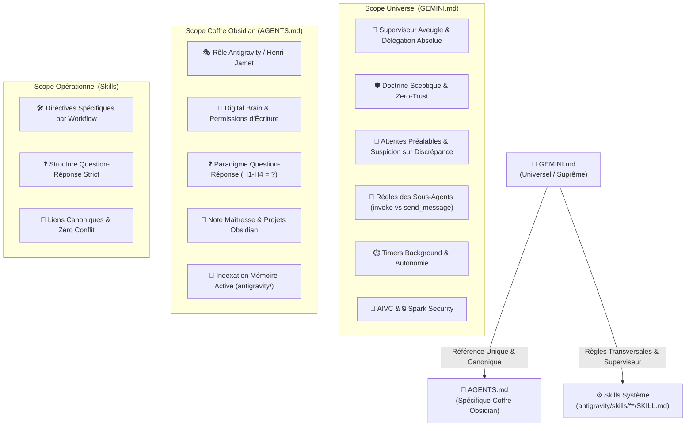
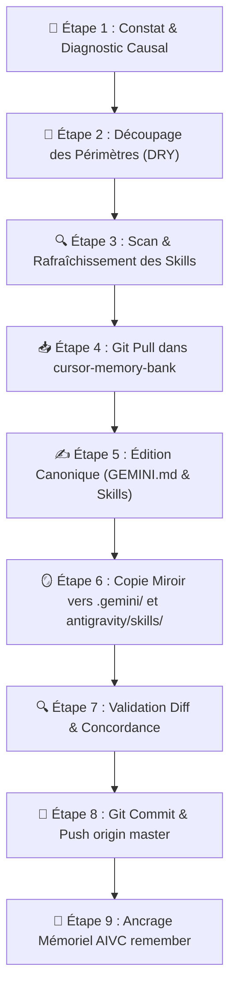

# 🪞 Pourquoi et Quand Déclencher le Protocole Reflect ?

| Déclencheur / Symptôme | Cause Probable | Risque Systémique | Action Immédiate |
| :--- | :--- | :--- | :--- |
| **Violation du Superviseur Aveugle** | L'agent racine appelle `find_by_name`, `grep_search`, `view_file` ou `run_command` au lieu de déléguer. | Perte de contexte, gaspillage de tokens, transgression des règles d'or. | Arrêt immédiat, rappel de la liste noire formelle, délégation via `invoke_subagent`. |
| **Recyclage Abusif via `send_message`** | Réutilisation d'un ancien sous-agent pour un nouveau besoin ou un outil distinct. | Pollution du contexte du sous-agent, hallucinations, exécution dégradée. | Clôture de l'échange, lancement d'un nouveau sous-agent dédié (`invoke_subagent`). |
| **Ambiguïté ou Contradiction dans un Skill** | Un fichier `SKILL.md` contient des instructions floues, contradictoires avec `GEMINI.md` ou obsolètes. | Mauvais choix d'outils, comportements erratiques, dérives de format. | Audit chirurgical du skill, alignement avec `GEMINI.md`, refactorisation Question-Réponse. |
| **Désynchronisation Miroir** | `C:\Users\Jamet\.gemini\GEMINI.md` et `cursor-memory-bank/src/GEMINI.md` (ou skills) diffèrent. | Régression au redémarrage d'IDE, comportement instable, perte des correctifs. | Exécution du protocole de synchronisation miroir git. |
| **Duplication de Règles (Violation DRY)** | Une règle globale système est recopiée ou paraphrasée dans `AGENTS.md` ou un skill. | Divergence de consignes, ambiguïté d'arbitrage pour les modèles. | Élagage, consolidation dans la source canonique (`GEMINI.md`) et renvoi par lien. |
| **Hallucination / Biais d'Optimisme** | Validation aveugle d'un résultat non prouvé ou affirmation d'une information absente. | Décisions erronées, dégradation de la confiance utilisateur. | Autopsie médico-légale de la règle transgressée, renforcement du Zero-Trust. |
| **Absence d'Attentes Préalables ou Confiance Aveugle sans Diff** | Le superviseur déploie un sous-agent sans consigner ses attentes dans l'artefact dédié (`expectations_<agent_id>.md`), ou valide son rapport sans confronter les données brutes aux attentes. | Validation de résultats hallucinés, fallbacks silencieux non détectés, érosion du Zero-Trust. | Arrêt, formulation d'attentes théoriques dans l'artefact dédié, audit rétroactif des données brutes du sous-agent. |

---

## 🏛️ Comment S'Articule l'Arborescence des Règles Système et des Skills ?



| Fichier / Entité | Emplacement Canonique | Périmètre Exclusif | Ce Qui y Est STRICTEMENT INTERDIT |
| :--- | :--- | :--- | :--- |
| **`GEMINI.md`** | `C:\Users\Jamet\.gemini\GEMINI.md`<br/>`cursor-memory-bank/src/GEMINI.md` | **Règles universelles transversales** : Pattern Superviseur Aveugle, sous-agents, interdiction `send_message` pour nouveaux besoins, timers de commandes, sécurité Spark, AIVC. | Spécificités locales d'un coffre ou projet particulier (chemins de notes, rôles métiers contextuels). |
| **`AGENTS.md`** | `c:\Users\Jamet\Documents\VoiceNotes\AGENTS.md` | **Spécificités locales du coffre Obsidian** : Rôle d'Antigravity auprès de Henri, Digital Brain, format des notes Obsidian (Paradigme Q/R), arborescence `notes/`, index `antigravity/`. | Recopier ou redéfinir les règles globales système déjà présentes dans `GEMINI.md` (DRY strict). |
| **`SKILL.md`** | `antigravity/skills/<skill-name>/SKILL.md`<br/>`cursor-memory-bank/src/skills/<name>/SKILL.md` | **Directives opérationnelles d'un workflow ciblé** : Commandes CLI, checklists, schémas Mermaid et étapes d'exécution d'un outil précis. | Redéfinir l'architecture globale ou entrer en conflit avec `GEMINI.md`. |

---

## 🔬 Comment Autopsier une Dérive Comportementale ou une Ambiguïté (Root-Cause Analysis) ?

| Dérive Observée | Question d'Autopsie Causal | Diagnostic de Cause Racine | Correction dans les Instructions |
| :--- | :--- | :--- | :--- |
| **L'agent superviseur lit un fichier ou exécute un `grep`** | Pourquoi le superviseur a-t-il utilisé un outil de lecture ? | Manque de clarté sur la liste noire ou tentation de "vérification rapide". | Réaffirmer la métaphore de l'aveugle et la liste noire formelle dans `GEMINI.md`. |
| **L'agent envoie un `send_message` pour demander une nouvelle action** | Pourquoi ne pas avoir déployé un nouveau sous-agent ? | Biais hérité des consignes génériques de plateforme ("continue conversation"). | Sanctuariser l'interdiction de `send_message` hors correction immédiate de bug. |
| **L'agent produit un titre descriptif sans point d'interrogation** | Pourquoi le format H1-H4 n'est pas interrogatif ? | Oubli du Paradigme Question-Réponse ou prompt tiers non aligné. | Réinjecter la règle stricte : TOUS les titres H1-H4 = questions terminées par `?`. |
| **Contradiction ou ambiguïté dans un skill** | Pourquoi le skill propose-t-il une action en désaccord avec `GEMINI.md` ? | Skill rédigé avant la refonte des règles globales ou copié sans alignement. | Réécrire le skill selon le paradigme Q/R, aligner sur `GEMINI.md`, éliminer les règles dupliquées. |
| **Divergence entre l'IDE et le dépôt git** | Pourquoi le comportement a régressé après une mise à jour ? | Modification locale dans `.gemini/GEMINI.md` sans report dans `cursor-memory-bank`. | Exécuter la synchronisation miroir bidirectionnelle avec commit et push. |
| **Duplication de règles entre fichiers** | Pourquoi deux fichiers contiennent le même paragraphe ? | Copier-coller de confort sans respect de la source unique de vérité. | Supprimer la copie, insérer un lien Markdown canonique absolu `[Nom](file:///...)`. |
| **Validation aveugle sans diff ou omission d'attentes** | Pourquoi l'agent a-t-il affirmé des faits non vérifiés ou accepté un rapport sans diff ? | Manque de discipline épistémique ou complaisance envers le sous-agent. | Rappeler le protocole Expectation-First (consignation dans l'artefact dédié `<appDataDir>/brain/.../expectations_<agent_id>.md`, zéro pollution du chat) et le déclenchement de suspicion sur toute discrépance. |

---

## 🔍 Comment Scanner et Aligner l'Ensemble des Skills (`antigravity/skills/**/SKILL.md`) ?

| Étape de l'Audit des Skills | Question de Contrôle | Critère de Conformité | Action Corrective si Non-Conforme |
| :--- | :--- | :--- | :--- |
| **1. Conformité Titres (Q/R)** | Tous les titres H1-H4 se terminent-ils par `?` ? | 100% des titres H1-H4 sont des questions explicites. | Renommer les titres descriptifs en questions directes (`## 🛠️ Comment... ?`). |
| **2. Cohérence avec GEMINI.md** | Le skill viole-t-il la cécité du superviseur ou les règles de sous-agents ? | Zéro recommandation d'exécution directe par le superviseur racine. | Déporter l'exécution aux sous-agents (`TypeName: 'self'`). |
| **3. Respect du Principe DRY** | Le skill duplique-t-il des règles universelles ? | Zéro paraphrase de `GEMINI.md` ou `AGENTS.md`. | Remplacer les doublons par des références canoniques absolues. |
| **4. Clarté & Zéro Ambiguïté** | Les étapes sont-elles télégraphiques, univoques et vérifiables ? | Tableaux Markdown, schémas Mermaid, pas de verbiage narratif. | Compacter en format télégraphique clé-valeur et diagrammes clairs. |
| **5. Validité des Chemins & Commandes** | Les chemins absolus et les commandes CLI sont-ils fonctionnels ? | Commandes et chemins testés et valides sous l'environnement hôte. | Corriger les chemins et syntaxes de scripts obsolètes. |

---

## 🔄 Quel Est le Protocole d'Alignement, de Réflexion et de Synchronisation Miroir Pas à Pas ?



### 1. 🛑 Comment Conduire l'Arrêt & le Diagnostic Causal (Phase 1) ?
- **Arrêt réflexe** : Dès qu'une instruction ambiguë produit une mauvaise action, stopper l'exécution immédiate.
- **Formulation de la dérive** : Identifier le fichier responsable (`GEMINI.md` pour le comportement universel, `AGENTS.md` pour Obsidian, `SKILL.md` pour un skill).
- **Règle d'arbitrage** : Si la règle concerne tous les projets/workspaces → `GEMINI.md`. Si la règle concerne uniquement le coffre Obsidian de Henri → `AGENTS.md`. Si la règle concerne un workflow métier → `SKILL.md`.

### 2. 🧭 Comment Découper & Assigner les Périmètres sans Duplication (Phase 2) ?
- **Vérification DRY** : S'assurer que la règle n'est pas rédigée à deux endroits distincts.
- **Règle de référence** : Dans `AGENTS.md` et les skills, pointer systématiquement vers `GEMINI.md` pour les règles globales.
- **Clarté chirurgicale** : Éliminer tout verbiage, privilégier des listes à puces clés-valeurs et des tableaux d'interdiction formelle.

### 3. 🔍 Comment Auditer et Corriger les Fichiers SKILL.md Détectés (Phase 3) ?
- **Inventaire** : Scanner l'ensemble des dossiers dans `antigravity/skills/` (ou `.agents/skills/`).
- **Correction ciblée** : Réécrire les titres en questions (`?`), éliminer le verbiage déclaratif, actualiser les instructions obsolètes.
- **Vérification croisée** : Vérifier que chaque skill respecte le pattern Superviseur Aveugle et ne prescrit jamais de raccourcis interdits.

### 4. 📥 Comment Exécuter le Pull Préalable de cursor-memory-bank (Phase 4) ?
- **Positionnement** : Se placer dans `C:\Users\Jamet\Documents\code\cursor-memory-bank`.
- **Commande Git** :
  ```bash
  git pull origin master
  ```
- **Objectif** : Éviter tout conflit de version avant d'appliquer les modifications canoniques.

### 5. ✍️ Comment Garantir la Synchronisation Miroir Parfaite (Phase 5) ?
- **Édition source** : Modifier `c:\Users\Jamet\Documents\code\cursor-memory-bank\src\GEMINI.md` et les skills sous `src/skills/`.
- **Copie miroir exacte** : Copier l'intégralité du contenu vers `C:\Users\Jamet\.gemini\GEMINI.md` et `c:\Users\Jamet\Documents\VoiceNotes\.agents\skills\`.
- **Vérification de parité** : Les fichiers doivent être strictement identiques octet par octet.

### 6. 🚀 Comment Valider le Commit, Push & l'Ancrage AIVC (Phase 6) ?
- **Commandes Git** :
  ```bash
  git status
  git add src/
  git commit -m "docs(skills): align reflect skill and universal system instructions"
  git push origin master
  ```
- **Ancrage AIVC** : Appeler obligatoirement `remember` avec `read_files` et `edited_files` documentés.

---

## 📋 Quelle Est la Checklist de Validation & d'Intégrité Reflect ?

- [ ] **Parité Miroir Absolue** : `C:\Users\Jamet\.gemini\GEMINI.md` et `cursor-memory-bank/src/GEMINI.md` ont un contenu strictement identique.
- [ ] **Frontière Étanche Respectée** : Aucune règle générale (superviseur aveugle, timers, `send_message`) n'est dupliquée dans `AGENTS.md` ou les skills.
- [ ] **Protocole d'Attente Préalable & Diff de Discrépance** : Les attentes sont consignées dans un artefact dédié (`expectations_<agent_id>.md`, zéro pollution du chat) au déploiement et systématiquement relues et confrontées aux données brutes au retour avant archivage.
- [ ] **Audit Skills Complété** : Les fichiers `SKILL.md` audités respectent le paradigme Question-Réponse (100% titres H1-H4 avec `?`).
- [ ] **Règle `send_message` Explicite** : Mention formelle que `send_message` = correction de bug immédiat uniquement ; tout nouveau besoin = `invoke_subagent`.
- [ ] **Git Propre & Synchro** : Le dépôt `cursor-memory-bank` est à jour (`git push origin master` validé sans erreur).
- [ ] **Paradigme Question-Réponse** : TOUS les titres H1-H4 de la documentation Obsidian et des skills se terminent par `?`.
- [ ] **Mémoire AIVC Consignée** : Un checkpoint mémoriel détaillé a été créé via l'outil MCP `remember`.

---

## 🛡️ Quelles Sont les 7 Règles d'Or de la Réflexion et de l'Alignement des Instructions ?

- **[Règle 1 : Source Unique de Vérité]** : `GEMINI.md` commande le comportement universel ; `AGENTS.md` commande le coffre Obsidian ; `SKILL.md` commande le workflow opérationnel. Zéro copie inter-fichiers.
- **[Règle 2 : Miroir Parfait Obligatoire]** : Tout changement dans `GEMINI.md` ou les skills doit exister simultanément dans les dépôts de référence et l'environnement d'exécution local.
- **[Règle 3 : Audit Périodique des Skills]** : Scanner régulièrement `antigravity/skills/` pour traquer les ambiguïtés, instructions obsolètes et titres déclaratifs non conformes.
- **[Règle 4 : Interdiction de Recyclage des Sous-Agents]** : `send_message` = correctif d'erreur en cours. Nouveau besoin = NOUVEAU sous-agent (`invoke_subagent`).
- **[Règle 5 : Cécité Totale du Superviseur]** : L'agent racine ne lit, ne cherche et n'exécute jamais directement sur la codebase ou le coffre (seuls les artefacts de session `<appDataDir>/brain/...` sont consultables directement).
- **[Règle 6 : Audit Sceptique Systématique]** : Zéro confiance aveugle envers les sous-agents, métriques et preuves brutes exigées.
- **[Règle 7 : Expectation-First & Suspicion sur Discrépance]** : Tout déploiement de sous-agent s'accompagne d'hypothèses qualitatives consignées dans un artefact dédié (`expectations_<agent_id>.md`, zéro chat). Tout retour fait l'objet d'une relecture et d'un diff impitoyable avec suspicion immédiate à la moindre divergence avant suppression/archivage de l'artefact.
