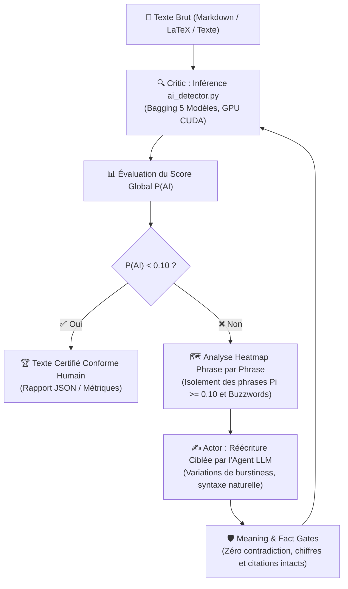

# 🛡️ Comment Reformulate-Human et ai_detector.py Éradiquent-ils les Empreintes IA sans Altérer le Sens ?

Ce skill fournit un **moteur local autonome haute précision** d'humanisation textuelle et d'évaluation anti-détection IA, propulsé par l'outil canonique [ai_detector.py](file:///c:/Users/hjamet/Documents/VoiceNotes/antigravity/scripts/ai_detector.py). Il associe une détection SOTA multi-modèles accélérée par GPU CUDA à un protocole agentique en boucle fermée (Actor-Critic).

---

## ⚡ Pourquoi ce Skill Est-il Centré sur ai_detector.py et le Bagging 5 Modèles ?

1. **Bagging 5 Modèles SOTA Complémentaires** : Combine des approches neuronales supervisées, analytiques zéro-shot, adversarielles et stylométriques pour neutraliser les faux positifs et déjouer les détecteurs commerciaux (Turnitin, GPTZero, CopyLeaks, RAID).
2. **Accélération Matérielle GPU CUDA & Mode Dégradé Élégant** : Exploitation directe du GPU avec bascule automatique sur les modèles légers (< 2.5 Go VRAM, inférence < 1.5s) et renormalisation bayésienne des poids.
3. **Diagnostic Chirurgical Phrase par Phrase (Heatmap)** : Isole visuellement et mathématiquement chaque phrase ($P_i$) et surligne les buzzwords IA stéréotypés.
4. **Sortie JSON Structurée pour Sous-Agents (`--json`)** : Intégration transparente et sans parsing fragile dans les pipelines agentiques.
5. **Seuil de Certification Inviolable : $P(\text{AI}) < 0.10$ (10%)** : Norme d'or académique et professionnelle pour garantir une attribution humaine indiscutable.

---

## 🔄 Comment Fonctionne la Boucle Rétroactive Fermée Actor-Critic ?



### 1. 🔍 Critic & Diagnostic (`ai_detector.py` & Heatmap)
- Exécution d'`ai_detector.py` sur le texte ou le fichier source.
- Extraction du score d'ensemble global $P(\text{AI})$.
- Analyse de la heatmap : repérage exact des segments signalés en orange/rouge ($P_i \ge 0.10$) et des connecteurs surreprésentés (*moreover, delve, pivotal, furthermore, tapestry*).

### 2. ✍️ Actor & Paraphrase Ciblée (L'Agent LLM)
- L'Agent concentre ses efforts de reformulation **exclusivement sur les phrases problématiques**, sans dégrader les passages déjà fluides.
- Application des règles de naturalité : alternance de phrases très courtes et de phrases plus développées (burstiness), vocabulaire vivant, suppression des formules d'emphase creuse.

### 3. 🛡️ Meaning & Fact Gates (Anti-Hallucination)
- **Préservation Factuelle** : Maintien strict des chiffres, dates, métriques et entités nommées.
- **Invariance Logique** : Interdiction absolue d'inverser le sens, de masquer des incertitudes scientifiques ou de travestir les hypothèses.
- **Intégrité Markdown & LaTeX** : Respect strict des citations (`\cite{...}`), équations et balises de tableau.

### 4. 🏁 Convergence & Certification (Seuil $P(\text{AI}) < 0.10$)
- Ré-évaluation avec `ai_detector.py`.
- Arrêt dès que le score global passe sous les 10% avec confirmation de conformité.

---

## 🔬 Quelle Est l'Architecture des 5 Modèles SOTA d'ai_detector.py ?

| # | Algorithme / Modèle | Identifiant HF | Poids Nominal | Rôle & Spécificité |
|---|---|---|---|---|
| **1** | **DeBERTa-v3 RAID SOTA** | `desklib/ai-text-detector-v1.01` | **30%** | Leader du benchmark RAID. Détecte les traces de tokenisation fine et d'attention croisée. |
| **2** | **ModernBERT Long-Context** | `GeorgeDrayson/modernbert-ai-detection-raid-mage` | **25%** | Encodeur natif 8192 tokens entraîné sur MAGE & RAID. Analyse multi-générateurs sans troncature. |
| **3** | **TMR RoBERTa Anti-Paraphrase** | `Oxidane/tmr-ai-text-detector` | **20%** | RoBERTa-base entraîné par Hard-Negative Mining itératif sur RAID. Résistance aux paraphrases. |
| **4** | **Fast-DetectGPT Zéro-Shot** | `EleutherAI/gpt-neo-125m` (ou `gpt2`) | **15%** | Analyse analytique de la courbure locale des log-probabilités sans perturbation coûteuse. |
| **5** | **Stylométrie & Entropie** | Moteur analytique interne | **10%** | Coefficient de variation de la longueur des phrases (burstiness), TTR, Maas, entropie de Shannon, buzzwords. |

> [!NOTE]
> **Formule Normalisée avec Renormalisation Bayésienne** :
> $$P(\text{AI}) = \frac{\sum_{i \in \mathcal{M}_{\text{actifs}}} w_i \cdot S_i}{\sum_{i \in \mathcal{M}_{\text{actifs}}} w_i}$$
> L'ensemble des 5 modèles forme une armada légère (< 500 Mo par modèle, < 2.5 Go VRAM au total). En cas d'omission rapide (`--fast`) ou d'indisponibilité ponctuelle, les modèles résidents sont automatiquement renormalisés sans perte de rigueur.

---

## 🚀 Comment Exécuter ai_detector.py en Ligne de Commande ?

```bash
# 1. Évaluation directe d'une chaîne de texte avec heatmap
python antigravity/scripts/ai_detector.py "Texte à analyser..."

# 2. Analyse d'un fichier Markdown ou LaTeX (nettoyage automatique du balisage)
python antigravity/scripts/ai_detector.py notes/mon_article.md
python antigravity/scripts/ai_detector.py paper/main.tex

# 3. Sortie structurée JSON pour les sous-agents (Machine-Readable)
python antigravity/scripts/ai_detector.py notes/mon_article.md --json

# 4. Définition explicite du seuil de conformité (défaut : 0.10)
python antigravity/scripts/ai_detector.py draft.md --threshold 0.10

# 5. Mode rapide (Fast inference) ou masquage de la heatmap
python antigravity/scripts/ai_detector.py draft.md --fast
python antigravity/scripts/ai_detector.py draft.md --no-heatmap

# 6. Forcer l'accélération GPU CUDA ou le mode CPU
python antigravity/scripts/ai_detector.py draft.md --device cuda
python antigravity/scripts/ai_detector.py draft.md --device cpu
```

---

## 🎯 Quelles Sont les Bonnes Pratiques d'Humanisation Textuelle ?

1. **Ne pas lisser artificiellement le texte** : Une écriture humaine possède des ruptures de ton, des propositions directes et des respirations variées.
2. **Attaquer les Buzzwords en Priorité** : Bannir sans compromis les termes stéréotypés (*delve, pivotal, multifaceted, tapestry, furthermore, testament, paramount*).
3. **Travailler Phrase par Phrase** : Suivre fidèlement les indications de la heatmap d'`ai_detector.py` pour préserver 100% de la matière déjà naturelle.
4. **Garantir le Seuil < 10%** : Ne jamais clore une phase de reformulation sans la preuve matérielle chiffrée issue d'`ai_detector.py`.