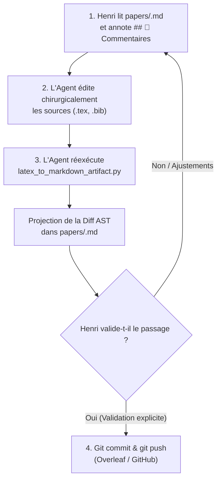

# 📝 Scientific Paper Writing & Revision Skill

> [!IMPORTANT]
> **Règle absolue d'écriture académique :** 
> Le texte doit être extrêmement scientifique, neutre, rigoureux et précis. Tout langage promotionnel, adjectifs hyperboliques ou tournures typiques des IA sont formellement interdits.

---

## 1. 🪞 Protocole Fondamental : La Note Miroir Obsidian & La Boucle Itérative

### Le Rôle Central de la Note Miroir
La note miroir `papers/<nom_papier>.md` (au sein du coffre `VoiceNotes`) est l'interface visuelle et le tableau de bord de relecture pour Henri. Elle est générée automatiquement à partir des sources LaTeX par le convertisseur universel :

```bash
python antigravity/scripts/latex_to_markdown_artifact.py <main.tex> --bib <references.bib>
```

- **Fonctionnalités & Richesse du rendu** :
  - **KaTeX natif** : Formules mathématiques fidèlement rendues (`$...$`, `$$...$$`, environnements `align`, `equation`).
  - **Tableaux Markdown** : Conversion automatique des tables LaTeX (`tabular`, `tabularx`, `booktabs`) en tableaux Markdown natifs.
  - **Résolution des citations** : Parser BibTeX intégré résolvant les clés `\cite{...}`, `\citep{...}`, `\citet{...}` en `[Auteur, Année]` lisibles.
  - **Diff AST incrémental** : Découpage par sections AST. Les sections inchangées restent en texte continu sans bruit ; seules les modifications réelles sont mises en évidence par callouts colorés chirurgicaux (`> [!CAUTION] 🔴 Supprimé / Ancien` et `> [!TIP] 🟢 Ajouté / Nouveau`).

### 🔄 La Boucle Itérative d'Écriture et de Relecture (Workflow Canonique)

Le travail de rédaction et de révision repose sur un cycle itératif en 4 étapes strictes :



#### Étape 1 : Relecture & Retours d'Henri dans Obsidian
- Henri lit la note miroir `papers/<nom_papier>.md` directement dans Obsidian.
- Henri inscrit ses remarques, consignes de réécriture, suppressions ou ajouts souhaités dans la section sanctuarisée :
  ```markdown
  ## 💬 Commentaires & Retours d'Arbitrage

  <!-- USER_COMMENTS_START -->
  [Consignes, retours et arbitrages rédigés par Henri]
  <!-- USER_COMMENTS_END -->
  ```
- Cette section est automatiquement préservée lors des régénérations successives du script d'export.

#### Étape 2 : Édition Directe des Sources LaTeX par l'Agent
- En fonction des retours et consignes d'Henri, l'agent **DOIT intervenir directement et chirurgicalement sur les fichiers sources bruts** (`.tex`, `.bib`) et sur les sources uniquement.
- **Interdiction formelle d'éditer le corps Markdown miroir à la main** : La note `papers/<nom_papier>.md` n'est qu'une projection dérivée générée par le script ; tout texte édité manuellement dans le Markdown (hors section des commentaires) serait écrasé lors du build.
- L'agent applique le style d'écriture scientifique rigoureux, les restructurations demandées ou les insertions de citations BibTeX.

#### Étape 3 : Réexécution Immédiate du Script d'Export
- Dès les modifications LaTeX appliquées, l'agent exécute **immédiatement** le script d'export :
  ```bash
  python antigravity/scripts/latex_to_markdown_artifact.py <main.tex> --bib <references.bib>
  ```
- Cela régénère `papers/<nom_papier>.md` et projette le diff AST (`[!CAUTION] 🔴 Supprimé` et `[!TIP] 🟢 Ajouté`) directement sous les yeux d'Henri dans Obsidian pour une relecture comparative instantanée.

#### Étape 4 : Garde-Fou Git & Validation Préalable
- ⚠️ **RÈGLE INVIOLABLE** : **INTERDICTION FORMELLE** d'exécuter `git commit` ou `git push` vers le dépôt distant (Overleaf, GitHub) tant qu'Henri n'a pas formellement examiné et validé le diff dans Obsidian.
- Le commit et push ne surviennent qu'après accord explicite d'Henri sur le passage modifié.

---

## 2. 🤖 Méthodologie de travail : Sous-agents spécialisés

Toute modification substantielle d'un papier académique doit mobiliser des sous-agents en parallèle. Trois rôles sont systématiques :

### 2.1 Sous-agent Critique (*Paper Text Critic*)
- **Rôle** : Relire le texte actuel et identifier les faiblesses.
- **Focus** : Claims non étayés, langage "IA", gaps logiques, structure, comparaisons manquantes.
- **Output** : Rapport structuré par sévérité (🔴 critique → 🔵 mineur).
- **Quand** : Avant toute réécriture, pour disposer d'un diagnostic objectif.

### 2.2 Sous-agent Recherche (*Citation Researcher*)
- **Rôle** : Chercher des références pertinentes via MCP Consensus ou web search.
- **Focus** : Papiers de la conférence cible, travaux récents sur le sujet, citations manquantes.
- **Output** : Entrées BibTeX complètes + suggestion d'insertion subtile.
- **Quand** : En parallèle de la critique, pour alimenter la réécriture.

### 2.3 Sous-agent Rédaction (*Paper Writer*)
- **Rôle** : Rédiger un passage spécifique selon le style défini ci-dessous (pour les textes longs).
- **Focus** : Section Results, Discussion, Related Work.
- **Output** : Texte LaTeX prêt à insérer.
- **Quand** : Pour les passages longs nécessitant un premier jet itératif.

> [!NOTE]
> Les sous-agents travaillent en parallèle. L'agent principal intègre leurs résultats et assure la cohérence globale du papier.

---

## 3. ✒️ Style d'écriture scientifique

### Ton & Registre
- **Extrêmement scientifique, neutre, rigoureux, précis.**
- Faire comprendre de manière subtile l'intérêt et la qualité du travail sans l'affirmer de manière explicite ou pompeuse.
- Jamais d'adjectifs hyper-mélioratifs : rester strictement objectif.
- Écrire de manière humaine : varier la longueur des phrases et le vocabulaire employé.

### Structure & Mise en page
- Privilégier les **paragraphes clairs et denses**.
- Pas de formatting excessif : éviter les sous-titres superflus et les listes à puces sauf si absolument nécessaire.
- Varier la mise en page pour rendre la lecture fluide et agréable.
- Chaque phrase doit porter une information précise. Aucune phrase vide ou de remplissage.

### ❌ Anti-patterns INTERDITS (Style IA)
- ❌ **Phrases vides non porteuses d'information** (ex: *"In this section, we discuss..."*)
- ❌ **Phrases de conclusion inutiles** (ex: *"In summary, we have shown that..."*)
- ❌ **Adjectifs superlatifs non justifiés** (ex: *"groundbreaking"*, *"revolutionary"*, *"powerful"*)
- ❌ **Formulations grandiloquentes** (ex: *"demonstrating the power of..."*)
- ❌ **Répétition de l'évidence** (ex: *"as mentioned earlier"*, *"as we have seen"*)
- ❌ **Hedging excessif** (ex: *"it is worth noting that"*, *"interestingly"*)
- ❌ **Listes numérotées comme substitut de prose** (ex: *"What we observe is the following: (1)... (2)..."*)

### ✅ Patterns RECOMMANDÉS
- ✅ **Attaque directe** : Commencer directement par l'observation ou le résultat.
- ✅ **Quantification** : Quantifier systématiquement les claims (pourcentages, p-values, intervalles de confiance).
- ✅ **Contextualisation** : Situer les résultats par rapport aux baselines de la littérature.
- ✅ **Connecteurs logiques variés** (*however*, *consistent with*, *in contrast*, *nevertheless*).
- ✅ **Rythme** : Alterner phrases courtes et phrases complexes.
- ✅ **Nuance** : Qualifier les résultats avec mesure plutôt que de manière catégorique.
- ✅ **Citations ciblées** : Intégrer les citations de la conférence cible de manière subtile et naturelle.

---

## 4. 📚 Intégration des citations de la conférence cible

Lors de la préparation ou de la révision d'un papier pour une conférence spécifique :
1. **Recherche ciblée** : Rechercher 2 à 3 papiers publiés récemment **dans cette conférence** qui sont thématiquement proches.
2. **Insertion naturelle** : Les intégrer dans le texte de manière **extrêmement subtile** (la citation doit s'insérer naturellement dans le flux argumentatif, jamais comme une mention forcée).
3. **Vérification rigoureuse** : Toujours vérifier les DOI, auteurs et venues via DBLP, Consensus ou le site officiel de l'éditeur.
