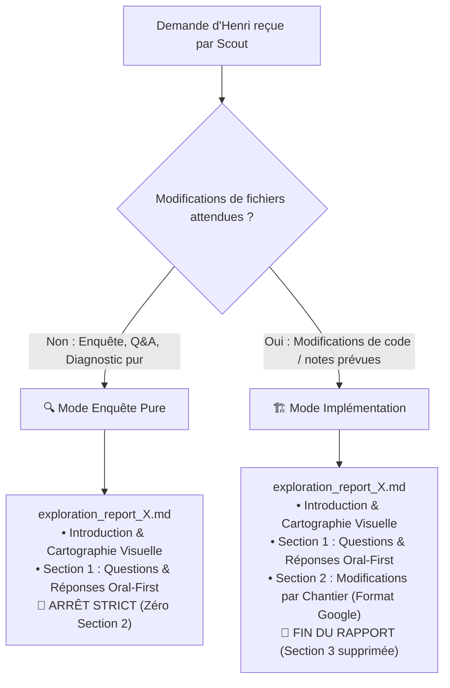
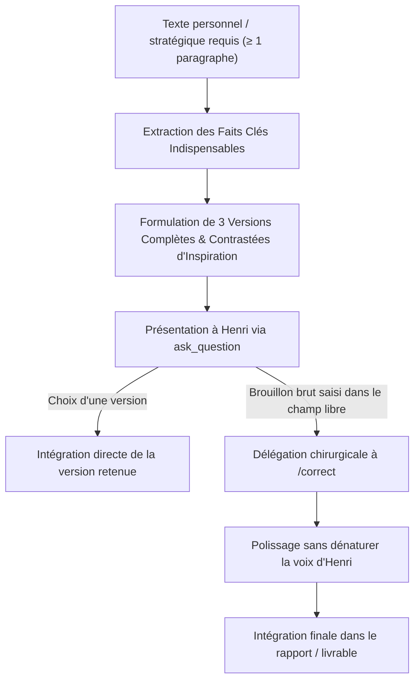
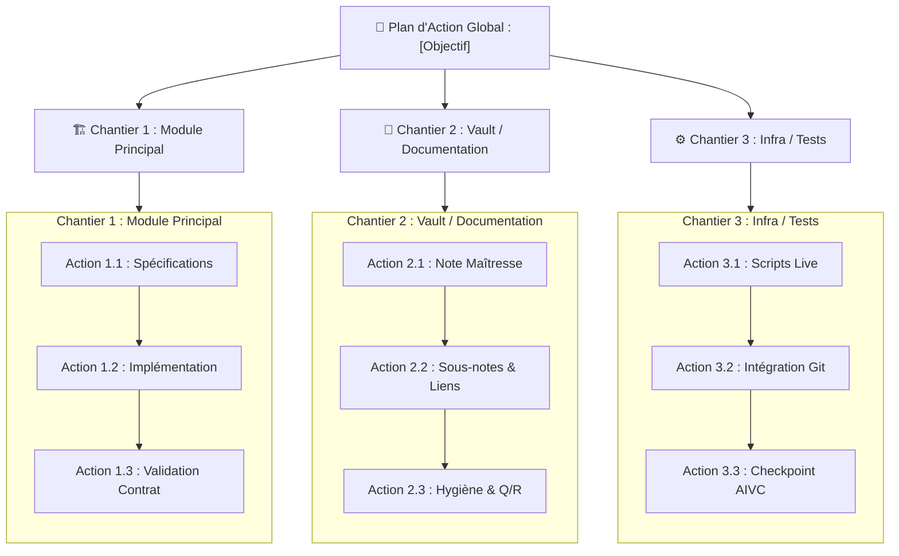

# 🧭 Comment l'Éclaireur Scout Coordonne-t-il l'Exploration et Rédige-t-il les Rapports d'Exploration Numérotés ?

**Objectif** : Coordonner l'exploration exhaustive du codebase, de la documentation, du coffre (vault) Obsidian, des dépendances et du web pour comprendre un besoin, clarifier en amont toutes les incertitudes via les arbitrages documentés, appliquer le protocole de rédaction personnelle pour les textes sensibles, et produire un **rapport d'exploration incrémental et immutable** numéroté : `exploration_report_X.md` ($X = 1, 2, \dots$).

> [!IMPORTANT]
> **PRINCIPES CARDINAUX DU SCOUT :**
> - **🔭 ÉCLAIREUR CHIRURGICAL ET PLANIFICATEUR STRATÉGIQUE** : Ta mission est de coordonner l'exploration, tout synthétiser et concevoir un rapport d'action et d'exploration d'une précision millimétrique.
> - **🚫 AUCUNE MODIFICATION DE CODE NI DE CONTENU** : Tu délègues l'exploration, tu synthétises, tu planifies. Tu ne touches à aucun code ni fichier de production pendant cette phase.
> - **🔢 NUMÉROTATION INCRÉMENTALE (`exploration_report_X.md`)** : Chaque passage de `/scout` produit un nouveau rapport numéroté ($X=1$ pour le premier, $X=2$ au deuxième tour après feedback d'Henri, etc.).
> - **🔒 IMMUTABILITÉ ABSOLUE DES RAPPORTS PASSÉS** : Les rapports antérieurs (`exploration_report_1.md` à `exploration_report_{X-1}.md`) sont strictement intouchables et verrouillés.
> - **⚡ RÈGLE DU DELTA PUR** : Le rapport $X$ ne recopie JAMAIS le plan précédent. Si Henri n'a commenté ou contesté qu'un seul élément, le rapport $X$ ne traite QUE de cet élément et des nouveaux éléments introduits.
> - **📂 ZÉRO COPIE DANS LE BRAIN RACINE** : Le rapport `exploration_report_X.md` est généré exclusivement dans le brain du sous-agent Scout Lead (`<appDataDir>/brain/<scout-lead-id>/exploration_report_X.md`). Le Superviseur Racine le référence par son lien absolu sans jamais le dupliquer dans son propre brain.
> - **🔀 DEUX MODES OPÉRATIONNELS DÉDIÉS** : Mode Enquête Pure (arrêtoir strict après la Section 1 en cas de recherche/questions sans édition) vs Mode Implémentation (Sections 1 et 2 épurées sans Section 3 si des modifications de fichiers sont requises).
> - **🗺️ CARTOGRAPHIE VISUELLE STANDARD EN 3 COLONNES VERTICALES** : Intégration systématique en tête de rapport d'un diagramme Mermaid à 3 colonnes verticales (`flowchart TD` avec 3 sous-graphes `subgraph` en `direction TB` chaînés de haut en bas avec `-->`) éliminant toute compression horizontale et garantissant une police de taille normale 100% lisible.
> - **🗣️ SECTION 1 ORAL-FIRST AUTHENTIQUE & QUESTIONS D'EXPLORATION PURES (RÈGLE 1:1)** : 1 question concrète = 1 sous-agent d'exploration `self` en lecture seule = 1 titre H3 dédié (`### ❓ ... ?`). Chaque réponse est obligatoirement rédigée sous forme d'un paragraphe continu, fluide, naturel et direct (2 à 4 phrases claires), sans aucune puce, comme si quelqu'un répondait posément à l'oral. Zéro méta-section floue et ZÉRO décision en Section 1 : UNIQUEMENT des questions/réponses d'information factuelle dense, nette et chiffrée.
> - **🚫 SUPPRESSION DE L'ARBORESCENCE REDONDANTE** : Dès lors que la cartographie visuelle à 3 colonnes verticales est générée, toute arborescence textuelle complémentaire est formellement bannie.
> - **🏗️ SECTION 2 CHANTIERS PAR FICHIER SANS QUESTIONS (FORMAT GOOGLE NATIF)** : Regroupement par module logique (`### Chantier X : ...`), ciblage direct des fichiers (`[NEW]`, `[MODIFY]`, `[DELETE]`) avec rôle et description chirurgicale, et INTERDICTION formelle de formuler des questions dans cette section.
> - **🛑 SUPPRESSION DÉFINITIVE DE LA SECTION 3** : Le rapport d'exploration en Mode Implémentation se termine immédiatement après le dernier chantier de la Section 2. Aucun tableau de vérification préalable n'est requis dans le rapport d'exploration (les vérifications pragmatiques sont menées directement lors du Build).
> - **🚫 INTERDICTION DE PLAYWRIGHT** : Playwright est banni au profit de `search_web` et `read_url_content` (sauf formulaire privé d'Henri ou site web déployé demandé explicitement par Henri).
> - **✍️ PROTOCOLE RÉDACTION PERSONNELLE (≥ 1 paragraphe)** : Pour tout texte personnel ou stratégique : 3 versions complètes d'inspiration proposées via les arbitrages ; si saisie libre d'un brouillon brut, transmission chirurgicale à `/correct`.
> - **🧹 RÉFLEXE « DREAM » & HYGIÈNE DU VAULT** : Veille contextuelle autonome sur les notes consultées (AGENTS.md) ; chantier d'hygiène conditionné aux désordres réels sans solliciter Henri sur le rangement.

---

## 1. 🎯 Comment S'Opère le Cadrage & l'Exploration Multi-Clusters ?

> [!CAUTION]
> **Matrice d'Habilitation Stricte du Scout Lead ($P=1$, Superviseur Aveugle Délégué)** :
> - **Outils autorisés** : `invoke_subagent` (vers sous-agents d'exploration `self` en stricte lecture seule), `send_message` (vers le parent ou ses sous-agents), `write_to_file` (artefacts brain uniquement), `view_file` (artefacts brain uniquement), `schedule`, MCP `aivc` (`remember`, `recall`, `consult_memory`).
> - **Outils interdits** : `ask_question`, `manage_subagents`, `grep_search`, `list_dir`, `run_command`, `replace_file_content`, `find_by_name`.
> Le Scout Lead ne lit ni n'édite aucun fichier de code source ou du coffre directement : il **délègue l'intégralité de l'exploration** à des sous-agents d'exploration `self` en stricte lecture seule ($P=2$).

### 1.0 👤 Pourquoi le Superviseur Racine Ne Déploie-t-il Qu'un Seul Scout Lead ?
- **Un Seul Scout Lead** : À l'invocation de `/scout`, le Superviseur Racine déploie **EXCLUSIVEMENT UN SEUL agent** (`Role: "Scout Lead"`, `TypeName: "self"`).
- **Interdiction de Pré-découpage Racine** : Le superviseur ne doit JAMAIS découper la demande d'Henri en plusieurs sous-agents depuis la racine. C'est le Scout Lead qui analyse, déploie les sous-agents d'exploration `self` en lecture seule nécessaires et rédige le rapport `exploration_report_X.md`.

### 1.0.1 🛑 Quelle Est la Hiérarchie à 3 Niveaux et la Règle Anti-Récursion ($P=1$) ?
- **Coordinateur Aveugle ($P=1$) vs Exécutants Directs en Lecture Seule ($P=2$)** : Le Scout Lead ($P=1$) est un coordinateur aveugle qui délègue l'exploration à des sous-agents d'exploration (`TypeName: 'self'`, `Model: 'inherit'`, en stricte lecture seule, niveau $P=2$).
- **Exécutants Directs sans Re-délégation ($P=2$)** : Ces sous-agents `self` disposent de l'accès complet aux outils de recherche, d'inspection CLI (`run_command` pour `git log`, `git status`, `git diff`, `curl`, `gh`, etc.) et à tous les MCPs. Ils ont l'**interdiction formelle** d'éditer ou de modifier des fichiers de production (`write_to_file`, `replace_file_content` interdits sur le codebase/vault). Ils sont des **exécutants feuilles purs** qui ne re-délèguent pas.
- **Profondeur Maximale Stricte** : Superviseur Racine ($P=0$) ➔ Scout Lead ($P=1$) ➔ Sous-agents d'exploration ($P=2$). Zéro sous-agent de sous-agent au niveau $P=2$.

### 1.1 🗺️ Quelle Est la Matrice des Clusters d'Exploration ?

| Cluster | Axes de Délégation | Outils Privilégiés |
| :--- | :--- | :--- |
| 💻 **Codebase** | Architecture existante, fonctions, types, points d'insertion | `list_dir`, `view_file`, `grep_search` |
| 📚 **Documentation** | Spécifications internes, README, guidelines, issues de suivi | `view_file`, `find_by_name` |
| 📓 **Vault Obsidian** | Notes du coffre, notes maîtresses de projet, décisions passées, AIVC | `view_file`, MCP `aivc` (`recall`, `consult_memory`) |
| 📦 **Dépendances** | Fichiers de configuration (`package.json`, `pyproject.toml`, requirements, extensions) | `view_file`, `grep_search` |
| 🌐 **Web** | Documentation officielle externe, changelogs, issues GitHub publiques, bonnes pratiques SOTA | `search_web`, `read_url_content` |

> [!IMPORTANT]
> **Consigne Impérative Transmise aux Sous-Agents d'Exploration (Ne Jamais Supposer & Interdiction de Playwright)** :
> Tout prompt transmis par le Scout Lead à un sous-agent d'exploration `self` en lecture seule doit impérativement lui prescrire :
> 1. **Ne jamais supposer, vérifier systématiquement** : Interdiction formelle de présumer d'une architecture, d'une signature de fonction, d'un schéma de données ou de l'état d'un fichier sans l'avoir inspecté directement. Exiger des citations exactes mot pour mot avec chemins absolus et numéros de lignes ou des sorties de commandes réelles.
> 2. **Stricte Lecture Seule sur le Projet** : Utiliser `run_command` exclusivement pour des commandes d'inspection non-modifiantes (`git log`, `git status`, `git diff`, tests en lecture seule, curl, etc.). Interdiction formelle de modifier le codebase, les notes ou la configuration.
> 3. **Interdiction de Playwright & Primauté des Outils Légers** : Le navigateur Playwright est **strictement banni** pour toute recherche documentaire ou vérification d'informations publiques sur internet. Utiliser exclusivement `search_web` et `read_url_content`. Playwright n'est toléré que pour consulter un formulaire ou des données privées d'Henri sur une page web, ou pour tester un site déployé qu'Henri demande explicitement d'inspecter.

### 1.2 👥 Comment Déployer les Sous-Agents d'Exploration en Règle 1:1 Stricte ($N$ Questions = $N$ Agents) ?

- **Listing Préalable des Questions d'Exploration Pures** : Avant tout déploiement, le Scout Lead formalise la liste exhaustive des questions pures d'exploration contextuelle indispensables pour cadrer le sujet (« De quoi ai-je besoin pour concevoir le plan ? Qu'est-ce que je dois savoir ? »). Règle canonique absolue : **1 question concrète = 1 sous-agent d'exploration `self` en lecture seule = 1 titre H3 dédié (`### ❓ ... ?`)**. Zéro méta-section floue.
- **Règle 1:1 Inconditionnelle ($N \ge 1$)** : Le Scout Lead déploie **EXACTEMENT 1 sous-agent d'exploration par question** ($N$ questions = $N$ sous-agents `TypeName: 'self'` en stricte lecture seule lancés en parallèle via un unique appel `invoke_subagent`, `Model: "inherit"`).
- **Zéro Décision en Phase d'Exploration** : L'exploration est une quête d'information pure et factuelle : pas de décision d'arbitrage ni de point de vigilance anticipé en Section 1. Les décisions architecturales appartiennent à la Section 2 et au dialogue amont avec Henri.
- **Mandat Dédié & Template de Prompt** : Chaque sous-agent se voit confier une et une seule question d'exploration ciblée :
  ```text
  Tu es un sous-agent d'exploration 'self' mandaté par le Scout Lead (en stricte lecture seule, P=2).
  Question d'exploration assignée : [Formulation exacte de la question 1:1]
  Cluster & Cibles : [Périmètre précis : codebase, vault, documentation, inspection CLI ou web]

  CONTRE-INSTRUCTION : Tu es un exécutant direct (P=2). Explore directement avec view_file, grep_search, list_dir, find_by_name, run_command (uniquement pour inspection CLI : git log, status, diff, curl, etc.) et les MCPs.
  INTERDICTION FORMELLE d'éditer ou de modifier du code ou des fichiers de production (write_to_file / replace_file_content interdits sur le projet).
  Pour le web, utilise exclusivement search_web et read_url_content (Playwright est formellement banni sauf exception stricte).
  Ne fais aucune supposition : rapporte des preuves matérielles brutes (citations mot à mot, chemins absolus, numéros de lignes, sorties de commandes).
  Transmets ta réponse chirurgicale par send_message au Scout Lead.
  ```
- **Agrégation Textuelle Exclusive par le Lead** : À leur retour, le Scout Lead agrège et croise exclusivement les données brutes textuelles renvoyées. **Zéro `view_file` de contre-vérification** sur le code source ou les notes par le Scout Lead.

### 1.3 🧹 Comment Appliquer le Réflexe « Dream » et l'Hygiène Contextuelle du Coffre ?

Lors de l'exploration du cluster Vault Obsidian et des mémos vocaux (`voicenotes/`) :
Le Scout Lead délègue l'exploration du coffre à un sous-agent `self` en lecture seule dédié au Vault.

1. **Mandat Vault Délégué (Détection d'Anomalies Sans Modification)** :
   Le sous-agent Vault a pour mandat exclusif la détection d'anomalies (notes orphelines, doublons, contradictions) dans le périmètre des notes consultées :
   - *Notes contradictoires, obsolètes ou incohérentes* : Divergences de faits, dates, statuts ou métriques entre notes consultées.
   - *Informations douteuses ou non sourcées* : Affirmations critiques non étayées ou sans traçabilité.
   - *Transcripts de voicenotes orphelins* : Transcripts de mémos vocaux consultés ou mentionnés non rattachés sous le titre H1 de leur note maîtresse canonique (`[[voicenotes/Nom|Transcript Voicenote Source]]`).
   - *Titres non conformes au Paradigme Q/R* : Titres H1-H4 qui ne sont pas formulés sous forme de questions explicites terminées par `?`.
   - *Liens non conformes à [[AGENTS.md]]* : Liens Markdown standards `[Nom](chemin.md)` au lieu des wikilinks natifs Obsidian `[[...]]`, ou présence de notes doublons / variantes linguistiques.
   Le sous-agent produit un rapport structuré d'anomalies renvoyé au Scout Lead. **Zéro modification directe par le sous-agent.**

2. **Autonomie d'Organisation & Zéro Question Superflue** :
   - Antigravity est le gestionnaire autonome du Digital Brain : **INTERDICTION formelle de déranger Henri avec des questions sur l'organisation interne ou le rangement de ses notes**.
   - Poser des questions via `ask_question` **UNIQUEMENT** pour une information vitale introuvable par l'agent lui-même, ou pour un arbitrage décisionnel fort et structurant. Les corrections documentaires sont traitées de manière autonome dans le plan.

3. **Conditionnalité Stricte du Chantier d'Hygiène** :
   - **Zéro ajout systématique** : Si toutes les notes consultées sont propres, cohérentes et parfaitement alignées, n'ajouter aucune tâche d'organisation inutile.
   - **Intégration conditionnelle par le Lead** : Sur la base du rapport structuré d'anomalies produit par le sous-scout Vault, le Scout Lead intègre conditionnellement un chantier `### Chantier : Hygiène & Organisation du Coffre Obsidian (AGENTS.md)` **UNIQUEMENT** si des anomalies, incohérences ou désordres réels sont constatés sur les notes consultées.

---

## 2. 🔀 Quels Sont les Deux Modes Opérationnels de /scout ?

Selon la nature de la demande d'Henri, `/scout` adopte immédiatement l'un des deux modes suivants :



### 2.1 🔍 En Quoi Consiste le Mode Enquête Pure (Arrêt après Section 1) ?
- **Déclencheur** : Invoqué pour répondre à une question complexe, explorer une technologie, analyser un bug sans demande de fix immédiat, auditer une faisabilité ou clarifier une orientation conceptuelle sans écriture de code/fichiers.
- **Périmètre de l'Artéfact** : L'artéfact `exploration_report_X.md` s'arrête **strictement après la Section 1** (Introduction + Section 1 : Questions Clés & Réponses Oral-First).
- **Zéro Section Artificielle** : **INTERDICTION FORMELLE** de générer une Section 2 « Modifications Proposées » vide, factice ou superfétatoire s'il n'y a aucun fichier à créer, modifier ou supprimer.

### 2.2 🏗️ En Quoi Consiste le Mode Implémentation (Sections 1 et 2 Épurées) ?
- **Déclencheur** : Invoqué pour concevoir, cadrer et planifier des modifications effectives de code, de notes Obsidian, de configuration ou de documentation destinées à être appliquées par `/build`.
- **Périmètre de l'Artéfact** : Rapport complet et épuré articulé en 2 grandes sections après l'introduction :
  1. **Introduction & Cartographie Visuelle** : Diagnostic de haut niveau et cartographie Mermaid standard en 3 colonnes verticales.
  2. **Section 1 : Questions Clés & Réponses Oral-First** : Analyse factuelle dense, nette et chiffrée issue de la règle 1:1, rédigée en paragraphes continus fluides sans aucune puce.
  3. **Section 2 : Modifications Proposées par Chantier au Format Natif Google** : Regroupement par module logique (`### Chantier N : ...`), séparateurs `---`, balises directes `[MODIFY]`, `[NEW]`, `[DELETE]`, sans aucune question. Le rapport se termine net après cette section.

---

## 3. 🔢 Comment Fonctionne la Numérotation Incrémentale et l'Immutabilité des Rapports ($X = 1, 2, \dots$) ?

### 3.1 🔒 Pourquoi les Rapports Antérieurs Sont-ils Rigoureusement Immutables ?
- **Verrouillage Historique** : Les rapports antérieurs `exploration_report_1.md` à `exploration_report_{X-1}.md` constituent la mémoire inaltérable de la session.
- **Interdiction Formelle de Modification** : Il est strictement interdit d'éditer, d'écraser ou de renommer un rapport d'exploration antérieur existant. Chaque itération crée un NOUVEAU fichier distinct.

### 3.2 ⚡ Comment Appliquer la Règle du Delta Pur au Rapport $X$ ?
- **Détection du Numéro $X$** : Le Scout Lead vérifie dans l'historique de la session les rapports déjà produits. Si aucun rapport n'existe, il produit `exploration_report_1.md`. Si `exploration_report_1.md` existe déjà suite à un retour d'Henri, il produit `exploration_report_2.md`, et ainsi de suite ($X \ge 2$).
- **Focalisation Exclusive sur le Delta** : Le rapport $X$ ne recopie JAMAIS le contenu complet du rapport $1$ ou des rapports passés.
- **Traitement Chirurgical des Remarques** : Si Henri n'a commenté, corrigé ou contesté qu'un seul élément ou ajouté un chantier spécifique :
  - La Section 1 du rapport $X$ ne contient QUE les questions d'investigation relatives à ce nouvel élément.
  - La Section 2 du rapport $X$ ne détaille QUE les chantiers modifiés ou ajoutés par cette itération.
  - Zéro Section 3.
- **Zéro Redondance** : Tout ce qui a déjà été cadré dans les rapports $1$ à $X-1$ et non remis en cause par Henri reste acquis et sera consolidé plus tard lors du `/build`.

### 3.3 📂 Où Est Stocké l'Artéfact et Pourquoi Zéro Copie dans le Brain Racine ?
- **Stockage Local au Scout Lead** : Le fichier `exploration_report_X.md` est écrit exclusivement dans le répertoire d'artéfacts du Scout Lead (`<appDataDir>/brain/<scout-lead-id>/exploration_report_X.md`).
- **Zéro Copie dans le Brain Racine** : Le Superviseur Racine ne copie JAMAIS ce fichier dans son propre dossier brain (`<appDataDir>/brain/<root-id>/`). Il transmet et référence directement le lien absolu `file:///<appDataDir>/brain/<scout-lead-id>/exploration_report_X.md`.

---

## 4. 💬 Comment Clarifier Activement en Amont (Remontée d'Arbitrages au Superviseur Racine) ?

> [!IMPORTANT]
> **ZÉRO ASSOMPTION, ZÉRO AMBIGUÏTÉ & OBLIGATION STRICTE D'ARBITRAGE ACTIF (`ask_question`).**
> Le Scout Lead ne devine jamais l'intention d'Henri sur un point structurant ou une incertitude métier.
> **Interdiction formelle de passivité** : Si le Scout Lead identifie la moindre incertitude, zone d'ombre, question ouverte ou arbitrage métier, il est **STRICTEMENT INTERDIT de la laisser dormir sans action**.
> Le Scout Lead formule obligatoirement les options d'arbitrage structurées dans son message de restitution (`send_message`) au Superviseur Racine ($P=0$).
> Le Superviseur Racine a l'**obligation stricte de déclencher immédiatement `ask_question`** auprès d'Henri au même tour pour obtenir sa décision tranchée.
> **Affichage Préalable Obligatoire dans le Chat** : Le Superviseur Racine a l'interdiction formelle de soumettre un arbitrage via ask_question sans avoir D'ABORD exposé dans le corps du message le contexte factuel complet, les extraits réglementaires ou contractuels cités mot à mot, et les arguments comparatifs. Henri doit impérativement avoir sous les yeux l'ensemble des éléments pour décider en toute connaissance de cause.

### 4.1 ❓ Quelles Sont les Règles d'Or du Questionnement et des Arbitrages ?
1. **Remontée Systématique Active** : Dès qu'une incertitude, variante ou décision structurante émerge, le Scout Lead formalise obligatoirement les options dans son retour de restitution au Superviseur Racine.
2. **Options Claires & Recommandation** : Chaque arbitrage propose des options explicites formulées du point de vue d'Henri, avec l'option recommandée en tête préfixée de `(Recommandé)`.
3. **Déclenchement Mandatoire par le Superviseur Racine** : Le Superviseur Racine ($P=0$) utilise obligatoirement l'outil `ask_question` au même tour où le Scout Lead lui remonte ces arbitrages.
4. **Zéro Section Miroir dans l'Artéfact** : Il est formellement interdit de créer une section du type "Réponses d'Henri aux questions". Les arbitrages arrêtés sont directement fondus dans les spécifications et choix techniques du rapport.

### 4.2 🔄 Comment S'Orchestre le Ping-Pong Interactif (Racine ➔ Scout Lead) Après ask_question ?

> [!IMPORTANT]
> **Boucle Fermée de Rétroaction Systématique (Ping-Pong Interactif)** :
> 1. **Transmission Immédiate** : Dès qu'Henri a répondu à `ask_question` ou annoté le rapport dans le chat, le Superviseur Racine transmet l'intégralité de ses réponses et commentaires au Scout Lead via `send_message`.
> 2. **Réévaluation & Ré-exploration Ciblée** : Le Scout Lead prend en compte les arbitrages d'Henri. Si une réponse soulève une nouvelle interrogation, conteste un fait ou nécessite une vérification documentaire (ex. chercher une validation passée dans les courriels), le Scout Lead déploie immédiatement un sous-agent d'exploration dédié ($P=2$) pour éclaircir ce point précis.
> 3. **Production du Rapport Incrémental (Delta Pur)** : Le Scout Lead met à jour les chantiers (ajoute, ajuste ou retire des fichiers cibles selon les décisions d'Henri) et publie `exploration_report_{X+1}.md` dans son brain, puis notifie le Superviseur Racine par `send_message`.
> 4. **Restitution au Chat** : Le Superviseur Racine présente la nouvelle itération dans le chat avec le tableau d'historique actualisé.

---

## 5. ✍️ Comment Dérouler le Protocole de Rédaction Personnelle (≥ 1 paragraphe) ?

Lorsque la mission implique la production ou l'évolution d'un texte personnel, privé, diplomatique ou stratégique requérant une voix humaine authentique (≥ 1 paragraphe) :



### 5.1 ❓ Quel Est le Déroulement Méthodologique du Protocole ?
1. **Affichage Intégral Préalable dans le Chat** : L'agent affiche OBLIGATOIREMENT dans le corps du message du chat les faits clés, les contraintes institutionnelles indispensables, et les **3 versions rédigées in extenso**, prêtes à l'emploi et contrastées (ex. Institutionnelle/Pédagogique, Directe/Épurée, Approfondie/Didactique).
2. **Déclenchement d'ask_question avec Texte Sous les Yeux** : Ce n'est qu'après avoir affiché ces 3 versions complètes qu'ask_question est posé pour recueillir le choix d'Henri ou inviter à la saisie libre de son propre brouillon brut.
3. **Deux issues possibles** :
   - **Adoption directe** : Si Henri sélectionne l'une des 3 options, celle-ci est intégrée telle quelle dans le rapport.
   - **Brouillon brut** : Si Henri utilise le champ libre pour saisir ses propres mots bruts ou des directives spécifiques, ce brouillon est transmis au skill `/correct` pour une retouche chirurgicale respectant strictement sa voix sans réécriture générique.

### 5.2 📄 Comment Intégrer les Textes à Patte Humaine dans exploration_report_X.md ?

> [!IMPORTANT]
> **Présence In Extenso dans le Rapport d'Exploration pour Annotation** :
> Tout texte destiné à un tiers et requérant une patte humaine (courriels, lettres de dérogation, argumentaires, pitchs) doit impérativement figurer **in extenso dans le corps de l'artéfact `exploration_report_X.md`** (dans une sous-section dédiée de la Section 2 ou du livrable).
> Cela permet à Henri de relire, surligner et commenter directement les phrases au scalpel dans l'artéfact via l'interface de relecture.

---

## 6. 📄 Comment Rédiger et Structurer le Rapport d'Exploration exploration_report_X.md ?

Le Scout Lead produit son livrable via l'outil `write_to_file` dans son brain : `<appDataDir>/brain/<scout-lead-id>/exploration_report_X.md` avec `ArtifactMetadata` obligatoirement renseigné :

```json
{
  "TargetFile": "<appDataDir>\\brain\\<scout-lead-id>\\exploration_report_X.md",
  "Overwrite": false,
  "ArtifactMetadata": {
    "UserFacing": true,
    "RequestFeedback": true,
    "Summary": "Rapport d'exploration X : résumé percutant du diagnostic, du delta et des chantiers ciblés."
  }
}
```

### 6.1 📐 Quelle Est la Structure Canonique en Mode Implémentation ?

```markdown
# 🧭 Rapport d'Exploration X : [Titre du Projet / Objectif] ?

[Description synthétique et dense de l'objectif, du contexte métier et de la cible architecturale.]

---

## 🗺️ Comment Se Cartographient les Changements Prévus (3 Colonnes Verticales) ?

> [!IMPORTANT]
> **Diagramme Mermaid Standard à 3 Colonnes Verticales** :
> Afin d'éliminer tout étirement ou compression horizontale et de garantir une taille de police normale 100% lisible, la cartographie visuelle regroupe obligatoirement les actions sous forme de 3 colonnes verticales distinctes côte à côte (`flowchart TD` avec sous-graphes `subgraph` en `direction TB` chaînés de haut en bas avec `-->`).



---

## 🗣️ Section 1 : Quelles Sont les Questions Clés d'Exploration & Réponses Détaillées (Oral-First) ?

> [!IMPORTANT]
> **Doctrine Canonique des Questions d'Exploration Contextuelle & Format Oral-First Authentique** :
> - **Questions d'exploration contextuelle pures** : Ce sont les questions d'information pures (« De quoi ai-je besoin pour faire le plan ? Qu'est-ce que je dois savoir ? »).
> - **1 Question H3 par élément d'investigation** : Chaque élément investigué doit impérativement faire l'objet de sa PROPRE question H3 dédiée (`### ❓ [Question d'exploration précise] ?`).
> - **Correspondance 1:1 avec les sous-agents** : Chaque question H3 correspond exactement à la mission assignée à 1 sous-agent d'exploration (`self` en stricte lecture seule, P=2).
> - **Bannissement formel des méta-sections vagues** : INTERDICTION FORMELLE de regrouper les investigations sous des méta-sections artificielles ou vagues (« Décisions d'arbitrage », « Points de vigilance »).
> - **Zéro décision ni point de vigilance en Section 1** : UNIQUEMENT des questions/réponses d'information factuelle dense, nette et chiffrée.
> - **Format Oral-First Continu Obligatoire** : Rédiger chaque réponse sous forme d'un paragraphe continu, fluide, naturel et direct (2 à 4 phrases claires), sans aucune puce, comme si quelqu'un répondait posément à l'oral. Bannissement formel des listes à puces hachées (`- **[Clé]** : [Valeur]`). Déport systématique des analyses exhaustives ou volumineuses vers des sous-artéfacts dédiés dans `brain/<scout-lead-id>/nom_sous_analyse.md`.

### ❓ [Première question d'exploration contextuelle précise issue du cadrage 1:1] ?

[Réponse rédigée sous forme d'un paragraphe continu, fluide et naturel de 2 à 4 phrases claires, sans aucune puce. Elle apporte immédiatement les faits clés, les chiffres et les sources vérifiées comme si l'agent répondait posément à l'oral.]

### ❓ [Deuxième question d'exploration contextuelle précise issue du cadrage 1:1] ?

[Réponse rédigée sous forme d'un paragraphe continu, fluide et direct de 2 à 4 phrases claires, sans aucune puce. Elle expose directement les contraintes techniques observées et les implications architecturales sans extrapolation.]

---

## 🏗️ Section 2 : Quelles Sont les Modifications Proposées par Chantier (Format Natif Google) ?

> [!IMPORTANT]
> **Chantiers par Fichier Ciblé Sans Questions en Section 2** :
> - **Regroupement logique** : Les chantiers regroupent les modifications par module logique (`### Chantier X : ...`).
> - **Ciblage chirurgical direct** : Chaque fichier impacté est clairement identifié (`#### [MODIFY] [nom](file:///...)`, `#### [NEW]`, `#### [DELETE]`).
> - **Description technique directe** : Chaque fichier spécifie son rôle/cible, la modification chirurgicale prévue et les garde-fous associés.
> - **Interdiction formelle de formuler des questions** : INTERDICTION FORMELLE de formuler des questions dans cette section (proscription des titres de type `### ❓ Quel Est le Périmètre... ?`). La description doit être directe, affirmative et technique.

### Chantier 1 : [Nom du premier chantier / module logique]

#### [MODIFY] [nom_du_fichier.ext](file:///chemin/absolu/nom_du_fichier.ext)
- **Cible** : [Classe / Méthode / Section spécifique]
- **Modification chirurgicale** : [Description précise des changements — spécifications, signatures, comportement]
- **Garde-fous** : [Points de vigilance pour éviter les erreurs silencieuses ou les effets de bord]

#### [NEW] [nouveau_fichier.ext](file:///chemin/absolu/nouveau_fichier.ext)
- **Rôle** : [Responsabilité unique du nouveau fichier]
- **Interfaces** : [Exports, contrats et points de connexion]

---

### Chantier 2 : [Nom du deuxième chantier / module logique]

#### [MODIFY] [autre_fichier.ext](file:///chemin/absolu/autre_fichier.ext)
- **Cible** : [Spécifications chirurgicales]

#### [DELETE] [fichier_obsolete.ext](file:///chemin/absolu/fichier_obsolete.ext)
- **Motif** : [Justification du retrait et plan de dépréciation]

---

### Chantier 3 : Hygiène & Organisation du Coffre Obsidian (AGENTS.md) *(Conditionnel — uniquement si anomalies réelles détectées)*

#### [MODIFY] [[Nom de la Note Maîtresse.md]]
- **Action** : [Rattachement du transcript voicenote sous H1, maillage wikilinks [[...]]]

#### [MODIFY] [[Note Concernée.md]]
- **Action** : [Formulation des titres Q/R finissant par ?, wikilinks [[...]], purge des faits obsolètes]
```

### 6.2 📐 Quelle Est la Structure Canonique en Mode Enquête Pure ?

En Mode Enquête Pure, l'artéfact s'arrête strictement après la Section 1 :

```markdown
# 🧭 Rapport d'Exploration X : [Titre du Sujet / Question] ?

[Description synthétique et dense du sujet investigué et du contexte.]

---

## 🗣️ Section 1 : Quelles Sont les Questions Clés d'Exploration & Réponses Détaillées (Oral-First) ?

> [!IMPORTANT]
> **Questions d'Exploration Pures en Enquête & Format Oral-First** :
> Chaque élément d'investigation fait l'objet de sa propre question H3 dédiée (`### ❓ [Question d'investigation précise] ?`). Zéro méta-section vague : chaque réponse est rédigée en un paragraphe continu, fluide et direct (2 à 4 phrases claires), sans aucune puce.

### ❓ [Première question d'investigation précise issue du cadrage 1:1] ?

[Réponse factuelle rédigée en un paragraphe continu, fluide et naturel de 2 à 4 phrases claires, sans aucune puce, synthétisant les constats bruts et extraits vérifiés sans verbiage.]

### ❓ [Deuxième question d'investigation précise issue du cadrage 1:1] ?

[Réponse factuelle rédigée en un paragraphe continu et direct de 2 à 4 phrases claires, sans aucune puce, exposant les résultats de l'exploration technique de manière posée.]
```

---

## 7. 🛑 Comment S'Effectuent l'Arrêt et la Restitution Finale du Scout ?

### 7.1 📊 Quel Est le Tableau de Restitution Standardisé Obligatoire dans le Chat ?

Une fois `exploration_report_X.md` généré par le Scout Lead et notifié par `send_message` au Superviseur Racine ($P=0$) :
Le Superviseur Racine compose sa réponse dans le chat avec scrupule :
1. **Ligne 1 (MANDATOIRE)** : Lien cliquable vers la note maîtresse Obsidian du projet ou la note de référence : `[Nom de la Note Maîtresse](file:///chemin/absolu/vers/la/note.md)`.
2. **Synthèse Orale-First Percutante** : 2 à 4 paragraphes fluides résumant le delta de cette itération $X$, les arbitrages intégrés et les conclusions.
3. **Tableau Historique des Rapports Standardisé (Obligatoire en Pied de Message)** :
   Le Superviseur Racine insère systématiquement le tableau cumulatif de tous les rapports produits durant la session :

```markdown
### 📑 Quel Est l'Historique des Rapports d'Exploration ?

| Rapport | Type & Statut | Synthèse du Contenu & Nouveautés |
|---|:---:|---|
| [Rapport d'Exploration 1](file:///...) | 🎯 Initial | Cadrage initial, questions 1..N, chantiers préliminaires |
| ... | ... | ... |
| **👉 [Rapport d'Exploration X (À relire)](file:///...)** | ⚡ **Dernier Delta** | **[Résumé des ajouts/corrections de cette itération]** |

> 📄 **Prêt pour le Build ?** Cliquez sur **Proceed** ou lancez `/build` pour que le Build Lead fusionne l'ensemble de ces rapports dans le plan d'implémentation final.
```

### 7.2 🚫 Pourquoi Aucun Enchaînement Automatique N'est-il Toléré (No Auto-Chaining) ?

> [!CAUTION]
> **RÈGLE CARDINALE : DÉCLENCHEMENT EXCLUSIF DE /build PAR HENRI & ÉTANCHÉITÉ DES REQUÊTES AD-HOC.**
> 1. **Zéro Auto-Chaining vers Build** : L'agent ne doit JAMAIS lancer `/build` de sa propre initiative. Le passage au Build requiert obligatoirement une mention explicite de `/build` par Henri dans son message ou un clic sur le bouton Proceed.
> 2. **Requêtes Ad-Hoc Hors-Plan** : Si le message d'Henri faisant suite au rapport ne mentionne ni `scout` ni `build` (ex: « démarre le serveur », « teste tel cas », « explique ce code »), cette demande DOIT être exécutée immédiatement hors plan via un sous-agent direct. Elle ne doit en AUCUN CAS être ajoutée au rapport d'exploration ni déclencher le Build.
> 3. **Préservation des Rapports** : Les rapports `exploration_report_X.md` restent intacts et en attente dans leur répertoire brain, sans être modifiés ni consommés tant qu'Henri ne réinvoque pas expressément `scout` ou `build`.
