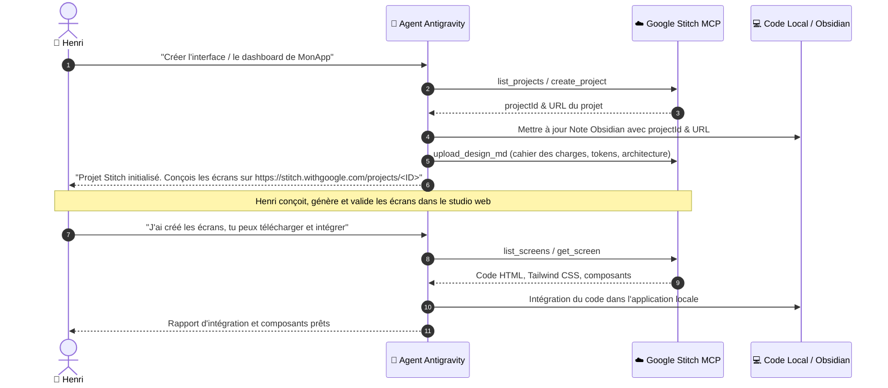

# 🎨 Comment Orchestrer le Studio UI Stitch en Synergie avec Henri ?

> [!IMPORTANT]
> **RÈGLE D'OR SYSTÉMATIQUE POUR TOUTE INTERFACE**
> Ce skill se déclenche **OBLIGATOIREMENT** dès qu'un chantier implique une interface graphique, web, dashboard, application mobile ou refonte de composants frontend.
> **RÉPARTITION CARDINALE DES RÔLES** :
> 1. **L'Agent** : Initialise le projet Stitch, injecte le cahier des charges, documente l'architecture, synchronise les tokens/code existant, et intègre le code final téléchargé.
> 2. **Henri** : Conçoit, génère, arbitre et retouche **100% des visuels et écrans** directement dans le studio Stitch.
> 3. **Interdiction Formelle** : L'agent ne doit **JAMAIS** générer d'écrans (`generate_screen_from_text`, `edit_screens`, `generate_variants`).

---

## 🌟 Quand et Pourquoi Activer le Skill Stitch ?

| Critère | Spécification |
|---|---|
| **Déclencheur Obligatoire** | Tout projet ou tâche nécessitant une interface visuelle, une refonte graphique, un composant UI ou un workflow utilisateur web/mobile. |
| **Bannissement du Code à l'Aveugle** | Interdiction formelle de coder des maquettes ou composants visuels ex nihilo sans passer par le studio Stitch d'Henri. |
| **Objectif Opérationnel** | Aligner en continu le studio de design Google Stitch avec le code source local, les tokens de design et le cahier des charges. |
| **Source de Vérité Design** | Le studio Google Stitch (piloté par Henri) pour les visuels ; le dépôt Git local pour l'implémentation. |

---

## ⚙️ Comment Est Configuré le Serveur MCP Stitch ?

Le serveur MCP Google Stitch est enregistré de manière centralisée dans `C:\Users\hjamet\.config\mcp\mcp_servers.json` :

```json
{
  "mcpServers": {
    "stitch": {
      "url": "https://stitch.googleapis.com/mcp",
      "serverUrl": "https://stitch.googleapis.com/mcp",
      "headers": {
        "X-Goog-Api-Key": "YOUR_STITCH_API_KEY"
      }
    }
  }
}
```

> [!NOTE]
> Les interactions s'effectuent en ligne de commande via `mcp-cli` avec `$env:MCP_NO_DAEMON="1"` afin de préserver la fenêtre de contexte de l'agent.

---

## 👥 Quelle Est la Répartition Stricte des Rôles Entre l'Agent et Henri ?

### 📥 1. Initialisation & Ingestion par l'Agent : Comment Alimenter Stitch ?

| Étape | Action de l'Agent | Commande / Mécanisme |
|---|---|---|
| **1. Détection / Création** | Vérifier si un projet Stitch existe déjà ou créer un nouveau conteneur. | `mcp-cli call stitch list_projects '{}'` ou `create_project '{"title": "<Nom>"}'` |
| **2. Ingestion Complète** | Transmettre **TOUT** le contexte fonctionnel au conteneur Stitch (cahier des charges, architecture, entités, user flows, tokens, contraintes). | `upload_design_md` (Markdown encodé en base64) ou `create_design_system` |
| **3. Ancrage Obsidian** | Consigner immédiatement les identifiants dans la note maîtresse Obsidian du projet (`#todo #project`). | Lien studio `https://stitch.withgoogle.com/projects/<projectId>`, `projectId`, liste d'écrans attendus |

### 🚫 2. Interdiction de Générer : Pourquoi l'Agent Ne Doit-il Jamais Créer d'Écrans ?

> [!CAUTION]
> **INTERDICTION STRICTE DE GÉNÉRATION D'ÉCRANS PAR L'AGENT**
> - **Outils Proscrits pour l'Agent** : `generate_screen_from_text`, `edit_screens`, `generate_variants`.
> - **Justification** : La conception esthétique, le choix des variantes, les nuances ergonomiques et l'arbitrage visuel sont le domaine exclusif d'Henri au sein du studio Stitch.
> - **Comportement Attendu** : Une fois le projet Stitch alimenté en contexte, l'agent **S'ARRÊTE** et notifie Henri avec l'URL du projet pour qu'il conçoive les écrans.

### 🔄 3. Synchronisation Ascendante : Comment Téléverser le Code Local vers Stitch ?

| Situation | Action Mandatoire | Outil / Procédure |
|---|---|---|
| **Composants Existants** | Extraire les tokens (couleurs, polices, espacements) et composants clés existants du code local. | Documenter dans un `DESIGN.md` synthétique. |
| **Téléversement Studio** | Pousser le `DESIGN.md` encodé en Base64 vers Stitch pour qu'Henri dispose des contraintes techniques dans son studio. | `upload_design_md` avec `{"projectId": "<ID>", "designMdBase64": "<base64>"}` |
| **Mise à Jour Système** | Si des tokens stricts Tailwind / CSS existent, instancier ou mettre à jour le design system Stitch. | `create_design_system` ou `update_design_system` |

### 📦 4. Consultation & Téléchargement : Comment Intégrer les Écrans Conçus par Henri ?

> [!IMPORTANT]
> **SIGNAL EXPLICITE D'HENRI REQUIS**
> L'agent n'interroge les écrans **QUE** lorsque Henri lui indique : *« j'ai créé les écrans »*, *« tu peux consulter »* ou *« télécharge l'UI »*.

| Étape | Action de l'Agent | Commande CLI |
|---|---|---|
| **1. Inventaire** | Lister les écrans créés par Henri dans le projet. | `mcp-cli call stitch list_screens '{"projectId": "<ID>"}'` |
| **2. Extraction** | Récupérer le code HTML, Tailwind CSS, métadonnées et assets pour chaque écran validé. | `mcp-cli call stitch get_screen '{"name": "projects/<ID>/screens/<screenId>"}'` |
| **3. Intégration Locale** | Découper et intégrer le code dans les composants de l'application locale (React, Next.js, Vue, templates HTML). | Édition chirurgicale des fichiers locaux dans le respect de l'architecture existante. |

---

## 🛠️ Quelles Sont les Commandes mcp-cli Canoniques pour Piloter Stitch ?

### 📋 Comment Gérer les Projets et Déposer les Spécifications ?

```powershell
# 1. Vérifier la connectivité
$env:MCP_NO_DAEMON="1"; mcp-cli info stitch

# 2. Lister les projets existants
$env:MCP_NO_DAEMON="1"; mcp-cli call stitch list_projects '{}'

# 3. Créer un nouveau projet pour une application
$env:MCP_NO_DAEMON="1"; mcp-cli call stitch create_project '{"title": "MonApp Dashboard"}'

# 4. Encoder et téléverser un document de spécifications / tokens DESIGN.md
$bytes = [System.IO.File]::ReadAllBytes("c:\chemin\vers\DESIGN.md")
$b64 = [Convert]::ToBase64String($bytes)
$payload = (@{ projectId = "12926192559519104991"; designMdBase64 = $b64 } | ConvertTo-Json -Compress)
$env:MCP_NO_DAEMON="1"; mcp-cli call stitch upload_design_md $payload
```

### 🔍 Comment Inspecter et Extraire les Écrans Validés ?

```powershell
# 1. Lister les écrans conçus par Henri
$env:MCP_NO_DAEMON="1"; mcp-cli call stitch list_screens '{"projectId": "12926192559519104991"}'

# 2. Récupérer le code source complet d'un écran
$env:MCP_NO_DAEMON="1"; mcp-cli call stitch get_screen '{"name": "projects/12926192559519104991/screens/defb95443539451cbcee97a74afa9681"}'

# 3. Récupérer les métadonnées d'un projet
$env:MCP_NO_DAEMON="1"; mcp-cli call stitch get_project '{"name": "projects/12926192559519104991"}'
```

### ⛔ Quels Outils de Génération Restent Formellement Interdits à l'Agent ?

| Outil Interdit | Raison de la Proscription | Acteur Exclusif |
|---|---|---|
| `generate_screen_from_text` | Risque de divergence stylistique et perte de maîtrise esthétique. | **Henri** (dans le studio web Stitch) |
| `edit_screens` | Retouches d'écrans réservées à l'œil d'Henri. | **Henri** (dans le studio web Stitch) |
| `generate_variants` | Exploration de variantes visuelles réservée à Henri. | **Henri** (dans le studio web Stitch) |

---

## 🔄 Quel Est le Cycle de Vie Complet d'un Chantier d'Interface Graphique ?



---

## 📑 Comment Consigner les Identifiants Stitch dans la Note Maîtresse Obsidian ?

Dès la création ou sélection du conteneur Stitch, consigner immédiatement dans la note maîtresse du projet sous la section appropriée :

```markdown
## 🎨 Comment l'Interface Est-elle Structurée dans Stitch ?

| Paramètre | Valeur |
|---|---|
| **Lien Studio Stitch** | [Ouvrir dans Stitch](https://stitch.withgoogle.com/projects/<projectId>) |
| **Project ID** | `<projectId>` |
| **Statut UI** | `En attente de conception par Henri` / `Écrans validés` / `Intégré` |
| **Dernière Synchronisation** | `AAAA-MM-JJ HH:mm` |
| **Écrans Clés** | `Dashboard Principal`, `Vue Détail`, `Paramètres` |
```
