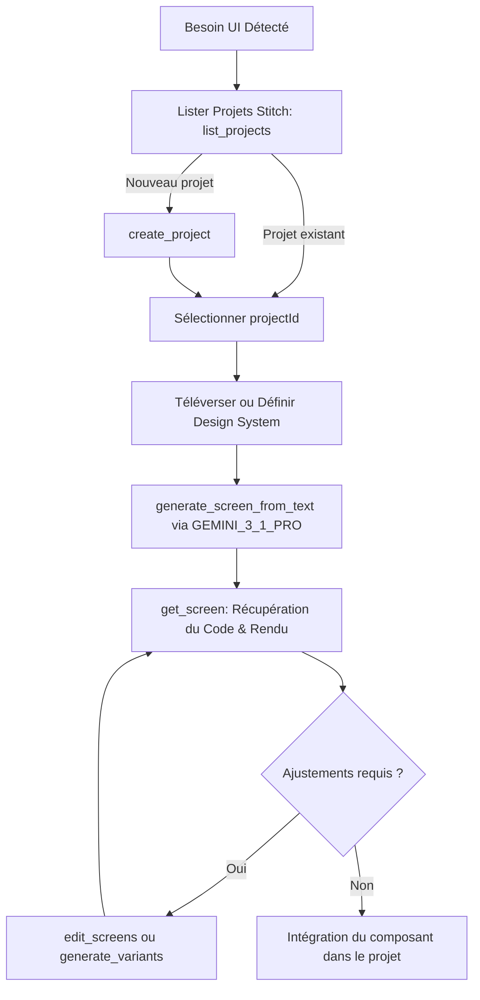

# Stitch — UI Generation & Design System Engine

Le skill **stitch** est le moteur officiel et impératif de génération d'interfaces graphiques, de design systems et de composants frontend pour Antigravity. Il pilote le serveur MCP distant Google Stitch (`https://stitch.googleapis.com/mcp`) en mode CLI-first via `mcp-cli` ou via l'intégration MCP native Antigravity.

---

## 1. Directive Impérative : Règle d'Or UI

> [!IMPORTANT]
> **INVOCATION SYSTÉMATIQUE POUR TOUTE INTERFACE**
> Dès qu'une interface web, application interactive, tableau de bord, composant frontend complexe ou maquette de design graphique est demandée :
> 1. **INTERDIT** de coder manuellement à l'aveugle des interfaces simplistes ou génériques.
> 2. **OBLIGATION** d'interroger ou de créer un projet Stitch, de générer les écrans et le design system via le MCP Stitch, et d'en extraire le code et les spécifications professionnelles de haute volée.

---

## 2. Configuration MCP Stitch

Le serveur MCP Stitch est configuré dans le registre centralisé `~/.config/mcp/mcp_servers.json` (et répliqué dans `.gemini/config/mcp_config.json`) :

```json
{
  "mcpServers": {
    "stitch": {
      "url": "https://stitch.googleapis.com/mcp",
      "serverUrl": "https://stitch.googleapis.com/mcp",
      "headers": {
        "X-Goog-Api-Key": "YOUR_STITCH_API_KEY"
      }
    }
  }
}
```

---

## 3. Commandes CLI-First (`mcp-cli`)

Conformément à la doctrine `mcp-manager`, l'interaction avec Stitch s'effectue principalement via `mcp-cli` afin d'éviter la saturation du contexte LLM :

```powershell
# Vérifier la connectivité et lister les 15 outils Stitch
$env:MCP_NO_DAEMON="1"; mcp-cli info stitch

# Inspecter le schéma d'un outil spécifique
mcp-cli info stitch/generate_screen_from_text
mcp-cli info stitch/create_design_system

# Appeler un outil avec payload JSON
mcp-cli call stitch list_projects '{}'
mcp-cli call stitch list_screens '{"projectId": "<ID>"}'
```

---

## 4. Panorama des 15 Outils MCP Stitch

| Catégorie | Outil | Description & Rôle | Paramètres Clés |
|-----------|-------|--------------------|-----------------|
| **Projets** | `list_projects` | Liste tous les projets Stitch accessibles | `filter` (ex: `"view=owned"`) |
| | `get_project` | Récupère la structure complète du projet, écrans et design systems | `name` (`projects/{id}`) |
| | `create_project` | Crée un nouveau conteneur de projet pour une application UI | `title` (string) |
| | `delete_project` | Supprime un projet Stitch | `name` (`projects/{id}`) |
| **Écrans** | `list_screens` | Liste l'ensemble des écrans d'un projet | `projectId` (sans préfixe) |
| | `get_screen` | Récupère le code généré, les métadonnées et l'URL du rendu | `name`, `projectId`, `screenId` |
| | `generate_screen_from_text` | **Génération majeure** : crée un nouvel écran à partir d'un prompt | `projectId`, `prompt`, `deviceType`, `modelId`, `designSystem` |
| | `edit_screens` | Modifie chirurgicalement un ou plusieurs écrans existants | `projectId`, `selectedScreenIds`, `prompt`, `deviceType`, `modelId` |
| | `generate_variants` | Explore 1 à 5 variations créatives d'un écran | `projectId`, `selectedScreenIds`, `prompt`, `variantOptions` |
| **Design System** | `upload_design_md` | Téléverse un fichier `DESIGN.md` encodé en base64 | `projectId`, `designMdBase64` |
| | `create_design_system` | Définit les tokens graphiques (couleurs, typo, roundness, spacing) | `projectId`, `designSystem` |
| | `create_design_system_from_design_md` | Extrait automatiquement un design system depuis un `DESIGN.md` | `projectId`, `selectedScreenInstance`, `deviceType` |
| | `update_design_system` | Met à jour les tokens graphiques d'un asset de design system | `name`, `projectId`, `designSystem` |
| | `list_design_systems` | Liste les design systems associés au projet ou globaux | `projectId` |
| | `apply_design_system` | Applique un design system à un ensemble d'écrans | `projectId`, `assetId`, `selectedScreenInstances` |

---

## 5. Modèles et Paramètres Recommandés

### Modèles d'inférence Stitch (`modelId`)
* `GEMINI_3_1_PRO` : **Recommandé par défaut**. Capacité maximale de raisonnement architectural, de structure CSS avancée (Flex/Grid), d'accessibilité et de raffinement esthétique.
* `GEMINI_3_FLASH` : Pour itérations ultra-rapides ou prototypes légers.
* *(Note : `GEMINI_3_PRO` est déprécié par le backend Google Stitch).*

### Types d'appareils (`deviceType`)
* `DESKTOP` : Interfaces de bureau, dashboards d'administration, applications SaaS.
* `MOBILE` : Applications mobiles, interfaces tactiles, vues PWA.
* `TABLET` : Vues hybrides et tablettes.
* `AGNOSTIC` : Composants ou designs indépendants du format.

---

## 6. Protocole de Travail Opérationnel



### Conventions de nommage des identifiants Stitch :
* `projectId` : ID numérique sous forme de chaîne pure (ex: `"12926192559519104991"`), **SANS** le préfixe `projects/`.
* `screenId` : Hash hexadécimal pur (ex: `"98b50e2ddc9943efb387052637738f61"`), **SANS** le préfixe `screens/`.
* `name` (ressource complète) : `projects/{projectId}` ou `projects/{projectId}/screens/{screenId}` selon le schéma de l'outil.
* `assetId` : ID numérique de l'asset (ex: `"15996705518239280238"`), **SANS** le préfixe `assets/`.
