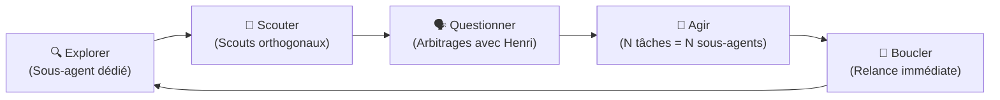
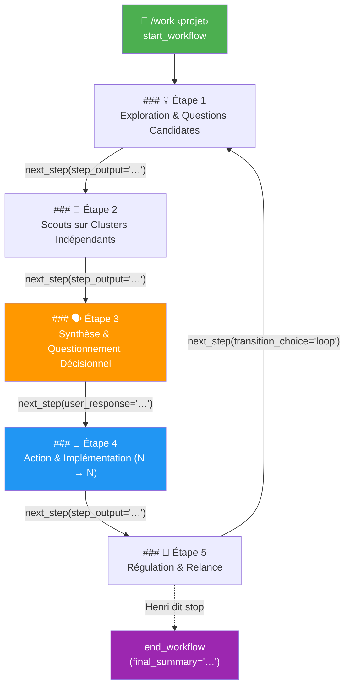
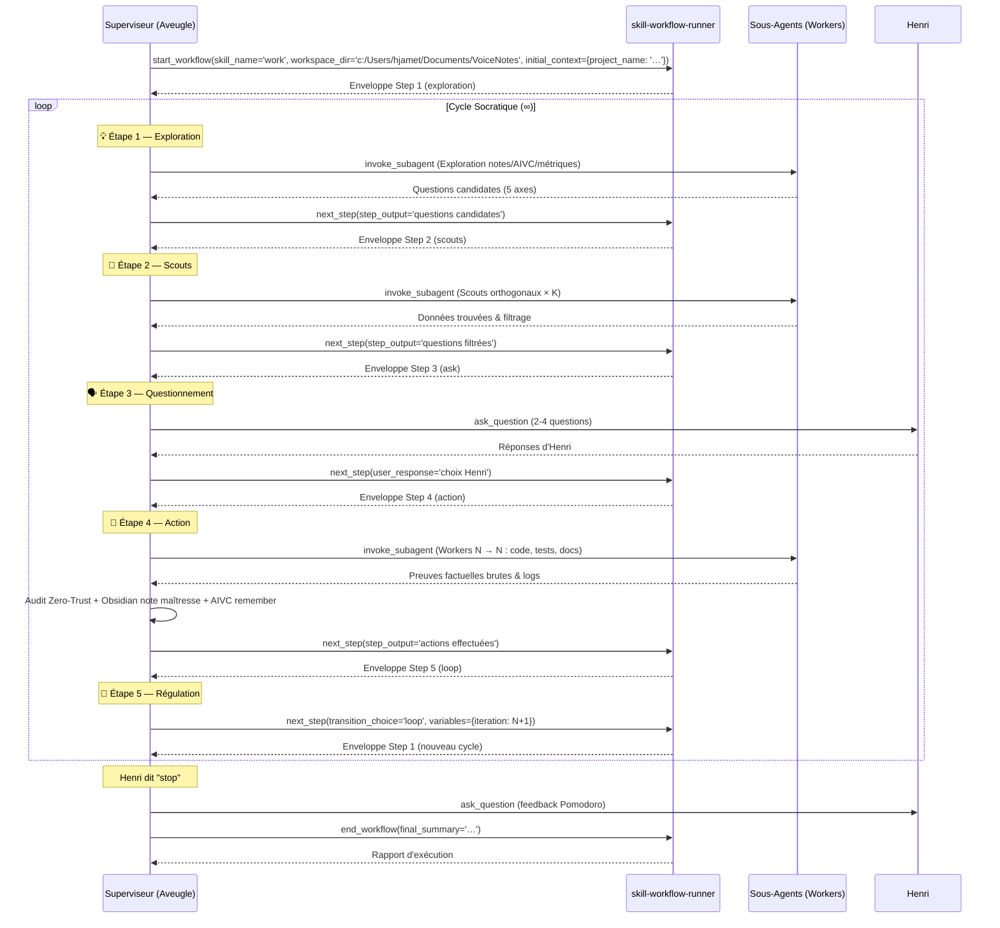

# 🔄 Skill `/work` — Boucle Socratique Continue & Questionnement Décisionnel

> [!TIP]
> **Moteur** : FastMCP `skill-workflow-runner` (mono-session déterministe — aucun `session_id` à gérer).
> **Philosophie** : Explorer d'abord, questionner ensuite, agir immédiatement, boucler sans fin.

---

## 🧭 1. Philosophie & Contrat de Travail



### 1.1 Doctrine du Superviseur Aveugle & Orchestration Pure (MANDATOIRE)
- **Le superviseur racine n'exécute JAMAIS aucune tâche de recherche, code, test ou écriture lui-même.**
- À chaque étape (Exploration, Scouts, Action), il déploie obligatoirement des sous-agents dédiés (`TypeName: 'self'`) et orchestre la boucle.
- Le superviseur conserve l'exclusivité du dialogue avec Henri (`ask_question`, arbitrage décisionnel) et la régulation du cycle FastMCP.
- **Audit Zéro-Confiance** : Le superviseur audite méthodiquement les rapports de ses sous-agents avec suspicion légitime (traquer fallbacks, hallucinations, incohérences).

### 1.2 Règle d'Or : Explorer Avant de Questionner
- **INTERDICTION ABSOLUE** de poser une question sans avoir préalablement vérifié via sous-agents que la réponse n'existe pas quelque part (notes, code, mails, web, mémoire AIVC).
- Une question n'est légitime **QUE si elle requiert une décision humaine** : arbitrage, préférence, validation stratégique, information personnelle.

### 1.3 Posture Socratique & Proactive
- **Ne pas attendre** : Identifier proactivement trous, incohérences, risques, opportunités via les sous-agents.
- **Faire réfléchir** : Formuler des questions qui stimulent la réflexion critique.
- **Challenger** : Remettre en question les choix existants, proposer des alternatives, souligner des angles morts.

### 1.4 Organisation des Notes : Sobriété & Clarté
- Enrichir et mettre à jour les notes existantes plutôt que multiplier les sous-notes.
- Chaque mise à jour rend la note plus propre, plus claire, plus actionnable.

---

## ⚡ 2. Déclencheur & Initialisation FastMCP

| Déclencheur | Intention |
| :--- | :--- |
| **`/work <projet>`** | Démarrer la boucle socratique continue sur un projet |
| **`/work`** (sans argument) | Reprendre sur le dernier projet actif (via AIVC `recall`) |

### 2.1 Séquence d'Initialisation (MANDATOIRE)

À chaque invocation `/work`, le superviseur exécute **dans cet ordre strict** :

```
┌─────────────────────────────────────────────────────────────────────────┐
│  1. LIEN OBSIDIAN (première ligne de la réponse)                       │
│     [Nom du Projet](file:///C:/Users/Jamet/Documents/VoiceNotes/     │
│     notes/NomProjet.md)                                                │
│                                                                        │
│  2. POMODORO (durée data.json, 60 min par défaut, sans demander la durée)│
│     → work "<NomProjet>" (skill project-memory) ou schedule 60 min     │
│                                                                        │
│  3. DÉMARRAGE WORKFLOW FastMCP                                         │
│     → call_mcp_tool(                                                   │
│         ServerName='skill-workflow-runner',                            │
│         ToolName='start_workflow',                                     │
│         Arguments={                                                    │
│           'skill_name': 'work',                                        │
│           'workspace_dir': 'c:/Users/hjamet/Documents/VoiceNotes',     │
│           'initial_context': { 'project_name': '<NomProjet>' }         │
│         }                                                              │
│       )                                                                │
└─────────────────────────────────────────────────────────────────────────┘
```

> [!IMPORTANT]
> **Règle du Pomodoro Permanent (Durée data.json / 60 min)** :
> - Durée déterminée par `data.json` (`pomodoroDuration`), **60 minutes (1h) par défaut** (réglages Obsidian d'Henri).
> - **Zéro demande de durée** : appliquer directement et de façon transparente la valeur de `data.json`.
> - Exception unique : Henri formule expressément une demande de durée différente.

> [!WARNING]
> **Aucun `session_id`** : Le serveur `skill-workflow-runner` gère une session mono-active par workflow. Les appels `start_workflow`, `next_step` et `end_workflow` n'exposent aucun identifiant de session — l'orchestration est entièrement déterministe.

---

## 🔁 3. Le Pipeline Socratique en 5 Phases

La boucle est **infinie** et découpée en **5 phases déterministes**, chacune ponctuée par un appel `next_step` au moteur FastMCP.

> [!CAUTION]
> **OBLIGATION D'AFFICHAGE DES TITRES** :
> À chaque exécution, le superviseur **DOIT** afficher les titres Markdown `### [Étape]` dans le chat pour traçabilité totale.



---

### 3.1 — 💡 Étape 1 : Exploration & Génération de Questions Candidates

Le superviseur déploie immédiatement un **sous-agent d'exploration dédié** (`TypeName: 'self'`) pour scanner et analyser le projet. Le superviseur racine étant aveugle, il n'explore ni ne lit jamais les notes ou fichiers lui-même.

**Protocole d'action du sous-agent d'exploration :**
1. Lire la **note maîtresse** du projet (`view_file`).
2. Lire les **sous-notes liées** (`[[Sous-Note.md]]`) référencées dans l'index.
3. Charger les métriques `project-memory` (`get "<NomProjet>"`).
4. Récupérer le contexte AIVC (`recall` si contexte passé requis).
5. Générer des questions candidates selon les **5 axes systématiques** :

| Axe | Focus | Exemple |
| :--- | :--- | :--- |
| 🎯 **Prochaines Actions** | Tâches `[ ]`, propositions d'expériences ou de code | « Le parseur PDF est implémenté. Dois-je lancer les tests d'intégration ? » |
| 🔬 **Réflexion Critique** | Incohérences architecturales, arbitrages à réévaluer | « Le cache ne gère pas l'invalidation concurrente — intentionnel ? » |
| 🌱 **Maturation Socratique** | Nouveaux cas d'usage, extensions, connexions inter-projets | « Avez-vous envisagé un mode hors-ligne ? » |
| 📊 **Résultats Manquants** | Données ou livrables non prouvés (Règle Zéro Assomption) | « Les métriques de performance sont mentionnées mais introuvables. » |
| ⚠️ **Vigilance & Risques** | Deadlines, dépendances, alertes mails | « Le certificat SSL expire dans 15 jours. » |

**Transition FastMCP :**
```
call_mcp_tool(
  ServerName='skill-workflow-runner',
  ToolName='next_step',
  Arguments={
    'step_output': '<liste des questions candidates + snapshot état projet>'
  }
)
```

---

### 3.2 — 🔭 Étape 2 : Déploiement des Scouts sur Clusters Indépendants

Pour chaque question candidate dont la réponse **pourrait** exister hors des notes, déployer des **sous-agents scouts dédiés** (`TypeName: 'self'`) sur les clusters indépendants :

| Cluster | Périmètre | Sous-agent |
| :--- | :--- | :--- |
| 📁 **Codebase** | Dépôts `code/`, scripts, configs | `self` |
| 🌐 **Web & Docs** | État de l'art, issues GitHub, plateformes | `self` |
| 📧 **Mails & Calendrier** | Échanges Spark, contacts, secrétariat | `self` |
| 🧠 **AIVC & Vault** | Notes connexes, transcriptions, mémoire | `self` |

> [!IMPORTANT]
> **Règle de Découpage par Cluster Indépendant** :
> $K$ clusters orthogonaux = $K$ sous-agents `self` simultanés. Ne JAMAIS regrouper deux périmètres distincts dans un seul sous-agent.

**Filtrage au retour des scouts :**
- ✅ Réponse trouvée → Intégrer directement dans les notes Obsidian, éliminer la question.
- 🔶 Réponse partielle → Affiner la question (ne demander à Henri que le delta décisionnel).
- ❌ Introuvable → Conserver pour l'arbitrage humain.

**Transition FastMCP :**
```
call_mcp_tool(
  ServerName='skill-workflow-runner',
  ToolName='next_step',
  Arguments={
    'step_output': '<questions filtrées + trouvailles intégrées>'
  }
)
```

---

### 3.3 — 🗣️ Étape 3 : Synthèse, Cadrage & Questionnement Décisionnel

Poser les questions filtrées via `ask_question`.

**Règles de formulation :**
1. **Format Socratique Contextualisé** : Chaque question inclut son contexte et des options claires.
2. **Rythme Contrôlé** : **2 à 4 questions maximum par cycle** (les plus urgentes d'abord).
3. **Zéro Question Triviale** : Arbitrage, orientation stratégique ou préférence d'Henri uniquement.
4. **Proposer des options** : Chaque question inclut des options actionnables avec une recommandation marquée `(Recommandé)`.

**Transition FastMCP :**
```
call_mcp_tool(
  ServerName='skill-workflow-runner',
  ToolName='next_step',
  Arguments={
    'user_response': '<réponses choisies par Henri via ask_question>'
  }
)
```

---

### 3.4 — 🚀 Étape 4 : Action, Implémentation & Mises à Jour

Dès qu'Henri valide ses réponses, exécuter les actions découlantes via des sous-agents dédiés (`TypeName: 'self'`).

> [!CAUTION]
> **LOI STRICTE $N \to N$ & EXÉCUTION DÉDIÉE PAR SOUS-AGENTS** :
> 1. **Zéro Exécution Directe par le Superviseur** : Le superviseur ne code, ne teste, et n'écrit jamais de code technique lui-même.
> 2. **Déploiement $N \to N$** : $N$ tâches = $N$ sous-agents parallèles (`TypeName: 'self'`). Zéro prompt composite.
> 3. **Audit Zéro-Confiance** : Le superviseur audite les retours (métriques brutes, logs, diffs) avant toute validation.
> 4. **Notes Obsidian & AIVC** : Actualisation de la note maîtresse et enregistrement du checkpoint AIVC `remember`.

**Transition FastMCP :**
```
call_mcp_tool(
  ServerName='skill-workflow-runner',
  ToolName='next_step',
  Arguments={
    'step_output': '<résumé des actions effectuées + mises à jour>'
  }
)
```

---

### 3.5 — 🔄 Étape 5 : Régulation, Bilan & Relance du Cycle

**Deux scénarios :**

#### Scénario A : Boucle Continue (par défaut — Enchaînement Immédiat)

> [!CAUTION]
> **INTERDICTION FORMELLE DE S'ARRÊTER AU STEP 5** :
> L'agent superviseur ne doit JAMAIS terminer son tour ni s'arrêter à l'Étape 5. Il doit immédiatement appeler :
> ```python
> call_mcp_tool(
>   ServerName='skill-workflow-runner',
>   ToolName='next_step',
>   Arguments={
>     'step_output': 'Cycle <N> terminé. Relance immédiate.',
>     'target_step_id': 'step_1_exploration'
>   }
> )
> ```
> et **enchaîner directement dans le même tour** sur l'Étape 1 (Exploration) et l'Étape 2 (Scouts) du cycle suivant !

#### Scénario B : Fin de Session (Henri dit « stop » OU Pomodoro écoulé)

1. **Interrogation interactive obligatoire** via `ask_question` : 4 options canoniques `["À l'aise", "OK", "Stressé", "Terminé"]` (suffixe ` (Recommandé)` selon marge calendaire).
2. **Exécution du feedback CLI** : `feedback "<NomProjet>" <action>` (choix d'Henri).
3. **Top 3 suivants** : `list --reviewed --top 3`.
4. **Clôture du workflow** :

```
call_mcp_tool(
  ServerName='skill-workflow-runner',
  ToolName='end_workflow',
  Arguments={
    'final_summary': '<bilan de session : N cycles, questions traitées, décisions prises, prochaines étapes>',
    'status': 'completed'
  }
)
```

---

## 🧠 4. Orchestration FastMCP — Récapitulatif des Appels

Le tableau ci-dessous récapitule la séquence complète d'appels MCP pour un cycle :



---

## 🔬 5. Grille des Questions Systématiques

À chaque cycle, le superviseur passe en revue cette grille :

| Axe | Question Générique | Signal Déclencheur |
| :--- | :--- | :--- |
| 🎯 **Prochaines Actions** | Quelle est la prochaine tâche prioritaire ? | Cases `[ ]` non cochées, roadmap pendante |
| 🔬 **Réflexion Critique** | Y a-t-il un problème caché, un bug latent, une dette ? | Code smell, incohérence architecturale |
| 🌱 **Maturation Socratique** | Comment enrichir ou faire évoluer le projet ? | Opportunités connexes, cas d'usage émergents |
| 📊 **Résultats Manquants** | Avons-nous tous les résultats nécessaires ? | Métriques citées sans chiffres, livrables absents |
| ⚠️ **Vigilance & Risques** | Quels deadlines, dépendances ou blocages ? | Dates butoirs proches, emails non lus |
| 🔗 **Connexions Inter-Projets** | Synergies avec d'autres projets du coffre ? | Composants mutualisables, duplications |

---

## 📊 6. Intégration avec l'Écosystème Antigravity

### 6.1 `project-memory`
- **Démarrage** : `get "<NomProjet>"` (métriques, deadlines, tâches) + Pomodoro automatique (durée `data.json`, 60 min).
- **Pendant** : `complete-task` à chaque tâche accomplie.
- **Fin de session** : `ask_question` (4 options canoniques) → `feedback` CLI selon choix Henri → Top 3 suivants.

### 6.2 `aivc` (Mémoire Long-Terme)
- **Début** : `recall` (si contexte passé du projet requis).
- **Après chaque décision** : `remember` détaillé (quoi, pourquoi, décisions, observations, prochaines étapes).

### 6.3 Sous-Agents (`TypeName: 'self'`)
- Briefer chaque sous-agent avec un contexte complet (objectif, architecture, fichiers, conventions).
- Modèle par défaut : `Model: 'inherit'`.

---

## 📖 7. Exemple Concret d'un Cycle

**Henri** : `/work Digital Language Learning Platform`

**Antigravity** :
> 📄 [Digital Language Learning Platform](file:///C:/Users/Jamet/Documents/VoiceNotes/notes/Digital%20Language%20Learning%20Platform.md)
>
> Boucle socratique lancée. Pomodoro (60 min) en cours.

```python
# 1. Initialisation FastMCP
call_mcp_tool(
    ServerName='skill-workflow-runner',
    ToolName='start_workflow',
    Arguments={
        'skill_name': 'work',
        'workspace_dir': 'c:/Users/hjamet/Documents/VoiceNotes',
        'initial_context': {'project_name': 'Digital Language Learning Platform'}
    }
)
```

*[Un sous-agent d'exploration dédié (TypeName: 'self') scanne la note maîtresse, sous-notes, métriques — génère 6 questions candidates]*

```python
# 2. Transition vers Étape 2
call_mcp_tool(
    ServerName='skill-workflow-runner',
    ToolName='next_step',
    Arguments={
        'step_output': '6 questions candidates générées sur 5 axes. Lancement de 3 scouts.'
    }
)
```

*[3 scouts parallèles (TypeName: 'self') : Scout Code ✅ (trouvé), Scout Mails ✅ (trouvé), Scout Web ❌ (introuvable)]*
*[2 questions éliminées, 1 affinée → 3 questions restantes pour Henri]*

```python
# 3. Transition vers Étape 3
call_mcp_tool(
    ServerName='skill-workflow-runner',
    ToolName='next_step',
    Arguments={
        'step_output': '3 questions filtrées prêtes pour arbitrage humain.'
    }
)
```

*[ask_question avec 3 questions contextualisées — Henri répond]*

```python
# 4. Transition vers Étape 4
call_mcp_tool(
    ServerName='skill-workflow-runner',
    ToolName='next_step',
    Arguments={
        'user_response': 'Q1: Oui lance le benchmark. Q2: LTR uniquement V1. Q3: Ajouter ticket V2.'
    }
)
```

*[2 sous-agents builders lancés en parallèle (TypeName: 'self'), audit Zero-Trust du superviseur, actualisation note Obsidian, AIVC remember]*

```python
# 5. Transition vers Étape 5 puis rebouclage
call_mcp_tool(
    ServerName='skill-workflow-runner',
    ToolName='next_step',
    Arguments={
        'step_output': 'Cycle 1 terminé. 3 décisions prises, 2 builders actifs.',
        'transition_choice': 'loop',
        'variables': {'iteration': 2}
    }
)
# → Le moteur renvoie l'enveloppe de l'Étape 1 du Cycle 2
```

---

## 🏁 8. Checklist d'Exécution

| # | Vérification | Outil / Action |
| :--- | :--- | :--- |
| 1 | Lien Obsidian en 1ère ligne | `[Projet](file:///…)` |
| 2 | Pomodoro lancé (data.json, 60 min) | `work` / `schedule` |
| 3 | Workflow FastMCP initialisé | `start_workflow` |
| 4 | Sous-agent d'exploration déployé | `invoke_subagent` (TypeName: 'self') |
| 5 | Contexte AIVC récupéré | `recall` (si requis) |
| 6 | 5 axes systématiques couverts | Grille §5 |
| 7 | Scouts parallèles déployés | `invoke_subagent` × K (TypeName: 'self') |
| 8 | Questions filtrées (2-4 max) | `ask_question` |
| 9 | Dispatch $N \to N$ par sous-agents | `invoke_subagent` × N (TypeName: 'self') |
| 10 | Audit Zero-Trust des retours | Métriques brutes, logs, diffs vérifiés |
| 11 | Note Obsidian actualisée | Note maîtresse (tableau de bord) |
| 12 | AIVC checkpoint | `remember` |
| 13 | `next_step` appelé à chaque transition | `call_mcp_tool` |
| 14 | Boucle relancée immédiatement | `transition_choice: 'loop'` |
| 15 | `end_workflow` à la clôture | `call_mcp_tool` |

---

## ⚠️ 9. Anti-Patterns

| ❌ Anti-Pattern | ✅ Correction |
| :--- | :--- |
| Superviseur explorant ou codant en direct | Déployer systématiquement des sous-agents dédiés (TypeName: 'self') à chaque étape |
| Demander la durée Pomodoro | Appliquer automatiquement la durée configurée dans data.json (60 min par défaut) |
| Omettre les titres d'étapes | Afficher `### [Étape]` à chaque phase |
| Regrouper clusters dans un scout | $K$ clusters = $K$ scouts parallèles |
| Poser des questions sans scouter | Explorer d'abord, questionner ensuite via sous-agents |
| Bombarder 10+ questions | 2-4 max, les plus impactantes |
| Questions vagues ou génériques | Contextualisées avec nom du projet |
| Assumer qu'un résultat existe | Exiger des preuves brutes et des logs vérifiés |
| Créer des dizaines de sous-notes | Enrichir l'existant, créer si nécessaire |
| Arrêter la boucle spontanément | Continuer jusqu'à arrêt explicite d'Henri |
| Ignorer les retours de sous-agents | Auditer avec Zero-Trust et synthétiser dans le chat |
| Attendre passivement | Suivre le cycle déterministe FastMCP |
| Oublier `next_step` entre les phases | Appeler systématiquement le moteur FastMCP |
| Passer un `session_id` | Le serveur gère la mono-session automatiquement |
