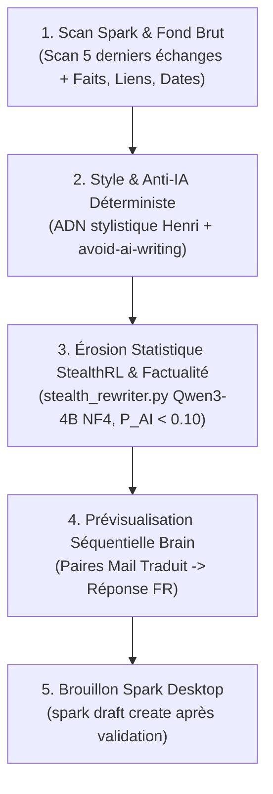

# ✉️ Comment Rédiger des E-mails au Style d'Henri Jamet avec le Pipeline en 4 Étapes ?

Ce skill formalise l'**ADN stylistique d'Henri Jamet**, les **deux règles fondamentales de contextualisation et de structuration**, ainsi que le **protocole d'orchestration obligatoire en 4 étapes ordonnées** pour la rédaction de courriels (via Spark Desktop et Obsidian).

> [!IMPORTANT]
> **Règle d'or d'orchestration — Zéro verbiage stylistique manuel** :
> Il est formellement interdit de récapituler, lister ou commenter manuellement les règles de style dans le chat ou dans la note de synthèse.
> Le sous-agent principal doit exécuter strictement et automatiquement l'orchestration séquentielle en 4 étapes :
> 1. **Étape 1 (Fond Brut & Scan Contextuel Spark)** : Scan contextuel des 5 derniers échanges Spark + Premier jet factuel brut (sous-agent classique).
> 2. **Étape 2 (Style & Anti-IA Déterministe)** : Application de l'ADN stylistique d'Henri et du repo `avoid-ai-writing` (purge des clichés IA, interdiction formelle des tirets cadratins `—`/`--`, concision naturelle). Le repo `avoid-ai-writing` suffit largement avec les consignes de style.
> 3. **Étape 3 (Érosion Statistique StealthRL & Garde-Fou Fermé)** : Exécution de `python antigravity/scripts/stealth_rewriter.py <passage>` (modèle Qwen3-4B NF4, 90% VRAM, scoring CPU), validation stricte par le sous-agent des faits/chiffres/dates, et interdiction formelle de reformuler après StealthRL.
> 4. **Étape 4 (Prévisualisation Séquentielle & Brouillon Spark Sécurisé)** : Prévisualisation dans l'artéfact Brain sous forme séquentielle (Mail traduit $\to$ Réponse FR), validation explicite par Henri dans le chat, puis création du brouillon Spark (`spark draft create`) sans envoi direct (`spark action send` strictement interdit).

---

## 📌 Quelles Sont les Deux Règles Fondamentales ?

### 🔍 1. Scan Obligatoire des 5 Derniers Échanges
- **Objectif** : Toujours scanner la boîte e-mail pour les 5 derniers échanges avec le correspondant s'ils existent (`spark search --filter "from:<email>"`, `spark search --filter "to:<email>"` ou `spark thread <id>`).
- **Finalité** : Capturer avec précision la nature de la relation, le degré de formalité, le ton exact, l'historique immédiat et la situation contextuelle réelle (ex: date de la dernière rencontre physique, sujets en cours).

### 📑 2. Structuration Séquentielle (E-mail Reçu Traduit ➔ Réponse Associée)
- **Objectif** : Toujours structurer l'artefact ou la note de correspondance sous forme de paires séquentielles claires et indissociables :
  - **E-mail Original Traduit en Français** : Traduction intégrale et fidèle du message reçu.
  - **Brouillon de Réponse en Français** : Proposition de réponse d'Henri placée immédiatement en dessous.
- **Format séquentiel** : Mail 1 ➔ Réponse 1, Mail 2 ➔ Réponse 2, Mail 3 ➔ Réponse 3. Ne jamais regrouper tous les mails reçus d'un côté et toutes les réponses de l'autre.

---

## 🎯 Quel Est le Protocole d'Orchestration Obligatoire en 4 Étapes ?



### 1. Étape 1 : Scan Contextuel & Fond Brut Factuel (Sous-agent Standard)
- **Rôle** : Scanner les 5 derniers échanges Spark avec le correspondant pour verrouiller le contexte, puis extraire et assembler les faits bruts du fil de discussion (destinataires, dates, liens, pièces jointes, contraintes logistiques et points clés).
- **Livrable intermédiaire** : Une ébauche factuelle brute, exhaustive et exacte sans recherche stylistique ni fard.
- **Action immédiate** : Zéro bavardage, zéro règle de style affichée. Enchaîner immédiatement sur l'Étape 2.

### 2. Étape 2 : Style & Anti-IA Déterministe (Sous-agent Standard)
- **Rôle** : Infuser l'ADN stylistique d'Henri Jamet et appliquer les filtres anti-IA déterministes.
- **Règles d'or** :
  * Application stricte de l'ADN stylistique d'Henri (ton direct, concis, chaleureux, paragraphes continus, smileys textuels `:)`, formule signature finale `Joyfully,` / `Joyeusement,`, zéro bloc de signature).
  * Application stricte du repo `avoid-ai-writing` : purge intégrale des clichés IA, interdiction absolue des tirets cadratins (`—`, `--`), zéro gras, zéro liste à puces artificielle.
  * Le repo `avoid-ai-writing` suffit largement avec les consignes de style, pas besoin d'ajouter d'autres instructions.
  * Réalisé par un sous-agent classique standard (aucune mention ni dépendance à `independent-agents`).

### 3. Étape 3 : Érosion Statistique StealthRL & Garde-Fou Fermé
- **Rôle** : Effondrer l'empreinte statistique neuronale et certifier la factualité.
- **Exécution** :
  ```bash
  python antigravity/scripts/stealth_rewriter.py "<texte_poli>"
  ```
  *(Modèle Qwen3-4B NF4, 90% VRAM, scoring CPU).*
- **Validation stricte par le sous-agent** : Audit sceptique et impitoyable de la factualité. Traque rigoureuse des hallucinations et erreurs factuelles introduites par le modèle Qwen3-4B (dates, créneaux horaires, noms de personnes, liens, engagements).
- **Règle d'or absolue** : **INTERDICTION FORMELLE de reformuler le texte après StealthRL**. Corriger UNIQUEMENT les erreurs factuelles ou éléments déformés afin de ne pas restaurer les motifs statistiques détectables par les classifieurs IA.
- **Certification Anti-IA** : Exécution d'`ai_detector.py` au seuil strict de 10% ($P(\text{AI}) < 0.10$).

### 4. Étape 4 : Prévisualisation Séquentielle Brain & Brouillon Spark Sécurisé
- **Rôle** : Présentation du résultat dans l'artéfact Brain sous forme de paires séquentielles (Mail traduit $\to$ Réponse associée proposée), validation explicite par Henri dans le chat, puis création sécurisée du brouillon Spark Desktop (`spark draft create`).
- **Édition Strictement Chirurgicale Bloc par Bloc** :
  * Si les échanges ou propositions s'intègrent dans un fichier ou une note existante : **INTERDICTION ABSOLUE de tout réécrire d'un coup ou d'écraser le document entier avec `write_to_file` (`Overwrite: true`)**.
  * **Obligation d'opérer bloc par bloc** : Utilisation EXCLUSIVE de `replace_file_content` ciblant des blocs précis et délimités.
- **Sécurité Spark** : Interdiction absolue d'exécuter `spark action send`. L'envoi reste manuel par Henri ou validé explicitement sans ambiguïté.

---

## ✒️ Quel Est l'ADN Stylistique d'Henri Jamet (Charte de Référence) ?

### 1. Rythme, Concision Extrême & Forme Épurée
- **Aller droit au but & Densité maximale** : Pas de préliminaires verbeux, pas de récapitulatif perroquet du mail reçu. La première phrase traite immédiatement le sujet ou pose une réaction chaleureuse et directe. Tout ce qu'il faut savoir en peu de phrases claires et efficaces. On ne répète jamais une phrase pour ne rien dire.
- **Zéro gras (`**mot**`)** : Aucun mot en gras dans le corps de l'e-mail. Le relief vient du choix des mots et du rythme des phrases, pas d'artifices typographiques.
- **Zéro liste à puces artificielle (`-`, `*`)** : Bannir le réflexe IA de transformer chaque idée en liste à puces. L'e-mail s'écrit en **paragraphes continus, fluides et élégants** (style épistolaire naturel). *(Exception unique : liste factuelle de créneaux horaires ou mini-tableau synthétique compact expressément autorisé pour comparer des projets/jalons de manière limpide).*
- **Zéro séparateur (`---`) et zéro titre Markdown (`#`, `##`)** : Un e-mail est une correspondance humaine, pas un rapport technique ni un README.
- **Zéro tiret cadratin (`—`) ou tiret d'incise (`–`)** : Proscrire les tirets longs au milieu des phrases (marqueur IA typique). Utiliser des virgules, des points ou des conjonctions naturelles.

### 2. Ton : Chaleur Humaine, Complicité Académique & Dynamisme
- **Complicité académique & Joie de collaborer** : Ton d'égal à égal, très respectueux, bienveillant, enthousiaste et vif avec les collègues, chercheurs, doctorants et étudiants (ex: *"I'd be very happy to supervise..."*, *"C'est avec grand plaisir !"*, *"Super initiative !"*).
- **Ponctuation vivante & dynamique** : Point d'exclamation naturel dès la salutation ou l'accroche pour marquer un accueil chaleureux et sincère.
- **Émojis exclusivement textuels** : Placer quelques smileys textuels légers et expressifs en fin de phrase (`:)`, `^^`, `;)` ou `:D`) pour donner vie et humanité au message. Bannir absolument les émojis graphiques Unicode dans le corps des e-mails.
- **Sobriété juste vs emphase creuse** : Exprimer un enthousiasme sincère et incarné sans adjectifs outranciers (*"delighted"*, *"with pleasure"*, *"ravi"* plutôt que les superlatifs mécaniques d'IA).

### 3. Salutations & Clôture Signature
- **Règle du Miroir pour la Salutation** : S'adapter au degré de formalité de l'interlocuteur (ex: *"Dear Henri,"* -> *"Dear <Prénom>,"* / *"Bonjour Henri,"* -> *"Bonjour <Prénom>,"*).
- **Formule de Clôture Signature** :
  - **Collaborations, collègues, recherche, étudiants, contacts humains** :
    - En Anglais : `Joyfully,`
    - En Français : `Joyeusement,`
  - **Formalités administratives / institutionnelles rigides** : Règle du miroir (ex: `Best regards,`, `Bien cordialement,`).
- **INTERDICTION STRICTE DE BLOC DE SIGNATURE DANS LE CORPS DU TEXTE** :
  - Ne **JAMAIS** écrire de nom, affiliation ou bloc de coordonnées après la formule de clôture (ex: AUCUN *"Henri Jamet"*, *"Henri"*, *"Doctorant..."*).
  - La dernière ligne du mail est STRICTEMENT la formule de politesse (ex: `Joyfully,`). Spark Desktop appose automatiquement la signature HTML officielle.

---

## 🚫 Comment Éradiquer les Marqueurs IA Spécifiques ?

| Marqueur IA Typique (À ÉLIMINER) | Correction Style Henri |
| :--- | :--- |
| **Intro perroquet / Remplissage** : *"I hope this email finds you well"*, *"Thank you for reaching out regarding..."*, *"J'espère que vous allez bien..."* | **Attaque directe & chaleureuse** : *"Great to hear from you!"*, *"Thanks for the update!"*, ou réponse directe au fond. |
| **Connecteurs lourds / scolaires** : *"Furthermore"*, *"Moreover"*, *"In addition"*, *"En outre"*, *"Il convient de noter que"*, *"Il est important de souligner"* | **Transitions fluides et naturelles** : Conjonctions simples (*"Also"*, *"And"*, *"Et"*, *"Pour ce qui est de"*), ou simple saut de paragraphe. |
| **Adjectifs d'emphase creuse** : *"pivotal"*, *"fascinating"*, *"multifaceted"*, *"crucial"*, *"invaluable"* | **Vocabulaire simple, juste et direct**. |
| **Outro mécanique** : *"Please do not hesitate to reach out if you have any further questions"*, *"Restant à votre entière disposition"* | **Conclusion humaine et brève** : *"Let me know if that works for you!"*, *"On se cale ça vite :)"*, *"Looking forward to our chat!"*. |
| **Découpage en puces systématique** : Découper 3 phrases simples en 3 puces avec des mots en gras au début. | **Prose en 2 ou 3 paragraphes courts et élégants**. |

---

## 🤖 Quel Est le Guide d'Exécution Technique ?

### 1. Étape 3 — Exécution de l'Érosion Statistique (`stealth_rewriter.py`)

```bash
# Érosion statistique neuronale sur le passage poli par le sous-agent
python antigravity/scripts/stealth_rewriter.py "<texte_poli>"
```

### 2. Étape 3 — Audit Anti-IA & Factualité (`ai_detector.py`)

```bash
# 1. Audit complet du texte StealthRL avec heatmap phrase par phrase
python antigravity/scripts/ai_detector.py "<texte_stealth>"

# 2. Validation au seuil strict de 10% avec rapport JSON pour les sous-agents
python antigravity/scripts/ai_detector.py "<texte_stealth>" --threshold 0.10 --json
```

### 3. Étape 4 — Création Sécurisée du Brouillon Spark Desktop

```bash
# Création du brouillon dans Spark Desktop UNIQUEMENT après validation par Henri dans le chat
spark draft create --to "<destinataire>" --subject "<sujet>" --body "<corps_final>"
```

---

## 🛡️ Pourquoi la Prévisualisation Brain Est-elle Obligatoire AVANT toute création Spark ?

1. **Interdiction de création immédiate dans Spark** : Il est STRICTEMENT INTERDIT d'exécuter `spark draft create` ou `spark draft edit` sans prévisualisation validée.
2. **Traçabilité Exhaustive des Itérations (MANDATOIRE)** : L'artéfact Brain de prévisualisation doit obligatoirement consigner l'audit trail complet des passes pour garantir une transparence scientifique totale :
   - **Passe 1** : Scan Spark & Premier jet factuel brut (Faits, dates, liens, contraintes).
   - **Passe 2** : Version stylisée (ADN stylistique Henri + règles du repo `avoid-ai-writing`, sous-agent classique).
   - **Passe 3** : Version StealthRL (`stealth_rewriter.py`) + Audit de factualité et score certifié ($P(\text{AI}) < 0.10$).
   - **Passe 4** : Version finale livrable (Langue originale Spark + Traduction française) prête pour création de brouillon Spark après accord.
3. **Revue & Annotations par Henri** : Henri lit le projet sur son écran, annote ou valide. Partager **EXCLUSIVEMENT** le lien vers l'artéfact Brain dans le fil de discussion Antigravity.
4. **Création Spark uniquement après validation** : `spark draft create` n'est appelé que lorsque Henri a expressément validé le texte.
5. **Verrouillage strict de l'envoi** : L'envoi définitif (`spark action send`) est STRICTEMENT INTERDIT à tout agent ou script sans confirmation explicite finale d'Henri.

---

## 🛠️ Comment Se Déroule la Synthèse Visuelle du Flux d'Exécution ?

```
1. Scan Spark des 5 derniers échanges + Fond brut factuel (Sous-agent classique)
       ↓
2. Style Henri & Anti-IA Déterministe (avoid-ai-writing + ADN stylistique, sous-agent classique)
       ↓
3. Érosion Statistique StealthRL & Audit Factualité (stealth_rewriter.py, P_AI < 0.10, zéro reformulation)
       ↓
4. Prévisualisation Séquentielle Brain (Mail 1 traduit -> Réponse 1 FR) & Validation par Henri
       ↓
5. Création sécurisée du brouillon Spark Desktop (spark draft create)
       ↓
6. Envoi manuel par Henri ou confirmation explicite pour envoi assisté (spark action send)
```