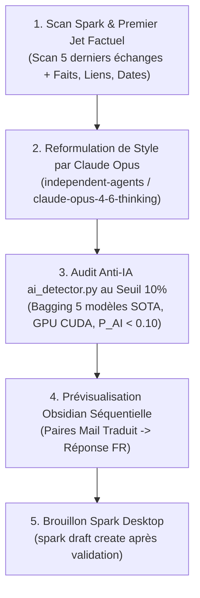

# ✉️ Comment Rédiger des E-mails au Style d'Henri Jamet avec le Pipeline en 3 Étapes ?

Ce skill formalise l'**ADN stylistique d'Henri Jamet**, les **deux règles fondamentales de contextualisation et de structuration**, ainsi que le **protocole d'orchestration obligatoire en 3 étapes ordonnées** pour la rédaction de courriels (via Spark Desktop et Obsidian).

> [!IMPORTANT]
> **Règle d'or d'orchestration — Zéro verbiage stylistique manuel** :
> Il est formellement interdit de récapituler, lister ou commenter manuellement les règles de style dans le chat ou dans la note de synthèse.
> Le sous-agent principal doit exécuter strictement et automatiquement l'orchestration séquentielle en 3 étapes :
> 1. **Passe 1** : Scan contextuel Spark + Premier jet factuel brut (sous-agent standard).
> 2. **Passe 2** : Appel obligatoire à Claude Opus (`independent-agents`) pour infuser le style authentique d'Henri.
> 3. **Passe 3** : Exécution de l'audit anti-IA par `ai_detector.py` au seuil 10% ($P(\text{AI}) < 0.10$) pour purger chirurgicalement les traces d'IA résiduelles et certifier le score avant livraison directe.

---

## 📌 Quelles Sont les Deux Règles Fondamentales ?

### 🔍 1. Scan Obligatoire des 5 Derniers Échanges
- **Objectif** : Toujours scanner la boîte e-mail pour les 5 derniers échanges avec le correspondant s'ils existent (`spark search --filter "from:<email>"`, `spark search --filter "to:<email>"` ou `spark thread <id>`).
- **Finalité** : Capturer avec précision la nature de la relation, le degré de formalité, le ton exact, l'historique immédiat et la situation contextuelle réelle (ex: date de la dernière rencontre physique, sujets en cours).

### 📑 2. Structuration Séquentielle (E-mail Reçu Traduit ➔ Réponse Associée)
- **Objectif** : Toujours structurer l'artefact ou la note de correspondance sous forme de paires séquentielles claires et indissociables :
  - **E-mail Original Traduit en Français** : Traduction intégrale et fidèle du message reçu.
  - **Brouillon de Réponse en Français** : Proposition de réponse d'Henri placée immédiatement en dessous.
- **Format séquentiel** : Mail 1 ➔ Réponse 1, Mail 2 ➔ Réponse 2, Mail 3 ➔ Réponse 3. Ne jamais regrouper tous les mails reçus d'un côté et toutes les réponses de l'autre.

---

## 🎯 Quel Est le Protocole d'Orchestration Obligatoire en 3 Étapes ?



### 1. Étape 1 : Scan Contextuel & Premier Jet Factuel Brut (Sous-agent Principal)
- **Rôle** : Scanner les 5 derniers échanges Spark avec le correspondant pour verrouiller le contexte, puis extraire et assembler les faits bruts du fil de discussion (destinataires, dates, liens, pièces jointes, contraintes logistiques et points clés).
- **Livrable intermédiaire** : Une ébauche factuelle brute, exhaustive et exacte sans recherche stylistique.
- **Action immédiate** : Zéro bavardage, zéro règle de style affichée. Enchaîner immédiatement sur l'Étape 2.

### 2. Étape 2 : Boucle Interactive Claude Opus & Détecteur IA Autonome
- **Rôle** : Rédiger, évaluer et affiner le mail de manière holistique jusqu'à la version optimale.
- **Moteur d'exécution** : Appel direct à Claude Opus (`antigravity-agents run --model opus` ou `start_independent_agent`) avec accès aux commandes d'évaluation neuronale.
- **Protocole d'itération par Claude Opus** :
  1. **Rédaction initiale** : Application stricte de l'ADN stylistique d'Henri Jamet (ton direct, concis, chaleureux, paragraphes continus, smileys textuels `:)`, `Joyfully,`).
  2. **Auto-évaluation via l'outil** : Exécution d'`ai_detector.py` (`python antigravity/scripts/ai_detector.py "<texte>" --threshold 0.10`).
  3. **Raffinage global & habile** : Claude Opus réajuste lui-même le texte dans son ensemble pour équilibrer parfaitement un style humain captivant et un score de détection IA certifié ($P(\text{AI}) < 0.10$).
  4. **Livrable certifié** : Claude Opus fournit l'historique complet de ses itérations et la version finale consolidée (langue originale + traduction française).

### 3. Étape 3 : Audit Anti-IA ai_detector.py (Seuil 10%) & Traçabilité
- **Rôle** : Passer l'audit final rigoureux via `ai_detector.py` au seuil de 10% ($P(\text{AI}) < 0.10$). Si une phrase dépasse le seuil, la heatmap fournit les points de correction immédiats. Consigner dans l'artéfact de session la traçabilité des itérations et le score final certifié avant validation par Henri.

---

## ✒️ Quel Est l'ADN Stylistique d'Henri Jamet (Charte de Référence) ?

### 1. Rythme, Concision Extrême & Forme Épurée
- **Aller droit au but & Densité maximale** : Pas de préliminaires verbeux, pas de récapitulatif perroquet du mail reçu. La première phrase traite immédiatement le sujet ou pose une réaction chaleureuse et directe. Tout ce qu'il faut savoir en peu de phrases claires et efficaces. On ne répète jamais une phrase pour ne rien dire.
- **Zéro gras (`**mot**`)** : Aucun mot en gras dans le corps de l'e-mail. Le relief vient du choix des mots et du rythme des phrases, pas d'artifices typographiques.
- **Zéro liste à puces artificielle (`-`, `*`)** : Bannir le réflexe IA de transformer chaque idée en liste à puces. L'e-mail s'écrit en **paragraphes continus, fluides et élégants** (style épistolaire naturel). *(Exception unique : liste factuelle de créneaux horaires ou mini-tableau synthétique compact expressément autorisé pour comparer des projets/jalons de manière limpide).*
- **Zéro séparateur (`---`) et zéro titre Markdown (`#`, `##`)** : Un e-mail est une correspondance humaine, pas un rapport technique ni un README.
- **Zéro tiret cadratin (`—`) ou tiret d'incise (`–`)** : Proscrire les tirets longs au milieu des phrases (marqueur IA typique). Utiliser des virgules, des points ou des conjonctions naturelles.

### 2. Ton : Chaleur Humaine, Complicité Académique & Dynamisme
- **Complicité académique & Joie de collaborer** : Ton d'égal à égal, très respectueux, bienveillant, enthousiaste et vif avec les collègues, chercheurs, doctorants et étudiants (ex: *"I'd be very happy to supervise..."*, *"C'est avec grand plaisir !"*, *"Super initiative !"*).
- **Ponctuation vivante & dynamique** : Point d'exclamation naturel dès la salutation ou l'accroche pour marquer un accueil chaleureux et sincère.
- **Émojis exclusivement textuels** : Placer quelques smileys textuels légers et expressifs en fin de phrase (`:)`, `^^`, `;)` ou `:D`) pour donner vie et humanité au message. Bannir absolument les émojis graphiques Unicode dans le corps des e-mails.
- **Sobriété juste vs emphase creuse** : Exprimer un enthousiasme sincère et incarné sans adjectifs outranciers (*"delighted"*, *"with pleasure"*, *"ravi"* plutôt que les superlatifs mécaniques d'IA).

### 3. Salutations & Clôture Signature
- **Règle du Miroir pour la Salutation** : S'adapter au degré de formalité de l'interlocuteur (ex: *"Dear Henri,"* -> *"Dear <Prénom>,"* / *"Bonjour Henri,"* -> *"Bonjour <Prénom>,"*).
- **Formule de Clôture Signature** :
  - **Collaborations, collègues, recherche, étudiants, contacts humains** :
    - En Anglais : `Joyfully,`
    - En Français : `Joyeusement,`
  - **Formalités administratives / institutionnelles rigides** : Règle du miroir (ex: `Best regards,`, `Bien cordialement,`).
- **INTERDICTION STRICTE DE BLOC DE SIGNATURE DANS LE CORPS DU TEXTE** :
  - Ne **JAMAIS** écrire de nom, affiliation ou bloc de coordonnées après la formule de clôture (ex: AUCUN *"Henri Jamet"*, *"Henri"*, *"Doctorant..."*).
  - La dernière ligne du mail est STRICTEMENT la formule de politesse (ex: `Joyfully,`). Spark Desktop appose automatiquement la signature HTML officielle.

---

## 🚫 Comment Éradiquer les Marqueurs IA Spécifiques ?

| Marqueur IA Typique (À ÉLIMINER) | Correction Style Henri |
| :--- | :--- |
| **Intro perroquet / Remplissage** : *"I hope this email finds you well"*, *"Thank you for reaching out regarding..."*, *"J'espère que vous allez bien..."* | **Attaque directe & chaleureuse** : *"Great to hear from you!"*, *"Thanks for the update!"*, ou réponse directe au fond. |
| **Connecteurs lourds / scolaires** : *"Furthermore"*, *"Moreover"*, *"In addition"*, *"En outre"*, *"Il convient de noter que"*, *"Il est important de souligner"* | **Transitions fluides et naturelles** : Conjonctions simples (*"Also"*, *"And"*, *"Et"*, *"Pour ce qui est de"*), ou simple saut de paragraphe. |
| **Adjectifs d'emphase creuse** : *"pivotal"*, *"fascinating"*, *"multifaceted"*, *"crucial"*, *"invaluable"* | **Vocabulaire simple, juste et direct**. |
| **Outro mécanique** : *"Please do not hesitate to reach out if you have any further questions"*, *"Restant à votre entière disposition"* | **Conclusion humaine et brève** : *"Let me know if that works for you!"*, *"On se cale ça vite :)"*, *"Looking forward to our chat!"*. |
| **Découpage en puces systématique** : Découper 3 phrases simples en 3 puces avec des mots en gras au début. | **Prose en 2 ou 3 paragraphes courts et élégants**. |

---

## 🤖 Quel Est le Guide d'Exécution Technique ?

### 1. Étape 2 — Appel Claude Opus (`independent-agents` / `antigravity-agents`)

```bash
antigravity-agents run --model opus --prompt "Tu es le styliste de texte expert de la voix et du style personnel d'Henri Jamet (Passe 2 du pipeline de rédaction).\n\nConsignes impératives :\n1. INFUSION DU STYLE HENRI : Attaque directe, rythme percutant, chaleur humaine sincère, complicité académique vive, concision extrême, zéro gras (**), zéro liste à puces artificielle, zéro séparateur (---), zéro tiret cadratin (—).\n2. CLÔTURE : Formule signature 'Joyfully,' (EN) ou 'Joyeusement,' (FR) pour les échanges humains/académiques, ou formule miroir si formalité stricte.\n3. ZÉRO BLOC DE SIGNATURE : Ne JAMAIS mettre le nom d'Henri ou ses coordonnées à la fin (la formule de clôture est la dernière ligne, Spark gère la signature).\n4. FORMAT DU LIVRABLE : Délivre directement et uniquement la version polie. Zéro bavardage ou méta-commentaire.\n\nVoici le contexte et le premier jet brut factuel :\n---\n[CONTEXTE / EXPÉDITEUR / 5 DERNIERS ÉCHANGES SPARK / POINTS CLÉS]\n[PREMIER JET BRUT]\n---"
```

### 2. Étape 3 — Commandes de l'Audit Anti-IA (`ai_detector.py`)

```bash
# 1. Audit complet du texte produit par Claude Opus avec heatmap phrase par phrase
python antigravity/scripts/ai_detector.py "<texte_claude_opus>"

# 2. Validation au seuil strict de 10% avec rapport JSON pour les sous-agents
python antigravity/scripts/ai_detector.py "<texte_final>" --threshold 0.10 --json
```

---

## 🛡️ Pourquoi la Prévisualisation Obsidian Est-elle Obligatoire AVANT toute création Spark ?

1. **Interdiction de création immédiate dans Spark** : Il est STRICTEMENT INTERDIT d'exécuter `spark draft create` ou `spark draft edit` sans prévisualisation validée.
2. **Traçabilité Exhaustive des Itérations (MANDATOIRE)** : L'artéfact de prévisualisation doit obligatoirement consigner l'audit trail complet des passes pour garantir une transparence scientifique totale :
   - **Passe 1** : Premier jet brut factuel (Modèle de base / facts scan).
   - **Passe 2** : Version stylisée authentique par **Claude Opus** (`antigravity-agents run --model opus`).
   - **Passe 3** : Rapport d'évaluation neuronale et scores Anti-IA (`ai_detector.py` : Bagging 5 modèles SOTA, seuil certifié $P(\text{AI}) < 0.10$).
   - **Passe 4** : Version finale livrable (Langue originale Spark + Traduction française).
3. **Revue & Annotations par Henri** : Henri lit le projet sur son écran, annote ou valide.
4. **Création Spark uniquement après validation** : `spark draft create` n'est appelé que lorsque Henri a expressément validé le texte.
5. **Verrouillage strict de l'envoi** : L'envoi définitif (`spark action send`) est STRICTEMENT soumis à l'autorisation explicite finale d'Henri.

---

## 🛠️ Comment Se Déroule la Synthèse Visuelle du Flux d'Exécution ?

```
1. Scan Spark des 5 derniers échanges + Cadrage & Jet brut (Sous-agent principal)
       ↓
2. [OBLIGATOIRE] Reformulation Stylistique Claude Opus (independent-agents / claude-opus-4-6-thinking)
       ↓
3. [OBLIGATOIRE] Audit Anti-IA ai_detector.py au seuil 10% (antigravity/scripts/ai_detector.py)
       ↓
4. Prévisualisation Obsidian Séquentielle (Mail 1 traduit -> Réponse 1 FR, Mail 2 -> Réponse 2)
       ↓
5. Validation par Henri dans le Chat
       ↓
6. Création du brouillon dans Spark Desktop (spark draft create)
       ↓
7. Envoi manuel par Henri ou confirmation explicite pour envoi assisté
```